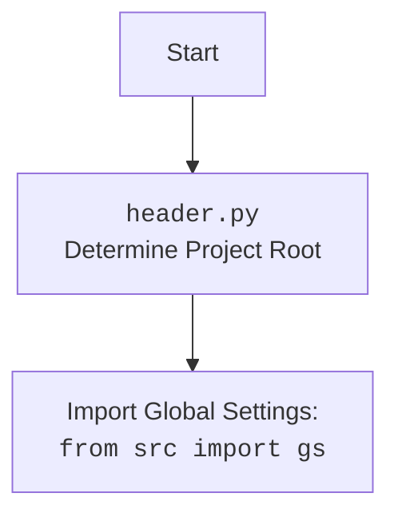

## АНАЛИЗ КОДА: `src/webdriver/executor.py`

### <алгоритм>

1. **Инициализация `ExecuteLocator`:**
   - При создании экземпляра `ExecuteLocator` передается объект `webdriver` и создается экземпляр `ActionChains`.
     ```python
     executor = ExecuteLocator(driver) 
     ```
   -  `driver`: Объект WebDriver для управления браузером.
   - `actions`: Объект для выполнения цепочки действий.

2. **`execute_locator(locator, message, typing_speed, continue_on_error)`**:
   - Принимает словарь `locator`, сообщение `message`, скорость набора `typing_speed`, флаг продолжения при ошибке `continue_on_error`.
   - **Пример:**
     ```python
     locator_data = {
        "by": "id",
        "selector": "my_element",
        "action": "click",
        "message": "Нажали на элемент"
     }
     executor.execute_locator(locator_data, message="Нажимаем кнопку", continue_on_error=False)
     ```
   -  Проверяет наличие ключа `action` в словаре `locator`.
   -  В зависимости от значения `action` вызывает соответствующие методы:
      - `action == "click"`: Вызывает `get_webelement_by_locator` для поиска элемента, затем выполняет клик.
      - `action == "send_keys"`: Вызывает `send_message` для ввода текста.
      - `action == "get_attribute"`: Вызывает `get_attribute_by_locator` для получения атрибута.
      - Если `action` не указан или не соответствует ни одному из условий, возвращает `None`.
   - Обрабатывает исключения: `NoSuchElementException`, `TimeoutException`, `ExecuteLocatorException`.
   - Если `continue_on_error` равен `False`, то поднимает исключение.
   - Возвращает результат выполнения операции.

3. **`get_webelement_by_locator(locator, message)`**:
   -  Принимает словарь `locator` и сообщение `message`.
     ```python
     locator_data = {
         "by": "xpath",
         "selector": "//div[@id='myDiv']",
         "timeout": 10
     }
     element = executor.get_webelement_by_locator(locator_data, message="Ищем элемент")
     ```
   - Определяет метод поиска элемента (например, `By.ID`, `By.XPATH`, и т.д.) из значения ключа `by` словаря `locator`.
   -  Использует `WebDriverWait` для ожидания появления элемента.
   -   Если `locator` имеет ключ `if_list` со значением "first", возвращает первый элемент из списка, иначе возвращает список элементов.
   - Обрабатывает исключения: `NoSuchElementException`, `TimeoutException`, `ExecuteLocatorException`.
   -  Возвращает найденный элемент (WebElement), список элементов или False.

4. **`get_attribute_by_locator(locator, message)`**:
   - Принимает словарь `locator` и сообщение `message`.
   -  Использует `get_webelement_by_locator` для получения элемента.
   -  Если элемент найден, извлекает атрибут (если в `locator` есть ключ `attribute`).
   -  Если `locator` имеет ключ `if_list` со значением "first", возвращает первый атрибут из списка, иначе возвращает список атрибутов.
   -  Возвращает значение атрибута, список атрибутов или `False`.

5. **`_get_element_attribute(element, attribute)`**:
   - Принимает `WebElement` и имя атрибута.
   - Получает значение атрибута у элемента или `None` если атрибут не найден.

6. **`send_message(locator, message, typing_speed, continue_on_error)`**:
   - Принимает словарь `locator`, сообщение `message`, скорость набора `typing_speed`, флаг продолжения при ошибке `continue_on_error`.
   - Использует `get_webelement_by_locator` для поиска элемента.
   - Очищает текстовое поле, отправляет `message`, печатая каждый символ с паузой, которая зависит от `typing_speed`.

7. **`evaluate_locator(attribute)`**:
   - Принимает атрибут (строку, список или словарь) и вызывает метод `_evaluate`.
    ```python
    locator_data = {
       "attribute": {
           "type": "xpath",
           "selector": "//div[@id='myDiv']"
       }
    }
    result = executor.evaluate_locator(locator_data["attribute"])
    ```
   -  Если атрибут является строкой, возвращает его.
   - Если атрибут является списком, перебирает его и вызывает метод `_evaluate` для каждого элемента списка.
   - Если атрибут является словарем, проходит по всем ключам словаря и вызывает метод `_evaluate` для каждого значения словаря.
   -  Возвращает строку с результатом.

8. **`_evaluate(attribute)`**:
   - Принимает строку `attribute`, проверяет, содержит ли строка `{...}`. Если да, то удаляет `{` и `}`.
   - Возвращает результат или None

9. **`get_locator_keys()`**:
   - Статический метод, возвращает список ключей, которые могут быть использованы в словаре локатора.
   - Пример: `['by', 'selector', 'selector 2', 'attribute', 'action', 'message', 'if_list', 'use_mouse', 'mandatory', 'timeout', 'timeout_for_event', 'event']`

### <mermaid>

```mermaid
flowchart TD
    Start[Start] --> Init[<code>ExecuteLocator</code><br> Initialize Driver and Actions]
    Init --> ExecuteLocatorMethod[<code>execute_locator</code><br> Main method to execute locator actions]
    
    ExecuteLocatorMethod --> CheckAction[Check if Action exist in Locator]
    CheckAction -- Yes --> ActionSwitch[Switch on Action Type: <br>click, send_keys, get_attribute]
    CheckAction -- No --> ReturnNone[Return None]

    ActionSwitch -- click --> GetElementForClick[<code>get_webelement_by_locator</code><br> Get WebElement for click]
    ActionSwitch -- send_keys --> SendMessage[<code>send_message</code><br> Send keys to element]
    ActionSwitch -- get_attribute --> GetAttribute[<code>get_attribute_by_locator</code><br> Get Attribute from element]
    ActionSwitch --> ReturnResult
    
    GetElementForClick --> ClickElement[Click WebElement]
    ClickElement --> ReturnResult
    
    SendMessage --> SendKeysToElement[Send Keys to WebElement]
    SendKeysToElement --> ReturnResult
    
    GetAttribute --> ReturnResult
    
    ReturnResult --> CheckError[Check if an Error has Occurred]
    CheckError -- Yes --> HandleError[Handle the Error based on continue_on_error flag]
    CheckError -- No --> End[End]
    
    HandleError -- continue_on_error=True --> End
    HandleError -- continue_on_error=False --> RaiseError[Raise Error]
    
    RaiseError --> End

    ExecuteLocatorMethod --> End
    
    subgraph "get_webelement_by_locator"
        GetElementStart[Start] --> GetBy[Determine the search method (By.ID, By.XPATH, etc)]
        GetBy --> WaitElement[Wait for the Element with <code>WebDriverWait</code>]
        WaitElement --> GetElement[Get the WebElement]
        GetElement --> CheckIfList[Check <code>if_list</code> Key]
        CheckIfList -- 'first' --> GetFirstElement[Return First Element]
        CheckIfList -- Other --> GetListElement[Return List of Elements]
        GetFirstElement --> GetElementEnd[Return Element]
        GetListElement --> GetElementEnd
    end
    
    subgraph "get_attribute_by_locator"
        GetAttrStart[Start] --> GetWebElement[Call <code>get_webelement_by_locator</code>]
        GetWebElement --> GetAttrFromElement[Get Attribute from WebElement]
        GetAttrFromElement --> CheckIfList2[Check <code>if_list</code> Key]
        CheckIfList2 -- 'first' --> GetFirstAttr[Return First Attribute]
        CheckIfList2 -- Other --> GetListAttr[Return List of Attribute]
        GetFirstAttr --> GetAttrEnd[Return Attribute]
        GetListAttr --> GetAttrEnd
    end
    
    subgraph "send_message"
        SendMessageStart[Start] --> GetWebElementForSend[Call <code>get_webelement_by_locator</code>]
        GetWebElementForSend --> ClearTextField[Clear the text field]
        ClearTextField --> SendMessageToElement[Send Message to the Element]
        SendMessageToElement --> SendMessageEnd[Return True]
    end

     subgraph "evaluate_locator"
        EvaluateStart[Start] --> EvaluateCheckType[Check the type of the attribute]
        EvaluateCheckType -- String --> ReturnString[Return string attribute]
        EvaluateCheckType -- List --> EvaluateList[Loop through elements in the List, calling method _evaluate ]
        EvaluateCheckType -- Dictionary --> EvaluateDict[Loop through values in Dictionary, calling method _evaluate]
        ReturnString --> EvaluateEnd[Return String]
        EvaluateList --> EvaluateEnd
        EvaluateDict --> EvaluateEnd
    end

     subgraph "_evaluate"
       EvaluateMethodStart[Start] --> EvaluateMethodCheck[Check if Attribute has "{...}"]
       EvaluateMethodCheck -- Yes --> EvaluateMethodRemoveBraces[Remove { and } from Attribute]
       EvaluateMethodCheck -- No --> EvaluateMethodReturn[Return String]
       EvaluateMethodRemoveBraces --> EvaluateMethodReturn
       EvaluateMethodReturn --> EvaluateMethodEnd[Return Attribute]

     end
    
   
    
    Start --> Init
    
   
```


### <объяснение>

#### Импорты:

1.  **`from selenium import webdriver`**:
    -   Импортирует модуль `webdriver` из библиотеки Selenium, предоставляя интерфейс для управления браузером. Это основной модуль для взаимодействия с веб-страницами.
2.  **`from selenium.webdriver.common.keys import Keys`**:
    -   Импортирует `Keys` для отправки специальных клавиш (например, `ENTER`, `TAB`, `CTRL`) элементам на веб-странице.
3.  **`from selenium.webdriver.common.by import By`**:
    -   Импортирует `By` для указания способа поиска элементов на странице (например, `By.ID`, `By.XPATH`, `By.CLASS_NAME`).
4.  **`from selenium.webdriver.remote.webelement import WebElement`**:
    -   Импортирует `WebElement`, который представляет элемент веб-страницы, с которым можно взаимодействовать.
5.  **`from selenium.webdriver.support.ui import WebDriverWait`**:
    -   Импортирует `WebDriverWait` для ожидания загрузки или появления элемента на странице с использованием заданного таймаута.
6.  **`from selenium.webdriver.support import expected_conditions as EC`**:
    -   Импортирует `expected_conditions` для определения ожидаемых условий, таких как появление элемента, его кликабельность, и т.д., которые используются с `WebDriverWait`.
7.  **`from selenium.webdriver.common.action_chains import ActionChains`**:
    -   Импортирует `ActionChains` для выполнения сложных действий с элементами веб-страницы, таких как перетаскивание, наведение курсора, и т.д.
8.  **`from selenium.common.exceptions import NoSuchElementException, TimeoutException`**:
    -   Импортирует исключения, которые могут возникнуть при поиске элементов или при ожидании условий.
    - `NoSuchElementException`: Возникает, когда элемент не найден на странице.
    - `TimeoutException`: Возникает, когда таймаут ожидания элемента истек.
9. **`from src import gs`**:
    - Импортирует глобальные настройки из `src`. `gs` (Global Settings) используется для доступа к различным настройкам проекта.
10. **`from src.utils.printer import pprint, j_loads, j_loads_ns, j_dumps, save_png`**:
     - Импортирует функции из модуля `src.utils.printer`:
        - `pprint`: Для красивого вывода данных в консоль.
        - `j_loads`: Для загрузки данных из JSON-строки.
        - `j_loads_ns`: Для загрузки данных из JSON-строки в `SimpleNamespace`.
        - `j_dumps`: Для преобразования данных в JSON-строку.
        - `save_png`: Для сохранения скриншота веб-страницы в файл PNG.
11. **`from src.logger.logger import logger`**:
    -   Импортирует объект `logger` для логирования событий и ошибок из модуля `src.logger.logger`.
12. **`from src.logger.exceptions import DefaultSettingsException, WebDriverException, ExecuteLocatorException`**:
    -   Импортирует пользовательские исключения из модуля `src.logger.exceptions`.
     - `DefaultSettingsException`: Исключение, связанное с настройками по умолчанию.
     - `WebDriverException`: Исключение, связанное с ошибками WebDriver.
     - `ExecuteLocatorException`: Исключение, связанное с ошибками при выполнении действий по локаторам.

#### Класс `ExecuteLocator`

- **Роль**: Предоставляет интерфейс для выполнения действий с веб-элементами, используя локаторы.
- **Атрибуты**:
    - `driver`: Объект WebDriver, управляющий браузером.
    - `actions`: Объект `ActionChains` для выполнения сложных действий.
    - `by_mapping`: (Неявно инициализируется внутри методов) - словарь для преобразования строковых представлений локаторов в объекты Selenium `By`.
- **Методы**:
    - **`__init__(self, driver)`**: Конструктор, инициализирует `driver` и `actions`.
    - **`execute_locator(self, locator, message, typing_speed, continue_on_error)`**:
        -   Основной метод для выполнения действий на основе локатора.
        -   Принимает словарь локатора, сообщение, скорость ввода и флаг продолжения при ошибке.
        -   Выбирает метод в зависимости от значения ключа 'action' словаря `locator`.
        -   Возвращает результат действия или None.
    -   **`get_webelement_by_locator(self, locator, message)`**:
        -   Получает веб-элемент или список элементов на основе словаря локатора.
        -   Использует `WebDriverWait` для ожидания загрузки элемента.
        -   Возвращает WebElement или список WebElement или False.
    -   **`get_attribute_by_locator(self, locator, message)`**:
        -   Получает атрибут элемента на основе словаря локатора.
        -   Использует `get_webelement_by_locator` для поиска элемента.
        -   Возвращает значение атрибута, список атрибутов или False.
    -   **`_get_element_attribute(self, element, attribute)`**:
        -   Вспомогательный метод для получения атрибута элемента.
        -   Возвращает значение атрибута или `None`.
    -   **`send_message(self, locator, message, typing_speed, continue_on_error)`**:
        -   Отправляет сообщение в текстовое поле.
        -   Использует `typing_speed` для имитации набора текста.
    -  **`evaluate_locator(self, attribute)`**:
        -  Оценивает атрибут локатора, возвращая строковое представление.
    -  **`_evaluate(self, attribute)`**:
        - Вспомогательный метод для оценки одного атрибута, удаляя `{}`.
    - **`get_locator_keys() -> list`**:
        -  Статический метод, возвращает список ключей, которые могут быть использованы в словаре локатора.

#### Функции
   -   Все функциональные блоки, по сути, являются методами класса `ExecuteLocator`.

#### Переменные

-   `driver`: Экземпляр `webdriver.Chrome` (или другого браузера), используемый для управления браузером.
-   `actions`: Экземпляр `ActionChains`, используется для создания и выполнения сложных действий пользователя.
-   `locator`: Словарь, содержащий информацию о том, как найти элемент на странице, например: `{"by": "id", "selector": "my_button", "action": "click"}`.
-   `message`: Строка сообщения, передаваемая элементу (например, для ввода текста).
-  `typing_speed`: Скорость набора текста при отправке сообщения, например: `0.1` для задержки в 0.1 секунды между символами.
- `continue_on_error`: Булевая переменная, определяющая, продолжать ли выполнение при возникновении ошибки (`True`) или нет (`False`).
-  `attribute`: строка, список или словарь - атрибут, который необходимо оценить.

#### Ошибки и улучшения

-   **Обработка ошибок**: Код правильно обрабатывает исключения `NoSuchElementException` и `TimeoutException`, но можно добавить более подробное логирование ошибок.
-  **Улучшение `evaluate_locator`**: Метод `evaluate_locator` можно улучшить, чтобы он более гибко обрабатывал различные типы данных и предоставлял возможность расширять его функциональность.
-   **Использование `SimpleNamespace`**: В коде иногда принимаются `dict | SimpleNamespace`. Стоит унифицировать использование типов данных.
-   **Расширение `get_locator_keys`**: Можно добавить документацию и примеры использования для каждого ключа локатора.
-   **Добавление документации**: Можно добавить docstrings ко всем методам для лучшей читаемости и понимания кода.

#### Взаимосвязь с другими частями проекта

-   **`src.gs`**: Используется для получения настроек проекта, которые могут влиять на поведение WebDriver.
-   **`src.utils.printer`**: Используется для вывода информации в консоль и для сохранения отладочных данных.
-   **`src.logger`**: Используется для логирования событий, ошибок и других важных сообщений.
-   **Конфигурация локаторов**:  Локаторы обычно определяются в отдельных файлах конфигурации (JSON или YAML), что позволяет легко менять стратегии поиска элементов без изменения кода.

Этот анализ предоставляет полное понимание структуры, функций и взаимосвязей класса `ExecuteLocator` в рамках проекта.