## ИНСТРУКЦИЯ:

Анализируй предоставленный код подробно и объясни его функциональность. Ответ должен включать три раздела:

1.  **<алгоритм>**: Опиши рабочий процесс в виде пошаговой блок-схемы, включая примеры для каждого логического блока, и проиллюстрируй поток данных между функциями, классами или методами.
2.  **<mermaid>**: Напиши код для диаграммы в формате `mermaid`, проанализируй и объясни все зависимости,
    которые импортируются при создании диаграммы.
    **ВАЖНО!** Убедитесь, что все имена переменных, используемые в диаграмме `mermaid`,
    имеют осмысленные и описательные имена. Имена переменных вроде `A`, `B`, `C`, и т.д., не допускаются!

    **Дополнительно**: Если в коде есть импорт `import header`, добавьте блок `mermaid` flowchart, объясняющий `header.py`:
    ```mermaid
    flowchart TD
        Start --> Header[<code>header.py</code><br> Determine Project Root]

        Header --> import[Import Global Settings: <br><code>from src import gs</code>]
    ```

3.  **<объяснение>**: Предоставьте подробные объяснения:
    -   **Импорты**: Их назначение и взаимосвязь с другими пакетами `src.`.
    -   **Классы**: Их роль, атрибуты, методы и взаимодействие с другими компонентами проекта.
    -   **Функции**: Их аргументы, возвращаемые значения, назначение и примеры.
    -   **Переменные**: Их типы и использование.
    -   Выделите потенциальные ошибки или области для улучшения.

Дополнительно, постройте цепочку взаимосвязей с другими частями проекта (если применимо).

Это обеспечивает всесторонний и структурированный анализ кода.
## Формат ответа: `.md` (markdown)
**КОНЕЦ ИНСТРУКЦИИ**

```md
## <алгоритм>

**Основной рабочий процесс:**

1.  **Инициализация драйвера (Chrome, Firefox, Edge):**
    *   Создается экземпляр класса `Driver`, которому передается один из классов веб-драйверов (`Chrome`, `Firefox`, `Edge`).
        *   Пример: `chrome_driver = Driver(Chrome)` создаёт драйвер Chrome.

2.  **Навигация по URL:**
    *   Вызывается метод `get_url(url)` для навигации по указанному адресу.
        *   Пример: `chrome_driver.get_url("https://www.example.com")`
    *   Метод возвращает `True`, если навигация прошла успешно, и `False` в противном случае.

3.  **Извлечение домена:**
    *   Вызывается метод `extract_domain(url)` для извлечения доменного имени из URL.
        *   Пример: `domain = chrome_driver.extract_domain("https://www.example.com/path")` возвратит `"www.example.com"`.

4.  **Прокрутка страницы:**
    *   Вызывается метод `scroll(scrolls, direction)` для прокрутки страницы.
        *   `scrolls`: количество прокруток.
        *   `direction`: направление прокрутки (`'forward'`, `'backward'`, `'both'`).
        *   Пример: `chrome_driver.scroll(scrolls=3, direction='forward')`
    *   Метод возвращает `True`, если прокрутка прошла успешно, и `False` в противном случае.

5.  **Сохранение cookies:**
    *   Вызывается метод `_save_cookies_localy(to_file)` для сохранения cookies в файл.
        *   `to_file`: имя файла, куда сохраняются cookies.
        *   Пример: `chrome_driver._save_cookies_localy(to_file='cookies_chrome.pkl')`
    *   Метод возвращает `True`, если сохранение прошло успешно, и `False` в противном случае.

6.  **Закрытие драйвера:**
    *   Вызывается метод `quit()` для закрытия браузера и освобождения ресурсов.
        *   Пример: `chrome_driver.quit()`

7.  **Повторение для других браузеров:**
    *   Все шаги повторяются для `Firefox` и `Edge`.

8.  **Вывод результатов:**
    *   На каждом шаге, при успешном или неудачном выполнении, выводится сообщение в консоль с помощью `print()`.

**Блок-схема (описание процесса для каждого браузера):**

```mermaid
graph LR
    A[Начало] --> B{Создание драйвера: Chrome};
    B --> C{Переход по URL: www.example.com};
    C -- Успех --> D{Извлечение домена};
    C -- Провал --> F[Вывод ошибки URL];
     D --> G{Прокрутка страницы: forward};
    G -- Успех --> H{Сохранение cookies: cookies_chrome.pkl};
     G -- Провал --> J[Вывод ошибки скролла];
     H -- Успех --> I[Вывод сообщения];
    H -- Провал --> K[Вывод ошибки cookies];
    I --> L{Закрытие драйвера: Chrome};
     F --> L
     J --> L
     K --> L
    L --> M{Создание драйвера: Firefox};
        M --> N{Переход по URL: www.example.com};
    N -- Успех --> O{Извлечение домена};
      N -- Провал --> Q[Вывод ошибки URL];
     O --> P{Прокрутка страницы: backward};
    P -- Успех --> R{Сохранение cookies: cookies_firefox.pkl};
    P -- Провал --> S[Вывод ошибки скролла];
     R -- Успех --> T[Вывод сообщения];
    R -- Провал --> U[Вывод ошибки cookies];
    T --> V{Закрытие драйвера: Firefox};
    Q --> V
    S --> V
    U --> V
        V --> W{Создание драйвера: Edge};
    W --> X{Переход по URL: www.example.com};
       X -- Успех --> Y{Извлечение домена};
    X -- Провал --> AA[Вывод ошибки URL];
     Y --> Z{Прокрутка страницы: both};
   Z -- Успех --> BB{Сохранение cookies: cookies_edge.pkl};
   Z -- Провал --> CC[Вывод ошибки скролла];
     BB -- Успех --> DD[Вывод сообщения];
       BB -- Провал --> EE[Вывод ошибки cookies];
    DD --> FF{Закрытие драйвера: Edge};
    AA --> FF
        CC --> FF
        EE --> FF
    FF --> GG[Конец];

```



## <mermaid>

```mermaid
flowchart TD
    Start(Начало) --> CreateChromeDriver[Создание Chrome Driver: <br> <code>chrome_driver = Driver(Chrome)</code>];
    CreateChromeDriver --> NavigateChrome[Навигация по URL (Chrome): <br> <code>chrome_driver.get_url(url)</code>];
    NavigateChrome -->|Успех| ExtractDomainChrome[Извлечение домена (Chrome): <br> <code>chrome_driver.extract_domain(url)</code>];
    NavigateChrome -->|Провал| ErrorNavigateChrome[Вывод ошибки навигации (Chrome)];
    ExtractDomainChrome --> ScrollChrome[Прокрутка страницы (Chrome): <br><code>chrome_driver.scroll(scrolls=3, direction='forward')</code>];
   ErrorNavigateChrome --> CloseChromeDriver[Закрытие Chrome Driver: <br> <code>chrome_driver.quit()</code>];
    ScrollChrome -->|Успех| SaveCookiesChrome[Сохранение Cookies (Chrome): <br> <code>chrome_driver._save_cookies_localy(to_file='cookies_chrome.pkl')</code>];
       ScrollChrome -->|Провал| ErrorScrollChrome[Вывод ошибки прокрутки (Chrome)];
       ErrorScrollChrome --> CloseChromeDriver;
    SaveCookiesChrome -->|Успех| SuccessCookiesChrome[Вывод сообщения об успешном сохранении cookies (Chrome)];
       SaveCookiesChrome -->|Провал| ErrorCookiesChrome[Вывод ошибки сохранения cookies (Chrome)];
          ErrorCookiesChrome --> CloseChromeDriver;
          SuccessCookiesChrome --> CloseChromeDriver;
    CloseChromeDriver --> CreateFirefoxDriver[Создание Firefox Driver: <br><code>firefox_driver = Driver(Firefox)</code>];
    CreateFirefoxDriver --> NavigateFirefox[Навигация по URL (Firefox): <br><code>firefox_driver.get_url(url)</code>];
     NavigateFirefox -->|Успех| ExtractDomainFirefox[Извлечение домена (Firefox): <br> <code>firefox_driver.extract_domain(url)</code>];
       NavigateFirefox -->|Провал| ErrorNavigateFirefox[Вывод ошибки навигации (Firefox)];
    ExtractDomainFirefox --> ScrollFirefox[Прокрутка страницы (Firefox): <br><code>firefox_driver.scroll(scrolls=2, direction='backward')</code>];
  ErrorNavigateFirefox --> CloseFirefoxDriver[Закрытие Firefox Driver: <br> <code>firefox_driver.quit()</code>];
    ScrollFirefox -->|Успех| SaveCookiesFirefox[Сохранение Cookies (Firefox): <br> <code>firefox_driver._save_cookies_localy(to_file='cookies_firefox.pkl')</code>];
       ScrollFirefox -->|Провал| ErrorScrollFirefox[Вывод ошибки прокрутки (Firefox)];
     ErrorScrollFirefox --> CloseFirefoxDriver;
    SaveCookiesFirefox -->|Успех| SuccessCookiesFirefox[Вывод сообщения об успешном сохранении cookies (Firefox)];
         SaveCookiesFirefox -->|Провал| ErrorCookiesFirefox[Вывод ошибки сохранения cookies (Firefox)];
          ErrorCookiesFirefox --> CloseFirefoxDriver;
        SuccessCookiesFirefox --> CloseFirefoxDriver;
        CloseFirefoxDriver --> CreateEdgeDriver[Создание Edge Driver: <br> <code>edge_driver = Driver(Edge)</code>];
    CreateEdgeDriver --> NavigateEdge[Навигация по URL (Edge): <br><code>edge_driver.get_url(url)</code>];
      NavigateEdge -->|Успех| ExtractDomainEdge[Извлечение домена (Edge): <br> <code>edge_driver.extract_domain(url)</code>];
    NavigateEdge -->|Провал| ErrorNavigateEdge[Вывод ошибки навигации (Edge)];
     ExtractDomainEdge --> ScrollEdge[Прокрутка страницы (Edge): <br><code>edge_driver.scroll(scrolls=2, direction='both')</code>];
     ErrorNavigateEdge --> CloseEdgeDriver[Закрытие Edge Driver: <br> <code>edge_driver.quit()</code>];
    ScrollEdge -->|Успех| SaveCookiesEdge[Сохранение Cookies (Edge): <br> <code>edge_driver._save_cookies_localy(to_file='cookies_edge.pkl')</code>];
    ScrollEdge -->|Провал| ErrorScrollEdge[Вывод ошибки прокрутки (Edge)];
         ErrorScrollEdge --> CloseEdgeDriver;
        SaveCookiesEdge -->|Успех| SuccessCookiesEdge[Вывод сообщения об успешном сохранении cookies (Edge)];
        SaveCookiesEdge -->|Провал| ErrorCookiesEdge[Вывод ошибки сохранения cookies (Edge)];
         ErrorCookiesEdge --> CloseEdgeDriver;
            SuccessCookiesEdge --> CloseEdgeDriver;
    CloseEdgeDriver --> End(Конец);
```

**Анализ `mermaid` диаграммы:**

1.  **Импорты и зависимости:**
    *   `Driver`, `Chrome`, `Firefox`, `Edge` импортируются из `src.webdriver.driver`. Это указывает на зависимость данного файла от модуля драйверов веб-браузеров.

2.  **Описания переменных:**
    *   `CreateChromeDriver`, `CreateFirefoxDriver`, `CreateEdgeDriver`:  Представляют создание экземпляров `Driver` для каждого браузера.
    *   `NavigateChrome`, `NavigateFirefox`, `NavigateEdge`:  Представляют вызов метода `get_url()` для навигации по URL.
    *  `ExtractDomainChrome`, `ExtractDomainFirefox`, `ExtractDomainEdge`: Представляют извлечение домена из URL.
    *   `ScrollChrome`, `ScrollFirefox`, `ScrollEdge`: Представляют вызов метода `scroll()` для прокрутки страницы.
    *   `SaveCookiesChrome`, `SaveCookiesFirefox`, `SaveCookiesEdge`: Представляют вызов метода `_save_cookies_localy()` для сохранения cookies.
    *   `CloseChromeDriver`, `CloseFirefoxDriver`, `CloseEdgeDriver`: Представляют вызов метода `quit()` для закрытия драйвера.
    *   `ErrorNavigateChrome`, `ErrorScrollChrome`, `ErrorCookiesChrome`:  Представляют вывод ошибки при неудачной навигации, прокрутке или сохранении cookies для Chrome.
     *   `ErrorNavigateFirefox`, `ErrorScrollFirefox`, `ErrorCookiesFirefox`:  Представляют вывод ошибки при неудачной навигации, прокрутке или сохранении cookies для Firefox.
      *  `ErrorNavigateEdge`, `ErrorScrollEdge`, `ErrorCookiesEdge`:  Представляют вывод ошибки при неудачной навигации, прокрутке или сохранении cookies для Edge.
    *   `SuccessCookiesChrome`, `SuccessCookiesFirefox`, `SuccessCookiesEdge`: Представляют вывод сообщения об успехе сохранения cookies для каждого браузера.

3. **Структура потока:**
    *   Диаграмма показывает последовательность действий для каждого из браузеров (Chrome, Firefox, Edge), включая создание драйвера, навигацию, прокрутку, сохранение cookies и закрытие.
    *   Поток включает обработку ошибок с выводом соответствующих сообщений при сбое любого из этапов.

## <объяснение>

**Импорты:**

*   `from src.webdriver.driver import Driver, Chrome, Firefox, Edge`:
    *   Импортирует класс `Driver` и классы браузеров (`Chrome`, `Firefox`, `Edge`) из модуля `src.webdriver.driver`.
    *   `Driver` - это класс, который управляет браузерами.
    *   `Chrome`, `Firefox`, `Edge` - это классы, которые представляют конкретные веб-драйверы для соответствующих браузеров.
    *   Это показывает, что данный файл зависит от модуля `driver` в пакете `src.webdriver`.

**Функции:**

*   `main()`:
    *   Основная функция, которая демонстрирует использование класса `Driver` с различными браузерами.
    *   Не имеет аргументов и не возвращает значения.
    *   Пример использования:
        *   Создает экземпляры класса `Driver` для каждого браузера.
        *   Вызывает методы `get_url()`, `extract_domain()`, `scroll()`, `_save_cookies_localy()` и `quit()`.
        *   Выводит сообщения в консоль в зависимости от результата выполнения операций.
        *   Обрабатывает ошибки с помощью try/finally.

**Классы:**

*   `Driver(browser_class)`:
    *   Создает экземпляр класса `Driver`, используя переданный ему класс браузера (`Chrome`, `Firefox`, `Edge`).
    *   Это абстракция, которая позволяет управлять разными браузерами через один интерфейс.

**Переменные:**

*   `chrome_driver`, `firefox_driver`, `edge_driver`: Экземпляры класса `Driver`, которые управляют соответствующими браузерами.
*   `url`: Строка, содержащая URL для перехода.
*   `domain`: Строка, содержащая извлеченный домен.
*   `scrolls`: целое число, количество прокруток страницы.
*   `direction`: строка, направление прокрутки ('forward', 'backward', 'both').
*   `to_file`: Строка, имя файла для сохранения cookies.

**Взаимосвязи с другими частями проекта:**

*   Данный файл использует `src.webdriver.driver`, что указывает на зависимость от модуля, который отвечает за управление веб-драйверами.
*   Цель данного файла - демонстрация работы класса `Driver` и его методов с различными браузерами.

**Потенциальные ошибки и области для улучшения:**

*   Обработка ошибок. Можно добавить более детальную обработку исключений, чтобы точно определить причины неудач при работе с webdriver.
*   Именование параметров. Параметры типа `scrolls`, `direction` и `to_file` должны быть более явно именуемые, например:  `scroll_count`, `scroll_direction`, `cookie_file`.
*   `_save_cookies_localy`. Использование префикса "_" говорит о том, что это внутренний метод, но он используется в примере. Желательно переименовать этот метод, чтобы отразить его публичный статус.
*   Можно добавить проверку типа для передаваемых параметров в `scroll()` и `_save_cookies_localy()` методы.
*   Можно добавить логирование для более подробного отслеживания операций.
*   Можно добавить поддержку пользовательских опций драйвера (например, headless mode).
*   Можно добавить обработку таймаутов для веб-драйвера.
*  Код повторяется для каждого браузера. Это можно рефакторить, написав функцию, которая будет принимать драйвер как аргумент.
*   Не хватает комментариев в коде, которые бы объясняли назначение отдельных блоков.
*   Необходимо добавить описание docstring для всех методов.

**Общая цепочка взаимосвязей:**

1.  `_example_driver.py` зависит от `src.webdriver.driver`.
2.  `src.webdriver.driver` должен содержать реализацию классов `Driver`, `Chrome`, `Firefox`, `Edge`, которые в свою очередь используют `Selenium`.
3.  `Selenium` взаимодействует с веб-браузерами для управления ими через веб-драйверы.

```