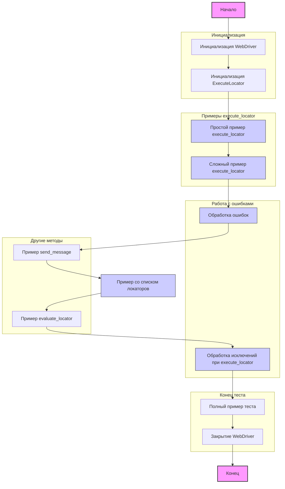

## ИНСТРУКЦИЯ:

Анализируй предоставленный код подробно и объясни его функциональность. Ответ должен включать три раздела:

1. **<алгоритм>**: Опиши рабочий процесс в виде пошаговой блок-схемы, включая примеры для каждого логического блока, и проиллюстрируй поток данных между функциями, классами или методами.
2.  **<mermaid>**: Напиши код для диаграммы в формате `mermaid`, проанализируй и объясни все зависимости,
     которые импортируются при создании диаграммы.
     **ВАЖНО!** Убедитесь, что все имена переменных, используемые в диаграмме `mermaid`,
     имеют осмысленные и описательные имена. Имена переменных вроде `A`, `B`, `C`, и т.д., не допускаются!

     **Дополнительно**: Если в коде есть импорт `import header`, добавьте блок `mermaid` flowchart, объясняющий `header.py`:
     ```mermaid
     flowchart TD
         Start --> Header[<code>header.py</code><br> Determine Project Root]

         Header --> import[Import Global Settings: <br><code>from src import gs</code>]
     ```

3.  **<объяснение>**: Предоставьте подробные объяснения:
    -   **Импорты**: Их назначение и взаимосвязь с другими пакетами `src.`.
    -   **Классы**: Их роль, атрибуты, методы и взаимодействие с другими компонентами проекта.
    -   **Функции**: Их аргументы, возвращаемые значения, назначение и примеры.
    -   **Переменные**: Их типы и использование.
    -   Выделите потенциальные ошибки или области для улучшения.

Дополнительно, постройте цепочку взаимосвязей с другими частями проекта (если применимо).

Это обеспечивает всесторонний и структурированный анализ кода.
## Формат ответа: `.md` (markdown)
**КОНЕЦ ИНСТРУКЦИИ**
```markdown
## <алгоритм>

1. **Инициализация WebDriver:**
    - Создается экземпляр `webdriver.Chrome` с путем к драйверу, взятым из глобальных настроек `gs['chrome_driver_path']`.
    - Открывается веб-страница `https://example.com`.
    
2. **Инициализация `ExecuteLocator`:**
    - Создается экземпляр класса `ExecuteLocator` с переданным драйвером.

3. **Простой пример `execute_locator`:**
   - Определяется словарь `simple_locator`, описывающий способ поиска элемента (XPath), его селектор (`//h1`), атрибут (`textContent`) и другие параметры.
   - Вызывается метод `execute_locator` с `simple_locator`, результат выводится.
   
4. **Сложный пример `execute_locator`:**
   - Определяется словарь `complex_locator` с вложенной структурой, включающей в себя поиск ссылок (`product_links`) и элементов пагинации (`pagination`).
   - Вызывается метод `execute_locator` с `complex_locator`, результат выводится.
  
5.  **Обработка ошибок:**
    - Вызывается метод `execute_locator` с `complex_locator` и `continue_on_error=True`.
    - Блок `try-except` отлавливает ошибку `ExecuteLocatorException`, если она произошла, и выводит сообщение.
    
6.  **Пример `send_message`:**
     - Определяется `message_locator` для ввода текста в поле поиска.
     - Вызывается метод `send_message` с `message_locator`, сообщением, скоростью ввода, и флагом обработки ошибки. Результат выводится.
    
7.  **Пример со списком локаторов:**
    - Определяется `multi_locator`, где `by`, `selector`, `attribute`, `event`, `use_mouse` и `mandatory` являются списками.
    - Вызывается метод `execute_locator` с `multi_locator`.
    
8. **Пример `evaluate_locator`:**
   - Определяется `attribute_locator` для получения значения атрибута `content` у мета-тега.
   - Вызывается метод `evaluate_locator` с `attribute` из `attribute_locator`.
    
9.  **Обработка исключений при `execute_locator`:**
    - Вызывается метод `execute_locator` с `simple_locator`.
    - Блок `try-except` отлавливает ошибку `ExecuteLocatorException`, если она произошла, и выводит сообщение.
   
10. **Полный пример теста:**
    - Определяется `test_locator`, аналогичный `simple_locator`.
    - Вызывается метод `execute_locator` с `test_locator`.
    
11. **Закрытие WebDriver:**
     - Вызывается метод `driver.quit()` для закрытия браузера.

## <mermaid>


**Анализ зависимостей `mermaid`:**

Диаграмма представляет собой блок-схему (flowchart), описывающую последовательность выполнения операций в коде. 
- Начало `Start` и Конец `End`  обозначают начальную и конечную точки выполнения программы.
- `InitializeWebDriver` и `InitializeExecuteLocator` — блоки инициализации драйвера и класса `ExecuteLocator` соответственно.
-  `SimpleLocatorExample`, `ComplexLocatorExample`, `MultiLocatorExample` — блоки, где демонстрируется работа метода `execute_locator` с разными типами локаторов.
- `ErrorHandling` — блок, показывающий использование `continue_on_error` в методе `execute_locator`.
- `SendMessageExample` — блок для демонстрации использования метода `send_message`.
- `EvaluateLocatorExample` — блок, показывающий использование метода `evaluate_locator`.
- `ExceptionHandling` — блок, демонстрирующий обработку исключений при выполнении локатора.
- `FullTestExample` — блок, демонстрирующий полный пример использования метода `execute_locator`.
- `QuitWebDriver` — блок закрытия браузера.

Подграфы `Инициализация`, `Примеры execute_locator`, `Работа с ошибками`, `Другие методы`, `Конец теста` группируют логически связанные блоки.
 Классы `locator` (SimpleLocatorExample, ComplexLocatorExample, MultiLocatorExample, ErrorHandling, ExceptionHandling) выделены цветом для наглядности.
## <объяснение>

**Импорты:**

-   `from selenium import webdriver`: Импортирует модуль `webdriver` из библиотеки `selenium`, который используется для управления браузером.
-   `from src.webdriver.executor import ExecuteLocator`: Импортирует класс `ExecuteLocator` из модуля `src.webdriver.executor`. Этот класс, вероятно, содержит логику для выполнения поиска элементов на веб-странице по заданным локаторам.
-   `from src import gs`: Импортирует глобальные настройки из модуля `src` (предположительно, `gs.py`). Эти настройки могут содержать пути к драйверам, URL-адреса и т.д.
-   `from src.logger.exceptions import ExecuteLocatorException`: Импортирует исключение `ExecuteLocatorException` из модуля `src.logger.exceptions`, которое используется для обработки ошибок, возникающих при выполнении локаторов.

**Классы:**

-   `ExecuteLocator`:
    -   **Роль**: Этот класс является основным для выполнения операций с веб-элементами на основе заданных локаторов. Он инкапсулирует логику взаимодействия с драйвером `selenium` и обработки различных сценариев.
    -   **Методы** (из кода видны):
        -   `__init__(driver)`: Конструктор класса, принимает экземпляр `webdriver` в качестве аргумента.
        -   `execute_locator(locator, continue_on_error=False)`: Выполняет поиск и взаимодействие с веб-элементами на основе переданного локатора, обрабатывает ошибки при необходимости.
        -   `send_message(locator, message, typing_speed=0.0, continue_on_error=False)`: Отправляет сообщение в текстовое поле, заданное локатором.
        -  `evaluate_locator(attribute)`: Возвращает значение атрибута найденного элемента.
    -   **Взаимодействие**: Класс `ExecuteLocator` использует экземпляр `webdriver` для взаимодействия с браузером, а также использует глобальные настройки из `gs`. Он генерирует исключение `ExecuteLocatorException` в случае ошибок.

**Функции:**

-   В явном виде функции не описаны, используется `driver.get`, `driver.quit`, но есть методы класса `ExecuteLocator`:
  -   `execute_locator(locator, continue_on_error=False)`:
    -   **Аргументы**:
        -   `locator`: Словарь или список словарей, содержащий параметры локатора (например, `by`, `selector`, `attribute`, `event`).
        -   `continue_on_error`: Булев флаг, определяющий, нужно ли продолжать выполнение при возникновении ошибки. По умолчанию `False`.
    -   **Возвращаемое значение**: Зависит от типа локатора и действий, если поиск был успешен, или `None` при ошибке, если `continue_on_error=True`.
    -   **Назначение**: Выполняет поиск элемента или элементов на веб-странице в соответствии с заданным локатором и применяет к ним действия (например, клик, отправка сообщения), и возвращает результат или список результатов.
     - **Пример:**
     ```python
     simple_locator = {
         "by": "XPATH",
         "selector": "//h1",
         "attribute": "textContent",
         "timeout":0,"timeout_for_event":"presence_of_element_located","event": None,
          "if_list":"first","use_mouse": False,
         "mandatory": True,
         "locator_description": "Получение заголовка страницы"
     }
     result = locator.execute_locator(simple_locator) #вернет текстовое содержимое h1
     ```

  - `send_message(locator, message, typing_speed=0.0, continue_on_error=False)`:
    -   **Аргументы**:
        -   `locator`: Словарь, содержащий параметры локатора текстового поля.
        -   `message`: Строка, которую нужно отправить в поле.
        -   `typing_speed`: Скорость печати, с которой нужно отправлять сообщение (по умолчанию `0.0`, без задержки).
        -   `continue_on_error`: Флаг, указывающий, нужно ли продолжать выполнение в случае ошибки.
    -   **Возвращаемое значение**: Зависит от того, удалось ли выполнить действие или нет, при `continue_on_error=True` вернет `None`.
    -   **Назначение**: Отправляет текст в текстовое поле на веб-странице, позволяет имитировать ввод текста с заданной скоростью.
     - **Пример:**
     ```python
     message_locator = {
         "by": "XPATH",
         "selector": "//input[@name='search']",
         "attribute": None,
          "timeout":0,"timeout_for_event":"presence_of_element_located","event": "%SEARCH%",
          "if_list":"first","use_mouse": False,
         "mandatory": True,
          "locator_description": "Отправка поискового запроса"
      }
      message = "Купить новый телефон"
      result = locator.send_message(message_locator, message, typing_speed=0.05, continue_on_error=True) #вернет None или результат в зависимости от реализации класса
     ```
  - `evaluate_locator(attribute)`:
     -  **Аргументы**:
        - `attribute`: Строка, указывающая, какой атрибут элемента нужно получить.
     - **Возвращаемое значение**: Значение атрибута или `None` если не найдено.
     - **Назначение**: Возвращает значение заданного атрибута найденного веб-элемента.
      - **Пример:**
      ```python
      attribute_locator = {
         "by": "XPATH",
         "selector": "//meta[@name='description']",
         "attribute": "content",
         "timeout":0,"timeout_for_event":"presence_of_element_located","event": None,
          "if_list":"first","use_mouse": False,
         "mandatory": True,
          "locator_description": "Получение значения мета-описания страницы"
      }
      attribute_value = locator.evaluate_locator(attribute_locator['attribute']) #вернет строку meta description или None
     ```

**Переменные:**

-   `driver`: Экземпляр `webdriver.Chrome`, используется для управления браузером.
-   `locator`: Экземпляр класса `ExecuteLocator`, используется для выполнения локаторов.
-   `simple_locator`, `complex_locator`, `message_locator`, `multi_locator`, `attribute_locator`, `test_locator`: Словари, содержащие параметры локаторов для поиска элементов на веб-странице.
-   `result`, `results`, `attribute_value`: Переменные для хранения результатов выполнения локаторов.
-   `message`: Строка, содержащая сообщение для отправки в текстовое поле.
-   `ex`: Экземпляр `ExecuteLocatorException` в блоках `try-except`.

**Потенциальные ошибки и области для улучшения:**

-   **Жестко заданные пути:** Путь к драйверу `gs['chrome_driver_path']` задан глобально. В больших проектах лучше использовать переменные окружения или конфигурационные файлы для гибкости.
-   **Обработка ошибок:** Код обрабатывает `ExecuteLocatorException`, но не проверяет возвращаемые значения `execute_locator` и `send_message`, что может привести к проблемам.
-   **Отсутствие логгирования:**  Не хватает логирования для отслеживания процесса и ошибок.
-   **Неполный список событий:** Указанные события `'click()', 'send_keys()'`,  `'%SEARCH%'` это упрощенное представление действий, а `send_message` принимает еще и аргумент `typing_speed`
-   **Дублирование кода:** Код с `simple_locator` и `test_locator` по сути дублируется, можно использовать функцию для параметризации

**Цепочка взаимосвязей:**

1.  Файл использует `selenium` для управления браузером.
2.  Он импортирует `ExecuteLocator`, класс из `src.webdriver.executor`, который инкапсулирует логику выполнения локаторов.
3.  Он использует глобальные настройки из `src.gs`.
4.  Он импортирует и обрабатывает исключение `ExecuteLocatorException` из `src.logger.exceptions`.
5.  Код демонстрирует использование различных методов `ExecuteLocator`, включая `execute_locator`, `send_message`, и `evaluate_locator`.
6.  Код представляет собой пример использования  `ExecuteLocator` и не затрагивает другие части проекта.

В целом, код представляет собой тестовый пример для демонстрации работы класса `ExecuteLocator`.
```