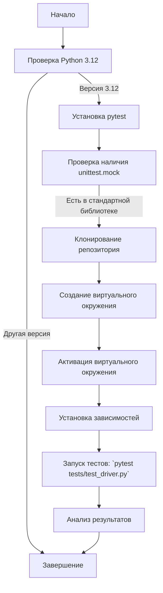

## АНАЛИЗ КОДА: `hypotez/src/webdriver/_pytest/guide_test_driver.md`

### 1. **<алгоритм>**

Данный документ представляет собой руководство для тестирования класса `DriverBase` с использованием `pytest`. Основные этапы работы:

1. **Предварительная настройка:**
   - Проверка наличия Python 3.12.
   - Установка `pytest`.
   - Проверка наличия `unittest.mock` (входит в стандартную библиотеку Python >= 3.3).
2. **Настройка окружения:**
   - Клонирование репозитория проекта.
   - Создание виртуального окружения.
   - Активация виртуального окружения.
   - Установка зависимостей из `requirements.txt` (если он есть).
3. **Написание и запуск тестов:**
   - Тесты находятся в файле `tests/test_driver.py`.
   - Запуск тестов с помощью команды `pytest tests/test_driver.py`.
   - Анализ результатов: количество пройденных тестов, время выполнения, детали ошибок.
4. **Дополнительные команды:**
   - Запуск всех тестов: `pytest`.
   - Запуск тестов с подробным выводом: `pytest -v`.
   - Запуск тестов с отчетом о покрытии кода:
     - установка `pytest-cov`: `pip install pytest-cov`.
     - Запуск тестов с отчетом о покрытии: `pytest --cov=src tests/`.

**Пример потока данных:**
    - Пользователь выполняет команды в терминале
    - `python --version` - проверка версии python
    - `pip install pytest` - установка `pytest`
    - `git clone <URL_вашего_репозитория>` - клонирование репозитория
    - `python -m venv venv` - создание виртуального окружения
    - `source venv/bin/activate` - активация виртуального окружения
    - `pip install -r requirements.txt` - установка зависимостей
    - `pytest tests/test_driver.py` - запуск тестов

### 2. **<mermaid>**

**Анализ `mermaid`:**

- **Start**: Начальная точка процесса.
- **CheckPython**: Проверка установленной версии Python.
- **InstallPytest**: Установка `pytest`, если Python соответствует требованиям.
- **CheckUnittestMock**: Проверка наличия `unittest.mock` в стандартной библиотеке.
- **CloneRepo**: Клонирование репозитория проекта.
- **CreateVenv**: Создание виртуального окружения.
- **ActivateVenv**: Активация виртуального окружения.
- **InstallDependencies**: Установка зависимостей, описанных в `requirements.txt`.
- **RunTests**: Запуск тестов с помощью `pytest`.
- **AnalyzeResults**: Анализ результатов тестов, включая успешные и неудачные тесты.
- **End**: Конечная точка процесса.

### 3. **<объяснение>**

**Импорты:**

- `pytest`: Основной инструмент для запуска и организации тестов.
- `unittest.mock`: Используется для мокирования объектов и функций во время тестов.

**Структура проекта:**

- `src/webdriver/driver.py`: Содержит класс `DriverBase` (или аналогичный), который является объектом тестирования.
- `src/webdriver/javascript/`: Вероятно, содержит код для работы с JavaScript в контексте веб-драйвера.
- `src/webdriver/executor/`: Возможно, содержит код для выполнения команд веб-драйвера.
- `src/logger.py`:  Содержит код для логирования.
- `src/utils/jjson.py`: Может быть, содержит утилиты для работы с JSON.
- `tests/test_driver.py`: Содержит тесты для `DriverBase`.

**Функции:**

- Код не содержит функции, но описывает процесс тестирования.  Фактические функции содержатся в `test_driver.py` файле.

**Переменные:**
- Документ не содержит переменных, но описывает процесс тестирования.

**Объяснение:**

- Документ является руководством по тестированию класса `DriverBase`. Он описывает шаги по подготовке окружения, запуску тестов и интерпретации результатов.
- Важной частью является настройка виртуального окружения, что обеспечивает изолированное окружение для проекта и его зависимостей.
- Тесты написаны в `test_driver.py` с использованием `pytest`, позволяя легко запускать и анализировать результаты тестирования.
- Команды для запуска тестов предоставляют гибкость в запуске всех тестов, тестов с подробным выводом и отчетов о покрытии.
- Этот документ предназначен для тестировщиков, чтобы помочь им эффективно тестировать функциональность класса `DriverBase`, обеспечивая его корректность и предотвращая регрессии.

**Потенциальные ошибки или области для улучшения:**

- Руководство не описывает, как настраивать зависимости в `requirements.txt`, что может вызвать проблемы при наличии зависимостей.
- Документ не описывает конкретные тесты, которые должны быть выполнены в `test_driver.py`.
- Недостаточно информации по поводу возможных ошибок и их исправления.

**Цепочка взаимосвязей с другими частями проекта:**

- `test_driver.py` напрямую зависит от `DriverBase` в `driver.py`.
- `driver.py` может зависеть от модулей в `javascript/` и `executor/`.
- `logger.py` и `jjson.py` могут быть общими утилитами и могут использоваться разными частями проекта.