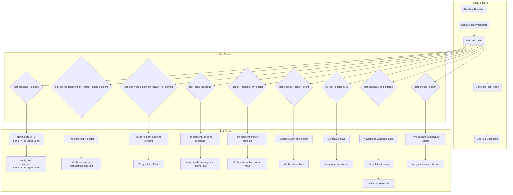

## Анализ файла `hypotez/src/webdriver/_pytest/guide_test_driver_executor.md`

### 1. **<алгоритм>**

1. **Подготовка среды тестирования:**
    *   **Установка зависимостей:**  Используется `pip install -r requirements.txt` для установки необходимых библиотек (например, `pytest`, `selenium`).
    *   **Настройка WebDriver:** Установка и настройка Chrome WebDriver, указание пути к `chromedriver`.
    *   **Пример:** Установка `selenium` для управления браузером и `pytest` для запуска тестов.

2. **Запуск тестов:**
    *   Используется команда `pytest src/webdriver/_pytest/test_driver_executor.py` для запуска всех тестов, определенных в `test_driver_executor.py`.
    *   **Пример:** `pytest` запускает тесты, определенные в `test_driver_executor.py`, анализирует результаты и создает отчет.

3. **Описание тестов (примеры):**
    *   **`test_navigate_to_page`:**
        *   **Действие:** WebDriver загружает указанную страницу ("http://example.com").
        *   **Проверка:** URL текущей страницы соответствует ожидаемому.
        *   **Пример:** Загрузка страницы и проверка, что URL равен "http://example.com".
    *   **`test_get_webelement_by_locator_single_element`:**
        *   **Действие:**  Метод `get_webelement_by_locator` ищет элемент по заданному локатору.
        *   **Проверка:** Возвращенный элемент является экземпляром `WebElement` и содержит ожидаемый текст.
        *   **Пример:** Поиск элемента с текстом "Example Domain" по локатору и проверка его типа и содержимого.
    *   **`test_get_webelement_by_locator_no_element`:**
        *   **Действие:** Метод `get_webelement_by_locator` ищет несуществующий элемент.
        *   **Проверка:** Метод возвращает `False`.
        *   **Пример:** Попытка найти несуществующий элемент и проверка возврата `False`.
    *   **`test_send_message`:**
        *   **Действие:** Метод `send_message` отправляет сообщение элементу.
        *   **Проверка:** Метод возвращает `True`.
        *   **Пример:** Отправка текста в поле ввода и проверка возврата `True`.
    *   **`test_get_attribute_by_locator`:**
        *   **Действие:** Метод `get_attribute_by_locator` получает значение атрибута элемента.
        *   **Проверка:** Атрибут соответствует ожидаемому значению.
        *   **Пример:** Получение значения атрибута "href" элемента и проверка его равенства "https://www.iana.org/domains/example".
    *   **`test_execute_locator_event`:**
        *   **Действие:** Метод `execute_locator` выполняет событие на локаторе.
        *   **Проверка:** Метод возвращает `True`.
        *   **Пример:** Клик по кнопке и проверка возврата `True`.
    *   **`test_get_locator_keys`:**
        *   **Действие:** Метод `get_locator_keys` возвращает ключи локатора.
        *   **Проверка:** Ключи локатора соответствуют ожидаемым.
        *   **Пример:** Получение ключей локатора и проверка их соответствия ["attribute", "by", "selector", "event", "use_mouse", "mandatory", "locator_description"].
    *   **`test_navigate_and_interact`:**
        *   **Действие:** Навигация на страницу, ввод текста в поле поиска, клик по кнопке.
        *   **Проверка:** Результаты поиска соответствуют ожиданиям.
        *   **Пример:** Переход на Википедию, ввод "Python" в поле поиска, клик по кнопке и проверка результатов.
    *   **`test_invalid_locator`:**
        *   **Действие:** Попытка использовать некорректный локатор.
        *   **Проверка:** Выброс исключения `ExecuteLocatorException`.
        *   **Пример:** Использование неверного селектора и проверка выброса исключения.

4. **Создание отчетов:**
    *   **Текстовый отчет:** Используется флаг `-v` для детального вывода в консоль.
    *   **HTML-отчет:** Используется `pytest-html` для генерации отчета в формате HTML.
    *   **Пример:** Запуск `pytest src/webdriver/_pytest/test_driver_executor.py -v` для текстового отчета и `pytest src/webdriver/_pytest/test_driver_executor.py --html=report.html` для HTML-отчета.

### 2. **<mermaid>**

**Объяснение `mermaid` диаграммы:**

*   **Test Execution:**
    *   `Start`: Начало выполнения тестов.
    *   `Setup`: Настройка окружения (зависимости, WebDriver).
    *   `RunTests`: Запуск всех определенных тестовых случаев.
    *   `GenerateReport`: Генерация отчета о результатах.
    *   `End`: Завершение выполнения тестов.
*   **Test Cases:**
    *   Перечислены все тестовые функции, как они вызываются.
*   **Test Details:**
    *   Описывается подробно действие каждого теста и какие проверки выполняются.
    *   Стрелки показывают последовательность действий в каждом тесте.
*   **Зависимости:**
    *   На диаграмме показаны зависимости между тестовыми функциями и их шагами.

### 3. **<объяснение>**

*   **Импорты**:
    *   В данном файле не используются явные импорты, так как это `markdown` файл с описанием, а не код `python`.

*   **Классы**:
    *   `Driver`: Этот класс (из `test_driver_executor.py`) инкапсулирует взаимодействие с WebDriver и обеспечивает методы для навигации, поиска элементов и взаимодействия с ними.
    *   `ExecuteLocator`: Этот класс (из `test_driver_executor.py`) управляет выполнением событий с использованием локаторов, предоставляет функциональность для поиска и работы с элементами через WebDriver.

*   **Функции**:
    *   В данном документе описываются тестовые функции (`test_...`) из `test_driver_executor.py`.
        *   **Аргументы:** Обычно не принимают аргументы.
        *   **Возвращаемые значения:** Обычно не возвращают значений. Используются `assert` для проверки ожидаемых результатов.
        *   **Назначение:** Каждая функция тестирует определенную функциональность классов `Driver` и `ExecuteLocator`.
        *   **Примеры:**
            *   `test_navigate_to_page` - проверяет, что браузер может перейти на страницу.
            *   `test_get_webelement_by_locator_single_element` - проверяет, что можно найти элемент по локатору.
            *   `test_send_message` - проверяет отправку текста в поле ввода.
            *   `test_get_attribute_by_locator` - проверяет получение значения атрибута элемента.
            *   `test_execute_locator_event` - проверяет выполнение события на элементе.
            *   `test_invalid_locator` - проверяет, что при некорректном локаторе возникает исключение.

*   **Переменные**:
    *   В основном, это переменные внутри тестовых функций, такие как:
        *   `driver` - экземпляр класса `Driver`.
        *   `locator` - словарь, определяющий способ поиска элемента.
        *   `element` - экземпляр `WebElement`, найденный на странице.
        *   `attribute_value` - значение атрибута элемента.
    *   Типы: В основном, это объекты `selenium.webdriver`, словари и строки.

*   **Взаимосвязи с другими частями проекта**:
    *   **`src.webdriver.driver`:** Класс `Driver` отвечает за взаимодействие с браузером и используется в тестах.
    *   **`src.webdriver.execute_locator`:** Класс `ExecuteLocator` используется для выполнения действий с элементами по заданному локатору.
    *   **`src.webdriver._pytest.test_driver_executor.py`:**  Файл, в котором содержатся тесты, описанные в этом `markdown` документе.
    *   **`requirements.txt`:** Файл, содержащий зависимости проекта, включая `selenium` и `pytest`.

*   **Потенциальные ошибки и области для улучшения**:
    *   **Путь к `chromedriver`:** Абсолютный путь к `chromedriver` может быть проблемой на разных машинах. Можно использовать относительные пути или переменные окружения.
    *   **Headless режим:** Опциональная настройка `headless` режима в `Options` может быть полезна для запуска тестов на серверах без графического интерфейса.
    *   **Кодогенерация локаторов:** Автогенерация локаторов для каждого теста может быть улучшена и упрощена.
    *   **Более сложные проверки:** Можно добавить более сложные проверки в тесты, например, проверку видимости элементов или корректность результатов поиска.
    *   **Разделение на тестовые наборы**: Разделение тестов на логические группы для лучшей организации и читаемости.

Этот анализ предоставляет подробное руководство для тестировщиков, позволяя им эффективно запускать, проверять и анализировать тесты для классов `Driver` и `ExecuteLocator` в проекте.