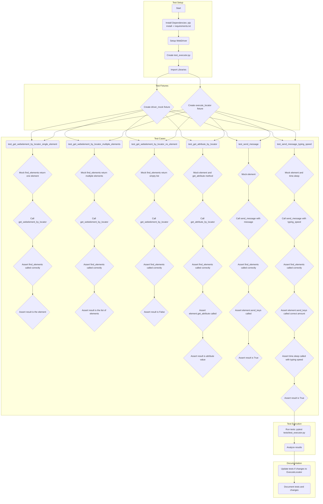

## Анализ кода тестирования класса `ExecuteLocator`

### 1. <алгоритм>

Этот документ представляет собой руководство по тестированию класса `ExecuteLocator`, который является частью проекта, использующего Selenium WebDriver для взаимодействия с веб-страницами. Раздел `Руководство по тестированию класса ExecuteLocator` описывает процесс от установки необходимых зависимостей до запуска и анализа результатов тестов.

**Блок-схема:**

1.  **Подготовка окружения:**
    *   **1.1 Установка зависимостей:**
        *   Используется `pip install -r requirements.txt` для установки библиотек `pytest` и `selenium`.
        *   Пример `requirements.txt`:
            ```text
            pytest==7.4.0
            selenium==4.16.1
            ```
    *   **1.2 Настройка WebDriver:**
        *   Установка WebDriver (например, ChromeDriver) для выбранного браузера.
2.  **Написание тестов:**
    *   **2.1 Структура тестов:**
        *   Создается файл `test_executor.py` в директории `tests`.
        *   Импортируются библиотеки: `pytest`, `unittest.mock`, `selenium.webdriver.remote.webelement`, `selenium.webdriver.common.by`, `src.webdriver.executor.ExecuteLocator`, `src.logger.exceptions.ExecuteLocatorException`.
        *   Создаются фикстуры `driver_mock` (мок-объект WebDriver) и `execute_locator` (экземпляр `ExecuteLocator` с мок-драйвером).
        *   Создаются функции тестов, такие как `test_get_webelement_by_locator_single_element`, `test_get_webelement_by_locator_multiple_elements`, `test_get_webelement_by_locator_no_element`, `test_get_attribute_by_locator`, `test_send_message` и `test_send_message_typing_speed`.
    *   **2.2 Реализация тестов:**
        *   `test_get_webelement_by_locator_single_element`:
            *   Мокается метод `find_elements` драйвера, чтобы вернуть один веб-элемент.
            *   Вызывается метод `get_webelement_by_locator` с локатором.
            *   Проверяется, что `find_elements` был вызван с правильными аргументами и результат соответствует ожидаемому.
        *   `test_get_webelement_by_locator_multiple_elements`:
            *   Мокается `find_elements`, возвращающий список веб-элементов.
            *   Вызывается `get_webelement_by_locator` с локатором.
            *   Проверяется вызов `find_elements` и что возвращается список элементов.
        *   `test_get_webelement_by_locator_no_element`:
            *   Мокается `find_elements`, возвращающий пустой список.
            *   Вызывается `get_webelement_by_locator`.
            *   Проверяется, что возвращается `False`.
        *   `test_get_attribute_by_locator`:
            *   Мокается элемент и его метод `get_attribute`.
            *   Вызывается `get_attribute_by_locator`.
            *   Проверяются вызовы `find_elements`, `get_attribute` и что возвращается значение атрибута.
        *   `test_send_message`:
            *   Мокается элемент.
            *   Вызывается `send_message`.
            *   Проверяется вызов `find_elements`, `send_keys` и что возвращается `True`.
        *   `test_send_message_typing_speed`:
            *   Мокается `time.sleep` и элемент.
            *   Вызывается `send_message` с указанием скорости печати.
            *   Проверяется вызов `find_elements`, количество вызовов `send_keys`, вызовы `time.sleep` и что возвращается `True`.
3.  **Запуск тестов:**
    *   Используется `pytest tests/test_executor.py` для запуска тестов.
4.  **Проверка результатов тестирования:**
    *   Анализируется вывод `pytest`.
    *   Исправляются ошибки в тестах или коде, если тесты не проходят.
5.  **Обновление тестов:**
    *   Тесты обновляются при изменении класса `ExecuteLocator`.
6.  **Документация:**
    *   Документируются новые или измененные тесты.

### 2. <mermaid>



**Объяснение зависимостей `mermaid`:**

*   **Test Setup:**
    *   `Start`: Начало процесса тестирования.
    *   `Install Dependencies`: Шаг установки необходимых библиотек (pytest, selenium).
    *   `Setup WebDriver`: Настройка драйвера для браузера.
    *   `Create test_executor.py`: Создание файла с тестами.
    *   `Import Libraries`: Импорт необходимых библиотек для тестов.

*   **Test Fixtures:**
    *   `Create driver_mock fixture`: Создание мок-объекта для имитации WebDriver.
    *   `Create execute_locator fixture`: Создание экземпляра класса `ExecuteLocator` с мок-драйвером.

*   **Test Cases:**
    *   `test_get_webelement_by_locator_single_element`: Функция тестирования метода `get_webelement_by_locator` при нахождении одного элемента.
    *  `Mock find_elements return one element`: мокаем метод find_elements с возвращением одного элемента.
    * `Call get_webelement_by_locator`: вызываем метод который тестируем.
     *   `Assert find_elements called correctly`: Проверяем, что метод `find_elements` был вызван с правильными аргументами.
    *   `Assert result is the element`: Проверяем, что метод вернул верный элемент.
     *   `test_get_webelement_by_locator_multiple_elements`: Функция тестирования метода `get_webelement_by_locator` при нахождении нескольких элементов.
     *   `Mock find_elements return multiple elements`: мокаем метод find_elements с возвращением списка элементов.
       * `Assert result is the list of elements`: Проверяем, что метод вернул верный список элементов.
     *  `test_get_webelement_by_locator_no_element`: Функция тестирования метода `get_webelement_by_locator`, когда элемент не найден.
     *   `Mock find_elements return empty list`: мокаем метод find_elements с возвращением пустого списка.
      *    `Assert result is False`: Проверяем, что метод вернул `False`.
     *   `test_get_attribute_by_locator`: Функция тестирования метода `get_attribute_by_locator`.
     *  `Mock element and get_attribute method`: мокаем элемент и его метод get_attribute.
       *   `Assert element.get_attribute called`: Проверяем, что метод `get_attribute` был вызван с правильными аргументами.
      *    `Assert result is attribute value`: Проверяем, что метод вернул верное значение атрибута.
     * `test_send_message`: Функция тестирования метода `send_message`.
       *   `Mock element`: мокаем элемент.
        *`Assert element.send_keys called`: Проверяем, что метод `send_keys` был вызван.
        * `Assert result is True`: Проверяем, что метод вернул `True`.
     *   `test_send_message_typing_speed`: Функция тестирования метода `send_message` с задержкой печати.
     *  `Mock element and time.sleep`: Мокаем элемент и time.sleep.
        *    `Assert element.send_keys called correct amount`: Проверяем количество вызовов `send_keys`.
        * `Assert time.sleep called with typing speed`: Проверяем что time.sleep вызван с правильной скоростью.

*   **Test Execution:**
    *   `Run tests`: Запуск тестов с помощью pytest.
    *   `Analyze results`: Анализ результатов тестирования.

*   **Documentation:**
    *  `Update tests if changes to ExecuteLocator`: Обновление тестов при изменении `ExecuteLocator`.
    * `Document tests and changes`: Документирование тестов.

### 3. <объяснение>

**Импорты:**

*   `import pytest`:  Импортирует библиотеку `pytest` для написания и запуска тестов.
*   `from unittest.mock import MagicMock, patch`: Импортирует `MagicMock` для создания мок-объектов и `patch` для временной замены частей кода в тестах. Это позволяет имитировать поведение зависимостей, таких как WebDriver.
*   `from selenium.webdriver.remote.webelement import WebElement`: Импортирует класс `WebElement` из Selenium для работы с веб-элементами.
*   `from selenium.webdriver.common.by import By`: Импортирует класс `By` из Selenium, который используется для указания типа локатора (например, `By.XPATH`, `By.ID`, и т. д.).
*   `from src.webdriver.executor import ExecuteLocator`: Импортирует класс `ExecuteLocator` из модуля `src.webdriver.executor`. Этот класс является основной целью тестирования.
*   `from src.logger.exceptions import ExecuteLocatorException`: Импортирует класс исключений `ExecuteLocatorException` из модуля `src.logger.exceptions`. Это может быть использовано в тестах для проверки обработки исключений.

**Классы:**

*   `ExecuteLocator`: Класс, который тестируется. Его роль - инкапсулировать методы для взаимодействия с веб-элементами через Selenium WebDriver. Основные методы:
    *   `get_webelement_by_locator(locator)`: Находит и возвращает веб-элемент(ы) по заданному локатору.
    *   `get_attribute_by_locator(locator)`: Получает значение атрибута веб-элемента.
    *   `send_message(locator, message, typing_speed=0, continue_on_error=True)`: Отправляет сообщение в элемент с возможностью указания скорости печати.

**Функции:**

*   `@pytest.fixture def driver_mock()`: Фикстура `driver_mock` создает мок-объект, имитирующий поведение Selenium WebDriver. Это позволяет изолировать тесты от реального браузера.
*   `@pytest.fixture def execute_locator(driver_mock)`: Фикстура `execute_locator` создает экземпляр класса `ExecuteLocator`, передавая ему мок-драйвер.
*   `test_get_webelement_by_locator_single_element(execute_locator, driver_mock)`: Тест проверяет, что метод `get_webelement_by_locator` правильно возвращает веб-элемент при поиске одного элемента.
*   `test_get_webelement_by_locator_multiple_elements(execute_locator, driver_mock)`: Тест проверяет, что метод `get_webelement_by_locator` правильно возвращает список веб-элементов при поиске нескольких элементов.
*   `test_get_webelement_by_locator_no_element(execute_locator, driver_mock)`: Тест проверяет, что метод `get_webelement_by_locator` правильно возвращает `False`, если элемент не найден.
*   `test_get_attribute_by_locator(execute_locator, driver_mock)`: Тест проверяет, что метод `get_attribute_by_locator` правильно получает значение атрибута веб-элемента.
*  `test_send_message(execute_locator, driver_mock)`: Тест проверяет, что метод `send_message` отправляет сообщение в элемент.
*  `test_send_message_typing_speed(execute_locator, driver_mock)`: Тест проверяет, что метод `send_message` отправляет сообщение в элемент с заданной скоростью печати.

**Переменные:**

*   `locator`: Словарь, который содержит информацию о том, как найти элемент на веб-странице. Ключи:
    *   `by`: Тип локатора (например, `XPATH`, `CSS_SELECTOR`, и т. д.).
    *   `selector`: Строка, которая определяет элемент.
    *   `attribute`: (опционально) Атрибут, который нужно получить.
*   `message`: Строка, содержащая сообщение, которое нужно отправить.
*   `typing_speed`: Скорость набора текста в секундах.
*   `element`: Мок-объект, представляющий веб-элемент.
*   `driver_mock`: Мок-объект, представляющий WebDriver.
*   `execute_locator`: Экземпляр класса `ExecuteLocator`.
*   `result`: Переменная, в которой хранится результат выполнения метода, который тестируется.

**Потенциальные ошибки и области для улучшения:**

*   **Отсутствие тестов на обработку ошибок:** Не хватает тестов для проверки обработки исключений в методах класса `ExecuteLocator`. Необходимо добавить тесты, которые проверяют, что `ExecuteLocatorException` или другие исключения генерируются и обрабатываются правильно при возникновении ошибок.
*   **Неполное покрытие тестами:** Не хватает тестов для проверки всех возможных сценариев, например, при отправке пустого сообщения или неправильного локатора.
*   **Жестко заданные локаторы:** Локаторы в тестах жестко заданы. Лучше использовать параметризацию или выносить локаторы в отдельные файлы, чтобы упростить их поддержку и изменение.
*   **Использование `assert result is True`:**  Может быть более точным использовать `assert result == True` для проверки булевых значений.

**Взаимосвязи с другими частями проекта:**

*   `src.webdriver.executor.ExecuteLocator`: Основной тестируемый класс.
*   `src.logger.exceptions.ExecuteLocatorException`: Класс исключений, используемый для обработки ошибок в `ExecuteLocator`.
*   `selenium.webdriver`: Используется для взаимодействия с веб-элементами через WebDriver.
*   `pytest`: Используется для написания и запуска тестов.

Данное руководство предоставляет базовую основу для тестирования класса `ExecuteLocator`. Необходимо расширить тесты, чтобы обеспечить надежную проверку всех его функций, а также обработку всех возможных ошибок и граничных условий.