## АНАЛИЗ КОДА: `test_driver_executor.py`

### 1. <алгоритм>

**Общий алгоритм:**
Этот файл содержит набор тестов, проверяющих функциональность `webdriver` и `ExecuteLocator`. Основная идея заключается в создании `WebDriver`,  использовании фикстуры `execute_locator` для взаимодействия с веб-страницей и проверки корректности работы методов класса `ExecuteLocator`.

**Блок-схема:**

1. **Инициализация (Setup):**
    *   Запускается `pytest` для запуска тестов.
    *   Фикстура `driver` создает экземпляр `WebDriver` (Chrome), открывает страницу `http://example.com` и передает его в тесты.
    *   Фикстура `execute_locator` создает экземпляр `ExecuteLocator` с переданным `WebDriver` экземпляром.
2.  **Тесты (`test_...`)**
    *   Каждый тест проверяет определенную функцию `ExecuteLocator` или состояние `WebDriver`.
    *   Пример: `test_navigate_to_page`:
        *   Проверяет, что `driver.current_url` соответствует ожидаемому URL.
    *   Пример: `test_get_webelement_by_locator_single_element`:
        *   Создается `locator` для поиска элемента `h1`.
        *   Вызывается `execute_locator.get_webelement_by_locator(locator)`.
        *   Проверяется, что возвращенный элемент является экземпляром `WebElement` и его текст соответствует ожидаемому значению.
     *   Пример: `test_get_webelement_by_locator_no_element`:
         *  Создается `locator` для поиска несуществующего элемента.
         *  Вызывается `execute_locator.get_webelement_by_locator(locator)`.
         *  Проверяется, что возвращен `False`.
    *   Пример: `test_send_message`:
        *   Создается `locator` для текстового поля.
        *   Вызывается `execute_locator.send_message(locator, "Hello World")`.
        *   Проверяется, что сообщение было отправлено.
    *   Пример: `test_get_attribute_by_locator`:
         * Создается `locator` для поиска элемента `<a>`.
         * Вызывается `execute_locator.get_attribute_by_locator(locator, message="href")`.
         * Проверяется, что возвращенный атрибут соответствует ожидаемому.
    *   Пример: `test_execute_locator_event`:
         *  Создается `locator` для поиска элемента `<a>`.
         *  Вызывается `execute_locator.execute_locator(locator, message="click")`.
         *  Проверяется, что событие было выполнено.
    *   Пример: `test_get_locator_keys`:
        *  Вызывается статический метод `ExecuteLocator.get_locator_keys()`.
        *  Проверяется, что возвращаемые ключи соответствуют ожидаемым.
    *   Пример: `test_navigate_and_interact`:
         *   Идет на страницу `https://www.wikipedia.org/`.
         *   Ищет поле ввода и вводит `Selenium`.
         *   Ищет кнопку `submit` и кликает по ней.
         *   Проверяет заголовок открывшейся страницы и наличие элемента с нужным текстом.
    *   Пример: `test_invalid_locator`:
         *  Создается `locator` с некорректным значением `by`.
         *  Вызывается `execute_locator.execute_locator(locator, message="click")`.
         *  Проверяется, что возникает исключение `ExecuteLocatorException`.
3.  **Завершение (Teardown):**
    *   Фикстура `driver` закрывает браузер (`driver.quit()`) после выполнения всех тестов.

**Поток данных:**
    *   `pytest`  -> `driver` (создание `WebDriver`)
    *   `driver`  -> `execute_locator` (создание `ExecuteLocator`)
    *   `execute_locator` -> `WebDriver` (выполнение действий, поиск элементов)
    *   Тестовые функции -> `execute_locator` (вызов методов и проверки)

```mermaid
flowchart TD
    subgraph Pytest Fixtures
        driverFixture(<code>driver</code> <br>WebDriver Setup)
        executeLocatorFixture(<code>execute_locator</code> <br>ExecuteLocator Setup)
    end
    
    subgraph Test Cases
        testNavigateToPage(<code>test_navigate_to_page</code> <br>Navigates to page)
        testGetWebElementSingle(<code>test_get_webelement_by_locator_single_element</code> <br>Gets single element)
        testGetWebElementNone(<code>test_get_webelement_by_locator_no_element</code> <br>Handles no element)
        testSendMessage(<code>test_send_message</code> <br>Sends message)
        testGetAttribute(<code>test_get_attribute_by_locator</code> <br>Gets attribute)
        testExecuteLocatorEvent(<code>test_execute_locator_event</code> <br>Executes event)
        testGetLocatorKeys(<code>test_get_locator_keys</code> <br>Gets locator keys)
        testNavigateAndInteract(<code>test_navigate_and_interact</code> <br>Navigates and interacts)
        testInvalidLocator(<code>test_invalid_locator</code> <br>Handles invalid locator)
    end

    driverFixture --> executeLocatorFixture
    executeLocatorFixture --> testNavigateToPage
    executeLocatorFixture --> testGetWebElementSingle
    executeLocatorFixture --> testGetWebElementNone
    executeLocatorFixture --> testSendMessage
    executeLocatorFixture --> testGetAttribute
    executeLocatorFixture --> testExecuteLocatorEvent
    executeLocatorFixture --> testGetLocatorKeys
    executeLocatorFixture --> testNavigateAndInteract
    executeLocatorFixture --> testInvalidLocator

    style driverFixture fill:#f9f,stroke:#333,stroke-width:2px
    style executeLocatorFixture fill:#ccf,stroke:#333,stroke-width:2px
    style testNavigateToPage fill:#cfc,stroke:#333,stroke-width:2px
    style testGetWebElementSingle fill:#cfc,stroke:#333,stroke-width:2px
    style testGetWebElementNone fill:#cfc,stroke:#333,stroke-width:2px
    style testSendMessage fill:#cfc,stroke:#333,stroke-width:2px
    style testGetAttribute fill:#cfc,stroke:#333,stroke-width:2px
    style testExecuteLocatorEvent fill:#cfc,stroke:#333,stroke-width:2px
    style testGetLocatorKeys fill:#cfc,stroke:#333,stroke-width:2px
    style testNavigateAndInteract fill:#cfc,stroke:#333,stroke-width:2px
    style testInvalidLocator fill:#cfc,stroke:#333,stroke-width:2px
    
```

### 2. <mermaid>

**Объяснение зависимостей `mermaid`:**

1.  **`Pytest Fixtures`**:
    *   `driverFixture`: Представляет фикстуру `driver`, которая инициализирует и возвращает экземпляр `webdriver.Chrome`. Эта фикстура обеспечивает настройку и управление жизненным циклом `WebDriver` для всех тестов.
    *   `executeLocatorFixture`: Представляет фикстуру `execute_locator`, которая создает и возвращает экземпляр `ExecuteLocator`, используя `driver` из предыдущей фикстуры. Она обеспечивает доступ к методам `ExecuteLocator` для взаимодействия с элементами веб-страницы.
2.  **`Test Cases`**:
    *   Каждая нода, начинающаяся с `test`, представляет отдельный тестовый метод, который проверяет конкретную функциональность.
    *   `testNavigateToPage`: Проверяет навигацию по странице.
    *    `testGetWebElementSingle`: Проверяет получение одиночного элемента по локатору.
    *    `testGetWebElementNone`: Проверяет обработку случая, когда элемент по локатору не найден.
    *    `testSendMessage`: Проверяет отправку сообщения элементу.
    *   `testGetAttribute`: Проверяет получение атрибута элемента.
    *   `testExecuteLocatorEvent`: Проверяет выполнение события на элементе.
    *    `testGetLocatorKeys`: Проверяет получение ключей локатора.
    *    `testNavigateAndInteract`: Проверяет навигацию и взаимодействие с элементами на другой странице.
    *   `testInvalidLocator`: Проверяет обработку некорректного локатора.
3.  **Связи (стрелки):**
    *   Стрелки показывают поток зависимостей. `driverFixture` создает `WebDriver`, который используется в `executeLocatorFixture`. Затем `executeLocatorFixture` предоставляется каждому тестовому методу.

    Таким образом, диаграмма `mermaid` наглядно показывает зависимости между фикстурами и тестовыми методами, а также порядок их выполнения.

### 3. <объяснение>

**Импорты:**

*   `pytest`: Фреймворк для тестирования. Используется для создания и запуска тестов, а также для фикстур.
*   `selenium.webdriver`: Модуль для управления браузером.
    *   `webdriver`:  Содержит классы для управления браузерами, такие как `Chrome`.
    *   `chrome.service.Service`:  Сервис для управления процессом `chromedriver`.
    *   `common.by.By`:  Класс для определения стратегий поиска элементов (`XPATH`, `ID`, `CSS`).
    *   `chrome.options.Options`: Класс для установки опций браузера, таких как headless mode.
    *   `remote.webelement.WebElement`:  Класс для представления веб-элементов.
    *   `common.action_chains.ActionChains`: Класс для выполнения сложных действий, таких как перемещение мыши, двойные клики.
    *   `support.ui.WebDriverWait`: Класс для ожидания определенного состояния веб-элемента.
    *   `support.expected_conditions as EC`:  Набор условий для ожидания веб-элементов.
*   `src.webdriver.executor.ExecuteLocator`:  Класс для взаимодействия с элементами веб-страницы по локатору.
*  `src.logger.exceptions.ExecuteLocatorException`:  Исключение, которое может быть вызвано при ошибке в `ExecuteLocator`.

**Фикстуры (`fixtures`):**

*   `driver`:
    *   `scope="module"`: Указывает, что фикстура будет выполняться один раз для всего модуля.
    *   Создаёт `Options`, добавляет аргумент `--headless` для запуска браузера без графического интерфейса.
    *   Использует `Service` для управления процессом `chromedriver`.
    *   Создаёт экземпляр `webdriver.Chrome` с заданными опциями.
    *   Открывает страницу `http://example.com`.
    *   Использует `yield` для передачи экземпляра `driver` в тесты и гарантирует выполнение кода после тестов (`driver.quit()`).
*   `execute_locator`:
    *   Создаёт и возвращает экземпляр класса `ExecuteLocator`, передавая ему объект `driver`.

**Тестовые функции (`test_...`)**:

*   `test_navigate_to_page(execute_locator, driver)`:
    *   Проверяет, что текущий URL страницы соответствует `http://example.com`.
*   `test_get_webelement_by_locator_single_element(execute_locator, driver)`:
    *   Проверяет, что метод `get_webelement_by_locator` возвращает `WebElement` при поиске существующего элемента.
    *   Проверяет, что текст элемента соответствует ожидаемому значению.
*   `test_get_webelement_by_locator_no_element(execute_locator, driver)`:
    *   Проверяет, что метод `get_webelement_by_locator` возвращает `False`, когда элемент не найден.
*   `test_send_message(execute_locator, driver)`:
    *   Проверяет, что метод `send_message` успешно отправляет текст в элемент.
*   `test_get_attribute_by_locator(execute_locator, driver)`:
    *   Проверяет, что метод `get_attribute_by_locator` возвращает значение атрибута элемента.
*   `test_execute_locator_event(execute_locator, driver)`:
    *   Проверяет, что метод `execute_locator` выполняет событие (клик) на элементе.
*   `test_get_locator_keys(execute_locator, driver)`:
    *   Проверяет, что статический метод `get_locator_keys` возвращает ожидаемый список ключей локатора.
*   `test_navigate_and_interact(execute_locator, driver)`:
    *   Проверяет навигацию на другую страницу, ввод текста и клик по кнопке.
    *  Проверяет наличие элемента на загрузившейся странице.
*   `test_invalid_locator(execute_locator, driver)`:
    *   Проверяет, что при передаче некорректного локатора вызывается исключение `ExecuteLocatorException`.

**Классы:**

*   `ExecuteLocator`: (из `src.webdriver.executor`)
    *   Предоставляет методы для выполнения действий над веб-элементами с использованием локаторов.
    *  Методы: `get_webelement_by_locator`, `send_message`, `get_attribute_by_locator`, `execute_locator`, `get_locator_keys`.
*   `WebElement`: (из `selenium.webdriver.remote.webelement`)
    *   Представляет HTML-элемент на веб-странице.

**Переменные:**

*   `locator`: Словарь, представляющий локатор для поиска элемента. Содержит ключи `by` (тип локатора, например, "XPATH") и `selector` (значение локатора).
*   `message`: Строка, передаваемая в метод `send_message` или как тип события.
*   `element`: Экземпляр `WebElement`, найденный на странице.
*   `attribute_value`: Строка, содержащая значение атрибута элемента.
*  `result`: Результат выполнения методов `execute_locator`.
* `options`: Экземпляр класса `selenium.webdriver.chrome.options.Options`
*   `service`: Экземпляр класса `selenium.webdriver.chrome.service.Service`

**Потенциальные ошибки и области для улучшения:**

*   **Жестко заданный путь к `chromedriver`**: Путь к `chromedriver` (`/path/to/chromedriver`) жестко задан и требует настройки для каждого окружения.  Лучше использовать `webdriver-manager` для автоматического управления драйвером.
*   **Зависимость от конкретной страницы**: Тесты завязаны на структуру `http://example.com`, `https://www.wikipedia.org/`, что может вызвать проблемы при их изменении.
*   **Слабые проверки**: Некоторые проверки (`assert result is True`) являются слишком общими и могут пропустить ошибки. Стоит проверять конкретные результаты действий.
*   **Повторение локаторов**: Локаторы могут быть вынесены в константы или более гибкие конфигурации.

**Взаимосвязь с другими частями проекта:**

*   `src.webdriver.executor.ExecuteLocator`: Этот файл является потребителем класса `ExecuteLocator`, демонстрируя, как использовать его методы для взаимодействия с веб-элементами.
*   `src.logger.exceptions.ExecuteLocatorException`: Используется для обработки ошибок, возникающих при выполнении действий с локаторами.

**Цепочка взаимосвязей:**

1.  `test_driver_executor.py` -> `ExecuteLocator` (из `src.webdriver.executor`): Использует `ExecuteLocator` для взаимодействия с веб-элементами.
2. `ExecuteLocator` -> `WebDriver`: Выполняет действия на основе `WebDriver`.
3. `WebDriver` -> Браузер (Chrome): Управляет браузером через `chromedriver`.
4. `test_driver_executor.py` -> `pytest`: Используется для запуска тестов и управления их выполнением.
5.  `test_driver_executor.py` -> `ExecuteLocatorException` (из `src.logger.exceptions`): Обрабатывает возможные исключения.

Этот анализ обеспечивает подробное понимание функциональности кода, его зависимостей и потенциальных областей для улучшения.