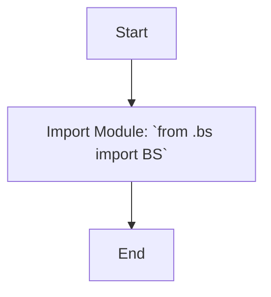

## Анализ кода `hypotez/src/webdriver/bs/__init__.py`

### <алгоритм>
1. **Начало**: Запускается интерпретатор Python.
2. **Импорт**: Импортируется модуль `BS` из текущего пакета `src.webdriver.bs`. Этот модуль предположительно содержит логику для взаимодействия с BeautifulSoup или аналогичными библиотеками для веб-скрапинга.
   - Пример: `from .bs import BS` импортирует класс или модуль `BS`, находящийся в файле `bs.py` в том же каталоге.
3. **Завершение**:  Файл `__init__.py` завершает свою работу, делая модуль `BS` доступным для импорта из пакета `src.webdriver.bs`.

### <mermaid>

### <объяснение>
- **Импорты**:
  - `from .bs import BS`: Этот импорт является ключевым в данном файле. Он импортирует модуль или класс `BS` из файла `bs.py`, находящегося в том же каталоге, что и файл `__init__.py`. Точка `.` в `from .bs` означает, что импорт производится из текущего пакета. Этот импорт позволяет использовать логику, определенную в `bs.py`, через пакет `src.webdriver.bs`.

- **Классы**:
  - В данном файле `__init__.py` нет определения классов. Основная цель этого файла - сделать класс или модуль `BS` доступным для импорта из пакета `src.webdriver.bs`. Класс или модуль `BS` вероятно определен в файле `bs.py`.

- **Функции**:
  - В данном файле `__init__.py` нет определения функций. Его основная функция — инициализировать пакет и сделать его модули доступными для импорта.

- **Переменные**:
  - В данном файле `__init__.py` нет определения переменных.

**Дополнительные замечания**:

- Файл `__init__.py` является важной частью структуры пакета Python. Его наличие делает каталог `bs` пакетом, из которого можно импортировать модули.
- Импорт `BS` из `.bs` предполагает, что файл `bs.py` содержит важную логику, скорее всего, для работы с HTML или XML данными (судя по названию, возможно, с использованием BeautifulSoup).
- Этот файл действует как своего рода "шлюз" для доступа к функциональности `BS`, предоставляя удобную точку входа для других частей проекта.

**Цепочка взаимосвязей с другими частями проекта**:

- Другие модули в проекте, которые хотят использовать функциональность, связанную с веб-скрапингом или парсингом HTML/XML, будут импортировать `BS` через `from src.webdriver.bs import BS`.
- Этот файл связывает логику, определенную в файле `bs.py`, с пакетом `src.webdriver.bs`.

**Потенциальные области для улучшения**:

- **Документация**: Было бы полезно добавить docstring к самому файлу `__init__.py`, а также к классу или модулю `BS` в файле `bs.py`, чтобы пояснить их назначение и использование.
- **Обработка ошибок**: Если файл `bs.py` содержит логику, связанную с сетью или файловой системой, нужно добавить обработку ошибок для обеспечения надежной работы.
- **Тестирование**: В дальнейшем необходимо реализовать тесты для `bs.py`, чтобы гарантировать корректность его работы.