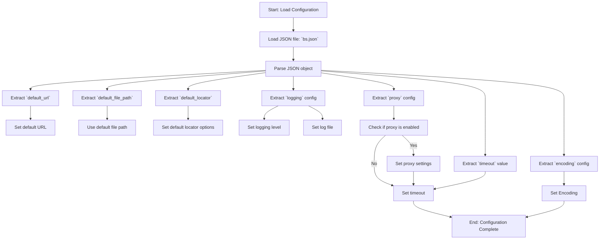

## АНАЛИЗ КОДА

### 1. <алгоритм>

Представленный код не является исполняемым кодом, а представляет собой JSON-объект, который описывает конфигурацию для веб-драйвера или другого приложения. Он не имеет шагов обработки данных, как в обычном программном коде. Однако, мы можем описать, как эта конфигурация могла бы быть использована в приложении:

1. **Чтение конфигурации**: Приложение считывает JSON-файл `bs.json`. 
   *  _Пример:_  Приложение использует стандартные библиотеки для разбора JSON (например, `json.load()` в Python) и загружает данные в структуру данных (словарь/объект).

2. **Использование параметров**: Приложение извлекает данные из загруженной структуры и использует их для настройки своих внутренних параметров. 
   * _Пример:_ Извлекается `default_url` и устанавливается как начальный URL в браузере веб-драйвера. `default_file_path` может быть использован для открытия локального HTML-файла.

3. **Конфигурация локатора**: Используются `default_locator` для определения стратегии поиска элементов на веб-странице.
   * _Пример:_ `by` (например, "ID"), `attribute` ("element_id"), и `selector` используются при поиске элемента на странице. Приложение может использовать  метод `find_element`  веб-драйвера с параметрами  `by="ID"` и `value="element_id"` .

4. **Конфигурация логирования**: Настраивается система логирования, используя параметры из раздела `logging`.
   * _Пример:_ Устанавливается уровень логирования `level` (например, `INFO`), и файл `file` (например, "logs/bs.log") для сохранения логов.

5. **Конфигурация прокси**: Используются параметры из раздела `proxy`, если прокси-сервер включен.
   * _Пример:_ Если `enabled` равно `true`, приложение будет использовать `server`, `username`, и `password` для подключения через прокси-сервер.

6. **Конфигурация тайм-аута**:  Используется значение `timeout` для установки времени ожидания различных операций.
   * _Пример:_ Время ожидания при загрузке страницы или поиске элемента устанавливается в 10 секунд.

7. **Конфигурация кодировки**: Значение `encoding` используется для обработки текста в правильной кодировке.
   * _Пример:_ Приложение использует кодировку `utf-8` при работе с текстовыми данными.

### 2. <mermaid>

**Объяснение диаграммы `mermaid`:**

*   **Start**: Начало процесса загрузки конфигурации.
*   **LoadJSON**: Загрузка содержимого JSON файла `bs.json`.
*   **ParseJSON**: Преобразование содержимого файла в структуру данных (словарь/объект).
*   **DefaultURL**: Извлечение URL по умолчанию.
*    **DefaultFilePath**: Извлечение пути к файлу по умолчанию.
*   **DefaultLocator**: Извлечение конфигурации локатора.
*   **LoggingConfig**: Извлечение конфигурации логирования.
*   **ProxyConfig**: Извлечение конфигурации прокси-сервера.
*   **TimeoutValue**: Извлечение значения таймаута.
*   **EncodingConfig**: Извлечение кодировки.
*   **UseDefaultURL**: Использование URL по умолчанию.
*   **UseDefaultFilePath**: Использование пути к файлу по умолчанию.
*   **UseDefaultLocator**: Использование конфигурации локатора по умолчанию.
*   **SetLoggingLevel**: Установка уровня логирования.
*   **SetLogFile**: Установка файла для сохранения логов.
*   **EnableProxy**: Проверка, включен ли прокси-сервер.
*   **UseProxy**: Использование настроек прокси-сервера.
*   **SetTimeout**: Установка значения таймаута.
*   **SetEncoding**: Установка кодировки.
*   **End**: Завершение процесса настройки.

### 3. <объяснение>

**Объяснение:**

*   **Импорты:** В данном коде нет явных импортов, поскольку это JSON-файл. Однако, при использовании этой конфигурации, приложение (написанное, например, на Python) будет импортировать библиотеки для работы с JSON (например, `json`) и для управления браузером (`webdriver`). В контексте `src`, эти библиотеки будут использовать функциональности, определенные в пакете `src`, например, `src.logging` для обработки логов,  `src.config` для работы с конфигурациями и так далее.

*   **Классы:** В этом JSON-файле нет классов. Однако предполагается, что приложение, которое будет использовать эту конфигурацию, будет иметь классы, которые используют эти параметры (например, класс для веб-драйвера, класс для работы с элементами на странице, и т. д.).

*   **Функции:** Этот JSON-файл не содержит функций, но подразумевает, что в коде, который использует эту конфигурацию, будут функции для работы с каждым элементом этой конфигурации. Например, функция для установки прокси, функция для поиска элементов на странице, функция для логирования.
   
     *   _Пример_:  Функция `setup_webdriver` могла бы использовать данные из этого файла для настройки веб-драйвера, функции `find_element`  и `find_elements` для поиска элементов на странице, а функция `log_message` для логирования событий.

*   **Переменные:**
    *   `default_url` (string): URL по умолчанию для веб-драйвера.
    *   `default_file_path` (string): Путь к локальному HTML-файлу.
    *   `default_locator` (object): Объект с настройками локатора.
        *   `by` (string): Тип локатора (например, "ID", "XPATH").
        *   `attribute` (string): Имя атрибута для поиска.
        *   `selector` (string): Селектор для поиска элемента.
    *   `logging` (object): Объект с настройками логирования.
        *   `level` (string): Уровень логирования (например, "INFO", "DEBUG", "ERROR").
        *   `file` (string): Путь к файлу для логирования.
    *   `proxy` (object): Объект с настройками прокси-сервера.
        *   `enabled` (boolean): Флаг, указывающий, включен ли прокси.
        *   `server` (string): Адрес прокси-сервера.
        *   `username` (string): Имя пользователя прокси-сервера.
        *   `password` (string): Пароль прокси-сервера.
    *   `timeout` (number): Время ожидания для операций, в секундах.
    *   `encoding` (string): Кодировка для текста (например, "utf-8").

**Потенциальные ошибки и области для улучшения:**

1.  **Отсутствие валидации**:  Нет явной валидации данных. Приложение, использующее эту конфигурацию, должно убедиться, что все значения имеют правильный тип и значения. Например, `timeout` должно быть числом, `enabled` должно быть логическим значением, и так далее.
2.  **Обработка ошибок прокси**: Если прокси-сервер недоступен или настройки неверны, необходимо обеспечить обработку таких ошибок, чтобы не приводить к краху приложения.
3.  **Недостаточно гибкая настройка локатора:** Можно расширить конфигурацию локатора, добавив другие типы селекторов.
4.  **Зависимость от жестко заданных путей:** Жестко заданные пути в `default_file_path`  и `logging.file`  могут вызвать проблемы на разных системах. Лучше использовать относительные пути или переменные окружения.
5.  **Отсутствие комментариев**: Внутри JSON нет комментариев. В будущем это может затруднить чтение и понимание конфигурации.

**Взаимосвязь с другими частями проекта (если применимо):**

Этот JSON-файл представляет собой файл конфигурации для модуля `webdriver`, который входит в состав более широкого проекта. Он влияет на то, как будет работать веб-драйвер, как он будет искать элементы, как будут вестись логи, и т. д.

Например, при использовании кода в Python, можно создать структуру пакетов, где `bs.json` будет находиться по пути `hypotez/src/webdriver/bs/bs.json`, а код, использующий эту конфигурацию, будет расположен в других модулях, например, в `src/webdriver/driver.py`. Этот файл `driver.py` будет импортировать `src.config` для чтения конфигурации и `src.webdriver` для управления браузером, при этом используя  настройки из `bs.json`.

Таким образом, данный JSON-файл является важным элементом в общей архитектуре проекта, обеспечивая гибкую настройку и управление веб-драйвером.