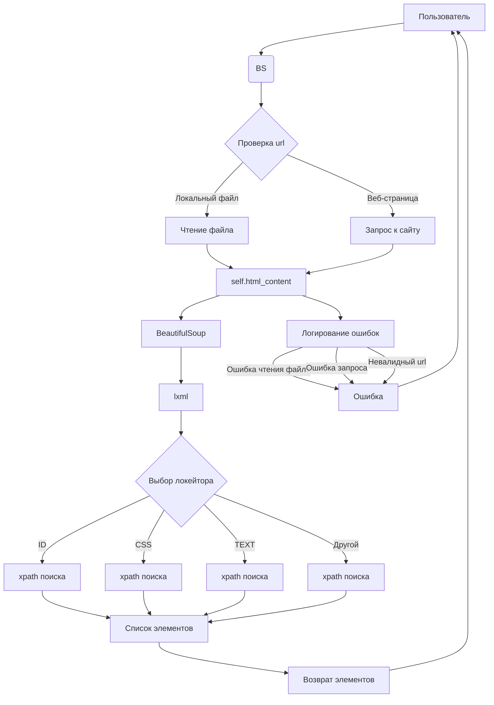

```MD
# <input code>

```python
## \file hypotez/src/webdriver/bs/bs.py
# -*- coding: utf-8 -*-

#! venv/bin/python/python3.12

"""
.. module: src.webdriver.bs 
	:platform: Windows, Unix
	:synopsis: parse pages with `BeautifulSoup` and XPath 
```python
if __name__ == "__main__":
    driver = Driver()
    # For file
    driver.get_url('path/to/your/file.html')
    # For URL
    driver.get_url('https://example.com')
    driver.execute_locator(locator)
```

"""


import re
from math import log
from bs4 import BeautifulSoup
from types import SimpleNamespace
from lxml import etree
import requests
from pathlib import Path
from src import gs
from src.webdriver.driver import Driver
from src.logger import logger

class BS:
    
    html_content:str
    def __init__(self, url:str|None=None):
        """"""
        self.html_content = url


    def get_url(self, url: str):
        """ Fetch HTML content from a file or URL and parse it with BeautifulSoup and XPath

        @param url: The file path or URL to fetch HTML content from
        """

        if url.startswith('file://'):
            # Remove 'file://' prefix and clean up the path
            cleaned_url = url.replace(r'file:///', '')
            
            # Extract the Windows path if it's in the form of 'c:/... or 'C:/...'
            match = re.search(r'[a-zA-Z]:[\\\\].*', cleaned_url)
            if match:
                file_path = Path(match.group(0))
                if file_path.exists():
                    try:
                        with open(file_path, 'r', encoding='utf-8') as file:
                            self.html_content = file.read()
                        return True
                    except Exception as ex:
                        logger.error('Exception while reading the file:', ex)
                        ...
                else:
                    logger.error('Local file not found:', file_path)
                    ...
            else:
                logger.error('Invalid file path:', cleaned_url)
                ...
        elif url.startswith('https://'):
            # Handle web URLs
            try:
                response = requests.get(url)
                response.raise_for_status()  # Check for HTTP request errors
                self.html_content = response.text
                return True
            except requests.RequestException as ex:
                logger.error(f"Error fetching {url}:", ex)
                ...
        else:
            logger.error('Invalid URL or file path:', url)
            ...
        


    def execute_locator(self,locator:SimpleNamespace|dict, url: str = None):
        """ мини версия экзкьютора вебдрайвера `Driver` (`src.webdriver.executor`)"""
        ...
        if url:
            self.get_url(url)
            
        soup = BeautifulSoup(self.html_content, 'lxml')
        tree = etree.HTML(str(soup))  # Convert BeautifulSoup object to lxml tree
        attribute = locator.attribute
        by = locator.by
        selector = locator.selector
        elements = None
        
        if by.upper() == 'ID':
            elements = tree.xpath(f'//*[@id="{attribute}"]')
        elif by.upper() == 'CSS':
            elements = tree.xpath(f'//*[contains(@class, "{attribute}")]')
        elif by.upper() == 'TEXT':
            elements = tree.xpath(f'//input[@type="{attribute}"]')
         ## @todo: - это костыль, а не логика"""
        else:
            ...
            elements = tree.xpath(selector)
            
        return elements
    
if __name__ == "__main__":
    driver = Driver()
    # For file
    driver.get_url('path/to/your/file.html')
    # For URL
    driver.get_url('https://example.com')
    locator:SimpleNamespace
    driver.execute_locator(locator)
```

# <algorithm>

**Алгоритм работы класса BS:**

1. **__init__(self, url):** Инициализирует экземпляр класса, принимая необязательный параметр `url`.  Присваивает переданный url в атрибут `html_content`.

2. **get_url(self, url):**
   - Проверяет, является ли `url` файлом или URL-адресом.
   - Если `url` начинается с 'file://':
     - Обрабатывает локальные файлы, используя `Path` для проверки существования и обработки путей.
     - Чтение содержимого файла в `self.html_content` с помощью `open`. Возвращает `True` если чтение успешно, иначе логгирует ошибки.
   - Если `url` начинается с 'https://':
     - Использует `requests` для получения содержимого веб-страницы.
     - Обрабатывает возможные ошибки при запросе. Если запрос успешен, то сохраняет содержимое в `self.html_content` и возвращает `True`. Иначе логгирует ошибки.
   - В других случаях, логгирует ошибки.

3. **execute_locator(self, locator, url=None):**
   - Если `url` передан, то выполняет `self.get_url(url)` для получения содержимого.
   - Создаёт объект `BeautifulSoup` для парсинга `self.html_content`.
   - Преобразует `BeautifulSoup` объект в `lxml` дерево.
   - Использует XPath для поиска элементов на основе `locator`, проверяя тип локейтора (`ID`, `CSS`, `TEXT`).
   - Возвращает список найденных элементов (`elements`).


**Пример использования:**

Предположим, что `locator` содержит информацию для поиска элемента по ID:

```python
locator = SimpleNamespace(attribute='myElementId', by='ID', selector=None)
elements = bs_instance.execute_locator(locator, url='https://example.com')
```


# <mermaid>



**Объяснение зависимостей:**

- `bs4`: Библиотека для парсинга HTML/XML.
- `lxml`: Библиотека для работы с XML/HTML, использует XPath для поиска.
- `requests`: Библиотека для отправки HTTP запросов.
- `pathlib`: Библиотека для работы с файловыми путями.
- `src.gs`, `src.webdriver.driver`, `src.logger`:  Предполагаемые модули из проекта `hypotez` для работы с Google Sheets, управлением браузером и логированием соответственно.  (Подробные детали не видны без доступа к этим модулям).

# <explanation>

**Импорты:**

- `re`: Для регулярных выражений, необходимых для обработки файловых путей.
- `math`: Не используется в данном коде.
- `bs4`: Для парсинга HTML.
- `types`: Для использования `SimpleNamespace` (представление данных).
- `lxml`: Для парсинга XML/HTML с помощью XPath.
- `requests`: Для запросов к веб-страницам.
- `pathlib`: Для работы с файловыми путями.
- `src.gs`: Предполагаемый модуль для работы с Google Sheets (не используется в анализируемом коде).
- `src.webdriver.driver`: Модуль для управления веб-драйвером.
- `src.logger`: Модуль для логирования.


**Классы:**

- `BS`: Класс для работы с HTML/XML с помощью BeautifulSoup и XPath.
  - `html_content`: Хранит содержимое HTML страницы.
  - `__init__`: Инициализирует экземпляр класса, принимая необязательный параметр `url`.
  - `get_url`: Загружает HTML содержимое из файла или URL.
  - `execute_locator`: Выполняет поиск элементов на странице с помощью XPath.


**Функции:**

- `get_url`: Загружает HTML-содержимое из файла или URL.  Принимает `url` (путь к файлу или URL) и обрабатывает различный типы данных (локальные файлы, веб-страницы). Возвращает `True` в случае успеха, `None` при ошибке.
- `execute_locator`: Выполняет поиск элементов на основе локейтора (`locator`).  Принимает `locator` (объект `SimpleNamespace` или `dict`) и необязательный параметр `url`. Возвращает список найденных элементов (`elements`).

**Переменные:**

- `MODE`: Строковая константа для выбора режима работы.
- `locator`: Объект `SimpleNamespace` или `dict`, содержащий информацию для локейтинга элементов на странице.
- `elements`: Список найденных элементов.
- `url`: Строка, представляющая путь к файлу или URL-адресу.

**Возможные ошибки и улучшения:**

- **Обработка ошибок:**  Код содержит `try...except` блоки для обработки ошибок при чтении файлов и запросах к веб-страницам, но обработка слишком общая (`...`). Нужно более конкретное определение типа ожидаемых исключений и их обработки.
- **Более гибкий локейтор:**  Функция `execute_locator` обрабатывает только локейторы по `ID`, `CSS` и `TEXT`.  Следует добавить обработку и других типов локейторов или использовать более гибкую схему локейтинга (например, с использованием дополнительных параметров `locator`).
- **Обработка `locator`:** Код предполагает, что `locator` будет объектом `SimpleNamespace`.  Лучше использовать более абстрактный класс или интерфейс для `locator`, чтобы принять различные типы данных.
- **Документация:** Более подробная документация для функций и классов значительно повысила бы читаемость и поддерживаемость кода.

**Связь с другими частями проекта:**

- `src.webdriver.driver`:  Класс `BS` взаимодействует с классом `Driver` посредством вызова метода `get_url` и `execute_locator`.  Это указывает на то, что класс `BS` является частью стека тестирования или автоматизации.