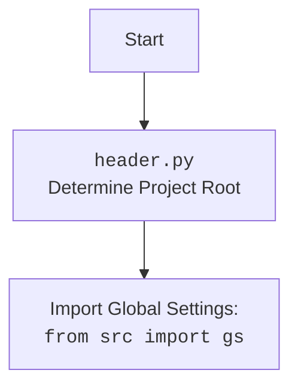

## ИНСТРУКЦИЯ:

Анализируй предоставленный код подробно и объясни его функциональность. Ответ должен включать три раздела:

1.  **<алгоритм>**: Опиши рабочий процесс в виде пошаговой блок-схемы, включая примеры для каждого логического блока, и проиллюстрируй поток данных между функциями, классами или методами.
2.  **<mermaid>**: Напиши код для диаграммы в формате `mermaid`, проанализируй и объясни все зависимости,
    которые импортируются при создании диаграммы.
    **ВАЖНО!** Убедитесь, что все имена переменных, используемые в диаграмме `mermaid`,
    имеют осмысленные и описательные имена. Имена переменных вроде `A`, `B`, `C`, и т.д., не допускаются!

    **Дополнительно**: Если в коде есть импорт `import header`, добавьте блок `mermaid` flowchart, объясняющий `header.py`:
    ```mermaid
    flowchart TD
        Start --> Header[<code>header.py</code><br> Determine Project Root]

        Header --> import[Import Global Settings: <br><code>from src import gs</code>]
    ```

3.  **<объяснение>**: Предоставьте подробные объяснения:
    -   **Импорты**: Их назначение и взаимосвязь с другими пакетами `src.`.
    -   **Классы**: Их роль, атрибуты, методы и взаимодействие с другими компонентами проекта.
    -   **Функции**: Их аргументы, возвращаемые значения, назначение и примеры.
    -   **Переменные**: Их типы и использование.
    -   Выделите потенциальные ошибки или области для улучшения.

Дополнительно, постройте цепочку взаимосвязей с другими частями проекта (если применимо).

Это обеспечивает всесторонний и структурированный анализ кода.
## Формат ответа: `.md` (markdown)
**КОНЕЦ ИНСТРУКЦИИ**

### <алгоритм>
1. **`set_project_root(marker_files)` Function:**
    - **Начало:** Функция вызывается с кортежем `marker_files` (по умолчанию `('__root__', '.git')`).
    - **Получение текущего пути:** Получает абсолютный путь к директории текущего файла (`__file__`).
        - Пример: Если `header.py` находится в `/home/user/project/src/webdriver/bs`, то `current_path` будет `/home/user/project/src/webdriver/bs`.
    - **Инициализация `__root__`:**  Устанавливает `__root__` равным текущему пути.
        - Пример: `__root__` = `/home/user/project/src/webdriver/bs`.
    - **Поиск родительских директорий:** Итерируется по текущей директории и всем ее родительским директориям.
        - Начинает поиск с текущей директории, затем переходит к родительской, затем к родительской родительской и т.д.
        - Пример: Последовательность: `/home/user/project/src/webdriver/bs`, `/home/user/project/src/webdriver`, `/home/user/project/src`, `/home/user/project`, `/home/user`, `/home`.
    - **Проверка маркерных файлов:** Для каждой директории проверяется, существует ли любой из маркерных файлов.
        - Пример: Для директории `/home/user/project`, проверяется, существует ли `/home/user/project/__root__` или `/home/user/project/.git`.
    - **Обновление `__root__`:** Если маркерный файл найден, `__root__` обновляется до текущей родительской директории, и цикл прерывается.
        - Пример: Если `/home/user/project/.git` существует, `__root__` становится `/home/user/project`, цикл останавливается.
    - **Добавление `__root__` в `sys.path`:** Если `__root__` еще нет в `sys.path`, то он добавляется.
        - Позволяет импортировать модули из корневой директории проекта.
    - **Возврат `__root__`:** Возвращает путь к корневой директории.
        - Пример: `/home/user/project`.
2. **Инициализация `__root__`:**
    - Функция `set_project_root()` вызывается, и возвращенное значение (путь к корневой директории) сохраняется в глобальную переменную `__root__`.
3. **Импорт `gs`:**
    - Из пакета `src` импортируется модуль `gs`, который, предположительно, содержит глобальные настройки проекта.
4. **Загрузка настроек из `settings.json`:**
    -  Попытка открыть и загрузить `settings.json` из каталога `src` в корневой директории проекта.
    - Если файл не найден или имеет неверный формат JSON, ошибки обрабатываются (ничего не происходит, `settings` остается `None`).
    -  `settings` содержит словарь с настройками проекта или `None`.
5. **Чтение документации из `README.MD`:**
    -  Попытка открыть и прочитать `README.MD` из каталога `src` в корневой директории проекта.
    -  Если файл не найден или возникает ошибка чтения файла, ошибки обрабатываются (ничего не происходит, `doc_str` остается `None`).
    -   `doc_str` содержит строку с содержимым файла или `None`.
6. **Инициализация глобальных переменных:**
    - Глобальные переменные проекта (`__project_name__`, `__version__`, `__doc__`, `__details__`, `__author__`, `__copyright__`, `__cofee__`) инициализируются значениями из `settings` (если он был успешно загружен) или значениями по умолчанию.

### <mermaid>
```mermaid
flowchart TD
    Start --> FindRoot[<code>set_project_root()</code>: Find Project Root Directory]
    FindRoot --> CheckMarker[Check for Marker Files: <code>__root__</code>, <code>.git</code>]
    CheckMarker -- Marker Found --> SetRoot[Set Root Directory]
    CheckMarker -- No Marker Found -->  ContinueSearch[Continue search in parent directories]
    ContinueSearch --> CheckMarker
    SetRoot --> AddToSysPath[Add Root to <code>sys.path</code>]
    AddToSysPath --> ReturnRoot[Return Root Path]
    ReturnRoot --> SetGlobalRoot[Set Global <code>__root__</code> variable]

    SetGlobalRoot --> ImportGS[Import Global Settings: <code>from src import gs</code>]
    ImportGS --> LoadSettings[Load Settings from <code>settings.json</code>]
    LoadSettings -- Success --> LoadReadme[Load Documentation from <code>README.MD</code>]
    LoadSettings -- Fail --> LoadReadme
    LoadReadme -- Success --> SetProjectVariables[Set Project Variables from Settings]
    LoadReadme -- Fail --> SetProjectVariables
    SetProjectVariables --> End[End]


    style Start fill:#f9f,stroke:#333,stroke-width:2px
    style End fill:#ccf,stroke:#333,stroke-width:2px
```



### <объяснение>

**Импорты:**
- `sys`: Модуль `sys` используется для взаимодействия с интерпретатором Python. В данном коде, он используется для добавления пути к корневой директории проекта в `sys.path`, что позволяет импортировать модули из этой директории.
- `json`: Модуль `json` используется для работы с данными в формате JSON. В коде используется для загрузки настроек проекта из файла `settings.json`.
- `packaging.version.Version`: Импортируется класс `Version` из модуля `packaging.version`, но нигде не используется в предоставленном коде. Это может быть потенциальной проблемой - ненужный импорт, или недоработка.
- `pathlib.Path`: Класс `Path` из модуля `pathlib` используется для представления файловых путей в виде объектов, что упрощает работу с путями.

**Функции:**
- `set_project_root(marker_files)`:
    - Аргументы: `marker_files` - кортеж строк, содержащих имена файлов или директорий, которые используются для определения корневой директории проекта (по умолчанию `('__root__', '.git')`).
    - Возвращаемое значение: Объект `Path`, представляющий путь к корневой директории проекта.
    - Назначение: Функция рекурсивно проходит вверх по иерархии директорий, начиная с директории, где находится скрипт, пока не найдет директорию, содержащую любой из маркерных файлов.
    - Примеры:
        - Если в директории `/home/user/project` есть файл `.git`, то `set_project_root()` вернет `/home/user/project`.
        - Если в директории `/home/user/project/src` есть файл `__root__`, то `set_project_root()` вернет `/home/user/project/src`.
        - Если маркерных файлов нет, функция вернет директорию с файлом `header.py`.

**Переменные:**
- `__root__`: Глобальная переменная типа `Path`, содержащая путь к корневой директории проекта, найденный функцией `set_project_root()`.
- `settings`: Глобальная переменная типа `dict` или `None`. Если файл `settings.json` успешно прочитан, содержит словарь с настройками проекта.
- `doc_str`: Глобальная переменная типа `str` или `None`. Если файл `README.MD` успешно прочитан, содержит строку с содержимым файла.
- `__project_name__`: Глобальная переменная типа `str`, содержащая имя проекта, извлеченное из `settings.json` или "hypotez" по умолчанию.
- `__version__`: Глобальная переменная типа `str`, содержащая версию проекта, извлеченное из `settings.json` или '' по умолчанию.
- `__doc__`: Глобальная переменная типа `str`, содержащая документацию проекта,  содержимое файла `README.MD` или '' по умолчанию.
- `__details__`: Глобальная переменная типа `str`, сейчас пустая.
- `__author__`: Глобальная переменная типа `str`, содержащая автора проекта, извлеченное из `settings.json` или '' по умолчанию.
- `__copyright__`: Глобальная переменная типа `str`, содержащая копирайт проекта, извлеченное из `settings.json` или '' по умолчанию.
- `__cofee__`: Глобальная переменная типа `str`,  содержащая сообщение про кофе для разработчика, извлеченное из `settings.json` или дефолтное сообщение.

**Объяснения:**

-   Основная задача кода – найти корневую директорию проекта, загрузить настройки из `settings.json` и прочитать документацию из `README.MD`.
-   Функция `set_project_root` используется для динамического определения корня проекта, что делает код переносимым и не зависящим от конкретного расположения файлов.
-   Импорт `from src import gs` предполагает наличие пакета `src` с модулем `gs` внутри. Этот модуль, скорее всего, предоставляет доступ к глобальным путям проекта и другим общим настройкам.
-   Блоки `try...except` используются для обработки ошибок, которые могут возникнуть при чтении `settings.json` или `README.MD`. В случае ошибки эти переменные останутся `None`, что позволяет программе продолжить работу, используя значения по умолчанию.
-   Глобальные переменные с префиксами `__` (например, `__project_name__`, `__version__` и т.д.) используются для хранения информации о проекте.

**Потенциальные ошибки и области для улучшения:**

-   Обработка ошибок в блоках `try...except`: в случае возникновения ошибок при чтении файлов, исключения обрабатываются, но никакое сообщение об ошибке не выводится в лог, что может усложнить отладку. Было бы полезно регистрировать ошибки.
-   Импорт `packaging.version.Version`: Этот импорт присутствует, но не используется в коде, поэтому его можно удалить.
-   Объявление переменной `__details__`:  Переменная объявлена, но нигде не используется, что делает её бесполезной в текущей реализации. Можно либо удалить, либо использовать.
-   Не хватает проверок на тип `settings` и `doc_str`.
-   Нет проверки существования каталогов `src` в пути, что потенциально может приводить к ошибкам, если каталог `src` будет отсутствовать.
-  Использование глобальных переменных: Глобальные переменные могут усложнить отладку и сопровождение кода, особенно в более крупных проектах. Было бы лучше использовать классы или другие способы для инкапсуляции данных.

**Взаимосвязи с другими частями проекта:**

-   Этот модуль устанавливает корневую директорию и загружает общие настройки, которые затем используются другими частями проекта.
-   Модуль `gs` (из `src import gs`) используется для доступа к глобальным настройкам проекта, что показывает связь с другими модулями, использующими `gs`.
-   `settings.json` и `README.MD` – это внешние файлы, которые влияют на работу этого модуля.

Этот анализ должен обеспечить всестороннее понимание функциональности и контекста использования `header.py`.