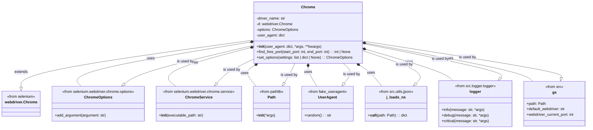
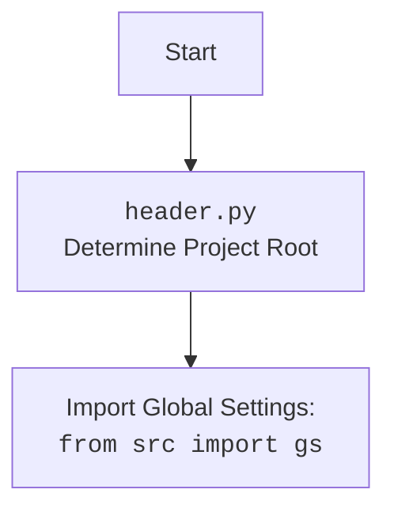

# Анализ кода `chrome.py`

## 1. <алгоритм>

### Блок-схема:

```mermaid
flowchart TD
    Start(Начало) --> InitChrome[Инициализация класса Chrome: `__init__`];
    InitChrome --> LoadSettings{Загрузка `chrome.json`};
    LoadSettings -- Успешно --> DefinePaths[Определение путей к драйверу и бинарнику];
    LoadSettings -- Ошибка --> LogError1[Логирование ошибки: "Ошибка в файле 'chrome.json'"];
    LogError1 --> End(Конец);
    DefinePaths --> SetOptions[Настройка опций Chrome: `set_options`];
    SetOptions --> AddProfileDir[Добавление пути к профилю пользователя];
    AddProfileDir --> DefineService[Определение сервиса Chrome];
    DefineService --> FindPort{Поиск свободного порта};
    FindPort -- Свободный порт найден --> AddPortOption[Добавление опции порта];
    FindPort -- Нет свободного порта --> LogError2[Логирование ошибки: "Нет свободных портов"];
    LogError2 --> End;
    AddPortOption --> StartDriver[Запуск WebDriver: `super().__init__`];
    StartDriver -- Успешно --> End;
    StartDriver -- WebDriverException --> LogError3[Логирование ошибки: "Ошибка инициализации WebDriver"];
    LogError3 --> End;
    StartDriver -- Exception --> LogError4[Логирование ошибки: "WebDriver упал. Общая ошибка"];
    LogError4 --> End;
    
    
    subgraph find_free_port.py
        FindPort --> LoopStart[Цикл по портам];
        LoopStart --> CheckPort{Проверка порта};
        CheckPort -- Порт свободен --> ReturnPort[Возврат свободного порта];
         CheckPort -- Порт занят --> LoopEnd;
        LoopEnd --> LoopStart;
        LoopEnd -- Конец цикла --> ReturnNone[Возврат None];
    end
     ReturnPort --> FindPort;
     ReturnNone --> FindPort;
    
    subgraph set_options.py
        SetOptions --> CheckSettings{Проверка настроек};
        CheckSettings -- Нет настроек --> ReturnEmptyOptions[Возврат пустых ChromeOptions];
        CheckSettings -- Есть настройки -->  CreateOptions[Создание объекта ChromeOptions];
        CreateOptions --> CheckOptionsSettings{Проверка 'options' в настройках};
        CheckOptionsSettings -- Есть 'options' -->  ParseOptions[Парсинг 'options'];
        ParseOptions -->  AddOptions[Добавление аргументов 'options'];
        AddOptions -->  CheckHeadersSettings{Проверка 'headers' в настройках};
         CheckOptionsSettings -- Нет 'options' --> CheckHeadersSettings;
        CheckHeadersSettings -- Есть 'headers' -->  AddHeaders[Добавление аргументов 'headers'];
        CheckHeadersSettings -- Нет 'headers' --> ReturnOptions[Возврат объекта ChromeOptions];
        AddHeaders --> ReturnOptions;
        ReturnEmptyOptions --> SetOptions;
        ReturnOptions --> SetOptions;
    end
```
### Примеры:
**`InitChrome`**: При создании объекта `Chrome`, первым делом вызывается метод `__init__`, который настраивает WebDriver.

**`LoadSettings`**: Загружает настройки из `chrome.json`.
Пример:

```json
{
    "driver": {
        "chromedriver": ["webdrivers", "chrome", "125.0.6422.14", "chromedriver.exe"],
        "chrome_binary": ["webdrivers", "chrome", "125.0.6422.14", "win64-125.0.6422.14", "chrome-win64", "chrome.exe"]
    },
    "headers": {
       "User-Agent": "Mozilla/5.0 (Windows NT 10.0; Win64; x64) AppleWebKit/537.36 (KHTML, like Gecko) Chrome/97.0.4692.71 Safari/537.36"
     },
     "options": [
         "headless=new",
         "disable-gpu=true",
         "disable-notifications=true"
        ]
}
```
**`DefinePaths`**: Извлекает пути к `chromedriver.exe` и `chrome.exe` из настроек. Например, `gs.path.bin` + `webdrivers/chrome/125.0.6422.14/chromedriver.exe`.

**`SetOptions`**: Устанавливает опции Chrome, такие как `headless`, `disable-gpu`, и добавляет пользовательские заголовки.

**`AddProfileDir`**: Добавляет путь к пользовательскому профилю Chrome.
**`DefineService`**: Создает объект `ChromeService` с путем к исполняемому файлу Chrome.

**`FindPort`**: Использует метод `find_free_port` для нахождения свободного порта.
**`StartDriver`**: Инициализирует WebDriver с заданными параметрами.

**`find_free_port`** - проверяет порт, пробуя установить биндинг, если не получилось, значит порт занят.

**`set_options`** - выставляет опции для браузера, если они есть.

## 2. <mermaid>


### Зависимости:

-   **`selenium.webdriver`**: Предоставляет базовый класс `webdriver.Chrome` для управления браузером.
-   **`selenium.webdriver.chrome.service`**: Содержит класс `Service` для настройки и управления ChromeDriver.
-   **`selenium.webdriver.chrome.options`**: Содержит класс `Options` для установки различных параметров запуска Chrome.
-   **`fake_useragent`**: Используется для генерации случайных user-agent строк.
-    **`pathlib`**: Модуль для работы с файловыми путями.
-    **`src.gs`**: Содержит глобальные настройки проекта, включая пути и параметры.
-   **`src.utils.jjson`**: Модуль для загрузки JSON файлов.
-   **`src.logger.logger`**: Модуль для логирования событий.
-    **`socket`**: Модуль для работы с сокетами.
-    **`os`**: Модуль для работы с системными переменными.



## 3. <объяснение>

### Импорты:

-   **`os`**: Используется для работы с переменными окружения (например, `LOCALAPPDATA`) и путями.
-   **`socket`**: Используется для проверки доступности порта при помощи сокетов.
-   **`pathlib.Path`**: Используется для создания и управления путями к файлам и каталогам.
-   **`typing.List`, `typing.Dict`**: Используется для аннотации типов переменных, что повышает читаемость и облегчает отладку.
-   **`selenium.webdriver`**: Основной модуль для управления браузером через WebDriver.
-   **`selenium.webdriver.chrome.service.Service`**: Класс для настройки и запуска ChromeDriver.
-   **`selenium.webdriver.chrome.options.Options`**: Класс для настройки опций запуска Chrome.
-   **`fake_useragent.UserAgent`**: Класс для генерации случайных user-agent строк, имитирующих разных пользователей.
-   **`selenium.common.exceptions.WebDriverException`**: Класс для обработки исключений, возникающих в процессе работы WebDriver.
-   **`src.gs`**: Глобальные настройки проекта, включая пути и параметры.
-   **`src.utils.jjson.j_loads_ns`**: Функция для загрузки настроек из JSON-файла, возвращающая словарь.
-   **`src.logger.logger`**: Модуль для логирования событий.

### Классы:

-   **`Chrome(webdriver.Chrome)`**:
    -   **Назначение**:  Наследует класс `webdriver.Chrome` и расширяет его функциональность для управления Chrome, включая установку опций, профилей и портов.
    -   **Атрибуты**:
        -   `driver_name` (`str`): Имя драйвера ('chrome').
        -   `d` (`webdriver.Chrome`): Экземпляр драйвера Chrome.
        -   `options` (`ChromeOptions`): Опции запуска Chrome.
        -   `user_agent` (`dict`): Пользовательский user-agent.
    -   **Методы**:
        -   `__init__(self, user_agent: dict = None, *args, **kwargs) -> None`:
            -   **Назначение**: Инициализирует WebDriver Chrome, загружает настройки из `chrome.json`, устанавливает профиль пользователя, находит свободный порт, применяет опции и запускает браузер.
            -   **Аргументы**:
                -   `user_agent` (`dict`, optional): Пользовательский user-agent.
                -   `*args`, `**kwargs`: Дополнительные аргументы.
            -   **Возвращает**: `None`.
        -   `find_free_port(self, start_port: int, end_port: int) -> int |  None`:
            -   **Назначение**: Находит первый свободный порт в заданном диапазоне.
            -   **Аргументы**:
                -   `start_port` (`int`): Начальный порт диапазона.
                -   `end_port` (`int`): Конечный порт диапазона.
            -   **Возвращает**: `int` - номер свободного порта, или `None`, если свободный порт не найден.
        -   `set_options(self, settings: list | dict | None = None) -> ChromeOptions`:
            -   **Назначение**: Устанавливает опции Chrome на основе настроек из JSON.
            -   **Аргументы**:
                -   `settings` (`list | dict | None`): Словарь с настройками из файла `chrome.json`.
            -   **Возвращает**: `ChromeOptions` - объект с установленными опциями.

### Функции:

-   В основном теле кода нет функций, кроме методов класса `Chrome`.

### Переменные:

-   `MODE = 'debug'`:  режим работы(не используется в коде).
-   `settings` (`dict`): Словарь с настройками, загруженными из `chrome.json`.
-   `profile_directory` (`str`): Путь к профилю пользователя Chrome.
-   `chromedriver_path_parts` (`list`): Список с частями пути к chromedriver.
-   `chromedriver_path` (`str`): Полный путь к chromedriver.exe.
-   `binary_location_parts` (`list`): Список с частями пути к chrome.exe.
-   `binary_location` (`str`): Полный путь к chrome.exe.
-   `free_port` (`int`): Свободный порт для WebDriver.

### Потенциальные ошибки и улучшения:

-   **Обработка ошибок:**
    -  Логирование ошибок присутствует, но можно добавить больше деталей.
    -  Не хватает полноценной перезагрузки драйвера и программы при ошибках.
-   **Конфигурация:**
    - Зависимость от переменных окружения, как `LOCALAPPDATA` может вызывать проблемы на разных системах.
-   **Улучшения**:
    -   Добавить возможность выбора профиля пользователя, так как на данный момент используется только один профиль.
    -   Реализовать механизм автоматического обновления драйверов и браузера.
    -   Расширить количество опций, доступных для настройки из `chrome.json`.

### Взаимосвязи с другими частями проекта:

-   **`src.gs`**: Используется для получения путей к драйверам, а также текущего порта.
-   **`src.utils.jjson`**: Используется для загрузки настроек из `chrome.json`.
-   **`src.logger.logger`**: Используется для логирования событий в процессе работы WebDriver.

Этот анализ дает полную картину работы кода `chrome.py` и его связей с другими частями проекта.