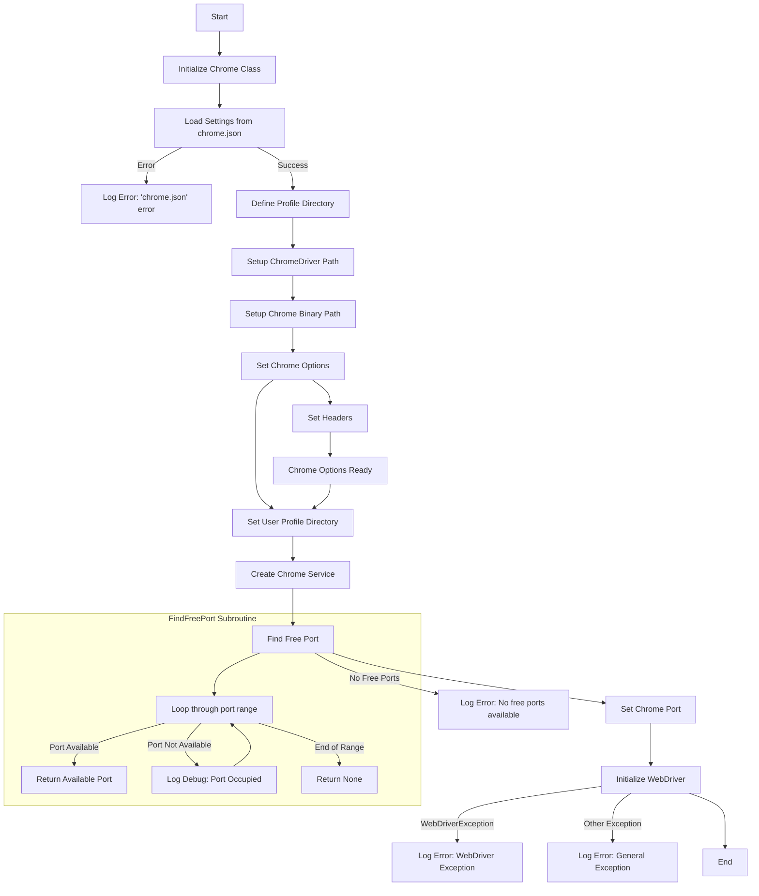

## АНАЛИЗ КОДА: `hypotez/src/webdriver/chrome/_docs/chrome.md`

### 1. <алгоритм>

**Блок-схема работы класса `Chrome`:**

1.  **Инициализация (`__init__`)**:
    *   Получает настройки `user_agent` (если переданы, иначе генерируется случайный).
    *   Загружает настройки из `chrome.json` с помощью `j_loads_ns`.
    *   Если `chrome.json` не найден или поврежден, выводит ошибку в лог и завершает инициализацию.
        *   _Пример ошибки_: "Error in the 'chrome.json' configuration file."
    *   Определяет каталог профиля пользователя для Chrome.
    *   Формирует пути к `chromedriver.exe` и `chrome.exe` на основе данных из `chrome.json` и глобальных настроек `gs`.
    *   Устанавливает опции Chrome с помощью метода `set_options`, включая опцию  `user-data-dir` для пользовательского профиля.
    *   Создает сервис `ChromeService`, указывая путь к исполняемому файлу `chrome.exe`.
    *   Находит свободный порт с помощью `gs.webdriver_current_port`, инкрементирует его для следующего использования и устанавливает опцию `--port` для Chrome, если порт доступен.
    *   Если свободный порт не найден в диапазоне, выводит ошибку в лог и завершает инициализацию.
         *   _Пример ошибки_: "No free ports available in the range (9500, 9599)"
    *   Если возникают исключения в процессе настройки WebDriver, регистрирует их в логе и завершает инициализацию.
        *   _Пример ошибки_: "Error setting up Chrome WebDriver."
2.  **Запуск WebDriver**:
    *   Инициализирует базовый класс `webdriver.Chrome` с установленными опциями и сервисом.
    *   При возникновении `WebDriverException` при инициализации, регистрирует ошибку в логе и завершает инициализацию.
         *   _Пример ошибки_: "Error initializing Chrome WebDriver: ..."
    *   При возникновении общего исключения (например, краш WebDriver) регистрирует ошибку в логе и завершает инициализацию.
        *   _Пример ошибки_: "Chrome WebDriver crashed. General error: ..."
3.  **Поиск свободного порта (`find_free_port`)**:
    *   Итерируется по диапазону портов от `start_port` до `end_port`.
    *   Пытается привязать сокет к каждому порту.
    *   Если привязка успешна, возвращает номер порта.
    *   Если привязка не удалась (порт занят), выводит отладочное сообщение в лог и переходит к следующему порту.
    *   Если ни один порт не найден, возвращает `None`.
        *   _Пример использования_: `free_port = self.find_free_port(9500, 9599)`
4.  **Установка опций (`set_options`)**:
    *   Принимает словарь настроек `settings` в качестве аргумента.
    *   Если `settings` равен `None` или не содержит ключи `options` и `headers`, возвращает `None`.
    *   Создает объект `ChromeOptions`.
    *   Если в `settings` есть ключ `options`, преобразует список строк вида "ключ=значение" в словарь, затем добавляет каждую пару "ключ-значение" в качестве аргументов опций.
        *   _Пример настройки options_ :` ["--disable-gpu", "user-agent=MyAgent"]`
    *   Если в `settings` есть ключ `headers`, добавляет каждую пару "ключ-значение" в качестве аргументов опций.
        *   _Пример настройки headers_: `{"User-Agent": "MyAgent", "Accept": "application/json"}`
    *   Возвращает настроенный объект `ChromeOptions`.

### 2. <mermaid>

**Объяснение диаграммы `mermaid`:**

*   **Start**: Начало работы скрипта.
*   **InitChrome**: Инициализация экземпляра класса `Chrome`.
*   **LoadSettings**: Загрузка настроек из файла `chrome.json`.
*   **ErrorLog**: Логирование ошибки, если `chrome.json` не может быть загружен.
*    **ProfileDir**: Определение директории профиля.
*   **ChromePath**: Формирование пути к `chromedriver.exe` на основе данных из `chrome.json`.
*   **ChromeBinPath**: Формирование пути к исполняемому файлу `chrome.exe` на основе данных из `chrome.json`.
*   **SetOptions**: Настройка опций `ChromeOptions`.
*  **SetHeaders**: Установка дополнительных headers для браузера.
*   **OptionsReady**: Готовые `ChromeOptions`
*   **SetProfileDir**: Установка директории профиля в опциях Chrome.
*   **CreateChromeService**: Создание сервиса `ChromeService`.
*    **FindFreePort**: Поиск свободного порта.
*   **SetPort**: Установка порта для Chrome.
*   **NoPortsLog**: Логирование ошибки, если свободный порт не найден.
*    **InitializeWebDriver**: Инициализация WebDriver.
*   **WebDriverErrorLog**: Логирование ошибки, если возникло `WebDriverException`.
*   **OtherErrorLog**: Логирование ошибки, если возникло другое исключение (кроме WebDriverException).
*   **End**: Завершение работы скрипта.
*   **FindFreePort Subroutine**: Подграф для процедуры поиска свободного порта
    *   **LoopPorts**: Цикл перебора портов
    *   **ReturnPort**: Возвращает свободный порт
    *   **DebugLog**: Логирование занятого порта
    *   **ReturnNone**: Возвращает None

**Зависимости (импорты):**

*   `os`: Используется для работы с операционной системой (например, для получения переменных окружения и объединения путей).
*   `socket`: Используется для работы с сокетами (например, для проверки, свободен ли порт).
*   `pathlib.Path`: Используется для удобной работы с путями файлов.
*   `typing.List, typing.Dict`: Используются для аннотации типов (указывают, что переменные должны быть списками и словарями).
*   `selenium.webdriver`: Используется для управления браузером через WebDriver.
*   `selenium.webdriver.chrome.service.Service`: Используется для запуска сервиса ChromeDriver.
*   `selenium.webdriver.chrome.options.Options`: Используется для настройки опций Chrome.
*   `fake_useragent.UserAgent`: Используется для генерации случайных user-agent-ов.
*   `selenium.common.exceptions.WebDriverException`: Используется для обработки исключений, возникающих при работе с WebDriver.
*   `src.gs`: Модуль `gs` (предположительно, `global settings`) содержит глобальные переменные и настройки проекта.
*   `src.utils.jjson.j_loads_ns`: Используется для загрузки данных JSON из файла с использованием пространства имен.
*   `src.logger.logger`: Модуль `logger` предоставляет функциональность логирования.

### 3. <объяснение>

**Импорты:**

*   `os`: Модуль операционной системы, используется для работы с путями, переменными окружения и т.д.
*   `socket`: Модуль для работы с сокетами, используется для поиска свободного порта.
*   `pathlib`: Модуль для работы с путями, обеспечивает более удобный и объектно-ориентированный способ работы с путями в файловой системе, чем os.path.
*   `typing`: Модуль для аннотации типов, помогает разработчикам понимать, какие типы данных ожидаются функциями и методами, делая код более читаемым и предотвращая ошибки.
*   `selenium`: Библиотека для автоматизации веб-браузеров.
    *   `webdriver`: Модуль для управления браузером.
    *   `webdriver.chrome.service`: Модуль для запуска сервиса ChromeDriver.
    *   `webdriver.chrome.options`: Модуль для настройки опций Chrome.
*   `fake_useragent`: Библиотека для генерации случайных user-agent-ов, которые помогают эмулировать поведение реального пользователя при работе с веб-сайтами.
*   `selenium.common.exceptions.WebDriverException`: Класс исключений, который возникает при ошибках WebDriver.
*    `src.gs`: Глобальные настройки проекта, в которых хранятся различные пути и переменные, используемые в проекте.
*   `src.utils.jjson`: Модуль для загрузки JSON файлов. `j_loads_ns` предположительно выполняет загрузку JSON, расшифровывая пути
*   `src.logger.logger`: Модуль для логирования, позволяет записывать сообщения о событиях, ошибках и т.д. в файл или консоль.

**Класс `Chrome`:**

*   **Роль**: Класс `Chrome` является подклассом `selenium.webdriver.Chrome`. Он предназначен для расширения функциональности стандартного класса `selenium.webdriver.Chrome`, предоставляя дополнительные возможности для настройки и управления браузером Chrome.
*   **Атрибуты**:
    *   `driver_name` (str): Имя драйвера ("chrome").
    *   `d` (`webdriver.Chrome`): Экземпляр драйвера Chrome (пока не используется).
    *   `options` (`ChromeOptions`): Опции запуска браузера, например, user-agent, прокси и т.д.
    *   `user_agent` (`dict`): Настройки user-agent.
*   **Методы**:
    *   `__init__(self, user_agent: dict = None, *args, **kwargs) -> None`:
        *   Конструктор класса, инициализирует драйвер Chrome.
        *   Читает настройки из `chrome.json`.
        *   Определяет пути к `chromedriver.exe` и `chrome.exe`.
        *   Устанавливает опции Chrome, включая `user-data-dir` для профиля, на основе загруженных настроек.
        *   Создает сервис `ChromeService`.
        *   Ищет свободный порт и устанавливает его для Chrome.
        *   Инициализирует базовый класс `webdriver.Chrome` с указанными опциями и сервисом.
        *   Обрабатывает ошибки инициализации и логирует их.
    *   `find_free_port(self, start_port: int, end_port: int) -> int | None`:
        *   Находит свободный порт в заданном диапазоне.
        *   Возвращает номер порта или `None`, если порт не найден.
    *   `set_options(self, settings: list | dict | None = None) -> ChromeOptions`:
        *   Устанавливает опции Chrome на основе заданных настроек.
        *   Обрабатывает параметры из `options` и `headers`.
        *   Возвращает объект `ChromeOptions`.

**Функции:**

*   `__init__`:
    *   **Аргументы**:
        *   `user_agent`: `dict` -  словарь для user-agent (необязательный).
        *   `*args`, `**kwargs`: Аргументы, которые могут быть переданы в родительский конструктор.
    *   **Назначение**: Инициализирует драйвер Chrome.
        *   Устанавливает пути к драйверам.
        *   Ищет свободный порт.
        *   Настраивает опции запуска браузера.
        *   Запускает браузер.
    *   **Примеры**:
        *   `driver = Chrome()`: создание объекта драйвера без дополнительных user-agent настроек.
        *   `driver = Chrome(user_agent={'User-Agent': 'Mozilla/5.0 ...'})`: создание объекта драйвера с кастомным `user_agent`.
*   `find_free_port`:
    *   **Аргументы**:
        *   `start_port`: int - начальный порт в диапазоне поиска.
        *   `end_port`: int - конечный порт в диапазоне поиска.
    *   **Назначение**: находит свободный порт в заданном диапазоне.
    *   **Возвращаемое значение**: `int` - номер порта, если найден свободный, или `None` если нет.
    *   **Примеры**:
        *   `free_port = find_free_port(9500, 9599)`: поиск свободного порта в диапазоне от 9500 до 9599.
*   `set_options`:
    *   **Аргументы**:
        *   `settings`: `list | dict | None` - настройки для опций.
    *   **Назначение**: Настраивает опции браузера на основе переданных настроек.
    *   **Возвращаемое значение**: `ChromeOptions` - объект с настроенными опциями.
    *    **Примеры**:
        *    `options = set_options(settings={"options": ["--disable-gpu", "user-agent=MyAgent"], "headers": {"Accept": "application/json"}})`: настройка options и headers для драйвера.

**Переменные:**

*   `driver_name`: `str` - имя драйвера.
*    `d`: `webdriver.Chrome` - экземпляр драйвера.
*   `options`: `ChromeOptions` - опции для запуска браузера.
*   `user_agent`: `dict` - настройки user-agent.
*   `settings`: `dict` - загруженные настройки из `chrome.json`.
*    `profile_directory`: `str` -  путь к пользовательскому профилю Chrome.
*   `chromedriver_path`: `str` - путь к исполняемому файлу ChromeDriver.
*   `binary_location`: `str` - путь к исполняемому файлу Chrome.
*   `free_port`: `int` - свободный порт для WebDriver.

**Потенциальные ошибки и области для улучшения:**

*   **Обработка ошибок**: Ошибки инициализации WebDriver (например, `WebDriverException`) обрабатываются, но стоит рассмотреть дополнительные стратегии, такие как попытка повторного запуска или корректное завершение программы.
*   **Зависимости**: Жесткие зависимости от конкретного расположения `chrome.json` и от глобальных настроек `gs` могут быть улучшены.
*   **Перезапуск драйвера**: В коде есть комментарии `@todo` по перезапуску драйвера и программы. Реализация этой логики сделает код более надежным.
*   **Логирование**: Более детальные сообщения в логах при ошибках могут помочь в отладке.
*    **Конфигурация:**  `chrome.json`  слишком жестко привязан к структуре файла, можно рассмотреть `dataclass` для парсинга
*    **Поиск порта**: `find_free_port` ищет порты в заданном диапазоне. Ограничение `gs.webdriver_current_port` может привести к сбою приложения, если порты заканчиваются.

**Взаимосвязи с другими частями проекта:**

*   `src.gs`: Этот файл зависит от глобальных настроек проекта, которые определяют пути к бинарным файлам (`chrome.exe`, `chromedriver.exe`) и другие параметры. Изменение `gs` повлияет на работу этого файла.
*   `src.utils.jjson`: Файл использует `j_loads_ns` для загрузки JSON, что делает его зависимым от этой функциональности.
*   `src.logger.logger`: Файл использует модуль логирования, все ошибки и важные сообщения регистрируются.

Таким образом, `chrome.py` предоставляет расширенные возможности для запуска Chrome WebDriver, настраивая различные параметры.