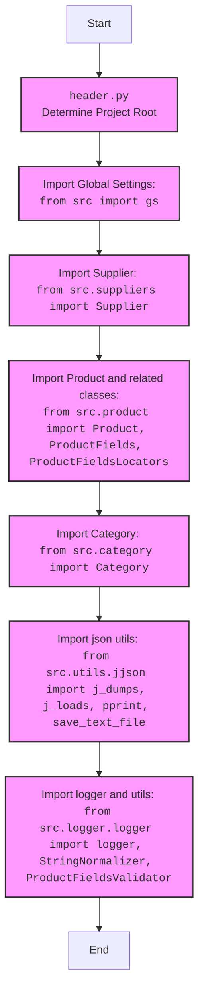

## <алгоритм>

1. **Определение корневой директории проекта (`dir_root`)**:
   - Получаем текущую рабочую директорию (`os.getcwd()`).
   - Находим индекс последнего вхождения подстроки 'hypotez' в текущей рабочей директории.
   - Извлекаем подстроку от начала и до индекса последнего вхождения 'hypotez' + 11 (длина строки 'hypotez')
   - Создаем объект `Path` из полученной строки, представляющий корень проекта.

   _Пример:_ Если текущая рабочая директория `/home/user/projects/hypotez/src/webdriver/chrome/_examples`, то `dir_root` будет `/home/user/projects/hypotez/`.

2. **Добавление корневой директории в `sys.path`**:
   - Преобразуем объект `dir_root` в строку.
   - Добавляем полученную строку в `sys.path`. Это позволяет импортировать модули из корневой директории и её поддиректорий.

   _Пример:_  После этой операции Python будет искать модули не только в стандартных путях, но и в `/home/user/projects/hypotez/`.

3. **Определение директории `src`**:
   - Создаем объект `Path`, представляющий директорию `src`, как поддиректорию корневой директории.

   _Пример:_ `dir_src` будет `/home/user/projects/hypotez/src/`.

4. **Повторное добавление корневой директории в `sys.path`**:
   -  Повторно добавляем строку из  объекта `dir_root` в `sys.path`. (непонятно зачем)

5. **Вывод корневой директории**:
   -  Выводим строковое представление `dir_root` в консоль.
   _Пример:_ на экран будет выведено `/home/user/projects/hypotez/`.

6. **Импорт дополнительных модулей**:
   - Импортируем модули `pathlib`, `json`, `re`.
   - Импортируем `gs` из `src`, `Supplier` из `src.suppliers`, `Product`, `ProductFields`, `ProductFieldsLocators` из `src.product`, `Category` из `src.category`.
   - Импортируем `j_dumps`, `j_loads`, `pprint`, `save_text_file` из `src.utils.jjson`.
   - Импортируем `logger`, `StringNormalizer`, `ProductFieldsValidator` из `src.logger.logger`.

   _Пример:_ Используя импортированный `logger`, можно будет логировать события внутри этого модуля. Используя `j_dumps`, `j_loads` можно работать с JSON.

## <mermaid>

```mermaid
flowchart TD
    Start --> DetermineRoot[Determine Project Root using <br> <code>os.getcwd()</code> & <code>Path()</code>]
    DetermineRoot --> AppendRootToSysPath[Append Project Root to <code>sys.path</code>]
    AppendRootToSysPath --> DefineSrcDir[Define src directory <br> using <code>Path()</code>]
    DefineSrcDir --> AppendRootToSysPathAgain[Append Project Root to <code>sys.path</code> <br> again]
    AppendRootToSysPathAgain --> PrintRoot[Print Project Root: <code>print(dir_root)</code>]
    PrintRoot --> ImportModules[Import External & Internal Modules <br> <code>pathlib</code>, <code>json</code>, <code>re</code>,<br> <code>src.gs</code>, <code>src.suppliers</code>, <br><code>src.product</code>, <code>src.category</code>,<br> <code>src.utils.jjson</code>, <code>src.logger.logger</code>]
    ImportModules --> End
    
    classDef external fill:#f9f,stroke:#333,stroke-width:2px
    class DefineSrcDir,AppendRootToSysPath,PrintRoot,DetermineRoot,AppendRootToSysPathAgain external;
```


**Объяснение зависимостей `mermaid`:**

*   **`Start`**: Начало процесса.
*   **`DetermineRoot`**: Определение корневой директории проекта.
*   **`AppendRootToSysPath`**: Добавление корневой директории в `sys.path`, чтобы python видел модули из корневой папки.
*   **`DefineSrcDir`**: Определение пути к `src` директории.
*  **`AppendRootToSysPathAgain`**:  Повторное добавление корневой директории в `sys.path`, (вероятно, ошибка).
*  **`PrintRoot`**: Вывод на консоль определенного корня проекта.
*   **`ImportModules`**: Импорт всех необходимых модулей из стандартной библиотеки, а также  внутренних модулей проекта.
*   **`End`**: Конец процесса.

Вторая `mermaid` диаграмма показывает иерархию импортов:

* **`Start`**: Начало процесса импорта модулей.
* **`Header`**: Обозначение `header.py` - файла, в котором происходит импорт.
* **`import`**: Импорт глобальных настроек проекта: `from src import gs`.
* **`import_supplier`**: Импорт класса `Supplier` из `src.suppliers`.
* **`import_product`**: Импорт классов `Product`, `ProductFields`, `ProductFieldsLocators` из `src.product`.
* **`import_category`**: Импорт класса `Category` из `src.category`.
* **`import_jjson`**: Импорт функций для работы с JSON из `src.utils.jjson`.
* **`import_logger`**: Импорт функций для логирования и валидации из `src.logger.logger`.
* **`End`**: Конец процесса импорта.

## <объяснение>

**Импорты:**

*   **`import sys`**: Модуль `sys` предоставляет доступ к некоторым переменным и функциям, которые взаимодействуют с интерпретатором Python. Здесь он используется для изменения `sys.path`, чтобы добавить пути поиска модулей.
*   **`import os`**: Модуль `os` предоставляет функции для взаимодействия с операционной системой. Здесь используется `os.getcwd()` для получения текущей рабочей директории.
*   **`from pathlib import Path`**: Класс `Path` из модуля `pathlib` предоставляет объектно-ориентированный способ работы с путями к файлам и директориям.
*   **`import json`**: Модуль `json` используется для работы с данными в формате JSON.
*   **`import re`**: Модуль `re` используется для работы с регулярными выражениями.
*   **`from src import gs`**: Импортирует модуль `gs`, который, вероятно, содержит глобальные настройки приложения.  Находится в папке `src`.
*  **`from src.suppliers import Supplier`**: Импортирует класс `Supplier` из модуля `src.suppliers`. Этот класс, вероятно, представляет поставщика товаров.
*   **`from src.product import Product, ProductFields, ProductFieldsLocators`**: Импортирует классы, связанные с продуктами, из модуля `src.product`. `Product`, вероятно, представляет сам продукт, `ProductFields` - поля продукта, `ProductFieldsLocators` - локаторы для этих полей.
*  **`from src.category import Category`**: Импортирует класс `Category` из модуля `src.category`. Этот класс, вероятно, представляет категорию товара.
*   **`from src.utils.jjson import j_dumps, j_loads, pprint, save_text_file`**: Импортирует функции для работы с JSON из `src.utils.jjson`: `j_dumps` для сериализации в JSON, `j_loads` для десериализации, `pprint` для красивого вывода, `save_text_file` для сохранения текста в файл.
*   **`from src.logger.logger import logger, StringNormalizer, ProductFieldsValidator`**: Импортирует объект логгера `logger` для записи событий, а так же классы `StringNormalizer` для нормализации строк, и `ProductFieldsValidator` для валидации полей продукта из модуля `src.logger.logger`.

**Переменные:**

*   **`dir_root: Path`**: Объект `Path`, представляющий корневую директорию проекта.
*   **`dir_src: Path`**: Объект `Path`, представляющий директорию `src` проекта.

**Функции:**

В данном коде функции как таковые не определены, но используется ряд функций:

-   **`os.getcwd()`**: Возвращает строку, представляющую текущую рабочую директорию.
-   **`str()`**: Преобразует объект в строку.
-   **`sys.path.append()`**: Добавляет путь к списку путей поиска модулей.
-   **`Path()`**: Создает объект пути.
-   **`print()`**: Выводит строку на стандартный вывод.

**Объяснение функциональности:**

Основная цель этого файла - определить корневую директорию проекта и добавить ее в список путей поиска модулей Python (`sys.path`). Это необходимо для того, чтобы модули внутри проекта могли импортировать друг друга, не зависимо от того, где запускается скрипт. Код также импортирует ряд модулей для использования в остальной части проекта.

**Потенциальные ошибки и области для улучшения:**

*   Повторное добавление корневой директории в `sys.path` кажется избыточным и может быть ошибкой.
*   Использование магического числа `11` (длина `hypotez`) при определении корневой директории может привести к проблемам, если название проекта изменится. Лучше использовать константу или функцию для определения длины.
*   Код содержит много пустых строк и комментариев, что делает его сложнее для чтения.  Стоит убрать лишнее.
*   Отсутствуют проверки на существование папки `hypotez` в текущей директории. Если её не будет то код будет работать не правильно.

**Взаимосвязи с другими частями проекта:**

Этот файл является частью системы инициализации проекта. Он обеспечивает правильную работу импортов во всем проекте, позволяя модулям обращаться друг к другу. Зависит от структуры папок проекта. Остальные модули проекта зависят от корректной работы этого файла, так как он обеспечивает доступ к ним.