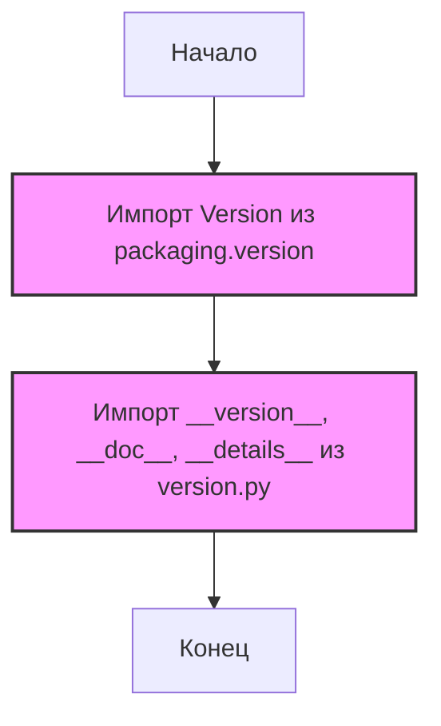

## АНАЛИЗ КОДА: `src/webdriver/chrome/extentions/__init__.py`

### 1. <алгоритм>

1.  **Начало:** Исполнение скрипта `__init__.py` начинается.
2.  **Импорт `Version`:** Импортируется класс `Version` из модуля `packaging.version`. Этот класс используется для сравнения и обработки версий программного обеспечения.
    *   Пример: `Version("1.2.3")`, `Version("2.0")`
3.  **Импорт `__version__`, `__doc__`, `__details__`:** Импортируются переменные `__version__`, `__doc__` и `__details__` из модуля `src.webdriver.chrome.extentions.version`.
    *   `__version__`: Строка, представляющая версию пакета (например, "1.0.0").
    *   `__doc__`: Строка, представляющая описание пакета (документация).
    *   `__details__`: Строка, представляющая дополнительные детали о пакете (может содержать информацию о сборке или окружении).
4.  **Конец:** Скрипт `__init__.py` завершает выполнение.

### 2. <mermaid>

**Объяснение зависимостей:**

*   **`packaging.version`**: Библиотека `packaging`, предназначенная для обработки версий программного обеспечения. Она используется для импорта класса `Version`, который используется для сравнения и работы с версиями.
*   **`src.webdriver.chrome.extentions.version`**:  Модуль в текущем пакете, который содержит метаданные о текущей версии расширения, включая номер версии (`__version__`), документацию (`__doc__`) и дополнительные детали (`__details__`).

### 3. <объяснение>

**Импорты:**

*   `from packaging.version import Version`: Импортирует класс `Version` из библиотеки `packaging`. Этот класс необходим для работы с версиями и их сравнения.
*   `from .version import __version__, __doc__, __details__`: Импортирует переменные `__version__`, `__doc__` и `__details__` из модуля `version.py`, который расположен в том же каталоге, что и `__init__.py`.

    *   `__version__`: Строковая переменная, которая указывает версию пакета. Она может быть использована для отслеживания обновлений и совместимости.
    *   `__doc__`: Строковая переменная, содержащая строку документации пакета. Эта переменная может содержать подробное описание функциональности пакета.
    *   `__details__`: Строковая переменная, содержащая дополнительную информацию о пакете. Это может быть информация о сборке или среде.

**Классы:**

*   В этом файле не определены классы.

**Функции:**

*   В этом файле не определены функции.

**Переменные:**

*   `__version__`: Строка, содержащая версию текущего пакета.
*   `__doc__`: Строка, содержащая документацию для текущего пакета.
*   `__details__`: Строка, содержащая дополнительные детали о текущем пакете.

**Цепочка взаимосвязей:**

1.  `__init__.py` импортирует данные о версии из `version.py` (в том же каталоге) и класс `Version` из `packaging`. Это стандартная практика для Python пакетов, чтобы предоставлять информацию о версии и документации.
2.  Импортированная информация может использоваться другими модулями в пакете `src.webdriver.chrome.extentions` для определения версии, отображения документации и предоставления дополнительных сведений о пакете.

**Потенциальные ошибки и области для улучшения:**

*   В коде нет явных ошибок, поскольку он выполняет базовую инициализацию пакета, импортируя необходимые метаданные.
*   Если модуль `version.py` отсутствует или в нем не определены ожидаемые переменные, могут возникнуть ошибки при импорте.  Хорошей практикой будет добавить проверку импорта или предусмотреть обработку исключений для таких случаев.
*   Можно рассмотреть добавление проверок соответствия формату для строки версии (`__version__`) чтобы предотвратить случайные ошибки.
*   В описании файла указана избыточная информация и дублирование комментариев, что можно сократить и унифицировать.

**Дополнительно:**

*   `__init__.py` является важной частью пакета Python, так как он определяет, какие модули и переменные доступны для импорта, и предоставляет общую информацию о пакете.
*   Этот код является минимальным, но его можно расширить, если потребуется выполнить дополнительную инициализацию при загрузке пакета.