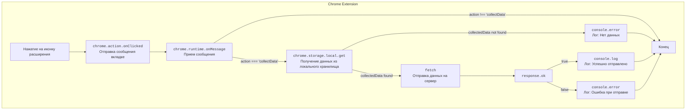

## ИНСТРУКЦИЯ:

Анализируй предоставленный код подробно и объясни его функциональность. Ответ должен включать три раздела:

1.  **<алгоритм>**: Опиши рабочий процесс в виде пошаговой блок-схемы, включая примеры для каждого логического блока, и проиллюстрируй поток данных между функциями, классами или методами.
2.  **<mermaid>**: Напиши код для диаграммы в формате `mermaid`, проанализируй и объясни все зависимости,
    которые импортируются при создании диаграммы.
    **ВАЖНО!** Убедитесь, что все имена переменных, используемые в диаграмме `mermaid`,
    имеют осмысленные и описательные имена. Имена переменных вроде `A`, `B`, `C`, и т.д., не допускаются!

    **Дополнительно**: Если в коде есть импорт `import header`, добавьте блок `mermaid` flowchart, объясняющий `header.py`
    ```mermaid
    flowchart TD
        Start --> Header[<code>header.py</code><br> Determine Project Root]

        Header --> import[Import Global Settings: <br><code>from src import gs</code>]
    ```

3.  **<объяснение>**: Предоставьте подробные объяснения:
    *   **Импорты**: Их назначение и взаимосвязь с другими пакетами `src.`.
    *   **Классы**: Их роль, атрибуты, методы и взаимодействие с другими компонентами проекта.
    *   **Функции**: Их аргументы, возвращаемые значения, назначение и примеры.
    *   **Переменные**: Их типы и использование.
    *   Выделите потенциальные ошибки или области для улучшения.

Дополнительно, постройте цепочку взаимосвязей с другими частями проекта (если применимо).

Это обеспечивает всесторонний и структурированный анализ кода.
## Формат ответа: `.md` (markdown)
**КОНЕЦ ИНСТРУКЦИИ**

## <алгоритм>

1.  **Событие клика на иконку расширения:**
    *   Пользователь кликает на иконку расширения в браузере.
    *   Срабатывает обработчик `chrome.action.onClicked.addListener`.
    *   Пример: Пользователь открыл страницу `https://example.com` и кликает по иконке расширения.
2.  **Отправка сообщения контентному скрипту:**
    *   Функция `chrome.tabs.sendMessage` отправляет сообщение на активную вкладку.
        *   `tab.id`: Идентификатор вкладки, куда отправляется сообщение.
        *   `{ action: 'collectData', url: tab.url }`: Объект с данными сообщения.
    *   Пример: Сообщение отправляется на вкладку с идентификатором `123`, с данными `{ action: 'collectData', url: 'https://example.com' }`.
3.  **Прием сообщения от контентного скрипта:**
    *   `chrome.runtime.onMessage.addListener` слушает сообщения от других частей расширения.
    *   Если `message.action === 'collectData'` (пришло сообщение от контентного скрипта с запросом сбора данных), вызывается `sendDataToServer`.
    *   Пример: Принято сообщение с данными `{ action: 'collectData', url: 'https://example.com' }`.
4.  **Отправка данных на сервер:**
    *   `sendDataToServer` получает `url` из сообщения.
    *   Получает данные из локального хранилища Chrome (`chrome.storage.local.get('collectedData')`).
    *   Если данные есть, отправляет их на сервер `http://127.0.0.1/hypotez/catch_request.php` методом `POST` в формате `JSON`.
        *   `fetch`: Отправка запроса.
        *   `method: 'POST'`: Метод отправки.
        *   `headers: { 'Content-Type': 'application/json' }`: Заголовок с типом контента.
        *   `body: JSON.stringify(collectedData)`: Тело запроса с данными в формате JSON.
    *   Обработка ответа:
        *   Если запрос успешен (`response.ok`), выводится сообщение в консоль "Data sent to server successfully".
        *   Если произошла ошибка, выводится сообщение об ошибке в консоль.
    *   Если в локальном хранилище нет данных, выводится ошибка в консоль "No collected data found".
    *   Пример: Запрос отправляется на `http://127.0.0.1/hypotez/catch_request.php` с данными `{"key": "value"}` из `collectedData`.

## <mermaid>



**Описание диаграммы `mermaid`:**

*   **Chrome Extension:** Основной блок, представляющий расширение Chrome.
*   **Start:** Начало процесса, когда пользователь нажимает на иконку расширения.
*   **SendMessageToTab:** Функция `chrome.action.onClicked`, отправляет сообщение на активную вкладку.
*    **ReceiveMessage:** Функция `chrome.runtime.onMessage` принимает сообщение.
*   **GetDataFromStorage:** Функция `chrome.storage.local.get`, извлекает данные из локального хранилища.
*   **SendDataToServer:** Функция `fetch`, отправляет данные на сервер.
*   **CheckResponse:** Проверяет статус ответа от сервера.
*   **LogSuccess:** Выводит сообщение об успешной отправке в консоль.
*   **LogErrorSending:** Выводит сообщение об ошибке при отправке в консоль.
*   **LogErrorNoData:** Выводит сообщение об отсутствии данных в консоль.
*    **End:** Конец процесса обработки сообщения.
*   **Стрелки:** Показывают поток управления и данных между блоками.

## <объяснение>

**Импорты:**

*   В данном коде нет явных импортов из других файлов или пакетов `src.`. Вместо этого используются встроенные API Chrome (например, `chrome.action`, `chrome.tabs`, `chrome.runtime`, `chrome.storage`).
    *   `chrome.action`: API для управления действиями расширения (например, клик по иконке).
    *   `chrome.tabs`: API для работы с вкладками браузера (например, отправка сообщения в конкретную вкладку).
    *   `chrome.runtime`: API для работы с расширением в целом (например, прослушивание сообщений).
    *   `chrome.storage`: API для работы с хранилищем данных расширения.

**Функции:**

1.  `chrome.action.onClicked.addListener((tab) => { ... });`
    *   **Аргументы:** Функция принимает коллбэк функцию, которая принимает аргумент `tab` - объект, представляющий активную вкладку, когда пользователь кликает на иконку расширения.
    *   **Назначение:** Обработчик события клика по иконке расширения. Отправляет сообщение `collectData` на активную вкладку с URL текущей страницы.
    *   **Пример:**
        *   Пользователь кликает на иконку расширения, находясь на странице `https://example.com`.
        *   Вызывается функция с аргументом `tab` (объект с информацией о вкладке).
        *   Отправляется сообщение на вкладку с ID, указанным в `tab.id`, и данными `{ action: 'collectData', url: 'https://example.com' }`.
2.  `chrome.runtime.onMessage.addListener((message, sender, sendResponse) => { ... });`
    *   **Аргументы:** Функция принимает коллбэк функцию с тремя аргументами:
        *   `message`: Объект с данными сообщения.
        *   `sender`: Объект с информацией об отправителе сообщения.
        *   `sendResponse`: Функция для отправки ответа отправителю.
    *   **Назначение:** Слушает сообщения, отправленные из других частей расширения. Проверяет, является ли сообщение запросом на сбор данных, и вызывает `sendDataToServer`, если это так.
    *   **Пример:**
        *   Приходит сообщение с данными `{ action: 'collectData', url: 'https://example.com' }`.
        *   `message.action === 'collectData'` возвращает `true`.
        *   Вызывается `sendDataToServer` с аргументом `message.url`.
3.  `function sendDataToServer(url) { ... }`
    *   **Аргументы:** `url` - URL страницы, данные с которой собираются.
    *   **Назначение:** Отправляет данные на сервер. Получает данные из локального хранилища, и если они есть, отправляет их на сервер в формате JSON.
    *   **Пример:**
        *   `url` равен `https://example.com`.
        *   Из локального хранилища получены данные `{"key": "value"}`.
        *   Отправляется `POST`-запрос на сервер `http://127.0.0.1/hypotez/catch_request.php` с телом запроса `{"key": "value"}`.
        *   После получения ответа, выводится сообщение в консоль об успешной отправке или об ошибке.

**Переменные:**

*   `serverUrl`: `String` - URL сервера, на который отправляются данные.
*   `collectedData`: `Object` - Данные, полученные из локального хранилища.
*   `message`: `Object` - Сообщение, полученное с помощью `chrome.runtime.onMessage`.
*   `sender`: `Object` - Информация об отправителе сообщения.
*   `response`: `Object` - Объект с ответом на `fetch` запрос.
*   `tab`: `Object` - Объект, представляющий активную вкладку.
*   `url`: `String` - URL текущей страницы.

**Потенциальные ошибки и области для улучшения:**

1.  **Обработка ошибок `fetch`:**
    *   Сейчас обрабатывается только ошибка при отправке данных на сервер.
    *   Нужно добавить более детальную обработку ошибок HTTP, например:
        *   Обработка таймаутов.
        *   Обработка ошибок сети.
        *   Различные коды статуса (404, 500 и т.д.).
2.  **Обработка ошибок локального хранилища:**
    *   Нет обработки ошибок при чтении данных из локального хранилища.
    *   Нужно добавить проверку на ошибки и обработку их, если таковые возникнут.
3.  **Конфигурация `serverUrl`:**
    *   URL сервера является хардкодом.
    *   Нужно вынести его в конфигурацию или настройки расширения.
4.  **Отсутствие обработки ответа от сервера:**
    *   Сейчас просто выводится сообщение об успехе или ошибке.
    *   Можно добавить обработку данных ответа от сервера.
5.  **Безопасность:**
    *   Нет проверки данных перед отправкой.
    *   Необходимо добавить валидацию и проверку безопасности.
6.  **Логирование:**
    *   Используется `console.log` и `console.error`.
    *   В продакшене лучше использовать более продвинутое логирование.

**Взаимосвязи с другими частями проекта:**

*   **content script:**  Этот `background.js` взаимодействует с контентным скриптом (например, `content.js`), отправляя ему сообщение с `action: 'collectData'` для инициирования сбора данных. Контентный скрипт собирает данные на веб-странице и отправляет их обратно в `background.js` через `chrome.runtime.sendMessage`.
*   **catch_request.php:** Этот скрипт на сервере принимает данные, отправленные из `sendDataToServer`. Он должен обрабатывать полученные JSON-данные, например, сохранять их в базе данных.
*   **Локальное хранилище:** Используется для временного хранения собранных данных перед отправкой на сервер.

**Цепочка взаимосвязей:**

1.  **Пользователь** кликает на иконку расширения.
2.  `background.js` отправляет сообщение в **контентный скрипт** на текущей вкладке.
3.  **Контентный скрипт** собирает данные и отправляет их в `background.js`.
4.  `background.js` получает данные из **локального хранилища**.
5.  `background.js` отправляет данные на **сервер `catch_request.php`**.
6.  **`catch_request.php`** обрабатывает полученные данные.

Данный анализ предоставляет полное понимание функциональности кода, его взаимодействий и областей для улучшения.