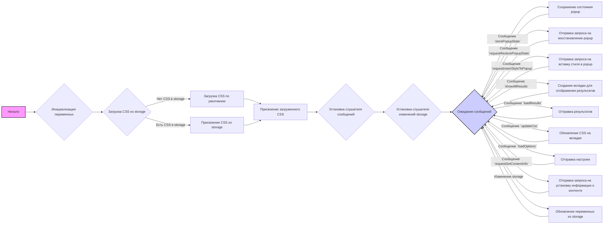

## Анализ кода `try_xpath_background.js`

### 1. <алгоритм>

**Блок-схема:**



**Примеры для блоков:**

*   **Инициализация переменных**: `popupState = null`, `css = ""`, `attributes = {...}`.
*   **Загрузка CSS из storage**: Проверяется, есть ли `css` в `browser.storage.sync`.
*   **Присвоение CSS из storage**: `css = items.css;`
*  **Загрузка CSS по умолчанию**:  Загружается `try_xpath_insert.css` с помощью `XMLHttpRequest`
*   **Присвоение загруженного CSS**: `css = loadedCss;`
*   **Установка слушателя сообщений**: `browser.runtime.onMessage.addListener(genericListener);`
*   **Установка слушателя изменений storage**: `browser.storage.onChanged.addListener(...);`
*   **Ожидание сообщений**: Обработка различных событий, таких как `storePopupState`, `updateCss` и др.
*  **Сохранение состояния popup**: `popupState = message.state;`
*   **Отправка запроса на восстановление popup**:  Отправка сообщения `restorePopupState` с текущим `popupState`.
*   **Отправка запроса на вставку стиля в popup**: Отправка сообщения `insertStyleToPopup` со стилями `popupCss`.
*   **Создание вкладки для отображения результатов**: `browser.tabs.create({ "url": "/pages/show_all_results.html" });`
*   **Отправка результатов**: Отправка накопленных результатов `results` в ответ на сообщение `loadResults`.
*   **Обновление CSS на вкладке**: Удаление старых стилей и добавление новых, отправка уведомлений `finishRemoveCss` и `finishInsertCss`.
*   **Отправка настроек**: Отправка объекта с `attributes`, `css` и `popupCss` в ответ на сообщение `loadOptions`.
*   **Отправка запроса на установку информации о контенте**: Отправка сообщения `setContentInfo` с текущими `attributes` на вкладку.
*   **Обновление переменных из storage**: Обновление `attributes`, `css` и `popupCss` при изменении данных в storage.

### 2. <mermaid>

```mermaid
flowchart TD
    A[Start] --> B{Initialize Variables: <br> popupState, results, css, attributes};
    B --> C{Load CSS from Storage: <br> browser.storage.sync.get};
    C -->|CSS Exists| D[Assign CSS from Storage];
    C -->|CSS Not Exists| E[Load Default CSS: <br> loadDefaultCss()];
    E --> F[Assign Loaded CSS];
    D --> F
    F --> G{Set Message Listener: <br> browser.runtime.onMessage.addListener};
    G --> H{Set Storage Change Listener: <br> browser.storage.onChanged.addListener};
    H --> I{Wait for Messages};
     I -->|Message: storePopupState| J[Store Popup State: <br> popupState = message.state];
    I -->|Message: requestRestorePopupState| K[Send Restore Popup Request: <br> browser.runtime.sendMessage];
    I -->|Message: requestInsertStyleToPopup| L[Send Insert Style Request: <br> browser.runtime.sendMessage];
    I -->|Message: showAllResults| M[Create Results Tab: <br> browser.tabs.create];
    I -->|Message: loadResults| N[Send Results: <br> sendResponse(results)];
    I -->|Message: updateCss| O[Update CSS on Tab: <br> browser.tabs.removeCSS, browser.tabs.insertCSS];
    I -->|Message: loadOptions| P[Send Options: <br> sendResponse(attributes, css, popupCss)];
    I -->|Message: requestSetContentInfo| Q[Send Set Content Info Request: <br> browser.tabs.sendMessage];
    I -->|Storage Change Event| R[Update Variables from Storage: <br> attributes, css, popupCss];
    J --> I;
    K --> I;
    L --> I;
    M --> I;
    N --> I;
    O --> I;
    P --> I;
    Q --> I;
    R --> I;
    
     style A fill:#f9f,stroke:#333,stroke-width:2px
    style I fill:#ccf,stroke:#333,stroke-width:2px
    
```

**Объяснение зависимостей:**

*   **`browser.runtime.onMessage`**: Слушает сообщения, отправленные из других частей расширения или с веб-страниц.  Это основа для связи между различными скриптами расширения.
*   **`browser.storage.sync.get`**:  Загружает данные (настройки, стили) из синхронизированного хранилища браузера. Это обеспечивает сохранение настроек между сессиями.
*   **`browser.storage.onChanged`**: Слушает изменения в хранилище и обновляет переменные в фоновом скрипте.
*  **`browser.runtime.getURL`**:  Получает абсолютный URL ресурса в расширении, например, CSS-файла.
*   **`browser.tabs.create`**:  Создает новую вкладку браузера, например, для отображения результатов.
*   **`browser.tabs.sendMessage`**:  Отправляет сообщения на вкладки браузера для управления их содержимым (вставка/удаление стилей, установка данных).
*   **`browser.tabs.removeCSS`**:  Удаляет CSS-стили со страницы.
*  **`browser.tabs.insertCSS`**: Вставляет CSS-стили на страницу.
*   **`XMLHttpRequest`**:  Используется для загрузки CSS-файла по умолчанию.
*   **`Promise`**:  Используется для асинхронных операций, таких как загрузка CSS и выполнение операций с браузером.

### 3. <объяснение>

**Импорты:**

*   В данном коде нет явных импортов из других пакетов `src.`. Код использует глобальные объекты `window` и `browser`, которые предоставляются окружением расширения браузера. Также происходит импорт `tryxpath`, предполагается, что это обьект, который доступен в глобальном пространстве имен, т.к. этот код предназначен для расширения. `fu` это обьект с функциями внутри `tryxpath`.

**Классы:**

*   В коде не определено явных классов. Код использует функциональный подход, где основные операции выполняются функциями.

**Функции:**

*   **`loadDefaultCss()`**:
    *   **Аргументы**: Нет.
    *   **Возвращаемое значение**: `Promise`, который разрешается со строкой CSS из файла `/css/try_xpath_insert.css` или отклоняется при ошибке.
    *   **Назначение**: Загружает CSS-стили по умолчанию из файла расширения.
    *   **Пример**: Возвращает `Promise`, который при успешном выполнении возвращает строковое представление CSS.
*   **`genericListener(message, sender, sendResponse)`**:
    *   **Аргументы**:
        *   `message`: Объект с данными сообщения. Содержит ключ `event`, определяющий тип события.
        *   `sender`: Объект, содержащий информацию об отправителе сообщения (например, вкладка, фрейм).
        *   `sendResponse`: Функция обратного вызова для отправки ответа.
    *   **Возвращаемое значение**: Зависит от вызываемого слушателя.
    *   **Назначение**: Обрабатывает сообщения, отправленные расширению, перенаправляя их соответствующим обработчикам.
    *   **Пример**: Если сообщение `message.event` равно `storePopupState`, то вызывается `genericListener.listeners.storePopupState`.
*   **`genericListener.listeners.storePopupState(message)`**:
    *   **Аргументы**:
        *   `message`: Объект с состоянием popup (`message.state`).
    *   **Возвращаемое значение**: Нет.
    *   **Назначение**: Сохраняет состояние popup во внутренней переменной `popupState`.
    *   **Пример**: `popupState = { "xpath": "//div", "currentElement": 1 }`
*   **`genericListener.listeners.requestRestorePopupState(message)`**:
    *   **Аргументы**:
        *   `message`: Объект с запросом на восстановление popup.
    *   **Возвращаемое значение**: Нет.
    *   **Назначение**: Отправляет запрос на восстановление popup с текущим сохраненным состоянием (`popupState`) на вкладку.
    *   **Пример**: Отправляет сообщение `restorePopupState` с данными `popupState`.
*   **`genericListener.listeners.requestInsertStyleToPopup()`**:
    *   **Аргументы**: Нет.
    *   **Возвращаемое значение**: Нет.
    *   **Назначение**: Отправляет сообщение на вкладку для вставки стилей `popupCss`.
    *   **Пример**: Отправляет сообщение `insertStyleToPopup` с данными `popupCss`.
*   **`genericListener.listeners.showAllResults(message, sender)`**:
    *   **Аргументы**:
        *   `message`: Объект с результатами.
        *   `sender`: Объект с информацией об отправителе сообщения.
    *   **Возвращаемое значение**: Нет.
    *   **Назначение**: Сохраняет результаты в переменной `results` и открывает новую вкладку с результатами.
    *   **Пример**: Сохраняет данные `results = { "xpathResults": [{...}] }` и открывает страницу `/pages/show_all_results.html`.
*   **`genericListener.listeners.loadResults(message, sender, sendResponse)`**:
    *   **Аргументы**:
        *   `message`: Сообщение (не используется в данном случае).
        *   `sender`: Объект с информацией об отправителе сообщения.
        *   `sendResponse`: Функция обратного вызова для отправки ответа.
    *   **Возвращаемое значение**: `true` (для асинхронного ответа).
    *   **Назначение**: Отправляет накопленные результаты `results` в ответ на запрос.
    *   **Пример**:  Отправляет `sendResponse(results)`.
*   **`genericListener.listeners.updateCss(message, sender)`**:
    *   **Аргументы**:
        *   `message`: Объект с `expiredCssSet`.
        *   `sender`: Объект с информацией об отправителе сообщения.
    *   **Возвращаемое значение**: Нет.
    *   **Назначение**: Обновляет CSS на вкладке, удаляя устаревшие стили и добавляя новые.
    *  **Пример**: Если `message.expiredCssSet` содержит CSS-стили, он удаляет их, а затем добавляет `css`.
*   **`genericListener.listeners.loadOptions(message, sender, sendResponse)`**:
    *   **Аргументы**:
        *   `message`: Сообщение (не используется в данном случае).
        *   `sender`: Объект с информацией об отправителе сообщения.
        *   `sendResponse`: Функция обратного вызова для отправки ответа.
    *   **Возвращаемое значение**: `true` (для асинхронного ответа).
    *   **Назначение**: Отправляет текущие настройки (атрибуты, CSS, стили popup) в ответ на запрос.
    *   **Пример**: Отправляет `sendResponse({ "attributes": attributes, "css": css, "popupCss": popupCss })`.
*   **`genericListener.listeners.requestSetContentInfo(message, sender)`**:
    *   **Аргументы**:
        *  `message`: Сообщение (не используется в данном случае).
        *   `sender`: Объект с информацией об отправителе сообщения.
    *   **Возвращаемое значение**: Нет.
    *   **Назначение**: Отправляет сообщение на вкладку с атрибутами, используемыми для поиска элементов.
    *   **Пример**: Отправляет сообщение `setContentInfo` с данными `attributes`.

**Переменные:**

*   **`tx`**:  Алиас для `tryxpath`.
*   **`fu`**: Алиас для `tryxpath.functions`
*   **`popupState`**: Состояние popup (например, текущий XPath, выбранный элемент).
*   **`popupCss`**: CSS-стили для popup.
*   **`results`**: Объект для хранения результатов выполнения XPath запросов.
*   **`css`**:  Строка с CSS-стилями для выделения элементов.
*   **`attributes`**:  Объект с атрибутами, используемыми для отслеживания элементов.

**Потенциальные ошибки и области для улучшения:**

*   Обработка ошибок в `XMLHttpRequest` не реализована явно в `loadDefaultCss`, можно добавить `req.onerror` для более надежной загрузки.
*   Можно добавить более детальную обработку ошибок при отправке сообщений и вставке CSS на вкладки.
*   Многократное удаление CSS при обновлении может приводить к мерцанию, можно оптимизировать этот процесс.
*   Можно добавить логирование для отслеживания сообщений и ошибок.

**Цепочка взаимосвязей с другими частями проекта:**

*   Этот скрипт является фоновым скриптом расширения. Он взаимодействует с вкладками браузера через `browser.tabs.sendMessage`, `browser.tabs.insertCSS` и `browser.tabs.removeCSS`.
*   Он использует API `browser.storage` для сохранения и загрузки настроек, что обеспечивает сохранение настроек между сессиями.
*   Скрипт реагирует на сообщения от других скриптов расширения и веб-страниц, координируя взаимодействие между ними.
*   Он загружает CSS стили и управляет их применением на страницах.

Этот анализ предоставляет подробное описание работы кода, его функциональности и взаимосвязей с другими частями проекта.