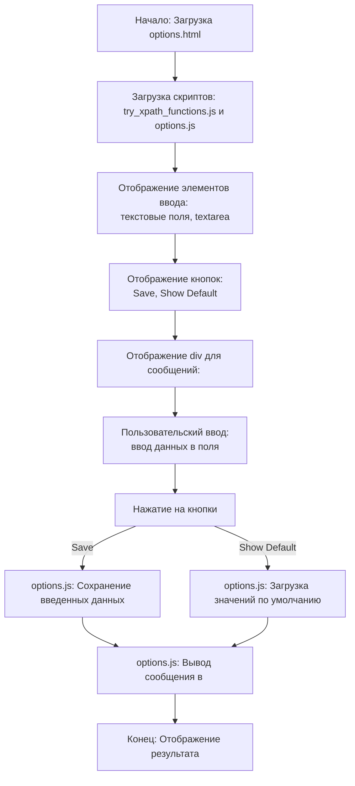

## <алгоритм>
1. **Начало**: Загрузка HTML-страницы `options.html` в браузере.
2. **Определение переменных**: Присвоение значения `debug` константе `MODE`. 
3. **Загрузка скриптов**: 
   - Загрузка `try_xpath_functions.js` для работы с XPath.
   - Загрузка `options.js`, который содержит логику страницы.
4. **Отображение элементов ввода**:  
   - Отображение текстовых полей (`input type="text"`) для атрибутов элементов, таких как "Resulted elements", "Context element", "Focused element", "Ancestors of the focused element", "Frame elements", "Ancestors of the frames".
     *Пример: `<input type="text" id="element-attribute">`*
   - Отображение текстовой области (`textarea`) для ввода стилей CSS.
     *Пример: `<textarea id="style"></textarea>`*
   - Отображение текстовых полей для ширины и высоты всплывающего окна.
     *Пример: `<input type="text" id="popup-body-width">`*
5. **Отображение кнопок**:  
   - Кнопка "Save" для сохранения настроек. 
     *Пример: `<button id="save">Save</button>`*
   - Кнопка "Show default" для возврата к настройкам по умолчанию.
     *Пример: `<button id="show-default">Show default</button>`*
6. **Отображение сообщения**: Отображение пустого `div` для вывода сообщений.
     *Пример: `

`*
7. **Ввод данных**: Пользователь вводит значения в поля ввода (текстовые поля и текстовую область).
8. **Нажатие на кнопки**:
   - Если нажата кнопка "Save", скрипт `options.js` обрабатывает введенные данные и сохраняет их.
   - Если нажата кнопка "Show default", скрипт `options.js` сбрасывает значения полей к значениям по умолчанию.
9. **Вывод сообщений**:  Скрипт `options.js` выводит сообщения в элемент `

`, например, об успешном сохранении или ошибке.
10. **Конец**: HTML-страница отображает результат действий пользователя.
  
## <mermaid>

## <объяснение>
**Импорты**:
- В данном файле `options.html` импортов нет. Однако, импортируются JavaScript файлы:
  - `../scripts/try_xpath_functions.js`: Этот скрипт, вероятно, содержит функции для работы с XPath, что позволяет извлекать элементы на веб-странице. Он находится на уровень выше в директории `scripts`.
  - `options.js`: Содержит логику для взаимодействия с элементами HTML-страницы, такими как сохранение или восстановление настроек. Он находится в той же директории, что и `options.html`.

**Классы**:
- В данном HTML файле классы не определены, но он использует классы CSS для стилизации элементов.

**Функции**:
- В данном файле функции не определены, однако используются методы DOM API для взаимодействия с элементами.
- Функции, связанные с логикой страницы, находятся в подключаемых скриптах `try_xpath_functions.js` и `options.js`.

**Переменные**:
- `MODE = 'debug'`:  Константа, которая, вероятно, используется для определения режима работы скриптов. В данном случае установлена в режим отладки (`debug`).
- В HTML-файле используются различные ID для элементов. Например `element-attribute`, `context-attribute`, `style`, `popup-body-width`, `save` и т.д. Они используются для доступа к этим элементам из JavaScript кода и CSS.

**Объяснение**:

- Этот HTML файл представляет страницу настроек расширения для браузера.
- Пользователь может ввести различные параметры, касающиеся элементов на странице, CSS стили и размеры всплывающего окна.
- При нажатии на кнопки "Save" или "Show default" подключаемый скрипт `options.js` обрабатывает введенные данные или возвращает значения по умолчанию.
- Вывод сообщений происходит в div с id `message`.
- Данная страница является пользовательским интерфейсом для управления параметрами расширения и взаимодействует с JS-скриптами для обработки ввода и хранения данных.
- Код содержит элементы HTML, необходимые для создания формы, где пользователи могут вводить различные значения, касающиеся атрибутов элементов, стилей CSS, и размеров всплывающего окна.
- Структура HTML включает разделы для "Attributes," "Style to be inserted," и "Popup styles," что позволяет группировать связанные элементы ввода.

**Цепочка взаимосвязей:**
1. **`options.html`:** Предоставляет пользовательский интерфейс для настройки параметров расширения.
2. **`try_xpath_functions.js`:** Предоставляет функциональность для извлечения элементов на странице.
3. **`options.js`:** Обрабатывает пользовательский ввод, сохраняет и восстанавливает настройки.
4. **Расширение для браузера:** Использует эту страницу для предоставления пользователю возможности настраивать его поведение.

**Возможные улучшения**:
- Можно добавить валидацию данных, вводимых пользователем. Например, проверку формата введенного размера или валидность CSS-кода.
- Необходимо более подробно изучить JavaScript файлы `try_xpath_functions.js` и `options.js` для полного понимания их логики.
- Можно улучшить UI, добавив подсказки к полям ввода или используя более структурированную верстку.
- Можно добавить локализацию, чтобы расширение поддерживало несколько языков.