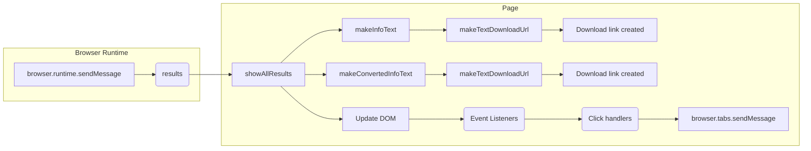

# Анализ кода show_all_results.js

## <input code>

```javascript
/* This Source Code Form is subject to the terms of the Mozilla Public
 * License, v. 2.0. If a copy of the MPL was not distributed with this
 * file, You can obtain one at http://mozilla.org/MPL/2.0/. */

(function (window, undefined) {
    "use strict";

    // alias
    var tx = tryxpath;
    var fu = tryxpath.functions;

    var document = window.document;

    var detailKeys = ["type", "name", "value", "textContent"];
    var headerValues = ["Type", "Name", "Value", "textContent"];
    var relatedTabId;
    var relatedFrameId;
    var executionId;

    function showAllResults(results) {
        // ... (Код функции showAllResults)
    };

    function makeTextDownloadUrl(text) {
        // ... (Код функции makeTextDownloadUrl)
    };

    function makeInfoText(results) {
        // ... (Код функции makeInfoText)
    };

    function makeConvertedInfoText(results) {
        // ... (Код функции makeConvertedInfoText)
    };

    window.addEventListener("load", function() {
        // ... (Код обработчика события load)
    });

})(window);
```

## <algorithm>

```mermaid
graph TD
    A[window.addEventListener("load")] --> B{browser.runtime.sendMessage({"event":"loadResults"})};
    B --> C[results];
    C -- results != null --> D[relatedTabId, relatedFrameId, executionId];
    C -- results == null --> E[End];
    D --> F[showAllResults(results)];
    D --> G[makeTextDownloadUrl(makeInfoText(results))];
    D --> H[makeTextDownloadUrl(makeConvertedInfoText(results))];
    F --> I[Update elements with results data];
    G --> J[export-text.href];
    H --> K[export-partly-converted.href];
    J --> L[Download link created];
    K --> M[Download link created];
    A --> N[contDetail.addEventListener("click")];
    N --> O{target.tagName === "button"};
    O -- true --> P[browser.tabs.sendMessage(relatedTabId, ...)];
    O -- false --> Q[End click handler];
    A --> R[mainDetails.addEventListener("click")];
    R --> S{target.tagName === "button"};
    S -- true --> T[Get index from data-index];
    S -- false --> U[End click handler];
    T --> V[browser.tabs.sendMessage(relatedTabId, ...)];
```

**Пример:** Если `results` содержит данные о результатах поиска, функция `showAllResults` обновит HTML-элементы на странице с этой информацией.  Данные из `results` передаются в функции `makeInfoText`, `makeConvertedInfoText` для формирования текста для загрузки. После обновления элементов, создаются ссылки для загрузки данных в файл. При клике на элементы, в зависимости от контекста, отправляются сообщения в браузер для фокусировки элементов.


## <mermaid>



**Подключаемые зависимости**:  `tryxpath`, `tryxpath.functions`.  Зависимости `browser.runtime`, `browser.tabs` из Chrome Extension API. `URL.createObjectURL`, `Blob`.  `JSON.stringify`. Эти зависимости необходимы для работы с данными, обновлением страницы, созданием ссылок для скачивания, обмена данными с расширением браузера.


## <explanation>

* **Импорты**: Код не использует импорт в привычном формате (`import`).  `tx = tryxpath;` и `fu = tryxpath.functions;` - это алиасы, которые ссылаются на глобальные переменные `tryxpath` и `tryxpath.functions`, предполагая, что эти переменные объявлены и доступны в глобальном контексте. Вероятно, они определяются в другом файле скрипта расширения Chrome.

* **Классы**: Нет явных определений классов.

* **Функции**:
    * `showAllResults(results)`: Функция принимает объект `results` с данными и обновляет HTML-элементы на странице.  Анализирует наличие `results.context` и соответственно действует. Вызывает `fu.updateDetailsTable` для обновления таблиц.  Примеры: обновляет элементы `<p>` на странице (`message`, `title`, `href`).
    * `makeTextDownloadUrl(text)`: Создает URL для скачивания текста.  Принимает строку `text` и возвращает URL.
    * `makeInfoText(results)`, `makeConvertedInfoText(results)`: Формируют текстовые данные для скачиваемых файлов в разных форматах (оригинальные или JSON), используя поля объекта `results`.
    * Обработчик `window.addEventListener('load')`: Обрабатывает событие загрузки страницы и инициирует получение данных с помощью `browser.runtime.sendMessage`.


* **Переменные**: `detailKeys`, `headerValues` - массив строк, используемых для заголовков таблиц.  `relatedTabId`, `relatedFrameId`, `executionId` - переменные, хранящие идентификаторы для взаимодействия с расширением Chrome (вероятно).  `document` - ссылка на объект `document`.

* **Возможные ошибки или области для улучшений**:
    * Отсутствие обработки ошибок:  `catch(fu.onError)` — хороший подход, но не хватает конкретных обработчиков ошибок.  Дополнительно полезно выводить сообщения об ошибках.
    * Непонятно, откуда берутся `results` в функции `showAllResults`.  Используется сообщение `browser.runtime.sendMessage`, предполагая, что данные передаются из другого компонента расширения (фонового скрипта или другого контекста). Необходимо проверить, что передаваемые данные корректно структурированы.
    * Можно улучшить обработку случаев, когда `results` пуст или не содержит нужных данных.
    * Отсутствие валидации данных, полученных из `results`, может привести к ошибкам, если данные не соответствуют ожидаемому формату.

**Цепочка взаимосвязей**:
   - Фоновый скрипт расширения Chrome (или другое взаимодействующее расширение) отправляет данные о результатах в содержимое страницы через `browser.runtime.sendMessage`.
   - Содержимое страницы получает данные через обработчик `window.addEventListener` и сохраняет их в `results`.
   - Функция `showAllResults` использует эти данные для обновления страницы.
   - Функции `makeTextDownloadUrl`, `makeInfoText`, `makeConvertedInfoText` обрабатывают данные для создания ссылок для загрузки.
   - Клики на кнопки внутри таблицы отправляют сообщения обратно в браузерное расширение, чтобы фокусировать соответствующие элементы.

Этот код представляет собой часть расширения Chrome, которое отображает результаты поиска. Код хорошо организован, используя функции и обработчики событий, что делает его легко читаемым и поддерживаемым. Необходимо исправить недостающие проверки данных, и, если это нужно, добавить более детальную логику обработки ошибок для повышения надежности.