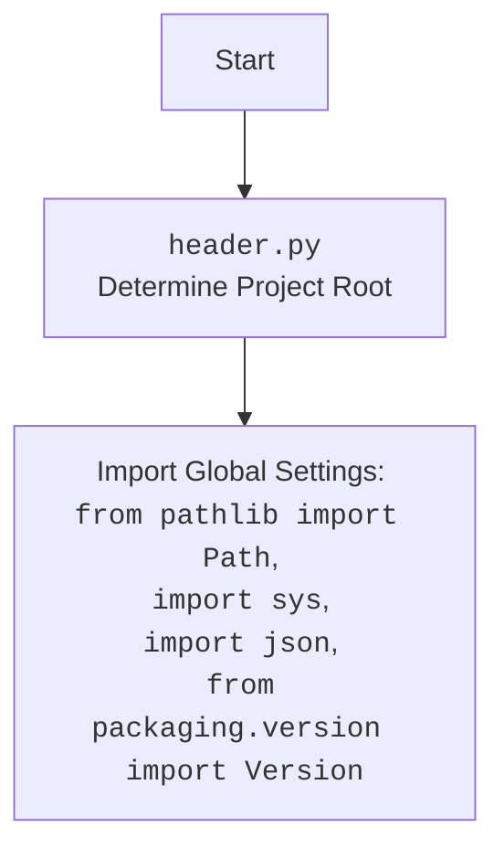

## <алгоритм>

1. **`set_project_root(marker_files)`**:
   - **Начало**: Функция `set_project_root` вызывается с кортежем `marker_files` (по умолчанию `('__root__', '.git')`).
   - **Определение текущего пути**: Получается абсолютный путь к директории, в которой расположен текущий файл (`header.py`).
     ```python
     current_path = Path(__file__).resolve().parent # Например, '/path/to/hypotez/src/webdriver/chrome'
     ```
   - **Инициализация root**: Переменная `__root__` инициализируется текущим путём.
     ```python
      __root__ = current_path # Например, '__root__' = '/path/to/hypotez/src/webdriver/chrome'
     ```
   - **Поиск родительских директорий**: Проходится циклом по текущей директории и всем её родительским директориям.
   - **Проверка наличия маркеров**: Для каждой родительской директории проверяется наличие хотя бы одного файла или директории из `marker_files`.
     ```python
      # Например, если 'marker_files' = ('__root__', '.git')
      (parent / '__root__').exists() or (parent / '.git').exists()
     ```
   - **Обновление root**: Если маркер найден, `__root__` обновляется до пути родительской директории, и цикл прерывается.
     ```python
      __root__ = parent # Например, '__root__' = '/path/to/hypotez'
     ```
   - **Добавление в sys.path**: Если `__root__` ещё не в `sys.path`, то `__root__` добавляется в начало списка путей поиска модулей.
   - **Возврат root**: Функция возвращает значение `__root__`.
2. **Глобальная переменная `__root__`**:
    - Вызывается функция `set_project_root()` без параметров.
        ```python
        __root__ = set_project_root()
        ```
   - Возвращенное значение из `set_project_root()` присваивается глобальной переменной `__root__`.
  
## <mermaid>

```mermaid
flowchart TD
    Start[Start] --> GetCurrentPath[Get Current File Path:<br> `__file__`]
    GetCurrentPath --> InitRoot[Initialize Root Path:<br> `__root__` = Current Path]
    InitRoot --> LoopParents[Loop Through Current and Parent Directories]
    LoopParents --> CheckMarker[Check for Marker Files:<br> `marker_files` = ('__root__', '.git')]
    CheckMarker -- Marker Found --> UpdateRoot[Update Root Path: <br> `__root__` = Parent Path]
    UpdateRoot --> BreakLoop[Break Loop]
    CheckMarker -- Marker Not Found --> LoopParents
    BreakLoop --> CheckInSysPath[Check if `__root__` is in `sys.path`]
    LoopParents -- No More Parents --> CheckInSysPath
    CheckInSysPath -- Not in sys.path --> AddToSysPath[Add `__root__` to `sys.path`]
    AddToSysPath --> ReturnRoot[Return `__root__`]
    CheckInSysPath -- In sys.path --> ReturnRoot
    ReturnRoot --> AssignGlobalRoot[Assign Returned Path to Global __root__ Variable]
    AssignGlobalRoot --> End[End]
```

### Описание зависимостей Mermaid:
*  `Start` - начало блок-схемы.
*  `GetCurrentPath`: Определяется путь текущего файла `__file__`, используя `Path(__file__).resolve().parent` для получения абсолютного пути к родительской директории.
*  `InitRoot`: Переменная `__root__` инициализируется значением `current_path`.
*  `LoopParents`: Организуется цикл по текущей директории и её родительским директориям.
*  `CheckMarker`: Внутри цикла проверяется наличие файлов или директорий из `marker_files` в текущей родительской директории.
*  `UpdateRoot`: Если маркер найден, `__root__` обновляется путём текущей родительской директории.
*  `BreakLoop`: Прерывается цикл поиска, если маркер найден.
*  `CheckInSysPath`: Проверяется, присутствует ли  `__root__` в `sys.path`.
*   `AddToSysPath`: Если `__root__` отсутствует в `sys.path`, он добавляется в начало списка.
*  `ReturnRoot`: Возвращается значение  `__root__`.
*  `AssignGlobalRoot`: Значение  `__root__` присваивается глобальной переменной `__root__`.
*  `End` - завершение блок-схемы.

### Дополнительно


## <объяснение>

### Импорты:

-   `import sys`:
    -   **Назначение**: Модуль `sys` предоставляет доступ к некоторым переменным и функциям, взаимодействующим с интерпретатором Python.
    -   **Использование**: Используется для добавления пути к корневой директории проекта в `sys.path`, что позволяет импортировать модули из этого проекта.
-   `import json`:
    -   **Назначение**: Модуль `json` предоставляет функции для работы с данными в формате JSON.
    -   **Использование**: В данном коде не используется напрямую, но может понадобиться в дальнейшем для работы с конфигурационными файлами или другими JSON-данными в рамках проекта.
-  `from packaging.version import Version`:
    - **Назначение**: Класс `Version` используется для представления версий пакетов и их сравнения.
    - **Использование**: В данном коде не используется напрямую, но может понадобиться в дальнейшем для работы с зависимостями проекта, управления версиями или определения совместимости.
-   `from pathlib import Path`:
    -   **Назначение**: Модуль `pathlib` предоставляет классы для работы с файловыми путями в объектно-ориентированном стиле.
    -   **Использование**: Используется для создания объектов `Path` и работы с путями к файлам и директориям (например, для нахождения родительских директорий).

### Функции:

-   `set_project_root(marker_files: tuple = ('__root__', '.git')) -> Path`:
    -   **Аргументы**:
        -   `marker_files` (tuple): Кортеж, содержащий имена файлов или директорий, которые используются для идентификации корневой директории проекта. По умолчанию используется `('__root__', '.git')`.
    -   **Возвращаемое значение**:
        -   `Path`: Объект `Path`, представляющий путь к корневой директории проекта.
    -   **Назначение**: Функция ищет корневую директорию проекта, поднимаясь по родительским директориям от директории, где находится текущий файл (`header.py`). Поиск останавливается, когда будет найдена директория, содержащая хотя бы один из файлов или директорий, указанных в `marker_files`.
    -   **Пример**:
        ```python
        root_path = set_project_root() #  Например:  Path("/path/to/hypotez")
        ```
        Если файл `__root__` или директория `.git` присутствует в  `/path/to/hypotez`, то будет возвращен этот путь.

### Переменные:

-   `__root__` (Path):
    -   **Тип**: `pathlib.Path`
    -   **Использование**: Глобальная переменная, представляющая путь к корневой директории проекта. Инициализируется путем, возвращаемым функцией `set_project_root()`.

### Объяснение:

1. **`set_project_root` Function**:
   - Функция `set_project_root` предназначена для динамического определения корневой директории проекта на основе наличия маркерных файлов или директорий.
   - Она гарантирует, что независимо от того, откуда запускается скрипт, всегда можно будет корректно определить корневую директорию, добавляя её в `sys.path`, что обеспечивает правильный импорт модулей.

2. **Глобальная переменная `__root__`**:
   - Переменная `__root__` является ключевой для всего проекта, поскольку она позволяет ссылаться на корневую директорию из любого модуля.
   - Она используется для организации импортов и работы с относительными путями внутри проекта.

### Потенциальные ошибки или области для улучшения:

-   **Отсутствие маркерных файлов**: Если ни один из файлов или директорий, указанных в `marker_files`, не найден, функция вернет директорию, где находится скрипт, а не корневую директорию проекта, это может вызвать проблемы при импорте.
-  **Обработка ошибок**: Не предусмотрена обработка ситуаций, когда `__file__` не определен, что может возникнуть в некоторых необычных сценариях.
-   **Жёстко заданные маркеры**: Жестко заданный список `marker_files` может не соответствовать структуре проекта, если использовать другие инструменты контроля версий или файловые структуры. Можно добавить параметр, который можно будет передавать при вызове функции для более гибкого использования.
-  **Зависимость от `sys.path`**: Изменения `sys.path` в runtime могут вызвать конфликты с другими модулями или зависимостями.

### Взаимосвязь с другими частями проекта:

-   `header.py` — это базовый модуль для проекта, обеспечивающий корректное определение корневой директории, что критично для других модулей.
-   Значение `__root__` используется другими модулями при импорте модулей и в целом для работы с путями внутри проекта.
-   Любой модуль, импортирующий `src.webdriver.chrome.header`, будет иметь доступ к переменной `__root__`, что позволяет ему находить ресурсы и другие модули.

### Цепочка взаимосвязей с другими частями проекта:
   - `header.py` -> `src` ->  `webdriver` -> `chrome` - это путь импорта, демонстрирующий иерархию каталогов проекта.
   - Другие модули проекта `hypotez`, импортируя `header.py`, используют полученный путь к корневой директории для импорта других модулей проекта, что обеспечивает модульность и организацию проекта.
   - Модули, зависящие от глобальной переменной `__root__`, получают возможность определять пути к файлам и директориям относительно корня проекта.