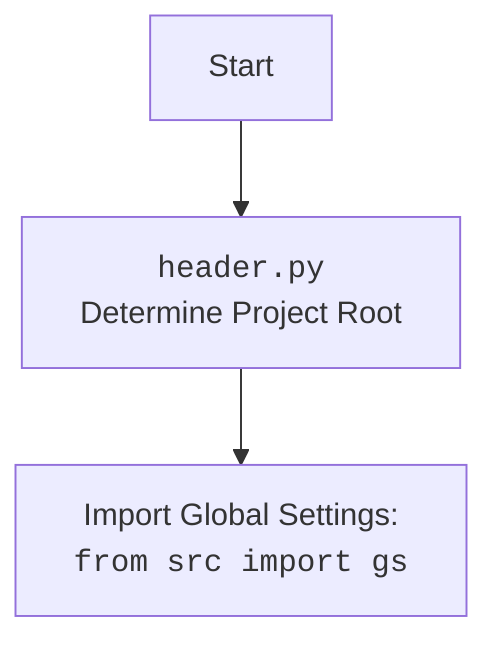

## АНАЛИЗ КОДА: `README.ru.md`

### <алгоритм>
1.  **Чтение конфигурации**: Загрузка конфигурации из `chrome.json`.
    *   *Пример*: Чтение JSON файла, который содержит параметры, например, `user-agent`, пути к бинарникам, и т.д.
2.  **Инициализация WebDriver**: Создание экземпляра WebDriver с применением загруженной конфигурации.
    *   *Пример*: Использование `selenium.webdriver.Chrome` с набором опций, полученных из файла конфигурации.
3.  **Установка опций**: Применение опций из `chrome.json`, а также дополнительных опций, переданных при инициализации.
    *   *Пример*: Установка опции `--headless`, если это необходимо, или передача дополнительных аргументов командной строки.
4.  **Настройка профиля**: Применение настроек профиля браузера (путь к пользовательским данным) на основе операционной системы.
    *   *Пример*: Установка пути к профилю в Windows `C:\\Users\\User\\AppData\\Local\\Google\\Chrome\\User Data`.
5.  **Установка заголовков**: Добавление пользовательских заголовков, таких как `User-Agent`, для имитации конкретного браузера.
    *   *Пример*: Добавление заголовка `User-Agent: Mozilla/5.0 ...` к запросам браузера.
6.  **Использование Singleton**: Обеспечение того, что существует только один экземпляр WebDriver.
    *   *Пример*: При запросе экземпляра, если он уже существует, возвращается существующий экземпляр, а не создается новый.
7.  **Логирование**: Регистрация всех важных событий, включая ошибки инициализации и конфигурации, с использованием модуля `logger`.
    *   *Пример*: Запись в лог сообщения об ошибке `Ошибка при инициализации Chrome WebDriver: ...`.
8.  **Работа с браузером**: Использование методов WebDriver для взаимодействия с браузером (открытие веб-страниц, закрытие браузера).
    *   *Пример*: `browser.get("https://www.example.com")` для открытия сайта и `browser.quit()` для закрытия браузера.

```mermaid
flowchart TD
    subgraph "src.webdriver.chrome"
      A[Read Configuration: chrome.json] --> B(Create ChromeOptions)
      B --> C{Set Options from Config}
      C --> D{Set Custom Options}
      D --> E{Set Profile Path}
      E --> F{Set Headers}
      F --> G(Create WebDriver Instance: Chrome)
      G --> H{Singleton Check}
      H -- Yes --> I[Return Existing Instance]
      H -- No --> J[Create New Instance]
      J --> K(Return WebDriver)
      K --> L[Log Initialization]
      
     
    end
    
     subgraph "Usage Example"
       M[Import Chrome Class] --> N[Initialize Chrome WebDriver]
       N --> O[Open Web Page]
       O --> P[Close Browser]
     end    

    style A fill:#f9f,stroke:#333,stroke-width:2px
    style G fill:#ccf,stroke:#333,stroke-width:2px
```

### <mermaid>

#### Зависимости `mermaid` диаграммы:
1. **src.webdriver.chrome:** Основной модуль, в котором происходит вся логика создания и настройки Chrome WebDriver.
2. **chrome.json:** Внешний JSON файл, содержащий настройки для WebDriver.
3. **selenium.webdriver.Chrome:** Класс из библиотеки Selenium, который используется для управления браузером Chrome.
4. **src.logger:** Модуль, используемый для логирования действий и ошибок.

### <объяснение>
#### Импорты:
-   В явном виде нет импортов, но по смыслу текста подразумевается использование следующих импортов:
    -   `selenium.webdriver`: используется для управления браузером Chrome.
    -   `selenium.webdriver.chrome.options`: для настройки опций браузера.
    -   `fake_useragent`: для генерации случайных user-agent.
    -   `src.logger`: для логирования событий.
    -   `json`: для работы с JSON файлами (`chrome.json`).

#### Классы:
-   **`Chrome`**: Основной класс в `src.webdriver.chrome`. Он инкапсулирует логику создания и управления Chrome WebDriver.
    -   **Атрибуты**:
        -   `config`: Словарь с настройками из `chrome.json`.
        -   `driver`: Экземпляр `selenium.webdriver.Chrome`.
    -   **Методы**:
        -   `__init__`: Загружает конфигурацию, настраивает и инициализирует WebDriver, а также реализует паттерн Singleton.
        -   `get`: Открывает веб-страницу в браузере.
        -   `quit`: Закрывает браузер.

#### Функции:
-   Не описаны явно отдельные функции, но можно выделить следующие:
    -   Функция инициализации `__init__` в классе `Chrome` для настройки WebDriver и применения Singleton паттерна.
    -   Методы `get` и `quit` предоставляют интерфейс для управления браузером.

#### Переменные:
-   `config`: Словарь, содержащий настройки из `chrome.json`, такие как `options`, `disabled_options`, `profile_directory`, `binary_location`, `headers`, и `proxy_enabled`.
-   `driver`: Экземпляр `selenium.webdriver.Chrome`, представляющий открытый браузер.
-   `options`: Список пользовательских опций для браузера.
-   `user_agent`: Строка `user-agent` для браузера.
-   Различные параметры в `chrome.json` являются переменными конфигурации, например, `log-level`, `remote-debugging-port`, пути к бинарникам, и т.д.

#### Потенциальные ошибки и области для улучшения:
-   **Обработка исключений**: В коде подразумевается наличие обработки исключений, особенно при загрузке конфигурационного файла и инициализации WebDriver. Необходимо проработать обработку ошибок более детально и предоставлять пользователю информативные сообщения.
-   **Конфигурация по умолчанию**: Необходимо обеспечить значения по умолчанию для конфигурационных параметров, чтобы избежать проблем, если файл `chrome.json` отсутствует или какие-то поля в нём не определены.
-   **Пути к файлам**: Пути к файлам в `binary_location` могут быть жестко закодированы, что может привести к проблемам на разных системах. Необходимо сделать эти пути более гибкими, возможно, с использованием переменных окружения.
-   **Паттерн Singleton**: Необходимо учесть, что данный подход может не подходить для многопоточных приложений.
-   **Логирование**: Логирование должно быть более информативным и детализированным, с возможностью настройки уровня логирования.

#### Взаимосвязь с другими частями проекта:
-   `src.logger`: Используется для централизованного логирования событий, ошибок и отладочной информации.
-   `chrome.json`: Внешний конфигурационный файл, который позволяет настраивать различные аспекты WebDriver.
-   Возможная интеграция с другими частями проекта для автоматизации тестирования веб-приложений и сбора данных.

В целом, код `README.ru.md` описывает модуль для управления браузером Chrome с помощью Selenium, который предоставляет гибкие настройки и централизованную конфигурацию. Присутствует использование паттерна Singleton и логгирования.