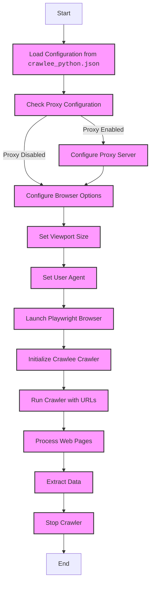

## Анализ кода `README.MD`

Этот файл `README.MD` предоставляет документацию для модуля `CrawleePython`, который является частью проекта `src.webdriver`. Модуль предназначен для автоматизации и сбора данных с веб-страниц с использованием библиотеки `Crawlee` и `Playwright`. 

### 1. <алгоритм>

1.  **Инициализация модуля**:
    -   Модуль `CrawleePython` предназначен для настройки и запуска веб-сканера с помощью `PlaywrightCrawler` из библиотеки `Crawlee`.
    -   Конфигурация считывается из файла `crawlee_python.json`.
    -   При инициализации можно передать пользовательские параметры, которые переопределят значения из конфигурационного файла.

2.  **Загрузка конфигурации**:
    -   Модуль загружает настройки из файла `crawlee_python.json`.
    -   Конфигурация включает параметры браузера (`headless`, `browser_type`, `options`, `user_agent`, `viewport`, `timeout`, `ignore_https_errors`), настройки прокси и максимальное число запросов.

3.  **Настройка Playwright**:
    -   `Playwright` настраивается с помощью параметров, полученных из конфигурационного файла и/или переданных при инициализации.
    -   Могут быть установлены параметры прокси, размера окна, пользовательского агента и другие параметры браузера.

4.  **Запуск сканера**:
    -   `CrawleePython` используется для запуска веб-сканера.
    -   Метод `run` принимает список URL-адресов для сканирования.
    -   Сканер обрабатывает страницы, используя настроенный `Playwright` и `Crawlee`.

5.  **Логирование**:
    -   Модуль использует логгер из `src.logger` для записи ошибок, предупреждений и другой информации.
    -   Логируются ошибки инициализации, проблемы с конфигурацией и ошибки, возникающие во время выполнения.

6.  **Пример использования**:
    -   В примере `async def main():` показано как создать экземпляр `CrawleePython` с кастомными опциями и запустить его.
    -   Функция `asyncio.run(main())` используется для запуска асинхронного кода.

### 2. <mermaid>

**Объяснение диаграммы `mermaid`:**

-   **`Start`**: Начало процесса.
-   **`LoadConfig`**: Загрузка конфигурации из файла `crawlee_python.json`. Этот шаг предполагает чтение и разбор JSON-файла.
-   **`CheckProxy`**: Проверка, включен ли прокси в конфигурации. Проверяется значение поля `enabled` в блоке `proxy`.
-   **`ConfigureProxy`**: Если прокси включен, настраивается прокси-сервер с использованием параметров `server`, `username` и `password` из конфигурации.
-   **`ConfigureBrowser`**: Настройка параметров браузера, таких как опции командной строки (`options`), тип браузера (`browser_type`) и т.д.
-   **`SetViewport`**: Установка размера окна браузера (ширина и высота) из поля `viewport` конфигурации.
-   **`SetUserAgent`**: Установка пользовательского агента браузера из поля `user_agent` конфигурации.
-   **`LaunchBrowser`**: Запуск браузера `Playwright` с настроенными параметрами.
-   **`InitializeCrawler`**: Инициализация веб-сканера `Crawlee` с настройками, полученными на предыдущих шагах.
-   **`RunCrawler`**: Запуск сканера с заданными URL-адресами.
-   **`ProcessPages`**: Обработка веб-страниц, посещенных сканером. Здесь выполняются все необходимые действия по сбору данных.
-   **`ExtractData`**: Извлечение данных со страниц, обработанных сканером.
-   **`StopCrawler`**: Остановка работы сканера.
-   **`End`**: Завершение процесса.

### 3. <объяснение>

#### Импорты:

-   В этом файле, как таковых, нет импортов, так как это `README.md`, но в коде, который описывается в этом файле, есть импорты:
    -   `src.webdriver.crawlee_python` : Импортируется класс `CrawleePython` из этого же модуля.
    -   `asyncio` : Библиотека для поддержки асинхронного программирования в Python.

#### Классы:

-   **`CrawleePython`**:
    -   **Роль**: Основной класс для запуска веб-сканера. Инкапсулирует всю логику работы с `Playwright` и `Crawlee`.
    -   **Атрибуты**: Содержит параметры конфигурации (из `crawlee_python.json` или переданные при инициализации).
    -   **Методы**:
        -   `__init__`: Конструктор класса, инициализирует настройки сканера.
        -   `run`: Запускает сканер с заданными URL-адресами.

#### Функции:

-   **`async def main()`**:
    -   **Аргументы**: Нет.
    -   **Возвращает**: Ничего (`None`).
    -   **Назначение**: Асинхронная функция для запуска примера работы сканера. Она создает экземпляр `CrawleePython` и вызывает метод `run` для сканирования URL.
-   **`asyncio.run(main())`**:
    -   **Аргументы**: Функция `main`.
    -   **Возвращает**: Ничего.
    -   **Назначение**: Запускает асинхронную функцию `main` и обеспечивает корректное выполнение асинхронного кода.

#### Переменные:

-   В `crawlee_python.json` :
    -   `max_requests` (int): Максимальное количество запросов для сканера.
    -   `headless` (bool): Запуск браузера в фоновом режиме.
    -   `browser_type` (str): Тип используемого браузера (chromium, firefox, webkit).
    -   `options` (list): Список опций командной строки для запуска браузера.
    -   `user_agent` (str): Пользовательский агент для запросов.
    -   `proxy` (dict): Параметры прокси сервера (enabled, server, username, password).
    -   `viewport` (dict): Размеры окна браузера (width, height).
    -   `timeout` (int): Таймаут для операций в миллисекундах.
    -   `ignore_https_errors` (bool): Флаг для игнорирования HTTPS ошибок.
-   В примере использования:
    -   `crawler` (CrawleePython): Экземпляр класса `CrawleePython`.

#### Потенциальные ошибки и улучшения:

-   **Отсутствие проверки конфигурации**: Код должен проверять наличие и корректность данных в файле `crawlee_python.json` перед их использованием.
-   **Жесткая привязка к `crawlee_python.json`**: Можно сделать более гибкой настройку, позволяя передавать конфигурацию через словарь или другой формат.
-   **Отсутствие обработки ошибок `Playwright`**: Код должен более тщательно обрабатывать ошибки, которые могут возникнуть при запуске браузера и выполнении запросов.
-   **Недостаточно подробное логирование**: В логах можно добавить больше информации, например, время выполнения запросов и данные, полученные со страниц.
-   **Отсутствие документации по методам класса CrawleePython**: В README нет описания методов класса, а только пример использования.

#### Взаимосвязь с другими частями проекта:

-   Модуль `CrawleePython` использует логгер из `src.logger`. Это позволяет централизованно обрабатывать логи.
-   Вероятно, `CrawleePython` может использоваться в других модулях проекта для сбора данных с веб-страниц.

**Заключение:**

Этот `README.MD` файл описывает функциональность модуля `CrawleePython` для автоматизации сбора данных с веб-страниц. Он предоставляет информацию о настройке модуля, параметрах конфигурации, примеры использования и возможные проблемы. Структурированный подход в документе делает его понятным и полезным для разработчиков, использующих данный модуль.