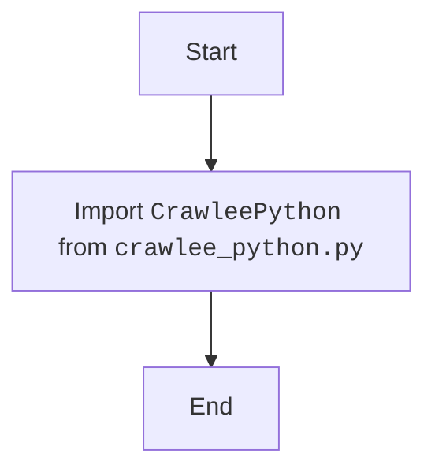

## Анализ кода `hypotez/src/webdriver/crawlee_python/__init__.py`

### 1. <алгоритм>

1.  **Импорт:**
    *   Импортируется класс `CrawleePython` из модуля `crawlee_python.crawlee_python`.

2. **Конец:**
    * Завершение работы файла `__init__.py`.

### 2. <mermaid>

**Объяснение зависимостей в mermaid:**

*   **`Start`**: Начало процесса.
*   **`ImportCrawleePython`**:  Импорт класса `CrawleePython` из модуля `crawlee_python.py`, который находится в той же директории. 
*  **`End`**: Конец процесса.
### 3. <объяснение>

**Импорты:**

*   `from .crawlee_python import CrawleePython`: Эта строка импортирует класс `CrawleePython` из модуля `crawlee_python.py`, находящегося в той же директории, что и файл `__init__.py`.  Точка `.` указывает на относительный импорт, что означает, что `crawlee_python.py` находится в текущем пакете (`src.webdriver.crawlee_python`).

**Классы:**

*   `CrawleePython`:  Этот класс, вероятно, содержит основную логику для работы с Crawlee (библиотека для веб-скрапинга) на Python. Он, вероятно, инкапсулирует функциональность, необходимую для взаимодействия с Crawlee, такую как запуск скрапинга, управление браузером и т.д. 
    *   **Атрибуты** и **методы** `CrawleePython` можно определить только путем анализа файла `crawlee_python.py` , который не был предоставлен.

**Файл `__init__.py`:**

*   Файл `__init__.py` в Python пакете (директории) отмечает её как пакет, позволяя импортировать модули и классы из этой директории, как если бы они были частью одного пакета. В данном случае, он делает класс `CrawleePython` доступным для импорта из `src.webdriver.crawlee_python`.

**Цепочка взаимосвязей:**

1.  **`src.webdriver`**: Этот пакет, вероятно, предназначен для управления веб-драйверами, необходимыми для автоматизированного взаимодействия с веб-страницами.
2.  **`src.webdriver.crawlee_python`**: Этот подпакет, как предполагается, содержит код, специфичный для интеграции с библиотекой Crawlee.
3.  **`src.webdriver.crawlee_python.__init__.py`**:  Этот файл инициализирует пакет и делает класс `CrawleePython` доступным для использования в других частях проекта.
4.  **`src.webdriver.crawlee_python.crawlee_python.py`**: Файл, в котором фактически находится реализация класса `CrawleePython`, который импортируется в файле `__init__.py` .

**Потенциальные области для улучшения:**

*   Без доступа к файлу `crawlee_python.py`, полный анализ и оценка класса `CrawleePython` невозможны.
*   Документирование методов и атрибутов класса `CrawleePython` в `crawlee_python.py` улучшит читаемость и понимание кода.
*   В будущей разработке, если класс `CrawleePython` будет содержать сложную логику, можно рассмотреть возможность её разделения на несколько более мелких классов или функций для повышения модульности и тестируемости.