## АНАЛИЗ КОДА: `CrawleePython`

### 1. **<алгоритм>**

**Блок-схема работы класса `CrawleePython`:**

```mermaid
graph TD
    A[Начало] --> B(Создание экземпляра CrawleePython);
    B --> C{Инициализация: __init__};
    C --> D[Установка параметров: max_requests, headless, browser_type];
    D --> E(Создание PlaywrightCrawler);
    E --> F{Настройка Crawler: setup_crawler};
    F --> G[Определение request_handler];
    G --> H[Обработка запроса: extract data, enqueue links];
    H --> I(Запуск Crawler: run_crawler);
    I --> J{Получение списка URL: initial_urls};
    J --> K(Crawl web pages);
    K --> L{Экспорт данных: export_data};
    L --> M(Сохранение в JSON файл);
    M --> N{Получение данных: get_data};
    N --> O[Возврат собранных данных];
    O --> P{Основной запуск: run};
    P --> Q(Оркестрация процесса);
    Q --> R[Вызов setup_crawler, run_crawler, export_data, get_data];
    R --> S(Вывод собранных данных);
    S --> T[Конец];
    style A fill:#f9f,stroke:#333,stroke-width:2px
    style T fill:#f9f,stroke:#333,stroke-width:2px
    
    
    classDef step fill:#ccf,stroke:#333,stroke-width:1px;
    class C,F,I,L,N,P step;
```



**Пояснение каждого блока:**

1.  **Начало**:  Начало выполнения программы.
2.  **Создание экземпляра `CrawleePython`**:  Создается объект класса `CrawleePython`.

    *   _Пример_: `crawler = CrawleePython(max_requests=10, headless=True, browser_type='chromium')`
3.  **Инициализация: `__init__`**: Вызывается конструктор класса.
4.  **Установка параметров**:  Устанавливаются начальные параметры для краулера: `max_requests`, `headless`, `browser_type`.
5.  **Создание `PlaywrightCrawler`**: Создается экземпляр `PlaywrightCrawler` с установленными параметрами.
6.  **Настройка Crawler: `setup_crawler`**: Настройка обработчика запросов.
7.  **Определение `request_handler`**:  Определение функции-обработчика для каждого запроса.
8.  **Обработка запроса**:  Обработка каждого URL: извлечение данных со страницы (например, заголовки, ранги, ссылки), добавление ссылок в очередь для дальнейшего обхода.

    *   _Пример_: Функция обрабатывает HTML-страницу, ищет элементы с классом `athing` и извлекает `title`, `rank`, `href` из каждого.
9.   **Запуск Crawler: `run_crawler`**: Запуск процесса обхода веб-страниц.
10. **Получение списка URL: `initial_urls`**: Получение списка начальных URL для обхода.

    *   _Пример_: `initial_urls = ['https://news.ycombinator.com/']`
11. **Crawl web pages**:  Обход веб-страниц.
12. **Экспорт данных: `export_data`**: Сохранение собранных данных в JSON файл.
13. **Сохранение в JSON файл**:  Сохранение данных в указанный файл.

    *   _Пример_: Сохранение в файл `results.json`.
14. **Получение данных: `get_data`**:  Получение собранных данных из объекта краулера.
15. **Возврат собранных данных**: Возврат собранных данных в виде словаря.
16. **Основной запуск: `run`**: Основная функция запуска краулера.
17. **Оркестрация процесса**: Управление всем процессом, настройка и запуск краулера.
18. **Вызов `setup_crawler`, `run_crawler`, `export_data`, `get_data`**: Последовательный вызов методов для настройки, запуска, экспорта и получения данных.
19. **Вывод собранных данных**: Вывод собранных данных на экран.
20. **Конец**:  Завершение выполнения программы.

### 2. **<mermaid>**

```mermaid
flowchart TD
    CrawleePythonClass[<code>CrawleePython</code><br>Web Scraper Class]
    CrawleePythonClass --> InitMethod[<code>__init__</code><br>Initialize Crawler]
    InitMethod --> PlaywrightCrawlerInstance[<code>PlaywrightCrawler</code><br>Instance Creation]
    PlaywrightCrawlerInstance --> SetupCrawlerMethod[<code>setup_crawler</code><br>Configure Request Handler]
    SetupCrawlerMethod --> RequestHandlerFunction[<code>request_handler</code><br>Process Request, Extract Data]
    RequestHandlerFunction --> PageObject[<code>page</code><br>Playwright Page Object]
     PageObject --> SelectorEngine[<code>page.locator</code><br>Element Selection]
      SelectorEngine --> ElementExtraction[Extract data by selectors: <br>titles, ranks, links]
    ElementExtraction -->  EnqueuedLinks[Enqueue links for further crawling]
    EnqueuedLinks --> RunCrawlerMethod[<code>run_crawler</code><br>Start Crawling Process]
     RunCrawlerMethod --> InitialUrls[List of Initial URLs]
    InitialUrls --> CrawlProcess[Web pages crawl]
    CrawlProcess --> ExportDataMethod[<code>export_data</code><br>Export data to JSON]
    ExportDataMethod --> JsonFile[JSON output file]
     CrawlProcess --> GetDataMethod[<code>get_data</code><br>Retrieve extracted data]
     GetDataMethod --> ExtractedData[Data in a Dictionary]
     ExtractedData --> RunMethod[<code>run</code><br>Orchestrate all the crawling process]
     RunMethod --> CrawlingFlow[Start Setup Crawler, run, Export and get data]
      CrawlingFlow --> OutputData[Print Extracted Data]
     OutputData --> EndProgram[End]


    classDef class_method fill:#f9f,stroke:#333,stroke-width:1px;
    class InitMethod, SetupCrawlerMethod, RunCrawlerMethod, ExportDataMethod, GetDataMethod, RunMethod class_method;

```

**Объяснение `mermaid` диаграммы:**

1.  **`CrawleePythonClass`**: Главный класс, представляющий веб-скрейпер.
2.  **`InitMethod`**: Метод `__init__` инициализирует параметры и создает экземпляр `PlaywrightCrawler`.
3.  **`PlaywrightCrawlerInstance`**: Экземпляр класса `PlaywrightCrawler`, используемый для обхода сайтов.
4.  **`SetupCrawlerMethod`**: Метод `setup_crawler` настраивает обработчик запросов `request_handler`.
5.  **`RequestHandlerFunction`**: Функция `request_handler`, выполняющаяся для каждого запроса, извлекает данные и добавляет ссылки в очередь.
6.  **`PageObject`**: Представление объекта страницы Playwright.
7.  **`SelectorEngine`**: Метод page.locator для выбора элементов на странице.
8.  **`ElementExtraction`**: Блок, представляющий процесс извлечения необходимых данных с использованием селекторов.
9.  **`EnqueuedLinks`**: Блок, представляющий добавление новых ссылок для обхода.
10. **`RunCrawlerMethod`**: Метод `run_crawler`, запускающий процесс обхода веб-страниц.
11. **`InitialUrls`**: Список начальных URL для обхода.
12. **`CrawlProcess`**: Процесс обхода веб-страниц с использованием `PlaywrightCrawler`.
13. **`ExportDataMethod`**: Метод `export_data` экспортирует собранные данные в JSON.
14. **`JsonFile`**: Результат работы метода `export_data` - файл JSON с извлеченными данными.
15. **`GetDataMethod`**: Метод `get_data` для получения собранных данных.
16. **`ExtractedData`**: Результат работы метода `get_data` - данные в виде словаря.
17. **`RunMethod`**: Метод `run` управляет всем процессом, включая вызов `setup_crawler`, `run_crawler`, `export_data`, и `get_data`.
18. **`CrawlingFlow`**: Представление последовательного выполнения методов.
19. **`OutputData`**:  Печать собранных данных.
20. **`EndProgram`**: Конец выполнения программы.

### 3. **<объяснение>**

**Импорты:**

*   `asyncio`: Стандартная библиотека Python для асинхронного программирования. Используется для запуска асинхронных задач, таких как веб-скрейпинг с помощью Playwright.
*   `json`: Стандартная библиотека для работы с данными в формате JSON. Используется для экспорта извлеченных данных в файл.
*   `typing`: Модуль для типизации, используется для аннотации типов, делая код более читаемым и понятным. В данном коде используется для аннотации типа данных возвращаемого значения `get_data()`.
*   `crawlee`: Библиотека `crawlee` (нестандартная) предоставляет функционал для создания веб-краулеров, включая поддержку Playwright. Используется для создания `PlaywrightCrawler`.

**Классы:**

*   **`CrawleePython`**: Основной класс, который инкапсулирует логику веб-скрейпинга.
    *   **Атрибуты**:
        *   `max_requests`: Максимальное количество запросов, которые должен выполнить краулер. Тип `int`.
        *   `headless`: Флаг, указывающий, запускать ли браузер в headless-режиме. Тип `bool`.
        *   `browser_type`: Тип браузера для использования (например, 'chromium', 'firefox'). Тип `str`.
        *   `data`: Список словарей для хранения извлеченных данных.
    *   **Методы**:
        *   `__init__(self, max_requests: int, headless: bool, browser_type: str)`: Конструктор класса, инициализирующий параметры краулера и создающий экземпляр `PlaywrightCrawler`.
        *   `setup_crawler(self)`: Метод для настройки краулера, устанавливающий обработчик запросов.
        *   `request_handler(self, {request, page})`: Асинхронный обработчик запросов, извлекающий данные со страницы и добавляющий ссылки в очередь для дальнейшего обхода.
        *   `run_crawler(self, initial_urls: list[str])`: Запускает краулер с заданным списком URL.
        *   `export_data(self, filename: str)`: Экспортирует собранные данные в JSON файл.
        *   `get_data(self) -> dict`: Возвращает собранные данные в виде словаря.
        *   `run(self, initial_urls: list[str], export_file: str = "results.json")`: Метод для оркестрации всего процесса: настройка, запуск, экспорт данных и печать результатов.

**Функции:**

*   `request_handler(self, {request, page})`:
    *   **Аргументы**: `request` (объект запроса), `page` (объект страницы Playwright).
    *   **Возвращаемое значение**: None.
    *   **Назначение**: Обрабатывает каждый запрос:
        1.  Ищет все элементы с классом `athing`.
        2.  Для каждого элемента извлекает `rank`, `title` и ссылку.
        3.  Собирает данные в список словарей `data`.
        4.  Добавляет ссылки для дальнейшего обхода.
    *   **Пример**:
        ```python
        async def request_handler(self, {request, page}):
            posts = await page.locator('.athing').all()
            for post in posts:
                rank_element = await post.locator('.rank').first()
                title_element = await post.locator('.titlelink').first()
                if rank_element and title_element:
                    rank = await rank_element.text()
                    title = await title_element.text()
                    link = await title_element.get_attribute('href')
                self.data.append({"rank": rank, "title": title, "link": link})
        ```
*   `main()`:
    *   **Аргументы**: None.
    *   **Возвращаемое значение**: None.
    *   **Назначение**:  Создает экземпляр `CrawleePython`, запускает краулер на Hacker News, экспортирует и печатает данные.

**Переменные:**

*   `crawler`: Экземпляр класса `CrawleePython`.
*   `initial_urls`: Список начальных URL для обхода.
*   `filename`: Имя файла для экспорта данных.
*   `max_requests`, `headless`, `browser_type`: Параметры для инициализации `CrawleePython`.
*   `data`: Список словарей, содержащий извлеченные данные.

**Потенциальные ошибки и области для улучшения:**

*   **Обработка исключений**: В коде не предусмотрена обработка исключений, что может привести к сбою при проблемах с сетевыми запросами или при извлечении данных. Следует добавить блоки `try-except`.
*   **Конфигурация селекторов**: Селекторы CSS (`.athing`, `.rank`, `.titlelink`) жестко заданы. Возможность их конфигурации извне сделает код более гибким.
*   **Логирование**: Отсутствует логирование, что затрудняет отладку и мониторинг работы краулера.
*   **Параллелизация**: Возможность параллелизации запросов для более быстрой работы краулера.
*   **Обработка динамического контента**: Код не обрабатывает динамически загружаемый контент на странице.

**Взаимосвязи с другими частями проекта:**
   -  **`crawlee` библиотека:** `CrawleePython` использует `PlaywrightCrawler` из библиотеки `crawlee` для обхода веб-страниц. `crawlee` предоставляет абстракцию для создания масштабируемых краулеров, в то время как `CrawleePython` реализует логику конкретного краулера.
   -  **Playwright:**  `PlaywrightCrawler` использует Playwright для управления браузером.  `CrawleePython` зависит от Playwright для взаимодействия с DOM и обработки JavaScript.

**Цепочка взаимосвязей:**

`CrawleePython` -> `crawlee` (библиотека) -> `Playwright` -> Web Browser.

`CrawleePython` использует `PlaywrightCrawler` из `crawlee`.  `PlaywrightCrawler` управляет браузером через Playwright, который непосредственно взаимодействует с браузером.

Этот подробный анализ кода должен дать полное представление о функциональности и структуре класса `CrawleePython`.