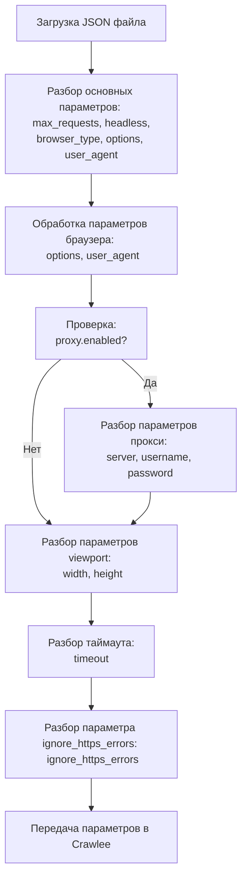

## АНАЛИЗ КОДА: `hypotez/src/webdriver/crawlee_python/crawlee_python.json`

### 1. <алгоритм>

Представленный JSON-файл содержит конфигурационные параметры для веб-скрейпера, использующего библиотеку Crawlee на Python. Вот пошаговая блок-схема обработки этих параметров:

1.  **Начало**: Загрузка JSON-файла с конфигурацией.

    *   *Пример*: Загружается файл `crawlee_python.json`.
2.  **Разбор основных параметров**: Извлечение параметров, таких как `max_requests`, `headless`, `browser_type`, `options`, `user_agent`.

    *   *Пример*:  `max_requests` = 10, `headless` = true, `browser_type` = "chromium".
3.  **Обработка параметров браузера**:
    *  **`options`**: Разбор массива строк, содержащих опции для запуска браузера.
         * *Пример*: `options` = ["--disable-dev-shm-usage", "--no-sandbox", "--disable-gpu"].
    *  **`user_agent`**: Запись строки, которая будет использоваться как User-Agent браузера.
         * *Пример*: `user_agent` = "Mozilla/5.0 ...".
4.  **Обработка прокси-сервера**: Проверка, включен ли прокси. Если да, то извлечение параметров: `server`, `username`, `password`.

    *   *Пример 1*: Если `proxy.enabled` = `false`, то прокси-сервер не используется.
    *   *Пример 2*: Если `proxy.enabled` = `true`,  то `server` = "http://proxy.example.com:8080", `username` = "user", `password` = "password".
5.  **Обработка параметров viewport**: Извлечение ширины и высоты окна браузера.

    *   *Пример*:  `width` = 1280, `height` = 720.
6.  **Обработка тайм-аута**: Извлечение значения таймаута в миллисекундах.
     *   *Пример*: `timeout` = 30000.
7.  **Обработка ошибки https**: Извлечение значения, игнорировать ошибки https или нет.
    * *Пример*: `ignore_https_errors` = false
8.  **Конец**: Передача параметров в Crawlee для настройки браузера и поведения скрейпера.

### 2. <mermaid>

**Объяснение диаграммы:**

1.  `Start`: Начальная точка процесса, где загружается JSON-файл.
2.  `ParseParams`: Разбор базовых параметров, таких как количество запросов, режим браузера (headless/не headless) и тип браузера.
3.  `BrowserOptions`: Разбор опций браузера и установка User-Agent.
4.  `CheckProxy`: Проверка, включен ли прокси-сервер.
5.  `ParseProxyParams`: Если прокси включен, то производится разбор его параметров.
6.  `ParseViewport`: Разбор параметров viewport (ширина и высота окна браузера).
7.  `ParseTimeout`: Разбор значения таймаута.
8.  `ParseIgnoreHttpsErrors`: Разбор параметра ignore_https_errors
9.  `End`: Конечная точка, параметры передаются в Crawlee.

### 3. <объяснение>

#### Импорты:

В представленном коде импортов нет, так как это JSON-файл, который хранит конфигурацию.

#### Классы:

В этом коде нет классов, так как это JSON-файл.

#### Функции:

В этом коде нет функций, так как это JSON-файл.

#### Переменные:

*   `max_requests` (Integer): Максимальное количество запросов, которые выполнит Crawlee.
*   `headless` (Boolean): Указывает, должен ли браузер работать в "headless" режиме (без графического интерфейса). Значение `true` означает, что браузер не будет отображаться визуально, что полезно для экономии ресурсов и ускорения работы.
*   `browser_type` (String): Тип браузера, который будет использоваться Crawlee. В данном случае это "chromium".
*   `options` (Array of Strings): Массив параметров командной строки для запуска браузера. Включает:
    *   `--disable-dev-shm-usage`: Отключает использование `/dev/shm` для Chrome, что может помочь избежать проблем в некоторых окружениях.
    *   `--no-sandbox`: Отключает "песочницу", что может потребоваться для работы в некоторых контейнерах.
    *   `--disable-gpu`: Отключает использование GPU, что может уменьшить потребление ресурсов.
*   `user_agent` (String): User-Agent браузера, который будет использоваться для отправки HTTP-запросов. Это позволяет эмулировать поведение обычного браузера.
*   `proxy` (Object): Настройки прокси-сервера.
    *   `enabled` (Boolean): Включает или отключает прокси-сервер.
    *   `server` (String): Адрес прокси-сервера.
    *   `username` (String): Имя пользователя для аутентификации на прокси-сервере.
    *   `password` (String): Пароль для аутентификации на прокси-сервере.
*   `viewport` (Object): Настройки viewport браузера.
    *   `width` (Integer): Ширина окна браузера.
    *   `height` (Integer): Высота окна браузера.
*   `timeout` (Integer): Время в миллисекундах, через которое Crawlee прервет запрос, если ответ не будет получен.
*   `ignore_https_errors` (Boolean): Указывает, нужно ли игнорировать ошибки SSL/TLS.

**Взаимосвязь с другими частями проекта:**

Этот JSON-файл используется для конфигурации веб-скрейпера на основе Crawlee. Его данные считываются и интерпретируются Python-скриптом, который использует Crawlee. Файл служит центральной точкой конфигурации для управления поведением браузера и скрейпера. Изменения в этом файле влияют на то, как Crawlee будет взаимодействовать с веб-сайтами.

**Потенциальные ошибки или области для улучшения:**

1.  **Отсутствие валидации**: JSON-файл не проверяется на наличие обязательных параметров, что может привести к сбоям, если какой-либо из параметров отсутствует или имеет неправильный формат.
2.  **Жесткая привязка к значениям**: Некоторые параметры (например, `user_agent`) могут быть более гибкими, позволяя настраивать их в зависимости от задачи.
3.  **Отсутствие логики по умолчанию**: Некоторые параметры (например, `proxy`) могут использовать значения по умолчанию, если они не указаны в JSON, а не просто отключаться.
4.  **Сложные параметры**: Наличие таких параметров как `--disable-dev-shm-usage`, `--no-sandbox`, `--disable-gpu` можно вынести в отдельный блок или создать enum со списком возможных конфигураций.

**Улучшения**:

*   Добавить валидацию JSON-файла, чтобы убедиться, что все обязательные параметры присутствуют и имеют правильный формат.
*   Использовать переменные окружения для параметров, которые зависят от среды выполнения.
*   Разбить файл на несколько секций, если конфигурация становится слишком большой.
*   Добавить комментарии для каждого параметра.