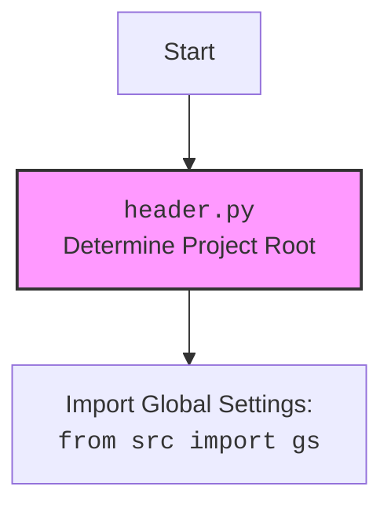

## Анализ кода `crawlee_python.py`

### 1. <алгоритм>

1.  **Инициализация `CrawleePython`**:
    *   При создании экземпляра `CrawleePython` задаются параметры: `max_requests` (максимальное количество запросов), `headless` (режим без графического интерфейса), `browser_type` (тип браузера, например, "firefox") и `options` (дополнительные опции для запуска браузера).
    *   Например: `crawler = CrawleePython(max_requests=5, headless=False, browser_type='firefox', options=["--headless"])`
    *   Создается экземпляр класса `CrawleePython` и сохраняет эти параметры.
2.  **Настройка `PlaywrightCrawler`**:
    *   Вызывается метод `setup_crawler`, который создает экземпляр `PlaywrightCrawler` из библиотеки `crawlee`, используя заданные параметры.
    *   Пример: `self.crawler = PlaywrightCrawler(max_requests_per_crawl=self.max_requests, headless=self.headless, browser_type=self.browser_type, launch_options={"args": self.options})`
3.  **Определение `request_handler`**:
    *   В `setup_crawler` создается `request_handler`, который обрабатывает каждую страницу, загруженную `PlaywrightCrawler`.
    *   Внутри `request_handler` происходит:
        *   Логирование URL запроса. `context.log.info(f'Processing {context.request.url} ...')`
        *   Поиск и добавление ссылок на странице в очередь на обработку. `await context.enqueue_links()`
        *   Извлечение данных со страницы (URL, заголовок, первые 100 символов контента).
        *   Пример:
            ```python
            data = {
                'url': context.request.url,
                'title': await context.page.title(),
                'content': (await context.page.content())[:100],
            }
            ```
        *   Сохранение извлеченных данных в датасет. `await context.push_data(data)`
4.  **Запуск краулера**:
    *   Вызывается метод `run_crawler`, который запускает `PlaywrightCrawler` с заданными начальными URL.
    *   Пример: `await self.crawler.run(urls)`
5.  **Экспорт данных**:
    *   Вызывается метод `export_data` для сохранения всех собранных данных в JSON-файл. Путь к файлу определяется с использованием `gs.path.tmp / 'results.json'`.
        *   Пример: `await self.export_data(str(Path(gs.path.tmp / 'results.json')))`
6.  **Получение данных**:
    *   Вызывается метод `get_data` для получения собранных данных в виде словаря.
    *   Пример: `data = await self.get_data()`
7.  **Главный метод `run`**:
    *   Метод `run` координирует весь процесс: вызывает `setup_crawler`, `run_crawler`, `export_data`, `get_data`.
    *   В случае ошибки, логирует ее.
8.  **Пример использования**:
    *   В блоке `if __name__ == '__main__':` создается `CrawleePython`, запускается `main`, который инициализирует `CrawleePython` и запускает его на примере URL.

### 2. <mermaid>

```mermaid
flowchart TD
    subgraph CrawleePython Class
        Start[Start CrawleePython Initialization] --> Init[Initialize: <br> max_requests, <br> headless, <br> browser_type, <br> options]
        Init --> Setup[Setup Crawler: <br> PlaywrightCrawler instance]
        Setup --> RequestHandler[Define Request Handler]
        RequestHandler --> EnqueueLinks[Enqueue Links <br> await context.enqueue_links()]
        EnqueueLinks --> ExtractData[Extract Data: <br> url, title, content]
        ExtractData --> PushData[Push Data to Dataset]
        PushData --> RunCrawler[Run Crawler: <br> await crawler.run(urls)]
        RunCrawler --> ExportData[Export Data to JSON]
        ExportData --> GetData[Get Data from Dataset]
        GetData --> End[End CrawleePython Run]
    end
    
     Start --> Init
    
    classDef classStyle fill:#f9f,stroke:#333,stroke-width:2px
    class CrawleePython classStyle
```



**Объяснение `mermaid` диаграмм:**

1.  **`CrawleePython Class`**:
    *   `Start` — начало инициализации класса `CrawleePython`.
    *   `Init` — инициализация атрибутов класса: `max_requests`, `headless`, `browser_type`, `options`.
    *   `Setup` — настройка экземпляра `PlaywrightCrawler` с использованием заданных параметров.
    *   `RequestHandler` — определение обработчика запросов, который обрабатывает каждый загруженный URL.
    *   `EnqueueLinks` — добавление найденных ссылок на странице в очередь на обработку.
    *   `ExtractData` — извлечение данных (URL, заголовок и контент) со страницы.
    *   `PushData` — сохранение извлеченных данных в датасет.
    *   `RunCrawler` — запуск `PlaywrightCrawler`.
    *   `ExportData` — экспорт данных в JSON файл.
    *   `GetData` — получение данных из датасета.
    *   `End` — конец выполнения метода `run`.
    *   Стрелки показывают поток выполнения программы между методами `CrawleePython`.

2.  **`header.py`**:
    *   `Start` — начало выполнения `header.py`.
    *   `Header` — определяет корень проекта.
    *   `import` — импортирует глобальные настройки проекта из `src.gs`.
    *   `classDef classStyle fill:#f9f,stroke:#333,stroke-width:2px` - устанавливает стиль для блоков.
    *  `class Header classStyle` - применяет стиль к блоку `Header`.
    *   Диаграмма `header.py` показывает как определяется корень проекта и импортируются глобальные настройки.

### 3. <объяснение>

#### Импорты:

*   `pathlib.Path`: Используется для работы с путями файлов и каталогов.
*   `typing.Optional, List, Dict, Any`: Используются для аннотации типов, для более читаемого кода и статической проверки.
*   `src.gs`: Импортирует глобальные настройки из пакета `src`, используется для доступа к настройкам проекта, например, пути временных файлов. Зависит от структуры проекта, в котором он используется.
*   `asyncio`: Используется для асинхронного программирования, необходимого для `PlaywrightCrawler`.
*   `crawlee.playwright_crawler.PlaywrightCrawler, PlaywrightCrawlingContext`: Импортирует классы `PlaywrightCrawler` и `PlaywrightCrawlingContext` из библиотеки `crawlee` для веб-краулинга.
*   `src.logger.logger`: Импортирует модуль для логирования, используется для записи информации о работе программы и ошибок.
*   `src.utils.jjson.j_loads_ns`: Импортирует функцию для работы с JSON, вероятно, с дополнительными настройками (например, для обработки имен полей).
    
#### Класс `CrawleePython`:

*   **Роль**: Представляет собой обертку над `PlaywrightCrawler`, предоставляя удобный интерфейс для настройки и запуска веб-краулера.
*   **Атрибуты**:
    *   `max_requests` (`int`): Максимальное количество запросов, которые краулер выполнит.
    *   `headless` (`bool`): Определяет, будет ли браузер работать в "headless" режиме (без графического интерфейса).
    *   `browser_type` (`str`): Тип браузера, который будет использоваться (`chromium`, `firefox`, `webkit`).
    *   `options` (`Optional[List[str]]`): Список дополнительных опций для запуска браузера.
    *   `crawler` (`Optional[PlaywrightCrawler]`): Экземпляр `PlaywrightCrawler`.
*   **Методы**:
    *   `__init__(self, max_requests, headless, browser_type, options)`: Конструктор класса, инициализирует атрибуты.
    *   `async setup_crawler(self)`: Создает и настраивает экземпляр `PlaywrightCrawler`. Определяет `request_handler`.
    *   `async run_crawler(self, urls)`: Запускает краулер с заданными URL.
    *   `async export_data(self, file_path)`: Экспортирует собранные данные в JSON файл.
    *    `async get_data(self)`: Возвращает собранные данные.
    *   `async run(self, urls)`: Главный метод, который координирует запуск, экспорт и получение данных.

#### Функции:

*   `request_handler(context: PlaywrightCrawlingContext)`:
    *   **Аргументы**: `context` типа `PlaywrightCrawlingContext` (контекст запроса).
    *   **Возвращаемое значение**: `None`.
    *   **Назначение**: Обрабатывает каждый запрос, логирует информацию, извлекает данные (URL, заголовок, контент) и добавляет ссылки в очередь.
    *   **Пример**:
        ```python
        async def request_handler(context: PlaywrightCrawlingContext) -> None:
            context.log.info(f'Processing {context.request.url} ...')
            await context.enqueue_links()
            data = {
                'url': context.request.url,
                'title': await context.page.title(),
                'content': (await context.page.content())[:100],
            }
            await context.push_data(data)
        ```
*   `main()`:
    *   **Аргументы**: Отсутствуют.
    *   **Возвращаемое значение**: Отсутствует.
    *   **Назначение**: Асинхронная функция, создает экземпляр `CrawleePython`, запускает его, используется как пример запуска краулера.
*   `__name__ == '__main__'`:
    *   **Назначение**:  Условная конструкция, которая гарантирует, что код внутри нее будет выполняться только при запуске скрипта как основной программы. В данном случае, вызывается функция `main()` для демонстрации работы краулера.

#### Переменные:

*   `self.max_requests` (`int`): Максимальное количество запросов.
*   `self.headless` (`bool`): Режим работы браузера (с графическим интерфейсом или без).
*   `self.browser_type` (`str`): Тип браузера.
*   `self.options` (`List[str]`): Список дополнительных опций.
*   `self.crawler` (`Optional[PlaywrightCrawler]`): Экземпляр `PlaywrightCrawler`.
*   `context` (`PlaywrightCrawlingContext`): Контекст текущего запроса в `request_handler`.
*   `data` (`Dict[str, Any]`): Словарь с извлеченными данными.
*   `file_path` (`str`): Путь к файлу для сохранения данных.
*   `urls` (`List[str]`): Список URL для обработки.

#### Потенциальные ошибки и области для улучшения:

*   **Обработка ошибок**: Обработка ошибок в методе `run` (в блоке `try...except`) может быть более специфичной. Вместо общего `Exception` можно ловить более конкретные исключения.
*   **Извлечение данных**: Извлечение первых 100 символов контента может быть недостаточным. Можно добавить опции для извлечения полного контента или определенного его фрагмента.
*   **Настройка `request_handler`**: `request_handler`  сейчас фиксирован, было бы полезно добавить возможность его настройки и расширения.
*   **Экспорт данных**: Экспорт данных в JSON может быть недостаточно гибким. Возможно, следует добавить другие форматы (например, CSV).
*   **Зависимости**:  Необходимо наличие библиотек `crawlee`, `playwright`, `asyncio`,  а так же корректной установки глобальных настроек `src.gs`, и пакетов `src.utils`, `src.logger`, что не показано в данном коде и может вызвать ошибки.
*   **Конфигурация**: Параметры краулера, такие как типы браузеров, можно было бы вынести в файл конфигурации для большей гибкости.

#### Взаимосвязи с другими частями проекта:

*   **`src.gs`**: Код использует `src.gs` для получения пути к временной директории для сохранения файла результатов. Это означает, что данный модуль зависит от структуры и конфигурации всего проекта.
*   **`src.logger.logger`**: Используется для логирования событий, что указывает на интеграцию с системой логирования проекта.
*   **`src.utils.jjson`**: Используется для работы с JSON, что может указывать на общий пакет утилит проекта.

**Цепочка взаимосвязей:**

1.  `crawlee_python.py` -> `src.gs` (получение глобальных настроек)
2.  `crawlee_python.py` -> `src.logger.logger` (логирование событий)
3.  `crawlee_python.py` -> `src.utils.jjson` (работа с JSON)
4.  `crawlee_python.py` -> `crawlee.playwright_crawler` (основная логика краулера)
5. `header.py` -> `src.gs` (определение корня проекта и загрузка глобальных настроек).