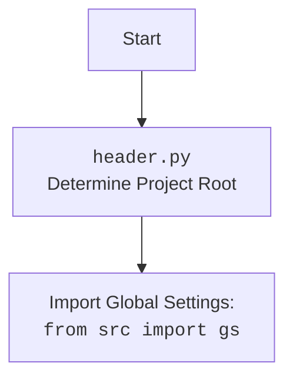

## ИНСТРУКЦИЯ:

Анализируй предоставленный код подробно и объясни его функциональность. Ответ должен включать три раздела:  

1. **<алгоритм>**: Опиши рабочий процесс в виде пошаговой блок-схемы, включая примеры для каждого логического блока, и проиллюстрируй поток данных между функциями, классами или методами.  
2. **<mermaid>**: Напиши код для диаграммы в формате `mermaid`, проанализируй и объясни все зависимости, 
    которые импортируются при создании диаграммы. 
    **ВАЖНО!** Убедитесь, что все имена переменных, используемые в диаграмме `mermaid`, 
    имеют осмысленные и описательные имена. Имена переменных вроде `A`, `B`, `C`, и т.д., не допускаются!  
    
    **Дополнительно**: Если в коде есть импорт `import header`, добавьте блок `mermaid` flowchart, объясняющий `header.py`:\
    ```mermaid
    flowchart TD
        Start --> Header[<code>header.py</code><br> Determine Project Root]
    
        Header --> import[Import Global Settings: <br><code>from src import gs</code>] 
    ```

3. **<объяснение>**: Предоставьте подробные объяснения:  
   - **Импорты**: Их назначение и взаимосвязь с другими пакетами `src.`.  
   - **Классы**: Их роль, атрибуты, методы и взаимодействие с другими компонентами проекта.  
   - **Функции**: Их аргументы, возвращаемые значения, назначение и примеры.  
   - **Переменные**: Их типы и использование.  
   - Выделите потенциальные ошибки или области для улучшения.  

Дополнительно, постройте цепочку взаимосвязей с другими частями проекта (если применимо).  

Это обеспечивает всесторонний и структурированный анализ кода.
## Формат ответа: `.md` (markdown)
**КОНЕЦ ИНСТРУКЦИИ**
## <алгоритм>

1.  **`set_project_root(marker_files=('__root__','.git'))`**:
    *   Начало: Функция вызывается, получая кортеж `marker_files` (по умолчанию `('__root__', '.git')`).
    *   Инициализация:  `current_path` устанавливается как абсолютный путь к директории текущего файла. `__root__` инициализируется как `current_path`.
        *   Пример: Если файл находится в `/home/user/project/src/webdriver/crawlee_python/header.py`, то `current_path` будет `/home/user/project/src/webdriver/crawlee_python`.
    *   Поиск родительских директорий: Функция перебирает директории от `current_path` вверх по дереву файловой системы.
        *   Пример: Проверяются `/home/user/project/src/webdriver/crawlee_python`, `/home/user/project/src/webdriver`, `/home/user/project/src`, `/home/user/project`, `/home/user`, `/home`, `/`.
    *   Проверка наличия маркеров: Для каждой директории проверяется, существует ли в ней какой-либо из файлов или директорий, указанных в `marker_files`.
        *   Пример: Для директории `/home/user/project` проверяется, есть ли в ней файл `__root__` или папка `.git`.
    *   Найдена корневая директория: Если маркер найден, то `__root__` устанавливается в найденную директорию и цикл прерывается.
        *   Пример: Если `.git` найден в `/home/user/project`, то `__root__` становится `/home/user/project`.
    *   Добавление в sys.path: Если `__root__` нет в `sys.path`, она добавляется в начало. Это гарантирует, что модули проекта могут быть импортированы.
    *   Возврат значения: Функция возвращает путь к корневой директории (`__root__`).
2. **`__root__ = set_project_root()`**:
    *   Вызов `set_project_root()`: Функция вызывается без параметров, используется значение по умолчанию `('__root__', '.git')`.
    *   Сохранение результата: Результат работы функции, то есть путь к корневой директории, сохраняется в переменной `__root__`.
3. **Импорт `from src import gs`**:
    *   Импорт глобальных настроек: Импортируются глобальные настройки из модуля `gs` в пакете `src`, подразумевая, что `__root__` добавлен в `sys.path`, так что `src` находится в путях импорта.
4. **Чтение `settings.json`**:
    *   Попытка открытия файла: Пытается открыть файл `settings.json`, расположенный в `src` директории относительно корня проекта, для чтения.
        *   Пример: `/home/user/project/src/settings.json`
    *   Чтение и загрузка JSON: Если файл успешно открыт, его содержимое читается и интерпретируется как JSON, результат сохраняется в `settings` (тип `dict`).
    *   Обработка ошибок: Если файл не найден (`FileNotFoundError`) или JSON невалиден (`json.JSONDecodeError`), исключение перехватывается, `settings` остается `None`.
5.  **Чтение `README.MD`**:
    *   Попытка открытия файла: Пытается открыть файл `README.MD`, расположенный в `src` директории относительно корня проекта, для чтения.
    *   Чтение содержимого: Если файл успешно открыт, его содержимое читается и сохраняется в `doc_str` (тип `str`).
    *   Обработка ошибок: Если файл не найден или возникает ошибка при чтении, исключение перехватывается, `doc_str` остается `None`.
6. **Инициализация глобальных переменных**:
    *   `__project_name__`: Если `settings` существует, то извлекается из словаря по ключу `"project_name"`, иначе устанавливается значение `'hypotez'`.
    *   `__version__`: Если `settings` существует, то извлекается из словаря по ключу `"version"`, иначе устанавливается значение `''`.
    *   `__doc__`:  Если `doc_str` не `None`, то ему присваивается его значение, иначе `''`.
    *   `__details__`: Инициализируется пустой строкой `''`.
    *   `__author__`: Если `settings` существует, то извлекается из словаря по ключу `"author"`, иначе устанавливается значение `''`.
    *   `__copyright__`: Если `settings` существует, то извлекается из словаря по ключу `"copyrihgnt"`, иначе устанавливается значение `''`.
    *   `__cofee__`: Если `settings` существует, то извлекается из словаря по ключу `"cofee"`, иначе устанавливается значение `'Treat the developer to a cup of coffee for boosting enthusiasm in development: https://boosty.to/hypo69'`.

## <mermaid>
```mermaid
flowchart TD
    Start --> FindProjectRoot[<code>set_project_root()</code><br>Find Project Root Directory]
    FindProjectRoot --> CheckParentDir[Check current and parent directories for marker files]
    CheckParentDir -- Marker Found --> SetRoot[Set Root Directory]
    CheckParentDir -- Marker Not Found --> NextParentDir[Check next parent directory]
    NextParentDir --> CheckParentDir
    SetRoot --> AddRootToPath[Add root to <code>sys.path</code>]
    AddRootToPath --> ReturnRoot[Return Root Path]
    ReturnRoot -->  SetGlobalRoot[<code>__root__ = set_project_root()</code> <br> Set Global Project Root]
    SetGlobalRoot --> ImportGlobalSettings[Import Global Settings: <br><code>from src import gs</code>]
    ImportGlobalSettings --> LoadSettings[Load settings from <br><code>settings.json</code>]
    LoadSettings --> LoadReadme[Load Documentation from <br><code>README.MD</code>]
    LoadReadme --> SetGlobalVars[Set global project variables from settings]
    SetGlobalVars --> End

    style FindProjectRoot fill:#f9f,stroke:#333,stroke-width:2px
    style SetGlobalRoot fill:#ccf,stroke:#333,stroke-width:2px
    style LoadSettings fill:#cfc,stroke:#333,stroke-width:2px
    style LoadReadme fill:#cfc,stroke:#333,stroke-width:2px
```



## <объяснение>

**Импорты:**

*   `sys`: Модуль `sys` используется для взаимодействия с интерпретатором Python. В данном коде он используется для добавления пути к корневой директории проекта в `sys.path`, что позволяет Python корректно находить модули и пакеты проекта.
*   `json`: Модуль `json` используется для работы с данными в формате JSON. Он применяется для загрузки настроек проекта из файла `settings.json`.
*   `packaging.version.Version`: Импортируется класс `Version` для работы с версиями. В данном коде он не используется, но может быть задействован в будущем для сравнения и проверки версий, что позволяет делать это корректно и в соответствии с нормами семантического версионирования.
*   `pathlib.Path`: Класс `Path` из модуля `pathlib` обеспечивает объектно-ориентированный способ работы с путями в файловой системе, делая код более читаемым и удобным.

    Импорт `from src import gs` указывает на то, что код предполагает наличие пакета `src` в структуре проекта, где `gs` является модулем, содержащим глобальные настройки, например `gs.path.root`. Это свидетельствует о структуре проекта, в котором логика разделена на модули.

**Функции:**

*   **`set_project_root(marker_files=('__root__', '.git')) -> Path`**:
    *   **Аргументы**:
        *   `marker_files`: Кортеж строк, содержащий имена файлов или директорий, которые используются для определения корневой директории проекта (по умолчанию `('__root__', '.git')`).
    *   **Возвращаемое значение**:
        *   `Path`: Объект `Path`, представляющий путь к корневой директории проекта.
    *   **Назначение**:
        *   Функция определяет корневую директорию проекта, начиная с директории, где находится текущий скрипт, и ищет вверх по дереву каталогов, пока не найдет один из файлов или директорий, указанных в `marker_files`. Это позволяет запускать скрипты из разных мест и всегда корректно определять корень проекта.
    *   **Пример**: Если скрипт находится в `/home/user/project/src/webdriver/crawlee_python/`, а маркер `.git` находится в `/home/user/project/`, то функция вернет `/home/user/project/`.
        *   Если маркер не найден, то вернет путь где запущен скрипт.
*   **Цепочка взаимосвязей:** `set_project_root()` используется для определения `__root__`, который затем используется для импорта `src.gs` и загрузки настроек из файлов, а также для формирования остальных глобальных переменных.

**Переменные:**

*   `__root__`: `Path`, путь к корневой директории проекта. Это глобальная переменная, которая используется для определения пути к другим файлам в проекте.
*   `settings`: `dict` или `None`, словарь, содержащий настройки проекта, загруженные из файла `settings.json`. Если файл не найден или возникла ошибка при чтении JSON, то переменная принимает значение `None`.
*   `doc_str`: `str` или `None`, строка, содержащая контент из файла `README.MD`.  Если файл не найден или возникла ошибка при чтении, то переменная принимает значение `None`.
*   `__project_name__`: `str`, название проекта, по умолчанию `'hypotez'` или значение из `settings.json`.
*   `__version__`: `str`, версия проекта, по умолчанию `''` или значение из `settings.json`.
*   `__doc__`: `str`,  текст из файла `README.MD` или `''`
*   `__details__`: `str`, строка содержащая детали проекта. Установлена по умолчанию в `''`, предназначена для будущего использования.
*    `__author__`: `str`, автор проекта, по умолчанию `''` или значение из `settings.json`.
*    `__copyright__`: `str`, информация о копирайте, по умолчанию `''` или значение из `settings.json`.
*    `__cofee__`: `str`, сообщение о поддержке разработчика, по умолчанию сообщение со ссылкой boosty.to или значение из `settings.json`.
    
**Потенциальные ошибки и области для улучшения:**

*   **Отсутствие обработки ошибок:** При чтении файлов `settings.json` и `README.MD` ошибки `FileNotFoundError` и `json.JSONDecodeError` перехватываются, но не обрабатываются детально,  просто присваивается значение `None`, что может усложнить диагностику проблем. Необходимо добавить логирование ошибок.
*   **Зависимость от `settings.json`:** Если файл `settings.json` не существует или не содержит необходимые ключи, проект может использовать значения по умолчанию. Необходимо добавить проверку существования ключей и, возможно,  выводить предупреждение в консоль.
*   **Использование глобальных переменных:**  Широкое использование глобальных переменных (`__project_name__`, `__version__`, и т.д.) может затруднить поддержку и тестирование кода. Рекомендуется использовать более структурированный подход, например,  создать класс настроек и хранить значения там, или рассмотреть использование `dataclasses`.
*   **Отсутствие документации:** Код имеет docstring, но не полностью описывает поведение.  Необходимо добавить больше информации в docstring, описывая переменные.
*  **Неправильная проверка `__root__`:**  Проверка `if __root__ not in sys.path:`  может некорректно работать, если `sys.path` содержит относительные пути, а `__root__` - абсолютный.
*   **Сообщение о кофе:**  Можно вынести сообщение `Treat the developer to a cup of coffee for boosting enthusiasm in development: https://boosty.to/hypo69` в отдельную константу, чтобы не дублировать код.

**Цепочка взаимосвязей с другими частями проекта:**

1.  `header.py` устанавливает корневую директорию проекта и добавляет ее в `sys.path`, что позволяет другим модулям проекта импортировать пакет `src` и использовать `gs` (глобальные настройки).
2.  Использует `gs.path.root` для поиска `settings.json` и `README.MD`, тем самым подтягивает глобальные пути из gs.
3.  Результаты чтения `settings.json` и `README.MD`, а так же  найденный `__root__`  используются для установки глобальных переменных проекта, таких как название, версия, автор, информация о копирайте и т.д., которые могут использоваться в других частях проекта, например, для отображения в консоли или при создании документации.

Таким образом, `header.py` является важной частью инфраструктуры проекта, обеспечивающей корректную работу с путями, настройками и информацией о проекте.