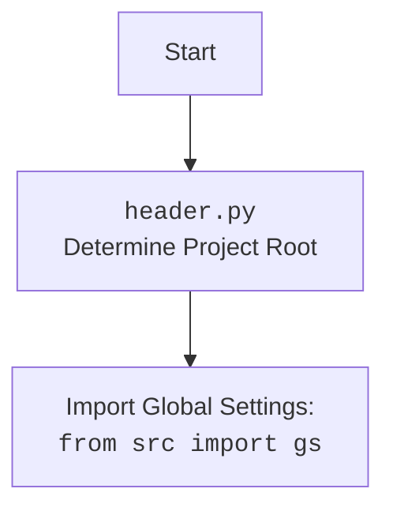

## АНАЛИЗ КОДА `src/webdriver/driver.py`

### 1. <алгоритм>

**Блок-схема работы класса `Driver`:**

1. **Инициализация ( `__init__` ):**
   - Принимает класс веб-драйвера (например, `Chrome`, `Firefox`) и его аргументы.
   - Проверяет, что переданный класс имеет метод `get`.
   - Создает экземпляр веб-драйвера (`self.driver`).
   - Пример: `driver = Driver(Chrome, executable_path='/path/to/chromedriver')`

2. **Инициализация подкласса (`__init_subclass__`):**
   - Вызывается автоматически при создании подкласса `Driver`.
   - Требует обязательного указания аргумента `browser_name`.
   - Сохраняет имя браузера в атрибуте класса.
   - Пример: `class MyDriver(Driver, browser_name='Chrome')`

3. **Доступ к атрибутам драйвера (`__getattr__`):**
   - Позволяет обращаться к атрибутам и методам внутреннего драйвера `self.driver` напрямую через экземпляр `Driver`.
   - Пример: `driver.current_url` (обращается к `self.driver.current_url`)

4. **Прокрутка страницы (`scroll`):**
    - Принимает параметры прокрутки (количество, размер, направление, задержка).
    - Вызывает внутреннюю функцию `carousel` для выполнения прокрутки в заданном направлении.
    - Ловит исключения и логирует ошибки.
   -  Пример: `driver.scroll(scrolls=2, direction='down', frame_size=300, delay=0.5)`

5. **Определение локали (`locale`):**
    - Пытается получить код языка из мета-тега `Content-Language`.
    - Если не удается, вызывает метод `get_page_lang()` для получения языка из JavaScript.
    - Возвращает код языка или `None`, если язык не найден.
   -  Пример: `lang_code = driver.locale`

6. **Переход по URL (`get_url`):**
   - Сохраняет текущий URL.
   - Выполняет переход по заданному URL через `self.driver.get(url)`.
   - Ожидает загрузки страницы (`self.ready_state != 'complete'`).
   - Сохраняет куки в локальный файл.
   - Ловит исключения, связанные с веб-драйвером и ошибками URL.
   - Возвращает `True` при успехе, `False` при ошибке.
   - Пример: `driver.get_url('https://example.com')`

7.  **Открытие нового окна/вкладки (`window_open`):**
   -   Открывает новую вкладку через `self.execute_script('window.open();')`.
   -   Переключается на новую вкладку.
   -   Если передан URL, открывает его в новой вкладке.
    -  Пример: `driver.window_open('https://example.com/new_page')`

8.  **Ожидание (`wait`):**
   -   Просто приостанавливает выполнение на заданное время через `time.sleep(delay)`.
   -   Пример: `driver.wait(1.5)`

9. **Сохранение куки (`_save_cookies_localy`):**
   - Сохраняет текущие куки браузера в файл (имя файла берется из глобальных настроек `gs`).
    - Использует `pickle` для сериализации куки.
   - Ловит исключения и логирует ошибки.
   - Пример: `driver._save_cookies_localy()`

10. **Извлечение HTML (`fetch_html`):**
    - Принимает URL (локальный файл или HTTP/HTTPS).
    - Если URL начинается с `file://`, считывает HTML из файла.
    - Если URL начинается с `http://` или `https://`, переходит по URL и получает `page_source`.
    - Возвращает `True` при успехе, `False` при ошибке.
   -  Пример: `driver.fetch_html('file://path/to/file.html')` или `driver.fetch_html('https://example.com')`

### 2. <mermaid>

```mermaid
flowchart TD
    subgraph Driver
        A[<code>__init__(webdriver_cls, *args, **kwargs)</code><br>Initialize Driver]
        B[<code>__init_subclass__(cls, *, browser_name=None, **kwargs)</code><br>Initialize Subclass]
        C[<code>__getattr__(item)</code><br>Access Driver Attributes]
        D[<code>scroll(scrolls=1, frame_size=600, direction='both', delay=.3)</code><br>Scroll Page]
        E[<code>locale()</code><br>Get Page Locale]
        F[<code>get_url(url)</code><br>Navigate to URL]
        G[<code>window_open(url)</code><br>Open New Tab]
        H[<code>wait(delay=.3)</code><br>Wait]
        I[<code>_save_cookies_localy()</code><br>Save Cookies]
        J[<code>fetch_html(url)</code><br>Fetch HTML Content]
    end

    A --> B
    A --> C
    A --> D
    A --> E
    A --> F
    A --> G
    A --> H
    A --> I
    A --> J
    
     subgraph carousel
        carousel_start[<code>carousel(direction, scrolls, frame_size, delay)</code> <br> Scroll Carousel]
        carousel_start -->  execute_script_scroll[<code>execute_script("window.scrollBy(0,{direction}{frame_size})")</code><br> Execute JavaScript Scroll]
        execute_script_scroll --> wait[<code>wait(delay)</code><br>Delay]
        wait --> carousel_end[return True or False]
    end
    D --> carousel_start

    F --> save_cookies[<code>_save_cookies_localy()</code> <br>Save Cookies]
    
    E --> meta_selector[find_element(By.CSS_SELECTOR, "meta[http-equiv='Content-Language']") <br> Find Meta Tag]
    meta_selector --> get_attribute_content[meta_language.get_attribute('content') <br>Get Content]
    E --> get_lang_js[<code>get_page_lang()</code> <br>  Get page language from Javascript]
   
    J --> check_url_file[Check if url startswith  file:// ]
    check_url_file -- Yes --> file_path_exist[ Check file_path.exists() ]
    file_path_exist -- Yes --> open_read_file[open file with utf-8]
    open_read_file --> file_content_return[return True or False]
    
    check_url_file -- No --> check_url_http[Check if url startswith http(s):// ]
    check_url_http -- Yes --> F
    
    
    F --> switch_to_new_window[Switch to new window if window_open]
```

**Объяснение зависимостей в `mermaid`:**

-   **`Driver`**: Обозначает класс `Driver` и его методы.
-   **`__init__`**: Конструктор класса, устанавливает начальное состояние.
-   **`__init_subclass__`**: Метод для настройки подклассов `Driver`.
-   **`__getattr__`**: Метод для делегирования атрибутов к внутреннему драйверу.
-   **`scroll`**: Метод для прокрутки страницы, вызывает внутренний метод `carousel` для прокрутки в определенном направлении.
-   **`locale`**: Метод для определения языка страницы.
-  **`get_url`**: Метод для перехода по URL, вызывает `_save_cookies_localy` для сохранения cookie.
-   **`window_open`**: Метод для открытия новой вкладки.
-   **`wait`**: Метод для добавления задержки.
-   **`_save_cookies_localy`**: Метод для сохранения куки.
-   **`fetch_html`**: Метод для извлечения HTML контента из файла или веб-страницы.
-   **`carousel`**: Вложенный метод для прокрутки экрана.
-   **`execute_script`**: Используется для выполнения JavaScript для прокрутки.
-   **`find_element`**: Используется для поиска мета-тега языка.
-  **`get_attribute_content`**: Используется для получения значения атрибута `content` тега.
-  **`get_page_lang`**: Используется для определения языка через JavaScript.
-  **`check_url_file`**: Проверяет является ли URL локальным файлом.
-  **`file_path_exist`**: Проверяет существование локального файла.
-  **`open_read_file`**: Открывает и считывает локальный файл.
-  **`check_url_http`**: Проверяет является ли URL http(s).
-  **`save_cookies`**: Метод для сохранения куков.
- **`switch_to_new_window`**: Метод для переключения на новую вкладку/окно.



**Объяснение `header.py`:**

Диаграмма показывает, что `header.py` отвечает за определение корневой директории проекта. Этот процесс, в свою очередь, позволяет импортировать глобальные настройки проекта из `src.gs`.

### 3. <объяснение>

#### Импорты:

-   `copy`: Используется для создания копий объектов, например, при сохранении предыдущего URL.
-   `pickle`: Используется для сериализации и десериализации объектов Python (например, куки) для сохранения в файл.
-   `time`: Используется для добавления задержек (`time.sleep`).
-   `re`: Используется для работы с регулярными выражениями (например, для поиска локальных путей).
-   `pathlib.Path`: Используется для работы с путями файлов.
-   `typing.Optional`: Используется для аннотации типов, указывая, что значение может быть `None`.
-   `selenium.webdriver.common.by.By`: Используется для определения стратегии поиска элементов на странице (например, по CSS-селектору).
-   `selenium.common.exceptions`: Набор исключений, которые могут возникнуть при работе с Selenium.
-   `header`: Используется для определения пути к корневой директории проекта (импортируется как `header`).
-   `src.gs`: Импортирует глобальные настройки проекта.
-   `src.logger.logger.logger`: Используется для логирования.
-   `src.logger.exceptions`: Импортирует пользовательские исключения.

#### Классы:

-   **`Driver`**:
    -   **Роль**: Предоставляет унифицированный интерфейс для работы с Selenium WebDriver.
    -   **Атрибуты**:
        -   `driver`: Экземпляр Selenium WebDriver.
        -   `browser_name`: Имя браузера (устанавливается при наследовании).
        -   `previous_url`: Предыдущий URL.
        -   `html_content`: HTML содержимое страницы.
    -   **Методы**:
        -   `__init__`: Инициализирует драйвер.
        -   `__init_subclass__`: Настраивает подклассы `Driver`.
        -   `__getattr__`: Позволяет обращаться к методам драйвера напрямую.
        -   `scroll`: Прокручивает страницу.
        -   `locale`: Определяет язык страницы.
        -   `get_url`: Переходит по URL и сохраняет куки.
        -   `window_open`: Открывает новую вкладку.
        -   `wait`: Добавляет задержку.
        -   `_save_cookies_localy`: Сохраняет куки в файл.
        -   `fetch_html`: Извлекает HTML контент.
-   **Вложенный класс  `carousel`**:
    -   **Роль**:  Выполняет прокрутку экрана.
    -   **Методы**:
         -  `carousel`: Принимает направление, количество прокруток, размер и задержку для прокрутки, выполняет JS скрипт `window.scrollBy`.
#### Функции:
-  **`__init__(self, webdriver_cls, *args, **kwargs)`**:
     -   **Аргументы**:
         -   `webdriver_cls`: Класс веб-драйвера (например, `Chrome`).
         -   `*args`: Позиционные аргументы для драйвера.
         -   `**kwargs`: Ключевые аргументы для драйвера.
    -   **Возвращает**: Ничего
    -  **Назначение**:  Инициализирует экземпляр класса Driver, создает экземпляр веб-драйвера.
-   **`__init_subclass__(cls, *, browser_name=None, **kwargs)`**:
    -   **Аргументы**:
        -   `cls`: Класс, для которого вызывается метод.
        -   `browser_name`: Имя браузера.
        -   `kwargs`: Дополнительные аргументы.
    -   **Возвращает**: Ничего
    -   **Назначение**: Автоматически вызывается при создании подкласса `Driver`, устанавливает имя браузера.
-    **`__getattr__(self, item)`**:
    -   **Аргументы**:
        -   `item`: Имя атрибута.
    -   **Возвращает**: Атрибут внутреннего драйвера.
    -   **Назначение**: Прокси для доступа к атрибутам драйвера.
-    **`scroll(self, scrolls: int = 1, frame_size: int = 600, direction: str = 'both', delay: float = .3)`**:
   -   **Аргументы**:
        -   `scrolls`: Количество прокруток.
        -   `frame_size`: Размер прокрутки в пикселях.
        -   `direction`: Направление прокрутки (`both`, `down`, `up`).
        -   `delay`: Задержка между прокрутками.
    -   **Возвращает**: `True` при успехе, `False` при неудаче.
    -   **Назначение**: Прокручивает страницу.
-    **`locale(self) -> Optional[str]`**:
    -   **Аргументы**: Нет.
    -   **Возвращает**: Код языка или `None`.
    -   **Назначение**: Определяет язык страницы.
-   **`get_url(self, url: str) -> bool`**:
    -   **Аргументы**:
        -   `url`: URL для перехода.
    -   **Возвращает**: `True` при успехе, `False` при неудаче.
    -   **Назначение**: Переходит по указанному URL и сохраняет куки.
-   **`window_open(self, url: Optional[str] = None) -> None`**:
    -   **Аргументы**:
        -   `url`: URL для открытия в новой вкладке.
    -   **Возвращает**: Ничего.
    -   **Назначение**: Открывает новую вкладку или окно.
-   **`wait(self, delay: float = .3) -> None`**:
    -   **Аргументы**:
        -   `delay`: Задержка в секундах.
    -   **Возвращает**: Ничего.
    -   **Назначение**: Добавляет задержку.
-   **`_save_cookies_localy(self) -> None`**:
    -   **Аргументы**: Нет.
    -   **Возвращает**: Ничего.
    -   **Назначение**: Сохраняет куки в файл.
-    **`fetch_html(self, url: str) -> Optional[bool]`**:
    -   **Аргументы**:
        -   `url`: URL файла или веб-страницы.
    -   **Возвращает**: `True` при успехе, `False` при неудаче, `None` в случае ошибки.
    -   **Назначение**: Извлекает HTML контент.
-   **`carousel(direction: str = '', scrolls: int = 1, frame_size: int = 600, delay: float = .3) -> bool`**:
    -   **Аргументы**:
         -   `direction`: Направление прокрутки (`down`, `up`).
         -   `scrolls`: Количество прокруток.
         -    `frame_size`: Размер прокрутки.
         -   `delay`: Задержка между прокрутками.
    -   **Возвращает**: `True` при успехе, `False` при неудаче.
    -   **Назначение**:  Локальный метод для прокрутки экрана.

#### Переменные:

-   `self.driver`: Экземпляр веб-драйвера.
-   `self.browser_name`: Имя браузера.
-   `self.previous_url`: Предыдущий URL.
-   `self.html_content`: HTML-содержимое страницы.
-   `gs.cookies_filepath`: Путь к файлу для сохранения куки (из глобальных настроек).
-   `url` : Строка, представляющая URL.
-   `cleaned_url`:  Строка, представляющая отчищенный url.
-   `match`: Строка, представляющая регулярное выражение для поиска пути.
-   `file_path`: Переменная типа `Path`, представляющая путь к файлу.
-   `ex`: Исключение.
-    `webdriver_cls`:  Класс веб-драйвера.
-   `item`: Строка, представляющая имя атрибута.
-   `direction`: Направление прокрутки.
-    `scrolls`: Количество прокруток.
-    `frame_size`: Размер прокрутки.
-   `delay`: Задержка.

#### Потенциальные ошибки и области для улучшения:

1.  **Обработка ошибок:**  В некоторых местах используются общие `Exception`, лучше использовать более специфические типы исключений. Например, обработка исключения при сохранении куки.
2.  **Сохранение куки**:   Метод `_save_cookies_localy`  возвращает `True` для отладки и не сохраняет куки,  это нужно исправить в релизной версии.
3.  **Ожидание загрузки страницы:**  Ожидание `self.ready_state != 'complete'` в `get_url` может быть недостаточно надежным, лучше использовать `WebDriverWait` с явными ожиданиями.
4.  **Улучшить обработку исключений в методе `fetch_html`**: Можно использовать  метод `try-except-else-finally` для более точного отслеживания ошибок и закрытия файлов.
5.  **Безопасность пути**: В методе `fetch_html`, не помешает добавить валидацию пути и проверить на наличие `..` для избежания чтения файла вне целевой директории.
6.  **Логирование**: Добавить больше контекста в логи, например, какой именно драйвер используется и т.д.
7.  **`__getattr__`**: Стоит добавить проверку на наличие атрибута у внутреннего драйвера, чтобы не возникали непредвиденные ошибки.
8. **`__init__`**: Использовать `isinstance` для проверки типа `webdriver_cls`.

#### Взаимосвязи с другими частями проекта:

-   **`src.gs`**:  Используется для получения глобальных настроек проекта, таких как путь к файлу для куки.
-   **`src.logger`**:  Используется для логирования ошибок и другой информации, что помогает отслеживать работу драйвера.
-   **`header`**:  Используется для определения пути к корневой директории проекта, что обеспечивает правильную работу импортов.

Этот класс `Driver` является фундаментальным компонентом для автоматизации браузера, предоставляя абстрактный слой над Selenium WebDriver и упрощая взаимодействие с веб-страницами.