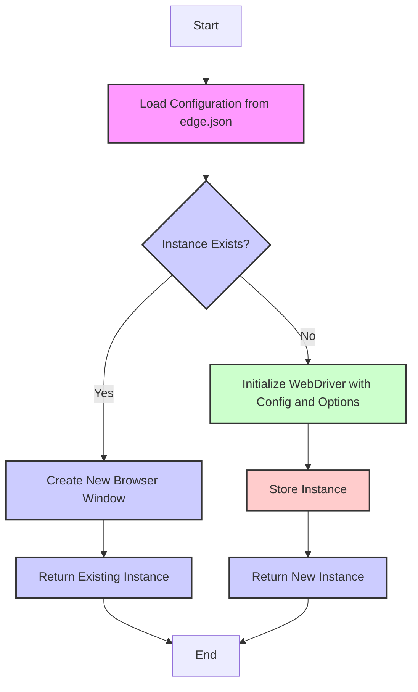
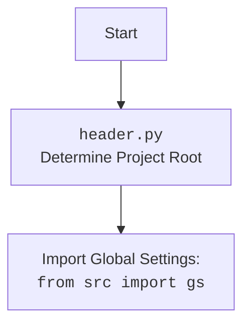

## Анализ кода Edge WebDriver Module

### 1. <алгоритм>
1.  **Загрузка конфигурации:**
    *   Читает файл `edge.json` и загружает настройки, такие как параметры командной строки, пути к профилям, путь к исполняемому файлу драйвера и заголовки.

    *   Пример `edge.json`:
        ```json
        {
          "options": ["--disable-dev-shm-usage", "--remote-debugging-port=0"],
          "profiles": {"os": "%LOCALAPPDATA%\\\\Microsoft\\\\Edge\\\\User Data\\\\Default", "internal": "webdriver\\\\edge\\\\profiles\\\\default"},
          "executable_path": {"default": "webdrivers\\\\edge\\\\123.0.2420.97\\\\msedgedriver.exe"},
          "headers": {"User-Agent": "...", "Accept": "...", "Accept-Charset": "...", "Accept-Encoding": "...", "Accept-Language": "...", "Connection": "keep-alive"}
        }
        ```

2.  **Инициализация WebDriver:**
    *   При первом создании экземпляра класса `Edge` создается экземпляр `webdriver.Edge`, используя загруженные параметры из `edge.json`, передавая custom `user-agent`, и custom `options`, если они предоставлены.

    *   Пример:
        ```python
        browser = Edge(user_agent="Custom User Agent", options=["--headless"])
        ```

3.  **Singleton Pattern:**
    *   Если экземпляр класса `Edge` уже существует, то при создании нового экземпляра, возвращается уже существующий экземпляр, но создается новое окно браузера.

    *   Пример:
        ```python
        browser1 = Edge() # Создает первый экземпляр
        browser2 = Edge() # Возвращает первый экземпляр, открывая новое окно
        assert browser1 is browser2 # Проверка что это один и тот же экземпляр
        ```

4.  **Логирование:**
    *   Использует `src.logger` для логирования ошибок и другой информации в процессе инициализации и настройки.

    *   Пример лога:
        ```
        "Error initializing Edge WebDriver: [error details]"
        ```

5.  **Использование WebDriver:**
    *   Предоставляет методы для работы с браузером, например, `get()`, `quit()`.

    *   Пример:
        ```python
        browser.get("https://example.com") # Открывает веб-страницу
        browser.quit() # Закрывает браузер
        ```

### 2. <mermaid>



### 3. <объяснение>

**Импорты:**

*   `src.logger`: Модуль для логирования событий. Позволяет вести записи о состоянии программы, ошибках и других событиях для дальнейшего анализа. Важен для отладки и мониторинга работы `Edge WebDriver`.

    *   Используется для логирования ошибок инициализации, проблем с конфигурацией, а также для отслеживания процесса работы драйвера.
*   `selenium`: Это основной пакет для автоматизации браузеров. Предоставляет классы и методы для взаимодействия с браузерами, такие как `webdriver.Edge`, который используется для управления браузером Microsoft Edge.
*   `json`: Модуль для работы с JSON файлами, используется для чтения конфигурации из файла `edge.json`.
*   `os`: Модуль для работы с операционной системой, используется для доступа к переменным окружения и выполнения различных системных операций.
*   `fake_useragent`: Пакет для генерации случайных `user-agent` строк. Позволяет имитировать использование браузеров, чтобы избежать обнаружения ботов.
*    `src.header`: Модуль для определения корневой директории проекта и импорта общих настроек. Обеспечивает доступ к глобальным настройкам и ресурсам, необходимым для работы.

**Классы:**

*   `Edge`:
    *   **Роль**: Основной класс для управления Edge WebDriver. Использует Singleton pattern, что гарантирует создание только одного экземпляра драйвера и переиспользование его, открывая новое окно, для каждого нового запроса на экземпляр.
    *   **Атрибуты**:
        *   `_instance`: Приватный статический атрибут, хранящий единственный экземпляр класса `Edge`.
        *   `driver`: Экземпляр класса `webdriver.Edge`.
        *   `log`: Экземпляр логгера из `src.logger`.
        *   `config`: Содержит загруженные конфигурации из `edge.json`.
        *   `custom_user_agent`: Пользовательский `user-agent`, если задан.
    *   **Методы**:
        *   `__new__(cls, user_agent=None, options=None)`: Переопределенный метод для реализации Singleton pattern. Обеспечивает создание только одного экземпляра класса `Edge` и переиспользования его при новых запросах на экземпляр, открывая новое окно.
        *   `__init__(self, user_agent=None, options=None)`: Инициализация экземпляра класса `Edge`. Загружает конфигурацию, настраивает WebDriver и задает пользовательский `user-agent`, и `options` если они заданы.
        *    `get(self, url)`: Метод для открытия веб-страницы по заданному `url`.
        *    `quit(self)`: Метод для закрытия браузера.
        *    `get_driver(self)`: Метод для получения экземпляра `webdriver.Edge` для прямого обращения.

**Функции:**

*   Функции как таковой нет, но есть методы класса `Edge`, которые принимают параметры и могут возвращать значения или изменять состояние объекта. Например, метод `get(self, url)` принимает `url` и открывает страницу в браузере.

**Переменные:**

*   `_instance`: Статическая переменная для хранения экземпляра Singleton.
*   `config`: Словарь, содержащий конфигурации из `edge.json`.
*   `options`: Список опций для Edge WebDriver.
*    `user_agent`: `user_agent` для браузера.
*   `log`: Объект логгера для записи сообщений.
*   `driver`: Экземпляр `webdriver.Edge`, управляющий браузером.
*   `url`: Строка, представляющая URL, который необходимо открыть.

**Потенциальные ошибки и улучшения:**

*   **Обработка ошибок:**
    *   Текущая реализация содержит базовую обработку ошибок в процессе инициализации. Можно добавить более детальную обработку ошибок, включая обработку исключений при чтении файла конфигурации, запуске WebDriver и использовании методов WebDriver.
*   **Конфигурация:**
    *   Использование `json.load` для чтения конфигурации может привести к ошибкам, если файл `edge.json` не существует или имеет неверный формат. Необходимо добавить проверку на существование файла и корректность его содержимого.
*   **Пути к драйверу:**
    *   Пути к исполняемому файлу драйвера определены статически в `edge.json`. Может потребоваться динамическое определение пути для разных ОС и версий.
*   **Версионирование:**
    *   Отсутствует проверка совместимости версии драйвера и браузера. Это может привести к ошибкам. Желательно добавить проверку и загрузку соответствующего драйвера в зависимости от версии браузера.
*   **Управление окнами:**
    *   Текущая реализация открывает новое окно при каждом новом запросе экземпляра, что может быть нежелательно в некоторых сценариях. Нужно добавить возможность управлять окнами: закрытие, переключение и тд.

**Взаимосвязи с другими частями проекта:**

*   **`src.logger`**: Используется для логирования. Позволяет записывать сообщения об ошибках и событиях, что облегчает отладку и мониторинг.
*   **`src.header`**: Используется для определения корневой директории проекта и импорта общих настроек. Обеспечивает доступ к глобальным настройкам и ресурсам, необходимым для работы.

В целом, данный модуль обеспечивает хорошую основу для работы с Edge WebDriver, но требует дополнительных улучшений для обеспечения устойчивости, гибкости и поддержки различных сценариев использования.