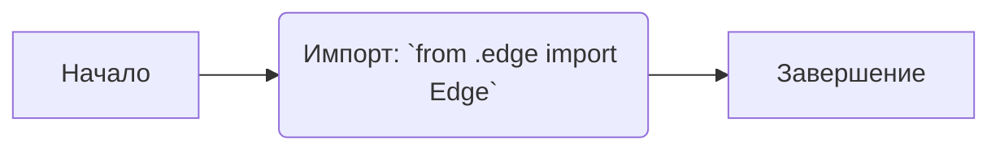
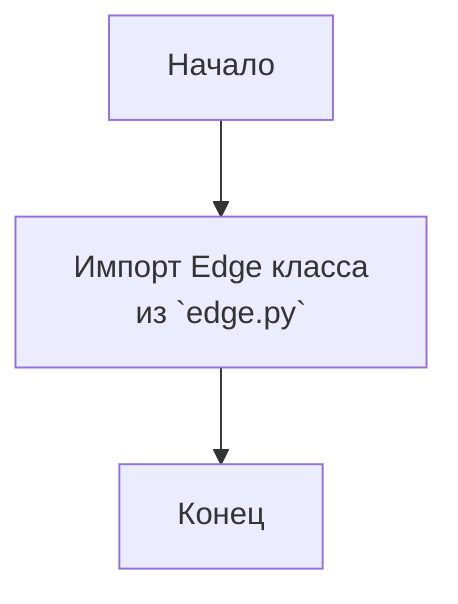

## АНАЛИЗ КОДА: `src/webdriver/edge/__init__.py`

### 1. <алгоритм>

**Блок-схема:**

**Пример:**

1.  **Начало:** Программа начинает выполнение модуля `src/webdriver/edge/__init__.py`.
2.  **Импорт:** Выполняется импорт класса `Edge` из модуля `src/webdriver/edge/edge.py`. Это позволяет использовать класс `Edge` в других частях проекта, где импортируется `src.webdriver.edge`.
3.  **Завершение:** Модуль завершает свою работу.

### 2. <mermaid>

**Анализ `mermaid`:**

*   `Start` - Начало выполнения модуля.
*   `ImportEdge` -  Импорт класса `Edge` из модуля `edge.py`, находящегося в том же каталоге.
*    `End` - Завершение выполнения модуля.
    
### 3. <объяснение>

**Импорты:**

*   `from .edge import Edge`: Этот импорт  загружает класс `Edge` из модуля `edge.py`, расположенного в той же директории. Этот механизм называется относительным импортом (relative import). Это позволяет `__init__.py` сделать класс `Edge` доступным при импорте пакета `src.webdriver.edge`.

**Классы:**

*   В данном файле нет объявленных классов, но есть импорт класса `Edge` из модуля `edge.py`. Ожидается, что класс `Edge` отвечает за функционал, связанный с управлением браузером Edge.

**Функции:**

*   В данном файле нет объявленных функций.

**Переменные:**

*   В данном файле нет переменных.

**Дополнительные пояснения:**

*   Файл `__init__.py` является файлом инициализации пакета `src.webdriver.edge`. Он делает все импортированные элементы (в данном случае, класс `Edge`) доступными при импорте пакета.
*   `# -*- coding: utf-8 -*-` - указывает кодировку исходного файла.
*   `#! venv/bin/python/python3.12`  -  Указывает путь к интерпретатору Python (shebang).

**Потенциальные ошибки и области для улучшения:**

*   В коде отсутствует явная логика, кроме импорта класса. Возможно, в будущем в этот файл добавятся переменные или функции для настройки пакета.
*   Отсутствует документация по классу `Edge` в самом файле, но она может быть в файле `edge.py`.

**Цепочка взаимосвязей с другими частями проекта:**
*  Этот файл является частью пакета `src.webdriver`. Он импортирует `Edge` из  `src.webdriver.edge.edge`, что говорит о том, что  `src.webdriver.edge` зависит от модуля `edge.py`. Другие части проекта могут использовать `src.webdriver.edge.Edge` для взаимодействия с Edge browser,  например `from src.webdriver.edge import Edge`.