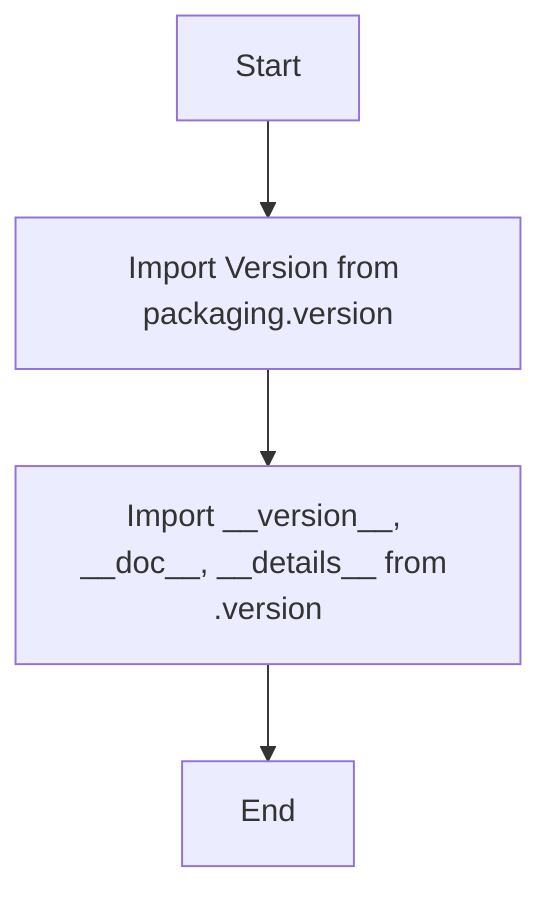

## <алгоритм>

1.  **Импорт `Version` из `packaging.version`**:
    *   Пример: `from packaging.version import Version`
    *   Импортирует класс `Version` для работы с версиями программного обеспечения.
2.  **Импорт `__version__`, `__doc__`, `__details__` из `src.webdriver.edge._examples.version`**:
    *   Пример: `from .version import __version__, __doc__, __details__`
    *   Импортирует переменные, содержащие информацию о версии, документацию и дополнительные детали о модуле из файла `version.py`.

## <mermaid>

## <объяснение>

**Импорты:**

*   `from packaging.version import Version`:
    *   `packaging.version` - это библиотека Python, предоставляющая инструменты для работы с версиями программного обеспечения.
    *   `Version` - это класс, который представляет собой конкретную версию (например, "1.2.3"). Он позволяет сравнивать и обрабатывать версии.
    *   Это импорт предназначен для использования класса `Version` для анализа и сравнения версий. Вероятно, в контексте этого модуля, версия edge-драйвера или другого компонента будет представлена экземпляром этого класса.
*   `from .version import __version__, __doc__, __details__`:
    *   `.version` - это  модуль `version.py`, который находится в той же директории, что и текущий файл (`__init__.py`).
    *   `__version__` -  строковая переменная, содержащая информацию о версии текущего модуля или пакета (`src.webdriver.edge._examples`).
    *   `__doc__` - строковая переменная, содержащая строку документации текущего модуля или пакета.
    *    `__details__` - строка содержащая дополнительные детали модуля.
    *   Импорт этих переменных позволяет использовать информацию о версии, документации и дополнительных сведениях модуля в других частях проекта.

**Общая структура:**

Файл `__init__.py` обычно используется для инициализации пакета `src.webdriver.edge._examples` в Python. В данном случае, он импортирует важные метаданные пакета (версия, документация, детали), а также инструмент для работы с версиями.

**Цепочка взаимосвязей:**

1.  **`src.webdriver.edge._examples`**: Это пакет, который, вероятно, содержит примеры использования Edge Webdriver.
2.  **`src.webdriver.edge._examples.version`**: Этот модуль (`version.py`) отвечает за хранение метаданных о версии текущего пакета, документации, и детали.
3. **`packaging`**: Внешняя библиотека `packaging` используется для обработки версий.
4. **Другие модули проекта**: Другие части проекта могут импортировать данные переменные, чтобы получить информацию о текущей версии, документации или для проверки совместимости версий.

**Потенциальные ошибки и области для улучшения:**

*   В предоставленном коде отсутствуют какие-либо дополнительные объявления переменных, классы или функции, кроме импортов.
*   Код может быть расширен для включения логики инициализации пакета или каких-либо общих настроек, например, считывание настроек из файла.

В целом, код представляет собой минимальную структуру для инициализации пакета, определяя метаданные версии, документацию и детали, и предоставляя возможность работать с версиями.