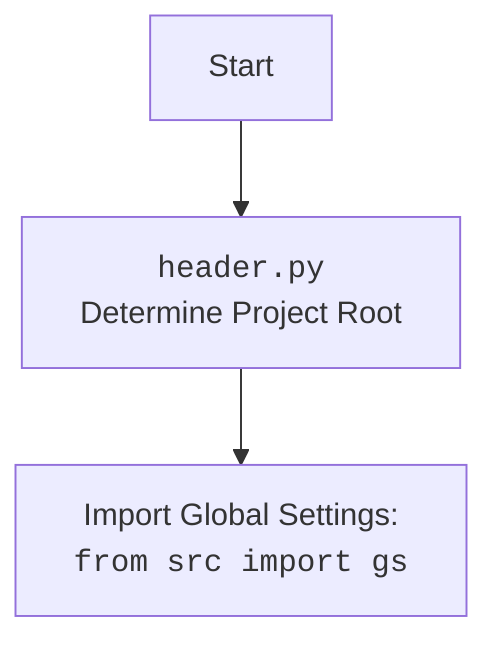

## АНАЛИЗ КОДА: `hypotez/src/webdriver/edge/_examples/header.py`

### 1. <алгоритм>

1. **Определение корня проекта (`dir_root`):**
   - Получаем текущую рабочую директорию с помощью `os.getcwd()`.
   - Находим индекс последнего вхождения подстроки `'hypotez'` в текущей рабочей директории.
   - Если подстрока найдена, извлекаем часть строки до и включая `'hypotez'`, добавляем 11 символов (`hypotez` + 1), чтобы получить абсолютный путь к корню проекта.
   - Создаём объект `Path` из полученной строки.
   - **Пример:** Если `os.getcwd()` возвращает `/Users/user/Documents/projects/hypotez/src/webdriver/edge/_examples`, то `dir_root` станет `/Users/user/Documents/projects/hypotez/`.

2. **Добавление корня проекта в `sys.path`:**
   - Преобразуем объект `Path` `dir_root` в строку с помощью `str()`.
   - Добавляем строку пути корня проекта в список `sys.path`, что позволяет импортировать модули из корня проекта.
   -  **Пример**: Теперь можно импортировать модули, находящиеся в `hypotez/src`, напрямую.

3. **Определение директории `src`:**
    - Создаем объект `Path` `dir_src` указывающий на директорию `src` в корне проекта.
   - **Пример**: Если `dir_root` это `/Users/user/Documents/projects/hypotez/`, то `dir_src` станет `/Users/user/Documents/projects/hypotez/src/`.
    - Добавляем строку пути корня проекта в список `sys.path`.
    -   **Пример**: Теперь можно импортировать модули, находящиеся в `hypotez/src`, напрямую.

4. **Вывод пути корня проекта:**
   - Выводим путь к корню проекта `dir_root` в консоль для отладки.
   - **Пример:** Будет выведено `/Users/user/Documents/projects/hypotez/`.

5. **Импорт модулей:**
   - Импортируем `Path` из модуля `pathlib`.
   - Импортируем `json` для работы с JSON.
   - Импортируем `re` для работы с регулярными выражениями.
   - Импортируем глобальные настройки `gs` из пакета `src`.
   - Импортируем класс `Supplier` из `src.suppliers`.
   - Импортируем классы `Product`, `ProductFields`, `ProductFieldsLocators` из `src.product`.
   - Импортируем класс `Category` из `src.category`.
   - Импортируем функции `j_dumps`, `j_loads`, `pprint`, `save_text_file` из `src.utils.jjson`.
    - Импортируем `logger`, `StringNormalizer`, `ProductFieldsValidator` из `src.logger.logger`.

### 2. <mermaid>

```mermaid
flowchart TD
    Start --> DetermineRoot[Determine Project Root];
    DetermineRoot --> GetCurrentDir[Get Current Working Directory: <code>os.getcwd()</code>];
    GetCurrentDir --> FindHypotez[Find Last Index of 'hypotez' in Path];
    FindHypotez --> CreatePath[Create Project Root Path Object: <code>Path(substring)</code>];
    CreatePath --> AppendRootToSysPath[Append Project Root Path to <code>sys.path</code>];
    AppendRootToSysPath --> DefineSrcDir[Define src Directory: <code>Path(dir_root, 'src')</code>];
    DefineSrcDir --> AppendSrcToSysPath[Append Project Root Path to <code>sys.path</code>];
    AppendSrcToSysPath --> PrintRootPath[Print Project Root Path: <code>print(dir_root)</code>];
    PrintRootPath --> ImportModules[Import necessary modules];
    ImportModules --> End;


    subgraph Project Setup
        GetCurrentDir
        FindHypotez
        CreatePath
        AppendRootToSysPath
        DefineSrcDir
         AppendSrcToSysPath
        PrintRootPath
    end
        subgraph Imports
        ImportModules
    end
```



**Объяснение зависимостей:**

-   **`Start`**: Начало процесса.
-   **`DetermineRoot`**:  Определение корня проекта.
    -   `GetCurrentDir` Получение текущей рабочей директории. Использует модуль `os`.
    -   `FindHypotez` Нахождение индекса подстроки `'hypotez'` в строке пути. Использует стандартные строковые методы.
    -   `CreatePath` Создание объекта `Path` из строки. Использует класс `Path` из модуля `pathlib`.
-   **`AppendRootToSysPath`**:  Добавление пути к корню проекта в `sys.path`. Использует модуль `sys`.
-    **`DefineSrcDir`**: Определение директории `src`
-   **`AppendSrcToSysPath`**:  Добавление пути к корню проекта в `sys.path`. Использует модуль `sys`.
-    **`PrintRootPath`**: Вывод пути корня проекта. Использует функцию `print()`.
-   **`ImportModules`**: Импорт необходимых модулей для работы. Включает в себя `pathlib`, `json`, `re`, а так же кастомные модули проекта.
-   **`End`**: Завершение процесса.
-   **`Project Setup`**: Подпроцесс установки корня проекта.
-  **`Imports`**: Подпроцесс импорта необходимых модулей.

Диаграмма показывает, как происходит инициализация путей проекта, какие стандартные модули используются, а также кастомные модули.

### 3. <объяснение>

**Импорты:**

*   `import sys`: Модуль `sys` обеспечивает доступ к системным переменным и функциям, таким как `sys.path`, который используется для настройки путей поиска модулей.
*   `import os`: Модуль `os` предоставляет функции для взаимодействия с операционной системой, например, получение текущей рабочей директории через `os.getcwd()`.
*   `from pathlib import Path`: Класс `Path` из модуля `pathlib` позволяет работать с файловыми путями в объектно-ориентированном стиле.
*   `import json`: Модуль `json` используется для работы с данными в формате JSON.
*   `import re`: Модуль `re` предназначен для работы с регулярными выражениями.
*   `from src import gs`: Импортирует глобальные настройки из пакета `src`. `gs` скорее всего содержит глобальные переменные и настройки проекта.
*   `from src.suppliers import Supplier`: Импортирует класс `Supplier` из модуля `src.suppliers`, предполагая, что он предназначен для управления информацией о поставщиках.
*   `from src.product import Product, ProductFields, ProductFieldsLocators`: Импортирует классы, связанные с продуктами. `Product` скорее всего представляет продукт, `ProductFields` — его поля, а `ProductFieldsLocators` — локаторы для элементов веб-страницы с информацией о продукте.
*   `from src.category import Category`: Импортирует класс `Category` из модуля `src.category`, предназначенный для управления категориями продуктов.
*   `from src.utils.jjson import j_dumps, j_loads, pprint, save_text_file`: Импортирует функции для работы с JSON, а именно `j_dumps` - сериализация в JSON, `j_loads` - десериализация из JSON,  `pprint` - форматированный вывод и `save_text_file` - сохранение текста в файл.
*   `from src.logger.logger import logger, StringNormalizer, ProductFieldsValidator`: Импортирует логгер `logger` и классы `StringNormalizer`, `ProductFieldsValidator` из модуля `src.logger.logger`, вероятно, для логирования, нормализации строк и проверки полей продуктов.

**Переменные:**

*   `dir_root`: Объект `Path`, представляющий корневую директорию проекта.
*   `dir_src`: Объект `Path`, представляющий директорию `src` внутри корневой директории проекта.

**Функции:**

*   `os.getcwd()`: Функция из модуля `os`, возвращающая строку с текущей рабочей директорией.
*   `rfind('hypotez')`: Метод строк, который ищет последнее вхождение подстроки `'hypotez'` и возвращает индекс.
*   `Path(...)`: Конструктор класса `Path` из модуля `pathlib`, создающий объект пути.
*   `str(...)`: Функция преобразования объекта в строку.
*   `sys.path.append(...)`: Метод списка `sys.path`, добавляющий путь в список путей поиска модулей.
*   `print(...)`: Выводит информацию на консоль.

**Объяснение:**

Этот код предназначен для динамического определения корневой директории проекта и добавления её в `sys.path`, чтобы импортировать модули из различных частей проекта. Это позволяет запускать скрипты из разных мест в файловой системе, при этом сохраняя возможность корректного импорта внутренних модулей проекта.

**Потенциальные ошибки и области для улучшения:**

*   **Зависимость от подстроки 'hypotez':** Определение корня проекта через поиск подстроки `'hypotez'` делает код зависимым от имени папки. Если имя папки изменится, код сломается. Лучше использовать более надежный метод, например, поиск файла-маркера в корне проекта (например, `.git`, `setup.py`).
*   **Избыточное добавление `dir_root` в `sys.path`:**  `dir_root` добавляется в `sys.path` дважды. Можно удалить одно из этих добавлений.
*   **Использование `...`:**  В коде используются многоточия `...`, что свидетельствует о неполноте примера. Это может быть проблемным, если код неполный.
*   **Не используются все импорты:** В коде импортируется много модулей, но не все из них используются. Это может указывать на лишние импорты или неполноту примера.

**Взаимосвязи с другими частями проекта:**

Этот скрипт `header.py` является начальным этапом, который подготавливает окружение для остальной части проекта. Он гарантирует, что все необходимые модули, находящиеся в `src`, будут доступны для импорта из любого скрипта, запускаемого внутри проекта. Он особенно важен для скриптов, которые взаимодействуют с веб-драйверами или другими частями системы.

Этот анализ предоставляет полную картину о структуре кода, его предназначении, а также указывает на возможные улучшения.