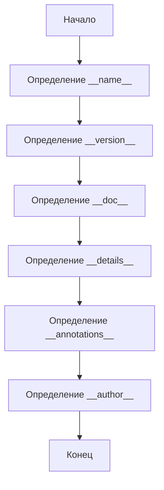

## ИНСТРУКЦИЯ:

Анализируй предоставленный код подробно и объясни его функциональность. Ответ должен включать три раздела:

1. **<алгоритм>**: Опиши рабочий процесс в виде пошаговой блок-схемы, включая примеры для каждого логического блока, и проиллюстрируй поток данных между функциями, классами или методами.
2. **<mermaid>**: Напиши код для диаграммы в формате `mermaid`, проанализируй и объясни все зависимости,
    которые импортируются при создании диаграммы.
    **ВАЖНО!** Убедитесь, что все имена переменных, используемые в диаграмме `mermaid`,
    имеют осмысленные и описательные имена. Имена переменных вроде `A`, `B`, `C`, и т.д., не допускаются!

    **Дополнительно**: Если в коде есть импорт `import header`, добавьте блок `mermaid` flowchart, объясняющий `header.py`:
    ```mermaid
    flowchart TD
        Start --> Header[<code>header.py</code><br> Determine Project Root]

        Header --> import[Import Global Settings: <br><code>from src import gs</code>]
    ```

3. **<объяснение>**: Предоставьте подробные объяснения:
   - **Импорты**: Их назначение и взаимосвязь с другими пакетами `src.`.
   - **Классы**: Их роль, атрибуты, методы и взаимодействие с другими компонентами проекта.
   - **Функции**: Их аргументы, возвращаемые значения, назначение и примеры.
   - **Переменные**: Их типы и использование.
   - Выделите потенциальные ошибки или области для улучшения.

Дополнительно, постройте цепочку взаимосвязей с другими частями проекта (если применимо).

Это обеспечивает всесторонний и структурированный анализ кода.
## Формат ответа: `.md` (markdown)
**КОНЕЦ ИНСТРУКЦИИ**

### <алгоритм>

1. **Инициализация модуля**:
   - Скрипт начинается с определения магических переменных модуля.
     - `__name__` устанавливается в виде строки.
     - `__version__` устанавливается в виде строки, представляющей версию модуля.
     - `__doc__` является строкой, содержащей документацию модуля.
     - `__details__` является строкой, содержащей дополнительные детали о версии.
     - `__annotations__` предназначен для хранения аннотаций типов.
     - `__author__` устанавливается в виде строки, представляющей автора модуля.

### <mermaid>



### <объяснение>

**Импорты:**

В данном коде отсутствуют явные импорты. Однако, если этот модуль является частью более крупного проекта, он может быть импортирован в другие модули.

**Классы:**

В данном коде нет определения классов. Этот модуль просто определяет ряд переменных, связанных с информацией о версии модуля.

**Функции:**

В данном коде нет определения функций. Модуль просто инициализирует переменные, содержащие информацию о модуле.

**Переменные:**

*   `__name__`:
    *   Тип: `str` (строка).
    *   Назначение: Содержит имя модуля. В данном случае, если файл выполняется напрямую, то значение будет "__main__".
    *   Пример: `"__main__"`, если модуль запущен напрямую.
*   `__version__`:
    *   Тип: `str` (строка).
    *   Назначение: Содержит строку с номером версии модуля.
    *   Пример: `"3.12.0.0.0.4"`
*    `__doc__`:
    *    Тип: `str` (строка).
    *    Назначение: Строка документации модуля.
    *    Пример: не определена в предоставленном фрагменте кода, обычно это многострочная строка с описанием модуля.
*   `__details__`:
    *   Тип: `str` (строка).
    *   Назначение: Содержит дополнительные детали о версии модуля.
    *   Пример: `"Details about version for module or class"`
*  `__annotations__`:
    * Тип: не указан, но подразумевается как словарь (или подобная структура данных).
    * Назначение: Используется для хранения аннотаций типов для переменных и функций в модуле.
    * Пример: не определена явно, должна быть словарем.
*   `__author__`:
    *   Тип: `str` (строка).
    *   Назначение: Содержит имя автора модуля.
    *   Пример: `"hypotez"`

**Потенциальные ошибки или области для улучшения:**

*   **Отсутствие документации для __doc__:** Переменная `__doc__` не заполнена, хотя она предназначена для хранения документации модуля. Необходимо добавить многострочную строку с подробным описанием модуля.
* **Тип `__annotations__`**: У переменной не определен тип данных, рекомендуется использовать `dict` для аннотаций.
*   **Формат версии:** Формат строки версии `"3.12.0.0.0.4"` выглядит необычно. Следует использовать более стандартный формат, например,  `"3.12.0.4"` или `"3.12.0-beta.4"`.
*   **Использование магических переменных**:  хотя это и нормальная практика, нужно быть осторожным при их использовании и обеспечивать согласованность их значений.
*  **Отсутствие явных импортов**: Зависимости от других модулей или пакетов не указаны, что может вызвать проблемы при работе с этим модулем в отрыве от контекста проекта.
* **Устаревшие заголовки**:  комментарии в заголовках файла дублируются и выглядят как артефакты,  следует привести их в порядок.

**Взаимосвязи с другими частями проекта:**

Этот модуль, вероятно, используется для определения версии пакета или модуля. Другие части проекта могут импортировать этот модуль для доступа к переменной `__version__`, чтобы получить информацию о текущей версии. Также можно использовать `__details__`, `__author__` для отображения информации о модуле.