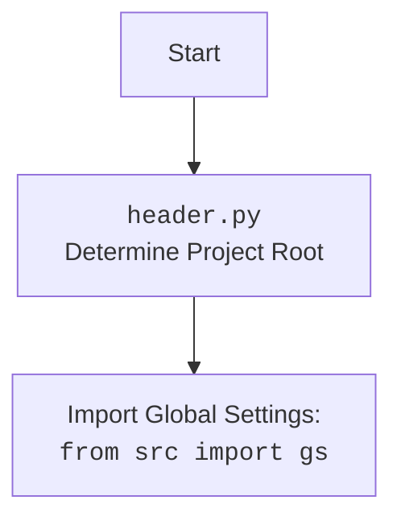

## <алгоритм>

**1. Инициализация Edge WebDriver:**

   - Начинается с вызова конструктора класса `Edge`.
   - Принимает параметры:
     - `profile_name`: Имя профиля пользователя (опционально).
     - `user_agent`: Строка User-Agent (опционально, если не задан, генерируется случайный).
     - `options`: Список дополнительных опций Edge (опционально).
     - `window_mode`: Режим окна браузера (`windowless`, `kiosk`, `full_window` и т.д.).
   - Если `user_agent` не предоставлен, используется `fake_useragent` для генерации случайного user-agent.
   - Загружает настройки из `edge.json`, используя `j_loads_ns`.
   - Создается объект `EdgeOptions`.
   - Добавляет в `EdgeOptions` User-Agent.
   - Устанавливает режим окна (`windowless`, `kiosk`, `full_window` ) из конфигурации или параметра.

**2. Добавление опций и настроек:**

   - Добавляет в `EdgeOptions` дополнительные опции, переданные через параметр `options`.
   - Добавляет в `EdgeOptions` опции из конфигурационного файла `edge.json`.
   - Добавляет в `EdgeOptions` кастомные хедеры из конфигурационного файла `edge.json`.
   - Устанавливает директорию профиля пользователя из конфигурации или переданного имени профиля.

**3. Запуск Edge WebDriver:**

   - Пытается запустить Edge WebDriver, используя настройки `EdgeOptions`.
   - Логирует запуск.
   - Если происходит `WebDriverException`, то записывается в лог и происходит `return`.
   - Если происходит общая ошибка `Exception`, то записывается в лог и происходит `return`.

**4. Инициализация payload:**
   - Вызывается метод `_payload` после успешного запуска WebDriver.
   - Инициализирует объект `JavaScript` для управления браузером.
   - Добавляет функции `JavaScript` в текущий класс.
   - Инициализирует `ExecuteLocator` для работы с элементами на странице.
   - Добавляет функции `ExecuteLocator` в текущий класс.

**5. `set_options`:**

  -  Метод `set_options` создает новый объект `EdgeOptions`.
  - Принимает список опций, если такой есть.
  - Возвращает настроенный объект `EdgeOptions`.

**Примеры:**

-   **Инициализация:**
    ```python
    driver = Edge(user_agent="MyCustomUserAgent", options=["--disable-gpu"], window_mode='full_window', profile_name='test')
    ```
-   **Без User-Agent:**
    ```python
    driver = Edge() # User-Agent будет сгенерирован случайным образом.
    ```
-   **Режим окна:**
    ```python
    driver = Edge(window_mode="kiosk")
    ```
-   **Использование `set_options`:**
    ```python
    options = driver.set_options(["--headless", "--disable-extensions"])
    ```
-  **Пример использования `if __name__ == "__main__":`:**
    ```python
    driver = Edge(window_mode='full_window')
    driver.get("https://www.example.com")
    ```
   Здесь создается экземпляр драйвера `Edge` в режиме полного окна и затем переходит по адресу `https://www.example.com`.
## <mermaid>

```mermaid
flowchart TD
    Start[Start] --> InitEdge[Инициализация Edge]
    InitEdge --> LoadConfig[Загрузка настроек из edge.json]
    LoadConfig --> CreateOptions[Создание EdgeOptions]
    CreateOptions --> SetUserAgent[Установка User-Agent]
    SetUserAgent --> SetWindowMode[Установка режима окна]
    SetWindowMode --> AddCustomOptions[Добавление пользовательских опций]
    AddCustomOptions --> AddConfigOptions[Добавление опций из конфигурации]
    AddConfigOptions --> AddConfigHeaders[Добавление заголовков из конфигурации]
    AddConfigHeaders --> SetProfileDir[Установка директории профиля]
    SetProfileDir --> StartWebDriver[Запуск Edge WebDriver]
    StartWebDriver --> Payload[Инициализация payload]
    StartWebDriver -- WebDriverException --> LogCriticalError1[Логирование критической ошибки WebDriver]
    StartWebDriver -- Exception --> LogCriticalError2[Логирование общей критической ошибки]
    Payload --> InitJavaScript[Инициализация JavaScript]
    InitJavaScript --> InitExecutor[Инициализация ExecuteLocator]
    InitExecutor --> End[Конец]
    LogCriticalError1 --> End
    LogCriticalError2 --> End

    classDef option_style fill:#f9f,stroke:#333,stroke-width:2px
    class CreateOptions, SetUserAgent, SetWindowMode, AddCustomOptions, AddConfigOptions, AddConfigHeaders, SetProfileDir option_style
```



## <объяснение>

**Импорты:**

-   `os`: Модуль для работы с операционной системой (например, для доступа к переменным окружения).
-   `pathlib.Path`: Класс для работы с путями файловой системы.
-   `typing.Optional`, `typing.List`: Используется для аннотации типов, указывая, что переменные могут быть `None` или списком.
-   `selenium.webdriver.Edge as WebDriver`: Импортирует класс `Edge` из `selenium` и переименовывает его в `WebDriver`, для создания экземпляра драйвера Edge.
-   `selenium.webdriver.edge.service.Service as EdgeService`: Используется для настройки сервиса Edge WebDriver.
-   `selenium.webdriver.edge.options.Options as EdgeOptions`: Используется для настройки опций Edge.
-   `selenium.common.exceptions.WebDriverException`: Исключение, возникающее при ошибках WebDriver.
-   `src.webdriver.executor.ExecuteLocator`: Класс для выполнения поиска элементов на странице.
-   `src.webdriver.js.JavaScript`: Класс для выполнения JavaScript на странице.
-   `fake_useragent.UserAgent`: Используется для генерации случайных User-Agent.
-   `src import gs`: Импортирует глобальные настройки проекта.
-   `src.logger.logger`: Импортирует модуль логирования.
-   `src.utils.jjson.j_loads_ns`: Импортирует функцию для загрузки JSON-файлов с поддержкой namespace.

**Класс `Edge`:**

-   **Назначение:** Представляет собой кастомный класс для управления браузером Edge. Наследует от `selenium.webdriver.Edge`.
-   **Атрибуты:**
    -   `driver_name`: Строка, указывающая имя драйвера (`'edge'`).
    -   `user_agent`: Строка, содержащая User-Agent.
-   **Методы:**
    -   `__init__`:
        -   Инициализирует WebDriver Edge с заданными опциями и User-Agent.
        -   Загружает настройки из `edge.json`.
        -   Устанавливает режим окна (`windowless`, `kiosk`, `full_window`).
        -   Настраивает профиль пользователя.
    -   `_payload`:
        -   Инициализирует объекты `JavaScript` и `ExecuteLocator`.
        -   Добавляет их методы в класс Edge для удобного использования.
    -   `set_options`:
        -   Создает и настраивает объект `EdgeOptions` с заданными опциями.
        -   Возвращает настроенный объект `EdgeOptions`.

**Функции:**

-   `__init__(self, profile_name: Optional[str] = None, user_agent: Optional[str] = None, options: Optional[List[str]] = None, window_mode: Optional[str] = None, *args, **kwargs) -> None`:
    -   **Аргументы:**
        -   `profile_name`: Имя профиля пользователя.
        -   `user_agent`: Строка User-Agent.
        -   `options`: Список опций Edge.
        -  `window_mode`: Режим окна браузера (`windowless`, `kiosk`, `full_window` и т.д.)
    -   **Возвращаемое значение:** `None`.
    -   **Назначение:** Инициализирует Edge WebDriver.
-   `_payload(self) -> None`:
    -   **Аргументы:** `self`.
    -   **Возвращаемое значение:** `None`.
    -   **Назначение:** Загружает объекты `JavaScript` и `ExecuteLocator` и добавляет их методы в класс.
-   `set_options(self, opts: Optional[List[str]] = None) -> EdgeOptions`:
   - **Аргументы:**
      - `opts`: Список опций для добавления в EdgeOptions.
   - **Возвращаемое значение:** `EdgeOptions` (объект с настроенными опциями).
   - **Назначение:** Создает и настраивает опции для WebDriver.

**Переменные:**

-   `driver_name`: Строка, содержащая имя драйвера (`'edge'`).
-   `user_agent`: Строка, содержащая User-Agent.
-   `settings`: Словарь, содержащий настройки, загруженные из JSON.
-   `options_obj`: Объект `EdgeOptions`, используемый для настройки драйвера.
-   `edgedriver_path`: Путь к исполняемому файлу драйвера Edge.
-   `service`: Объект `EdgeService` для управления сервисом драйвера.

**Потенциальные ошибки и области для улучшения:**

-   **Обработка ошибок:** В коде реализована базовая обработка `WebDriverException` и `Exception`, но можно добавить более детальную обработку ошибок.
-  **Конфигурация:** Код использует `j_loads_ns` для загрузки настроек из `edge.json`.  Необходимо убедиться, что файл `edge.json` существует и имеет правильный формат.
-   **Логирование:**  Необходимо улучшить логирование, чтобы отслеживать все важные действия и ошибки.
-   **Управление профилем пользователя:** Код использует жестко заданные пути к профилям пользователей, что можно сделать более гибким.
- **`get_referrer`**: Присвоение `self.get_referrer = j.ready_state` является явной ошибкой, так как эти методы выполняют разные функции.

**Взаимосвязь с другими частями проекта:**

-   **`src.webdriver.executor`**: Класс `ExecuteLocator` используется для выполнения операций с элементами веб-страницы.
-   **`src.webdriver.js`**: Класс `JavaScript` используется для выполнения JavaScript кода на веб-странице.
-  **`src.utils.jjson`**: Класс `j_loads_ns` используется для загрузки конфигурационных файлов в формате `json`.
-   **`src.logger.logger`**: Модуль логирования используется для записи информации о ходе выполнения программы.
-   **`src import gs`**:  Импортирует глобальные настройки проекта, что обеспечивает доступ к общим параметрам и путям.
-   **`fake_useragent`**: Модуль используется для генерации случайного User-Agent, что позволяет избежать блокировки со стороны веб-сайтов.

Этот анализ предоставляет полное понимание функциональности и взаимодействия компонентов кода `edge.py`.