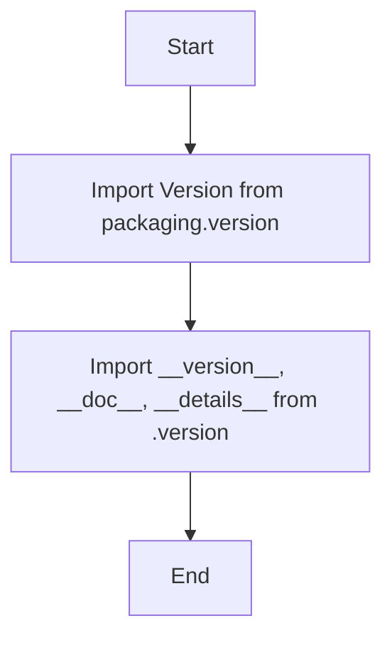
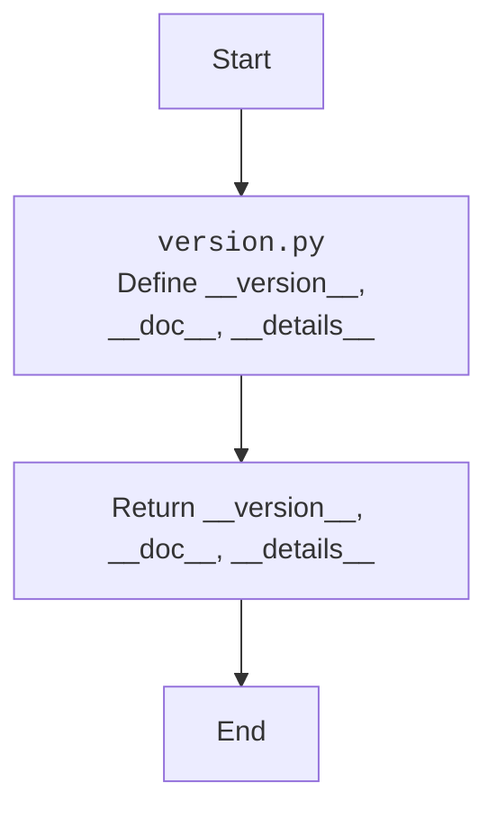

## Анализ кода `src/webdriver/edge/extentions/__init__.py`

### <алгоритм>

1. **Импорт модуля `Version` из `packaging.version`**: 
   - Этот шаг импортирует класс `Version`, который используется для работы с версиями программного обеспечения.
   - **Пример**: `from packaging.version import Version`

2. **Импорт переменных `__version__`, `__doc__`, и `__details__` из модуля `version.py`**:
   - Этот шаг импортирует три переменные:
     - `__version__`: Строка, представляющая версию расширения.
     - `__doc__`: Строка, содержащая документацию для модуля.
     - `__details__`: Строка, содержащая дополнительную информацию о расширении.
   - Эти переменные предположительно определены в файле `version.py` в той же директории.
   - **Пример**: `from .version import __version__, __doc__, __details__`
   - **Поток данных**: Данные переменных `__version__`, `__doc__`, и `__details__` передаются из модуля `version.py` в текущий модуль.

### <mermaid>

### <объяснение>

#### Импорты:

-   **`from packaging.version import Version`**:
    -   Импортирует класс `Version` из библиотеки `packaging`.
    -   `packaging` - это библиотека, предоставляющая утилиты для работы с версиями пакетов. Класс `Version` позволяет сравнивать и работать с версиями программного обеспечения.
    -   В данном контексте, это может использоваться для проверки совместимости версий или других операций, связанных с версиями расширений.

-   **`from .version import __version__, __doc__, __details__`**:
    -   Импортирует переменные `__version__`, `__doc__` и `__details__` из модуля `version.py`, расположенного в той же директории.
    -   `__version__`: Обычно является строкой, представляющей версию расширения (например, "1.0.0").
    -   `__doc__`:  Предположительно является строкой документации, описывающей назначение расширения.
    -   `__details__`: Содержит дополнительную информацию, касающуюся расширения.
    -   Эти переменные используются для предоставления метаданных о модуле, такие как версия, документация и подробная информация о модуле.

#### Классы:

- В данном коде нет определения классов. Код в основном занимается импортом переменных и библиотек.

#### Функции:

-   В данном коде нет определения функций.

#### Переменные:

-   `__version__`: Строка, содержащая версию расширения.
-   `__doc__`: Строка, содержащая документацию для расширения.
-   `__details__`: Строка, содержащая дополнительную информацию о расширении.
    -  Эти переменные являются метаданными расширения, которые могут использоваться для отладки, логирования и отображения информации о модуле.

#### Потенциальные ошибки и улучшения:

-   **Отсутствие фактической функциональности:** Данный файл, по сути, является только точкой входа для определения версии, документации и метаданных расширения. Он не содержит никакого исполняемого кода, поэтому сложно говорить об ошибках.
-   **Зависимость от наличия `version.py`**: Файл `__init__.py` полностью зависит от файла `version.py`. Отсутствие или неправильное содержимое `version.py` может вызвать ошибки при импорте. Необходимо убедиться, что файл `version.py` существует и правильно настроен.
-   **Отсутствие комментариев для переменных**: Можно добавить комментарии к каждой из переменных, чтобы было понятнее, что они собой представляют.
-   **Множественные заголовки и пустые строки**: В начале кода много пустых строк и повторений заголовков. Это следует удалить для читаемости.

#### Взаимосвязи с другими частями проекта:

-   **`version.py`**: Тесно связан с `version.py`, из которого импортируются метаданные. Он является частью механизма версионирования.
-   **Другие модули `webdriver.edge`**: Этот модуль, вероятно, предоставляет метаданные для других частей `webdriver.edge`, которые используют эти данные для логирования, отображения информации или проверки версий.

В целом, файл `__init__.py` в `src/webdriver/edge/extentions` является точкой входа для предоставления основных метаданных расширения, таких как версия, документация и подробная информация. Его основная задача - импортировать необходимые переменные и предоставить их для использования в других частях проекта.