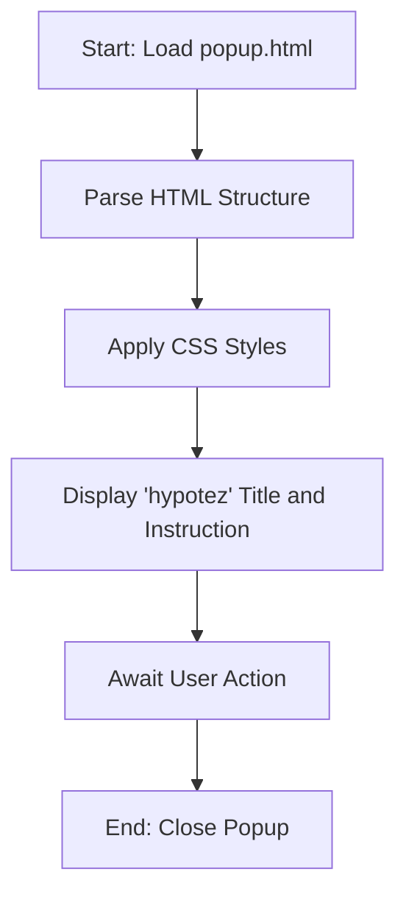

## АНАЛИЗ КОДА `hypotez/src/webdriver/edge/extentions/test_extention/html/popup.html`

### 1. <алгоритм>

HTML-файл `popup.html` представляет собой пользовательский интерфейс расширения для браузера, в данном случае Edge. Это всплывающее окно, которое появляется при нажатии на иконку расширения в панели инструментов браузера.

**Блок-схема:**

1. **Начало:** Браузер загружает файл `popup.html`.
2. **Разметка HTML:** Браузер интерпретирует HTML-код.
    - Устанавливается заголовок страницы ("hypotez").
    - Применяются стили CSS для задания ширины и отступов тела страницы.
    - Отображается заголовок h1 "hypotez".
    - Отображается абзац с инструкцией.
3. **Отображение:** Готовое окно с контентом выводится на экран.
4. **Ожидание:** Окно ожидает действий пользователя.
5. **Завершение:** Окно закрывается при нажатии пользователя или изменении состояния расширения.

**Примеры:**

-   **Разметка HTML:**
    ```html
        <!DOCTYPE html>
        <html>
        <head>
            <title>hypotez</title>
        </head>
        <body>
            <h1>hypotez</h1>
            <p>Click the extension icon to collect data from the current webpage.</p>
        </body>
        </html>
    ```

-   **Стили CSS:**
    ```css
        body {
            width: 200px;
            padding: 10px;
        }
    ```

### 2. <mermaid>



**Описание диаграммы `mermaid`:**

-   **Start**: Начало загрузки HTML файла `popup.html`.
-   **ParseHTML**: Разбор HTML-структуры документа.
-   **ApplyStyles**: Применение стилей CSS к элементам.
-   **DisplayContent**: Отображение заголовка "hypotez" и текста инструкции в окне.
-   **UserInteraction**: Ожидание действий пользователя.
-   **End**: Завершение работы при закрытии всплывающего окна.

### 3. <объяснение>

**Импорты:**

В данном коде нет явных импортов. Однако, в начале файла есть строка `""" module: src.webdriver.edge.extentions.test_extention.html """` и определение переменной `MODE = 'debug'`. Это говорит о том, что файл является частью модуля `src.webdriver.edge.extentions.test_extention.html`, и переменная `MODE` предназначена для определения режима работы расширения (здесь установлен режим отладки). Это может повлиять на поведение кода, но в данном HTML-файле это никак не используется.

**Классы:**

В этом коде нет классов. Это простой HTML-файл.

**Функции:**

В данном файле нет явных функций JavaScript. Функциональность HTML заключается в отображении контента.

**Переменные:**

-   `MODE = 'debug'` - Строковая переменная, указывающая режим работы расширения. Используется, вероятно, в связанном python коде.

**Детальное объяснение:**

-   Файл `popup.html` - это базовый HTML-файл, который служит для отображения всплывающего окна расширения.
-   Структура файла содержит:
    -   `<head>`: Содержит метаданные, включая заголовок страницы и стили CSS.
    -   `<body>`: Содержит отображаемый контент, включая заголовок и абзац.
-   Стили CSS задают ширину и отступы тела страницы, обеспечивая аккуратный вид окна.
-   HTML-код написан просто и понятно, не содержит сложных элементов или скриптов.

**Цепочка взаимосвязей с другими частями проекта:**

-   `popup.html` - это часть расширения для браузера Edge, которое находится в подкаталоге `src/webdriver/edge/extentions/test_extention/html`.
-   Этот файл используется для создания интерфейса пользователя расширения.
-   Вероятно, другие части проекта (например, Python-скрипты в каталоге `src/webdriver/edge/extentions/test_extention/`) используют этот файл для отображения окна при нажатии на значок расширения.
-   Переменная `MODE`, вероятно, используется в другом коде для определения того, нужно ли выводить дополнительную отладочную информацию.

**Потенциальные ошибки и области для улучшения:**

-   В данном файле нет явных ошибок.
-   Возможно, стоит добавить более подробный текст или кнопки для взаимодействия.
-   Также можно добавить стили или скрипты для более интерактивного поведения окна.
-   Сейчас файл является статическим, можно добавить JS для динамического изменения данных в окне.