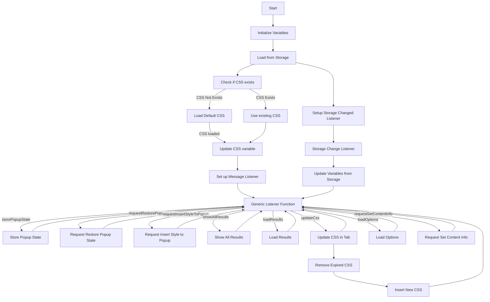

## АНАЛИЗ КОДА:

### 1. **<алгоритм>**

**Блок-схема работы скрипта:**

1.  **Инициализация**:
    *   Объявление переменных: `tx` (алиас для `tryxpath`), `fu` (алиас для `tryxpath.functions`), `popupState` (состояние popup-окна), `popupCss` (CSS для popup-окна), `results` (результаты), `css` (CSS для вставки), `attributes` (атрибуты).

2.  **`loadDefaultCss`**:
    *   **Начало**: Функция вызывается для асинхронной загрузки CSS из файла `try_xpath_insert.css`.
    *   Создание `XMLHttpRequest` объекта для загрузки CSS.
    *   Отправка GET-запроса на получение файла CSS.
    *   Обработчик `onreadystatechange` ждет завершения запроса и возвращает `responseText` в качестве результата Promise.
    *   **Пример**: Загрузка CSS из `/css/try_xpath_insert.css`.

3.  **`genericListener`**:
    *   Создание объекта `listeners` (прототип `null`).
    *   Создание обработчика сообщений `browser.runtime.onMessage` (`genericListener`).
    *   **Пример**: При получении сообщения с событием `storePopupState`, вызывается `genericListener.listeners.storePopupState`.

4.  **Обработчики сообщений (в `genericListener.listeners`)**:
    *   **`storePopupState`**: Сохранение состояния popup в `popupState`.
        *   **Пример**: `message.state` = `{popupOpen: true}`. `popupState` становится `{popupOpen: true}`.
    *   **`requestRestorePopupState`**: Запрос на восстановление состояния popup. Отправляет сообщение `restorePopupState` с текущим состоянием `popupState`.
        *   **Пример**: Отправка сообщения `{event: "restorePopupState", state: {popupOpen: true}}`.
    *   **`requestInsertStyleToPopup`**: Запрос на вставку CSS в popup-окно. Отправляет сообщение `insertStyleToPopup` с CSS из `popupCss`.
        *   **Пример**: Отправка сообщения `{event: "insertStyleToPopup", css: "body{width:367px;height:auto;}"}`.
    *   **`showAllResults`**: Сохранение результатов, ID вкладки и фрейма. Открытие новой вкладки с `show_all_results.html`.
        *   **Пример**: Прием сообщения `{event: "showAllResults", xpath: "//div"}`. Сохраняет `{xpath: "//div", tabId: 123, frameId: 0}`.
    *   **`loadResults`**: Отправка сохраненных результатов `results` в ответ на сообщение.
        *   **Пример**: Возврат `{xpath: "//div", tabId: 123, frameId: 0}` при запросе.
    *   **`updateCss`**: Обновление CSS во вкладке. Удаление просроченного CSS, затем вставка нового.
        *   **Пример**: Удаление `body { color: red; }`, вставка `body { color: blue; }`.
    *   **`loadOptions`**: Возвращает текущие значения `attributes`, `css`, и `popupCss`.
        *   **Пример**: Возврат `{attributes: {…}, css: "body {…}", popupCss: "body{…}"}`.
    *   **`requestSetContentInfo`**: Отправка атрибутов во вкладку для установки информации о контексте.
        *   **Пример**: Отправка сообщения `{event: "setContentInfo", attributes: {…}}`.

5.  **Обработчик `browser.storage.onChanged`**:
    *   Обновление переменных `attributes`, `css`, `popupCss` при изменении настроек в хранилище.
        *   **Пример**: При изменении атрибута `element`, переменная `attributes.element` обновляется.

6.  **Загрузка данных из `browser.storage.sync`**:
    *   Получение сохраненных `attributes`, `css` и `popupCss` из хранилища.
    *   Если `css` не задан, вызывается `loadDefaultCss`, иначе используется сохраненный CSS.
    *   Обновление переменных `attributes`, `popupCss`, `css` на основе данных из хранилища.

### 2. **<mermaid>**

**Объяснение:**

*   **Start**: Начало выполнения скрипта.
*   **Initialize**: Инициализация глобальных переменных (алиасы, состояние popup, CSS, атрибуты).
*   **LoadStorage**: Загрузка данных из `browser.storage.sync` для `attributes`, `css`, и `popupCss`.
*   **CheckCSS**: Проверка, есть ли сохраненный CSS.
*   **UseExistingCSS**: Используется сохраненный CSS, если он есть.
*   **LoadDefaultCSS**: Если сохраненного CSS нет, загружается CSS по умолчанию.
*   **UpdateCSSVar**: Обновление переменной `css` загруженным CSS.
*   **SetUpListener**: Настройка прослушивателя сообщений `browser.runtime.onMessage`.
*   **GenericListener**: Общая функция-обработчик сообщений.
    *   **StorePopupState**: Сохраняет состояние popup-окна.
    *   **RequestRestorePopupState**: Запрашивает восстановление состояния popup.
    *   **RequestInsertStyleToPopup**: Запрашивает вставку CSS в popup-окно.
    *   **ShowAllResults**: Сохраняет результаты и открывает страницу с результатами.
    *   **LoadResults**: Загружает сохраненные результаты.
    *   **UpdateCSS**: Обновляет CSS во вкладке.
    *   **LoadOptions**: Отправляет текущие значения опций.
    *   **SetContentInfo**: Отправляет атрибуты для установки информации о контексте.
*   **RemoveExpiredCSS**: Удаление старого CSS.
*    **InsertNewCSS**: Вставка нового CSS.
*   **SetupStorageListener**: Установка прослушивателя изменений в хранилище `browser.storage.onChanged`.
*   **StorageChangeListener**: Функция-обработчик изменений в хранилище.
*   **UpdateVariables**: Обновление переменных на основе новых данных из хранилища.

### 3. **<объяснение>**

*   **Импорты:**
    *   `browser.runtime`: Используется для взаимодействия с API расширения Chrome. Позволяет отправлять и принимать сообщения, получать URL, управлять вкладками.
    *   `browser.storage`: Используется для работы с хранилищем данных расширения.
*   **Классы:**
    *   В коде нет явно определенных классов. Объект `genericListener.listeners` имитирует функциональность классов с методами-обработчиками сообщений.
*   **Функции:**
    *   `loadDefaultCss()`: Загружает CSS из файла `/css/try_xpath_insert.css` асинхронно. Возвращает Promise с текстом CSS.
        *   **Аргументы**: Нет
        *   **Возвращаемое значение**: `Promise<string>`
        *   **Назначение**: Загрузка CSS по умолчанию.
    *   `genericListener(message, sender, sendResponse)`: Обработчик сообщений `browser.runtime.onMessage`.
        *   **Аргументы**:
            *   `message`: Объект сообщения.
            *   `sender`: Объект отправителя сообщения.
            *   `sendResponse`: Функция обратного вызова для отправки ответа.
        *   **Возвращаемое значение**: Зависит от обработчика в `genericListener.listeners`.
        *   **Назначение**: Маршрутизация входящих сообщений к соответствующим обработчикам.
    *   Обработчики в `genericListener.listeners`:
        *   `storePopupState(message)`: Сохраняет состояние popup-окна.
            *   **Аргументы**: `message` (содержит `state`).
            *   **Возвращаемое значение**: Нет.
            *   **Назначение**: Обновление состояния popup-окна.
        *   `requestRestorePopupState(message)`: Отправляет запрос на восстановление popup-окна.
            *   **Аргументы**: `message`.
            *   **Возвращаемое значение**: Нет.
            *   **Назначение**: Запрос на восстановление popup.
        *   `requestInsertStyleToPopup()`: Отправляет запрос на вставку CSS в popup-окно.
            *   **Аргументы**: Нет.
            *   **Возвращаемое значение**: Нет.
            *   **Назначение**: Запрос на вставку стилей.
        *   `showAllResults(message, sender)`: Сохраняет результаты, ID вкладки, ID фрейма и открывает страницу с результатами.
            *   **Аргументы**: `message` (результаты), `sender` (информация об отправителе).
            *   **Возвращаемое значение**: Нет.
            *   **Назначение**: Отображение результатов.
        *   `loadResults(message, sender, sendResponse)`: Отправляет сохраненные результаты обратно.
            *   **Аргументы**: `message`, `sender`, `sendResponse`.
            *   **Возвращаемое значение**: `true` (асинхронный ответ).
            *   **Назначение**: Отправка сохраненных результатов.
        *   `updateCss(message, sender)`: Обновляет CSS во вкладке, удаляя просроченный CSS и вставляя новый.
            *   **Аргументы**: `message` (содержит `expiredCssSet`), `sender`.
            *   **Возвращаемое значение**: Нет.
            *   **Назначение**: Обновление CSS.
        *   `loadOptions(message, sender, sendResponse)`: Отправляет текущие опции.
            *   **Аргументы**: `message`, `sender`, `sendResponse`.
            *   **Возвращаемое значение**: `true` (асинхронный ответ).
            *   **Назначение**: Отправка опций.
        *   `requestSetContentInfo(message, sender)`: Отправляет атрибуты для установки информации о контексте.
            *   **Аргументы**: `message`, `sender`.
            *   **Возвращаемое значение**: Нет.
            *   **Назначение**: Установка атрибутов.
*   **Переменные:**
    *   `tx`: Алиас для `tryxpath`
    *   `fu`: Алиас для `tryxpath.functions`.
    *   `popupState`: Состояние popup-окна (может быть `null`, `{}` или другие объекты).
    *   `popupCss`: CSS для popup-окна (строка).
    *   `results`: Сохраненные результаты поиска (объект).
    *   `css`: CSS для вставки в документ (строка).
    *   `attributes`: Объект с атрибутами для элементов.

*   **Потенциальные ошибки и области для улучшения:**
    *   Обработка ошибок: В коде используется `catch(fu.onError)` для обработки ошибок, но не предоставляется информация о том, как именно обрабатываются эти ошибки. Возможно, стоит добавить более подробное логирование ошибок.
    *   Отсутствие проверок типов: Код не проверяет типы данных, что может привести к ошибкам.
    *   Асинхронность: Код активно использует асинхронные операции (Promise, `browser.tabs.sendMessage`, `browser.tabs.removeCSS`), но есть вероятность возникновения проблем с обработкой ошибок или гонок, особенно в `updateCss` при удалении и добавлении CSS. Необходимо более тщательно тестировать эту часть кода.
    *   Глобальные переменные: Код использует много глобальных переменных, что может привести к конфликтам. Возможно, стоит пересмотреть архитектуру и использовать классы.

*   **Цепочка взаимосвязей:**
    *   Скрипт `try_xpath_background.js` является фоновым скриптом расширения, который обрабатывает сообщения из других частей расширения (контентные скрипты, popup, страница настроек).
    *   Использует `browser.runtime` для отправки сообщений и управления расширением.
    *   Использует `browser.storage` для сохранения настроек и данных.
    *   Связан с контентным скриптом, который вставляет и удаляет CSS во вкладках.

Этот скрипт обрабатывает сообщения, отправленные из различных частей расширения, и управляет состоянием popup-окна, CSS и атрибутами для элементов на страницах. Он также синхронизирует данные между разными частями расширения и сохраняет их в хранилище.