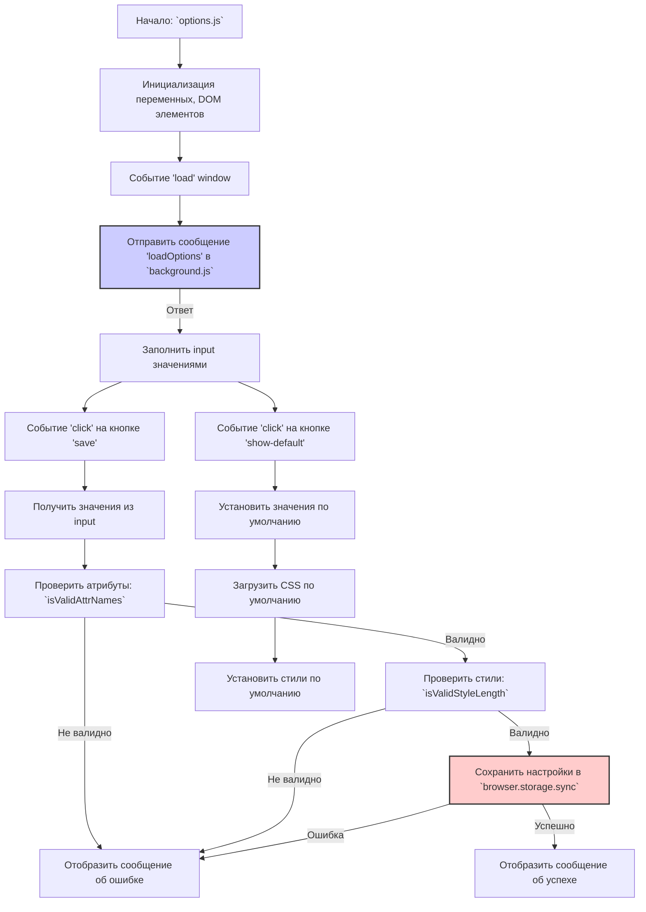

## Анализ кода `options.js`

### 1. **<алгоритм>**

**Блок-схема:**

```mermaid
graph LR
    A[Начало: Загрузка страницы options.html] --> B{Событие "load" на window};
    B -- Да --> C[Получение элементов DOM: input, message];
    C --> D{Отправка сообщения "loadOptions" в background.js};
    D -- Ответ с данными --> E[Заполнение полей input значениями из background.js];
    E --> F{Событие "click" на кнопке "save"};
    F -- Да --> G[Получение значений из input];
    G --> H[Проверка атрибутов: `isValidAttrNames()`];
    H -- Не валидно --> I[Отображение сообщения об ошибке];
    H -- Валидно --> J[Проверка стилей: `isValidStyleLength()`];
    J -- Не валидно --> K[Отображение сообщения об ошибке];
    J -- Валидно --> L[Сохранение данных в `browser.storage.sync`];
    L -- Успешно --> M[Отображение сообщения об успехе];
    L -- Ошибка --> N[Отображение сообщения об ошибке];
    E --> O{Событие "click" на кнопке "show-default"};
    O -- Да --> P[Установка значений по умолчанию для input];
    P --> Q[Загрузка CSS по умолчанию: `loadDefaultCss()`];
    Q --> R[Установка значений width/height по умолчанию];
    R --> S[Конец];
    I --> S;
    K --> S;
    M --> S;
    N --> S;

    style L1:fill:#f9f,stroke:#333,stroke-width:2px
    style M fill:#ccf,stroke:#333,stroke-width:2px
    style N fill:#fcc,stroke:#333,stroke-width:2px

    
```
**Примеры для каждого логического блока:**

*   **A (Начало):** Загружается страница `options.html`, где пользователь может настраивать параметры расширения.
*   **B (Событие "load"):** После загрузки страницы, скрипт начинает свою работу.
*   **C (Получение элементов DOM):** Получаются ссылки на input-поля для ввода атрибутов, стилей, а также на элемент `message`, где будет отображаться результат сохранения.
*   **D (Отправка сообщения "loadOptions"):** Скрипт отправляет сообщение `loadOptions` в `background.js` (фон расширения) для получения сохраненных настроек.
*   **E (Заполнение полей input):** Полученные данные из `background.js` (атрибуты, css, стили попапа) устанавливаются в соответствующие input-поля.
*   **F (Событие "click" на кнопке "save"):** При нажатии кнопки "save", вызывается обработчик.
*   **G (Получение значений из input):** Извлекаются текущие значения атрибутов и стилей из input-полей.
*   **H (Проверка атрибутов):** Функция `isValidAttrNames()` проверяет, что все введенные атрибуты допустимы для элемента HTML.
    *   **Пример**: Если пользователь введет "data-my-attr" как атрибут, функция `isValidAttrName` проверит можно ли установить этот атрибут на div элементе, перед тем как подтвердить сохранение.
*   **I (Отображение сообщения об ошибке):** Если хотя бы один атрибут недопустим, выводится сообщение об ошибке.
*   **J (Проверка стилей):** Функция `isValidStyleLength()` проверяет, что введенные значения ширины и высоты являются допустимыми (например, "auto", "100px").
    *   **Пример**: Если пользователь введет "120px" как ширину попапа, то функция `isValidStyleLength` пропустит это значение.
*   **K (Отображение сообщения об ошибке):** Если ширина или высота не являются допустимыми, выводится сообщение об ошибке.
*   **L (Сохранение данных):** Если атрибуты и стили валидны, они сохраняются в `browser.storage.sync`.
    *   **Пример**: Если атрибуты `element`, `context`, и другие, а также стили (css) и popupCss, являются допустимыми, то они сохраняются в `browser.storage.sync` для дальнейшего использования.
*   **M (Отображение сообщения об успехе):** Если сохранение прошло успешно, выводится сообщение об успехе.
*   **N (Отображение сообщения об ошибке):** Если произошла ошибка сохранения, выводится сообщение об ошибке.
*   **O (Событие "click" на кнопке "show-default"):** При нажатии кнопки "show-default", вызывается обработчик.
*   **P (Установка значений по умолчанию):**  В input-поля устанавливаются значения атрибутов по умолчанию.
*    **Q (Загрузка CSS по умолчанию):** Загрузка CSS по умолчанию из файла `try_xpath_insert.css`
*   **R (Установка значений width/height по умолчанию):** В input-поля для ширины и высоты попапа устанавливаются значения по умолчанию.
*  **S (Конец):** Работа скрипта завершена.

### 2. **<mermaid>**



**Объяснение:**

*   **Start**: Начало работы скрипта `options.js`.
*   **Init**: Инициализация переменных, получение DOM-элементов input и message.
*  **LoadEvent**:  Добавляем слушатель события `load` для окна. Этот слушатель запускает код после полной загрузки DOM.
*   **SendMessage**:  Отправка сообщения `loadOptions` в `background.js`,  используя `browser.runtime.sendMessage`, для получения сохраненных настроек.
*   **FillInputs**: Заполнение полей input значениями, полученными от `background.js`, такими как `attributes.element`, `attributes.context`, `css`, `popupCss`.
*   **SaveButtonEvent**: Ожидание события клика на кнопке с id `save`.
*   **GetInputValues**: Получение текущих значений из input-полей для атрибутов и стилей, таких как `elementAttr.value`, `contextAttr.value`, `popupBodyWidth.value`, `popupBodyHeight.value`.
*   **ValidateAttrs**: Проверка введенных атрибутов с помощью функции `isValidAttrNames`, которая в свою очередь вызывает функцию `isValidAttrName` для проверки каждого атрибута.
*   **ValidateStyles**: Проверка введенных стилей с помощью функции `isValidStyleLength`.
*   **ShowError**: Отображение сообщения об ошибке, если атрибуты или стили не прошли проверку.
*  **SaveToStorage**: Сохранение настроек в `browser.storage.sync` используя `browser.storage.sync.set`, включая `attributes`, `css` и `popupCss`.
*   **ShowSuccess**: Отображение сообщения об успехе после сохранения настроек.
*    **DefaultButtonEvent**:  Ожидание события клика на кнопке с id `show-default`.
*   **SetDefaultValues**: Установка значений атрибутов по умолчанию, таких как `defaultAttributes.element`, `defaultAttributes.context` и других.
*   **LoadDefaultCss**: Загрузка CSS по умолчанию из файла `try_xpath_insert.css` с помощью функции `loadDefaultCss`.
*   **SetPopupStyles**: Установка стилей попапа по умолчанию, таких как `defaultPopupBodyStyles.width` и `defaultPopupBodyStyles.height`.

**Зависимости**:

*   `browser.runtime.sendMessage`: Используется для взаимодействия с `background.js` для запроса сохраненных настроек и отправки данных.
*   `browser.storage.sync`: Используется для сохранения и загрузки настроек в синхронизированном хранилище браузера.
*   `window.document`: Используется для доступа к DOM и манипуляции элементами страницы.

### 3. **<объяснение>**

**Импорты:**

В этом коде нет явных импортов, так как он написан в формате IIFE (Immediately Invoked Function Expression), и все необходимые функции и переменные определены внутри этой области видимости. Однако есть неявное использование `browser` API, который предоставляется как глобальный объект для расширений браузера.

*   `browser.runtime.sendMessage`: Используется для отправки сообщений в background.js, что позволяет расширению взаимодействовать с бэкграунд-скриптом.
*   `browser.storage.sync`: Используется для сохранения и загрузки данных в синхронизированном хранилище браузера, позволяя настройкам сохраняться между сессиями браузера.
*  `browser.runtime.getURL`: Используется для получения абсолютного URL файла в пакете расширения.

**Классы:**

В данном коде нет явных классов. Код использует функции и объекты для организации логики.

**Функции:**

*   `isValidAttrName(name)`:
    *   **Аргументы**: `name` (строка) - имя атрибута.
    *   **Возвращаемое значение**: `true`, если атрибут допустим, `false` - в противном случае.
    *   **Назначение**: Проверяет, является ли `name` допустимым именем атрибута HTML, путем попытки установить этот атрибут на временный div-элемент.
    *   **Пример**:  `isValidAttrName("data-my-attribute")` вернет `true`, если такой атрибут допустим, а `isValidAttrName("invalid-attribute@")` вернет `false`.
*   `isValidAttrNames(names)`:
    *   **Аргументы**: `names` (объект) - объект, содержащий имена атрибутов.
    *   **Возвращаемое значение**: `true`, если все атрибуты допустимы, `false` - если хотя бы один недопустим.
    *   **Назначение**: Проверяет, что все имена атрибутов в объекте `names` являются допустимыми, вызывая функцию `isValidAttrName`.
    *   **Пример**: `isValidAttrNames({element: "data-tryxpath-element", context:"data-tryxpath-context"})` вернет `true`. `isValidAttrNames({element: "data-tryxpath-element", context:"invalid-attribute"})` вернет `false`.
*   `isValidStyleLength(len)`:
    *   **Аргументы**: `len` (строка) - значение длины.
    *   **Возвращаемое значение**: `true`, если значение является допустимым (например, "auto", "100px"), `false` - в противном случае.
    *   **Назначение**: Проверяет, является ли строка `len` допустимым значением длины, используя регулярное выражение.
    *   **Пример**: `isValidStyleLength("100px")` вернет `true`, `isValidStyleLength("auto")` вернет `true`, `isValidStyleLength("100")` вернет `false`, `isValidStyleLength("100em")` вернет `false`.
*   `loadDefaultCss()`:
    *   **Аргументы**: Нет.
    *   **Возвращаемое значение**: Promise, который разрешается со строкой CSS, если запрос выполнен успешно.
    *   **Назначение**: Загружает CSS по умолчанию из файла `try_xpath_insert.css` используя `XMLHttpRequest`.
    *   **Пример**:  `loadDefaultCss().then(css => { /* ... */ })` загружает файл `try_xpath_insert.css` и возвращает его содержимое.
*   `extractBodyStyles(css)`:
    *   **Аргументы**: `css` (строка) - строка CSS.
    *   **Возвращаемое значение**: объект с ключами `width` и `height`, извлеченными из CSS.
    *   **Назначение**: Извлекает значения `width` и `height` из строки CSS с помощью регулярного выражения.
    *   **Пример**: Если `css` строка имеет значение  `body{width:367px;height:auto;}`, тогда функция `extractBodyStyles(css)` вернет `{width: "367px", height: "auto"}`
*   `createPopupCss(bodyStyles)`:
    *   **Аргументы**: `bodyStyles` (объект) - объект с ключами `width` и `height`.
    *   **Возвращаемое значение**: строка CSS для тела попапа.
    *   **Назначение**: Формирует строку CSS для тела попапа, используя переданные стили.
    *   **Пример**: Если `bodyStyles` равен  `{width: "367px", height: "auto"}`, тогда функция `createPopupCss(bodyStyles)` вернет `body{width:367px;height:auto;}`

**Переменные:**

*   `tx`, `fu`: Псевдонимы для объектов `tryxpath` и `tryxpath.functions`.
*   `document`: Ссылка на объект `document`.
*   `defaultAttributes`: Объект, содержащий атрибуты по умолчанию для элементов.
*   `defaultPopupBodyStyles`: Объект, содержащий стили по умолчанию для тела попапа.
*   `elementAttr`, `contextAttr`, `focusedAttr`, `ancestorAttr`, `frameAttr`, `frameAncestorAttr`, `style`, `popupBodyWidth`, `popupBodyHeight`, `message`, `testElement`: DOM-элементы, используемые для взаимодействия с HTML-страницей.

**Потенциальные ошибки и области для улучшения:**

*   **Отсутствие валидации ввода**:  Проверки `isValidAttrNames` и `isValidStyleLength` - это хорошая практика, но они могут быть усилены. Например, можно добавить проверку на пустые значения.
*   **Обработка ошибок при запросе**: Функция `loadDefaultCss` использует `catch(fu.onError)`, что может быть недостаточно информативным. Лучше было бы  логировать ошибку с деталями.
*   **Зависимость от `background.js`**: Данный код тесно связан с `background.js`, и ошибка в бэкграунд-скрипте может вызвать проблемы в `options.js`. Стоит добавить обработку ошибок при отправке сообщений.
*   **Управление стилями**: В текущем варианте стили попапа обрабатываются как обычный текст. Рассмотреть возможность использование css объектов для управления стилями.

**Цепочка взаимосвязей с другими частями проекта:**

1.  **`options.html`**: HTML-страница, на которой работает данный скрипт. Эта страница предоставляет пользовательский интерфейс для настройки параметров расширения.
2.  **`background.js`**: Бэкграунд-скрипт, с которым взаимодействует данный код через `browser.runtime.sendMessage` для получения сохраненных настроек и отправки обновленных данных.
3.  **`try_xpath_insert.css`**: CSS-файл, содержащий стили по умолчанию для расширения, загружаемый в  функции `loadDefaultCss`.
4.  **`browser.storage.sync`**: Используется для хранения данных, которые будут доступны между сессиями расширения.

Этот файл является частью системы управления настройками расширения, где пользователи могут изменять атрибуты, используемые расширением, и настраивать стили элементов, которые он добавляет на страницу.