## <алгоритм>

1. **Инициализация:**
   - Проверяется, существует ли пространство имен `tryxpath`. Если нет, оно создается.
   - Проверяется, существует ли объект `tryxpath.functions`. Если нет, он создается.
   - Создается псевдоним `tx` для `tryxpath` и `fu` для `tryxpath.functions`.
   - Проверяется, была ли уже выполнена инициализация (`fu.done`). Если да, выполнение функции прекращается. В противном случае `fu.done` устанавливается в `true`.

2. **`fu.execExpr(expr, method, opts)`:**
   - **Входные данные:** XPath выражение (`expr`), метод (`method`), опции (`opts`).
   - Устанавливает контекст (`context`) для выполнения XPath (по умолчанию `document`).
   - Получает `resolver` из опций, если он предоставлен, иначе устанавливает в `null`.
   - Получает документ (`doc`) из контекста или опций.
   - **Логика:**
     - В зависимости от `method`:
       - **`evaluate`:**
         - Проверяет, является ли контекст узлом или атрибутом.
         - Создает `resolver` с помощью `fu.makeResolver`.
         - Выполняет `doc.evaluate` с предоставленными параметрами.
         - Преобразует результат в массив `items` с помощью `fu.resToArr`.
         - Если `resultType` был `ANY_TYPE`, обновляет его фактическим значением.
       - **`querySelector`:**
         - Проверяет, является ли контекст документом или элементом.
         - Выполняет `context.querySelector` с выражением.
         - Преобразует результат в массив `items` (один элемент или пустой массив).
       - **`querySelectorAll` или по умолчанию:**
         - Проверяет, является ли контекст документом или элементом.
         - Выполняет `context.querySelectorAll` с выражением.
         - Преобразует результат в массив `items` с помощью `fu.listToArr`.
   - **Выходные данные:** Объект с `items`, `method`, и `resultType`.

3. **`fu.resToArr(res, type)`:**
   - **Входные данные:** Результат XPath (`res`), тип результата (`type`).
   - Получает тип результата, если он не предоставлен, используя `res.resultType`.
   - Создает пустой массив `arr`.
   - **Логика:**
     - В зависимости от типа результата (`type`):
       - Добавляет числовое, строковое или логическое значение в массив.
       - Итерируется по узлам и добавляет их в массив для итераторов.
       - Итерируется по снимкам узлов и добавляет их в массив.
       - Добавляет одиночный узел в массив для `ANY_UNORDERED_NODE_TYPE` и `FIRST_ORDERED_NODE_TYPE`.
   - **Выходные данные:** Массив с результатами.

4.  **`fu.makeResolver(obj)`:**
    -   **Входные данные:** Объект `obj`, который может быть функцией, строкой или объектом.
    -   **Логика:**
        -   Если `obj` равен `null`, возвращает `null`.
        -   Если `obj` является функцией, возвращает ее.
        -   Если `obj` является строкой, пытается распарсить ее как JSON. В случае ошибки выбрасывает исключение.
        -   Если `obj` является объектом, проверяет его валидность с помощью `fu.isValidDict`.
        -   Преобразует объект в `Map` с помощью `fu.objToMap` и возвращает функцию-замыкание, которая ищет значения по ключу в `Map`
        -   Если объект невалиден, выбрасывает исключение.
    -   **Выходные данные:** Функция-разрешатель или `null`.

5.  **`fu.isValidDict(obj)`:**
    -   **Входные данные:** Объект `obj`.
    -   **Логика:**
        -   Проверяет, является ли `obj` объектом и не равен `null`.
        -   Проверяет, что все значения в объекте являются строками.
    -   **Выходные данные:** `true`, если `obj` является валидным словарем, `false` в противном случае.

6. **`fu.objToMap(obj)`:**
    - **Входные данные:** Объект `obj`.
    - **Логика:**
        - Создает новый `Map`.
        - Перебирает ключи `obj` и добавляет их в `Map`.
    - **Выходные данные:** `Map` объект.

7. **`fu.isDocOrElem(obj)`:**
   - **Входные данные:** Объект `obj`.
   - **Логика:** Проверяет, является ли объект элементом (nodeType === 1) или документом (nodeType === 9).
   - **Выходные данные:** `true` если является элементом или документом, `false` иначе.

8.  **`fu.listToArr(list)`:**
    -   **Входные данные:** Список (NodeList) `list`.
    -   **Логика:**
        -   Создает пустой массив `elems`.
        -   Перебирает элементы списка `list` и добавляет их в массив.
    -   **Выходные данные:** Массив элементов.

9. **`fu.getItemDetail(item)`:**
   - **Входные данные:** Элемент (`item`).
   - **Логика:**
     - Определяет тип элемента (строка, число, логическое, DOM-элемент, атрибут, узел).
     - Возвращает объект с информацией о типе, имени, значении и текстовом содержимом элемента.
   - **Выходные данные:** Объект с деталями элемента.

10. **`fu.getItemDetails(items)`:**
    - **Входные данные:** Массив элементов (`items`).
    - **Логика:** Перебирает массив элементов и вызывает `fu.getItemDetail` для каждого элемента, собирая результаты в массив `details`.
    - **Выходные данные:** Массив объектов с деталями элементов.

11. **`fu.getNodeTypeStr(nodeType)`:**
    - **Входные данные:** Целочисленный код типа узла.
    - **Логика:** Возвращает строковое представление типа узла, используя `nodeTypeMap`.
    - **Выходные данные:** Строка с типом узла или "Unknown".

12. **`fu.getxpathResultStr(resultType)`:**
    - **Входные данные:** Код результата XPath.
    - **Логика:** Возвращает строковое представление кода результата, используя `xpathResultMaps.numToStr`.
    - **Выходные данные:** Строка с типом результата или "Unknown".

13. **`fu.getxpathResultNum(resultTypeStr)`:**
    - **Входные данные:** Строковое представление типа результата XPath.
    - **Логика:** Возвращает код результата, используя `xpathResultMaps.strToNum`.
    - **Выходные данные:** Код результата XPath или `NaN`.

14. **`fu.isAttrItem(item)`:**
    - **Входные данные:** Любой объект.
    - **Логика:** Проверяет, является ли элемент атрибутом DOM.
    - **Выходные данные:** `true`, если объект является атрибутом, `false` иначе.

15. **`fu.isNodeItem(item)`:**
    - **Входные данные:** Любой объект.
    - **Логика:** Проверяет, является ли элемент узлом DOM (не атрибутом, строкой или числом).
    - **Выходные данные:** `true`, если объект является узлом, `false` иначе.

16. **`fu.isElementItem(item)`:**
    - **Входные данные:** Любой объект.
    - **Логика:** Проверяет, является ли объект элементом DOM.
    - **Выходные данные:** `true`, если объект является элементом, `false` иначе.

17. **`fu.addClassToItem(clas, item)`:**
    - **Входные данные:** Класс CSS (`clas`), элемент DOM (`item`).
    - **Логика:** Добавляет класс к элементу, если он является элементом DOM.
    - **Выходные данные:** Нет.

18. **`fu.addClassToItems(clas, items)`:**
    - **Входные данные:** Класс CSS (`clas`), массив элементов DOM (`items`).
    - **Логика:** Добавляет класс ко всем элементам в массиве.
    - **Выходные данные:** Нет.

19. **`fu.saveItemClass(item)`:**
    - **Входные данные:** Элемент DOM (`item`).
    - **Логика:** Сохраняет исходный класс элемента.
    - **Выходные данные:** Объект с элементом и исходным классом или `null`.

20. **`fu.restoreItemClass(savedClass)`:**
    - **Входные данные:** Объект с элементом и исходным классом (`savedClass`).
    - **Логика:** Восстанавливает исходный класс элемента.
    - **Выходные данные:** Нет.

21. **`fu.saveItemClasses(items)`:**
    - **Входные данные:** Массив элементов DOM (`items`).
    - **Логика:** Сохраняет исходные классы всех элементов.
    - **Выходные данные:** Массив объектов с сохраненными классами.

22. **`fu.restoreItemClasses(savedClasses)`:**
    - **Входные данные:** Массив объектов с сохраненными классами (`savedClasses`).
    - **Логика:** Восстанавливает исходные классы для элементов.
    - **Выходные данные:** Нет.

23. **`fu.setAttrToItem(name, value, item)`:**
    - **Входные данные:** Имя атрибута (`name`), значение атрибута (`value`), элемент DOM (`item`).
    - **Логика:** Устанавливает атрибут элементу, если он является элементом DOM.
    - **Выходные данные:** Нет.

24. **`fu.removeAttrFromItem(name, item)`:**
    - **Входные данные:** Имя атрибута (`name`), элемент DOM (`item`).
    - **Логика:** Удаляет атрибут из элемента, если он является элементом DOM.
    - **Выходные данные:** Нет.

25. **`fu.removeAttrFromItems(name, items)`:**
    - **Входные данные:** Имя атрибута (`name`), массив элементов DOM (`items`).
    - **Логика:** Удаляет атрибут из всех элементов в массиве.
    - **Выходные данные:** Нет.

26. **`fu.setIndexToItems(name, items)`:**
    - **Входные данные:** Имя атрибута (`name`), массив элементов DOM (`items`).
    - **Логика:** Устанавливает атрибут с индексом элемента.
    - **Выходные данные:** Нет.

27. **`fu.getParentElement(item)`:**
    - **Входные данные:** Элемент DOM (`item`).
    - **Логика:** Находит родительский элемент.
    - **Выходные данные:** Родительский элемент или `null`.

28. **`fu.getAncestorElements(elem)`:**
    - **Входные данные:** Элемент DOM (`elem`).
    - **Логика:** Находит всех предков элемента.
    - **Выходные данные:** Массив предков элемента.

29. **`fu.getOwnerDocument(item)`:**
    - **Входные данные:** Элемент DOM (`item`).
    - **Логика:** Находит документ, к которому принадлежит элемент.
    - **Выходные данные:** Документ или `null`.

30. **`fu.createHeaderRow(values, opts)`:**
    -   **Входные данные:** Массив значений заголовка `values`, опции `opts`.
    -   **Логика:**
        -   Создает строку таблицы (`<tr>`).
        -   Для каждого значения создает заголовочную ячейку (`<th>`) и добавляет его в строку.
    -   **Выходные данные:** Строка таблицы (`<tr>`).

31. **`fu.createDetailTableHeader(opts)`:**
    -   **Входные данные:** Опции `opts`.
    -   **Логика:**
        -   Создает строку таблицы (`<tr>`).
        -   Создает заголовочные ячейки (`<th>`) для "Index", "Type", "Name", "Value" и "Focus".
    -   **Выходные данные:** Строка таблицы (`<tr>`).

32. **`fu.createDetailRow(index, detail, opts)`:**
   - **Входные данные:** Индекс (`index`), детали элемента (`detail`), опции (`opts`).
   - **Логика:**
     - Создает строку таблицы `<tr>`.
     - Создает ячейки `<td>` для индекса и значений, указанных в `keys` в `opts`.
     - Создает кнопку "Focus" с атрибутом `data-index`.
   - **Выходные данные:** Строка таблицы `<tr>` с данными.

33. **`fu.appendDetailRows(parent, details, opts)`:**
   - **Входные данные:** Родительский элемент `parent`, массив деталей `details`, опции `opts`.
   - **Логика:**
     - Добавляет строки в таблицу порциями (chunk).
     - Использует рекурсию для добавления остальных строк.
   - **Выходные данные:** Promise, который выполняется после добавления всех строк.

34. **`fu.updateDetailsTable(parent, details, opts)`:**
   - **Входные данные:** Родительский элемент `parent`, массив деталей `details`, опции `opts`.
   - **Логика:**
     - Очищает родительский элемент.
     - Добавляет строку заголовка.
     - Добавляет строки деталей.
   - **Выходные данные:** Promise, который выполняется после обновления таблицы.

35. **`fu.emptyChildNodes(elem)`:**
    -   **Входные данные:** DOM элемент `elem`.
    -   **Логика:** Удаляет все дочерние узлы элемента.
    -   **Выходные данные:** Нет.

36. **`fu.saveAttrForItem(item, attr, storage, overwrite)`:**
    - **Входные данные:** Элемент DOM `item`, имя атрибута `attr`, `Map` хранилище `storage`, флаг перезаписи `overwrite`.
    - **Логика:** Сохраняет значение атрибута элемента в хранилище, если он является элементом DOM.
    - **Выходные данные:** `Map` хранилище.

37. **`fu.saveAttrForItems(items, attr, storage, overwrite)`:**
   - **Входные данные:** Массив элементов DOM `items`, имя атрибута `attr`, `Map` хранилище `storage`, флаг перезаписи `overwrite`.
   - **Логика:** Сохраняет значение атрибута для каждого элемента в хранилище.
   - **Выходные данные:** `Map` хранилище.

38. **`fu.restoreItemAttrs(storage)`:**
   - **Входные данные:** `Map` хранилище с атрибутами элементов.
   - **Логика:** Восстанавливает атрибуты элементов из хранилища.
   - **Выходные данные:** Нет.

39. **`fu.getFrameAncestry(inds, win)`:**
    -   **Входные данные:** Массив индексов фреймов `inds`, окно `win` (по умолчанию `window`).
    -   **Логика:**
        -   Находит все фреймы предков, по массиву индексов
    -   **Выходные данные:** Массив элементов фрейма.

40. **`fu.isNumberArray(arr)`:**
    - **Входные данные:** Массив `arr`.
    - **Логика:** Проверяет, является ли массив массивом чисел.
    - **Выходные данные:** `true` если массив - массив чисел, `false` иначе.

41. **`fu.onError(err)`:**
    - **Входные данные:** Ошибка `err`.
    - **Логика:** Обработчик ошибок (в текущей реализации ничего не делает).
    - **Выходные данные:** Нет.

42. **`fu.isBlankWindow(win)`:**
    - **Входные данные:** Окно `win`.
    - **Логика:** Проверяет, является ли окно пустым (`about:blank`).
    - **Выходные данные:** `true` если окно пустое, `false` иначе.

43. **`fu.collectBlankWindows(top)`:**
    - **Входные данные:** Верхнее окно `top`.
    - **Логика:** Собирает все пустые окна в иерархии фреймов.
    - **Выходные данные:** Массив пустых окон.

44. **`fu.findFrameElement(win, parent)`:**
    - **Входные данные:** Окно `win`, родительский элемент `parent`.
    - **Логика:** Находит элемент фрейма по его окну.
    - **Выходные данные:** Элемент фрейма или `null`.

45. **`fu.findFrameIndex(win, parent)`:**
    - **Входные данные:** Окно `win`, родительский элемент `parent`.
    - **Логика:** Находит индекс фрейма в родительском окне.
    - **Выходные данные:** Индекс фрейма или `-1`.

46. **`fu.makeDetailText(detail, keys, separator, replacers)`:**
    -   **Входные данные:** Объект с деталями `detail`, массив ключей `keys`, разделитель `separator` (по умолчанию ","), объект с заменами `replacers`.
    -   **Логика:**
        -   Создает массив `texts` из значений `detail` по ключам, применяя `replacers` если необходимо.
        -   Возвращает строку, объединенную из массива `texts` с разделителем.
    -   **Выходные данные:** Строка с деталями.

```mermaid
flowchart TD
    subgraph tryxpath
        subgraph functions
            Start(Start) --> checkDone{fu.done?}
                checkDone -- Yes --> End(End)
                checkDone -- No --> setDone(fu.done = true)
                setDone --> execExpr[fu.execExpr]
                setDone --> resToArr[fu.resToArr]
                setDone --> makeResolver[fu.makeResolver]
                setDone --> isValidDict[fu.isValidDict]
                setDone --> objToMap[fu.objToMap]
                setDone --> isDocOrElem[fu.isDocOrElem]
                setDone --> listToArr[fu.listToArr]
                setDone --> getItemDetail[fu.getItemDetail]
                setDone --> getItemDetails[fu.getItemDetails]
                setDone --> getNodeTypeStr[fu.getNodeTypeStr]
                setDone --> getxpathResultStr[fu.getxpathResultStr]
                setDone --> getxpathResultNum[fu.getxpathResultNum]
                setDone --> isAttrItem[fu.isAttrItem]
                setDone --> isNodeItem[fu.isNodeItem]
                setDone --> isElementItem[fu.isElementItem]
                setDone --> addClassToItem[fu.addClassToItem]
                setDone --> addClassToItems[fu.addClassToItems]
                setDone --> saveItemClass[fu.saveItemClass]
                setDone --> restoreItemClass[fu.restoreItemClass]
                setDone --> saveItemClasses[fu.saveItemClasses]
                setDone --> restoreItemClasses[fu.restoreItemClasses]
                setDone --> setAttrToItem[fu.setAttrToItem]
                setDone --> removeAttrFromItem[fu.removeAttrFromItem]
                setDone --> removeAttrFromItems[fu.removeAttrFromItems]
                setDone --> setIndexToItems[fu.setIndexToItems]
                setDone --> getParentElement[fu.getParentElement]
                setDone --> getAncestorElements[fu.getAncestorElements]
                setDone --> getOwnerDocument[fu.getOwnerDocument]
                setDone --> createHeaderRow[fu.createHeaderRow]
                setDone --> createDetailTableHeader[fu.createDetailTableHeader]
                setDone --> createDetailRow[fu.createDetailRow]
                setDone --> appendDetailRows[fu.appendDetailRows]
                setDone --> updateDetailsTable[fu.updateDetailsTable]
                setDone --> emptyChildNodes[fu.emptyChildNodes]
                setDone --> saveAttrForItem[fu.saveAttrForItem]
                setDone --> saveAttrForItems[fu.saveAttrForItems]
                setDone --> restoreItemAttrs[fu.restoreItemAttrs]
                setDone --> getFrameAncestry[fu.getFrameAncestry]
                setDone --> isNumberArray[fu.isNumberArray]
                setDone --> onError[fu.onError]
                setDone --> isBlankWindow[fu.isBlankWindow]
                setDone --> collectBlankWindows[fu.collectBlankWindows]
                setDone --> findFrameElement[fu.findFrameElement]
                setDone --> findFrameIndex[fu.findFrameIndex]
                setDone --> makeDetailText[fu.makeDetailText]


            execExpr --> resToArr
            makeResolver --> isValidDict
            isValidDict --> objToMap
            getItemDetails --> getItemDetail
            getNodeTypeStr
            getxpathResultStr
            getxpathResultNum
        end
    end
```

## <mermaid>

**Разбор `mermaid` диаграммы:**

-   Диаграмма представляет собой блок-схему функций, которые находятся в пространстве имен `tryxpath.functions`.
-   `Start`: Начало выполнения скрипта.
-   `checkDone`: Проверка флага `fu.done`. Если `fu.done` равен `true`, то выполнение функций прекращается и происходит переход к `End`.
-   `setDone`: Установка флага `fu.done` в `true`, чтобы функции не выполнялись повторно.
-   `execExpr`: Функция `fu.execExpr` — основная функция для выполнения XPath выражений и запросов CSS.
-   `resToArr`: Функция `fu.resToArr`, конвертирует результат XPath в массив.
-   `makeResolver`: Функция `fu.makeResolver` для создания функции, которая ищет по неймспейсу.
-    `isValidDict`: Функция `fu.isValidDict`, проверяет валидность объекта для создания неймспейса.
-   `objToMap`: Функция `fu.objToMap`, преобразует объект в `Map`.
-   `isDocOrElem`: Функция `fu.isDocOrElem`, проверка является ли объект `document` или `element`.
-   `listToArr`: Функция `fu.listToArr`, конвертация `NodeList` в массив.
-   `getItemDetail`: Функция `fu.getItemDetail` — получение детальной информации об элементе (тип, имя, значение).
-    `getItemDetails`: Функция `fu.getItemDetails` — получение массива деталей элементов.
-   `getNodeTypeStr`: Функция `fu.getNodeTypeStr`, получение строкового значения `nodeType`.
-   `getxpathResultStr`: Функция `fu.getxpathResultStr`, получение строкового значения `xpathResult`.
-   `getxpathResultNum`: Функция `fu.getxpathResultNum`, получение числового значения `xpathResult`.
-   `isAttrItem`: Функция `fu.isAttrItem`, проверка является ли элемент атрибутом.
-   `isNodeItem`: Функция `fu.isNodeItem`, проверка является ли элемент нодой.
-   `isElementItem`: Функция `fu.isElementItem`, проверка является ли элемент элементом.
-   `addClassToItem`: Функция `fu.addClassToItem`, добавление класса к элементу.
-   `addClassToItems`: Функция `fu.addClassToItems`, добавление класса к массиву элементов.
-   `saveItemClass`: Функция `fu.saveItemClass`, сохранение класса элемента.
-   `restoreItemClass`: Функция `fu.restoreItemClass`, востановление класса элемента.
-   `saveItemClasses`: Функция `fu.saveItemClasses`, сохранение массива классов элементов.
-   `restoreItemClasses`: Функция `fu.restoreItemClasses`, востановление массива классов элементов.
-   `setAttrToItem`: Функция `fu.setAttrToItem`, добавление атрибута элементу.
-   `removeAttrFromItem`: Функция `fu.removeAttrFromItem`, удаление атрибута у элемента.
-   `removeAttrFromItems`: Функция `fu.removeAttrFromItems`, удаление атрибута у массива элементов.
-   `setIndexToItems`: Функция `fu.setIndexToItems`, добавление индекса элементам массива.
-   `getParentElement`: Функция `fu.getParentElement`, получение родительского элемента.
-   `getAncestorElements`: Функция `fu.getAncestorElements`, получение предков элемента.
-   `getOwnerDocument`: Функция `fu.getOwnerDocument`, получение документа элемента.
-  `createHeaderRow`: Функция `fu.createHeaderRow`, создание строки заголовка таблицы.
-   `createDetailTableHeader`: Функция `fu.createDetailTableHeader`, создание строки с заголовком таблицы для деталей.
-   `createDetailRow`: Функция `fu.createDetailRow`, создание строки с деталями элементов.
-   `appendDetailRows`: Функция `fu.appendDetailRows`, добавление строк деталей в таблицу.
-   `updateDetailsTable`: Функция `fu.updateDetailsTable`, обновление таблицы с деталями.
-   `emptyChildNodes`: Функция `fu.emptyChildNodes`, удаление всех дочерних элементов.
-   `saveAttrForItem`: Функция `fu.saveAttrForItem`, сохранение атрибута элемента.
-   `saveAttrForItems`: Функция `fu.saveAttrForItems`, сохранение атрибутов элементов массива.
-   `restoreItemAttrs`: Функция `fu.restoreItemAttrs`, востановление атрибутов элементов.
-   `getFrameAncestry`: Функция `fu.getFrameAncestry`, получение массива фреймов.
-   `isNumberArray`: Функция `fu.isNumberArray`, проверка является ли массив массивом чисел.
-   `onError`: Функция `fu.onError`, обработка ошибок.
-   `isBlankWindow`: Функция `fu.isBlankWindow`, проверка является ли окно пустым.
-   `collectBlankWindows`: Функция `fu.collectBlankWindows`, сбор пустых окон.
-   `findFrameElement`: Функция `fu.findFrameElement`, поиск фрейма.
-   `findFrameIndex`: Функция `fu.findFrameIndex`, поиск индекса фрейма.
-   `makeDetailText`: Функция `fu.makeDetailText`,  генерация текста с деталями из объекта.
-   Стрелки показывают поток вызовов функций.
-   `subgraph` используется для группировки функций в пространство имен `tryxpath.functions`.

## <объяснение>

**Импорты:**

В данном коде нет явных операторов `import`. Код работает в контексте браузера и использует глобальные объекты, такие как `window`, `document` и `Node`, а также объект `xpathResult`, который предполагает наличие в окружении.

**Классы:**

В коде нет классов. Вся логика реализована с помощью функций, которые объединены в объект `tryxpath.functions`.

**Функции:**

1.  **`fu.execExpr(expr, method, opts)`:**
    -   **Аргументы:**
        -   `expr`: XPath выражение или CSS селектор.
        -   `method`: Метод выполнения (`evaluate`, `querySelector`, `querySelectorAll`).
        -   `opts`: Объект с опциями (`context`, `resolver`, `document`, `resultType`).
    -   **Возвращает:** Объект с массивом элементов (`items`), методом (`method`) и типом результата (`resultType`).
    -   **Назначение:** Выполняет XPath выражение или CSS запрос в зависимости от метода и контекста.
    -   **Примеры:**
        -   `fu.execExpr('//div[@class="test"]', 'evaluate', {context: document.body})`
        -   `fu.execExpr('.test', 'querySelector', {context: document.body})`

2.  **`fu.resToArr(res, type)`:**
    -   **Аргументы:**
        -   `res`: Результат выполнения XPath выражения.
        -   `type`: Тип результата XPath.
    -   **Возвращает:** Массив с результатами.
    -   **Назначение:** Преобразует результат выполнения XPath в массив.
    -   **Примеры:**
        -   `fu.resToArr(result, xpathResult.ORDERED_NODE_ITERATOR_TYPE)`

3. **`fu.makeResolver(obj)`:**
   - **Аргументы:**
      - `obj`: Объект, который может быть функцией, строкой или объектом.
   - **Возвращает:** Функция-разрешатель или `null`.
   - **Назначение:** Создает функцию для разрешения неймспейсов XPath.
   - **Примеры:**
      - `fu.makeResolver({"prefix1": "http://example1.com", "prefix2": "http://example2.com"})`
      - `fu.makeResolver(function(prefix){ if (prefix === 'test') return 'http://test.com'; return '';})`

4.  **`fu.isValidDict(obj)`:**
    -   **Аргументы:**
        -   `obj`: Объект для проверки.
    -   **Возвращает:** `true`, если объект является валидным словарем, `false` в противном случае.
    -   **Назначение:** Проверяет, является ли объект словарем, где значения - строки.
    -   **Примеры:**
        -   `fu.isValidDict({"key1": "value1", "key2": "value2"})`

5.  **`fu.objToMap(obj)`:**
    -   **Аргументы:**
        -   `obj`: Объект для преобразования.
    -   **Возвращает:** `Map`, созданный из объекта.
    -   **Назначение:** Преобразует объект в `Map`.
    -   **Примеры:**
        -   `fu.objToMap({"key1": "value1", "key2": "value2"})`

6.  **`fu.isDocOrElem(obj)`:**
    -   **Аргументы:**
        -   `obj`: Объект для проверки.
    -   **Возвращает:** `true`, если объект является документом или элементом, `false` в противном случае.
    -   **Назначение:** Проверяет, является ли объект документом или элементом DOM.
    -   **Примеры:**
        -   `fu.isDocOrElem(document.body)`
        -   `fu.isDocOrElem(document)`

7.  **`fu.listToArr(list)`:**
    -   **Аргументы:**
        -   `list`: NodeList
    -   **Возвращает:** Массив элементов.
    -   **Назначение:** Конвертация NodeList в массив.
    -   **Примеры:**
        -   `fu.listToArr(document.querySelectorAll('.test'))`

8.  **`fu.getItemDetail(item)`:**
    -   **Аргументы:**
        -   `item`: Элемент DOM или JS примитив
    -   **Возвращает:** Объект с деталями элемента.
    -   **Назначение:** Получение детальной информации об элементе.
    -   **Примеры:**
        -   `fu.getItemDetail(document.body)`
        -   `fu.getItemDetail(10)`
        -   `fu.getItemDetail('test')`

9. **`fu.getItemDetails(items)`:**
    - **Аргументы:**
        - `items`: Массив элементов.
    - **Возвращает:** Массив объектов с деталями элементов.
    - **Назначение:** Получение массива детальной информации об элементах.
    - **Примеры:**
      - `fu.getItemDetails([document.body, document.querySelector('div')])`

10. **`fu.getNodeTypeStr(nodeType)`:**
    - **Аргументы:**
      - `nodeType`: Код типа ноды.
    - **Возвращает:** Строку с типом ноды.
    - **Назначение:** Получение типа ноды в строковом представлении.
    - **Примеры:**
      - `fu.getNodeTypeStr(Node.ELEMENT_NODE)`

11. **`fu.getxpathResultStr(resultType)`:**
    - **Аргументы:**
        - `resultType`: Код результата XPath.
    - **Возвращает:** Строку с типом результата XPath.
    - **Назначение:** Получение типа результата XPath в строковом представлении.
    - **Примеры:**
        - `fu.getxpathResultStr(xpathResult.NUMBER_TYPE)`

12. **`fu.getxpathResultNum(resultTypeStr)`:**
    - **Аргументы:**
        - `resultTypeStr`: Строка типа результата XPath.
    - **Возвращает:** Код результата XPath.
    - **Назначение:** Получение типа результата XPath в числовом представлении.
    - **Примеры:**
        - `fu.getxpathResultNum("NUMBER_TYPE")`

13. **`fu.isAttrItem(item)`:**
    - **Аргументы:**
        - `item`: Любой объект.
    - **Возвращает:** `true`, если объект является атрибутом, `false` иначе.
    - **Назначение:** Проверяет, является ли объект атрибутом DOM.
    - **Примеры:**
        - `fu.isAttrItem(document.body.attributes[0])`

14. **`fu.isNodeItem(item)`:**
    - **Аргументы:**
        - `item`: Любой объект.
    - **Возвращает:** `true`, если объект является узлом DOM, `false` иначе.
    - **Назначение:** Проверяет, является ли объект узлом DOM.
    - **Примеры:**
        - `fu.isNodeItem(document.body)`
        - `fu.isNodeItem(document.createTextNode('test'))`

15. **`fu.isElementItem(item)`:**
    - **Аргументы:**
        - `item`: Любой объект.
    - **Возвращает:** `true`, если объект является элементом DOM, `false` иначе.
    - **Назначение:** Проверяет, является ли объект элементом DOM.
    - **Примеры:**
        - `fu.isElementItem(document.body)`

16. **`fu.addClassToItem(clas, item)`:**
    - **Аргументы:**
        - `clas`: Класс