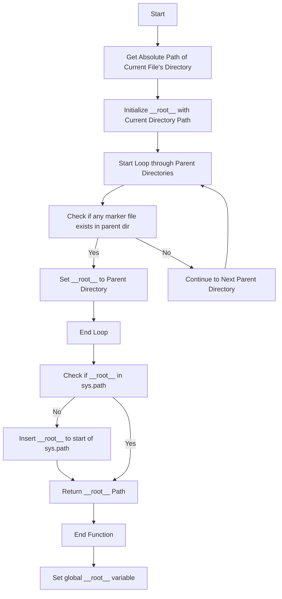
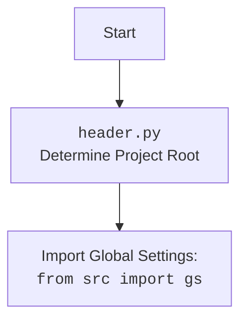

# Анализ кода `src/webdriver/edge/header.py`

## 1. <алгоритм>

**Блок-схема работы функции `set_project_root`:**

1.  **Начало:** Функция `set_project_root` вызывается.
    *   Пример: `set_project_root(marker_files=('__root__', '.git'))`
2.  **Инициализация:**
    *   `current_path` получает абсолютный путь к директории, где расположен текущий файл.
        *   Пример: Если файл находится в `/home/user/project/src/webdriver/edge/header.py`, `current_path` будет `/home/user/project/src/webdriver/edge`.
    *   `__root__`  инициализируется значением `current_path`.
        *   Пример: `__root__` = `/home/user/project/src/webdriver/edge`.
3.  **Поиск родительских директорий:**
    *   Создаётся список всех директорий-предков текущей директории, начиная с самой текущей, включая её.
        *   Пример: `[/home/user/project/src/webdriver/edge, /home/user/project/src/webdriver, /home/user/project/src, /home/user/project, /home/user, /home]`.
    *   Цикл for: Для каждой родительской директории в этом списке:
        *   Проверяется, существует ли хотя бы один из `marker_files` в текущей родительской директории.
            *   Пример 1: Проверка наличия `__root__` или `.git` в `/home/user/project/src/webdriver/edge`.
            *   Пример 2: Проверка наличия `__root__` или `.git` в `/home/user/project/`.
        *   Если один из маркерных файлов найден, присваиваем `__root__` значение текущей родительской директории и выходим из цикла.
            *   Пример: если  `.git` существует в `/home/user/project/`, тогда `__root__` =  `/home/user/project/`, цикл прерывается.
4.  **Обновление `sys.path`:**
    *   Проверка: Если  `__root__` нет в `sys.path`.
    *   Добавляем `__root__` в начало  `sys.path`.
5.  **Возврат:**
    *   Функция возвращает значение  `__root__`.
        *   Пример: Возвращает `/home/user/project/`

**Блок-схема работы глобальной части модуля:**

1.  **Вызов `set_project_root`:** Функция `set_project_root` вызывается без аргументов, используются значения по умолчанию `marker_files` = `("__root__", ".git")`.
2.  **Получение `__root__`:** Результат работы функции `set_project_root` присваивается глобальной переменной `__root__`.

## 2. <mermaid>

**Объяснение `mermaid` диаграммы:**

*   `Start`: Начало процесса.
*   `FindCurrentDir`: Получение абсолютного пути к директории, в которой находится текущий файл.
*   `InitRoot`: Инициализация переменной `__root__` значением пути к текущей директории.
*    `LoopStart`: Начало цикла перебора родительских директорий.
*   `CheckMarker`: Проверка наличия одного из файлов-маркеров в текущей родительской директории.
*   `SetRoot`: Если маркер найден, присваивает переменной `__root__` путь к текущей родительской директории.
*    `LoopEnd`: Завершение цикла перебора родительских директорий, если маркер найден.
*   `LoopContinue`: Переход к следующей родительской директории в цикле.
*   `CheckSysPath`: Проверяет, присутствует ли `__root__` в `sys.path`.
*   `UpdateSysPath`: Если `__root__` отсутствует в `sys.path`, добавляет его в начало списка путей.
*   `ReturnRoot`: Возвращает значение переменной `__root__`, являющееся путем к корневой директории проекта.
*   `End`: Завершение функции `set_project_root`.
*    `SetGlobalRoot`: Присваивает результат `set_project_root()` глобальной переменной `__root__`.

**Зависимости `mermaid` диаграммы:**

Диаграмма отражает логику работы функции `set_project_root` без явных зависимостей от других модулей. Зависимостью является только получение пути к файлу с использованием `__file__`.

## 3. <объяснение>

### Импорты:

*   `import sys`: Модуль `sys` предоставляет доступ к некоторым переменным и функциям, взаимодействующим с интерпретатором Python. В данном случае используется для изменения `sys.path` - списка путей для поиска модулей.
*   `import json`: Модуль `json` используется для работы с JSON данными. В этом конкретном файле не используется, но может быть использован в других частях проекта.
*   `from packaging.version import Version`: импортирует класс Version из пакета `packaging.version`. Он может быть полезен для сравнения версий. Но в данном коде не используется.
*   `from pathlib import Path`: импортирует класс `Path` из модуля `pathlib`, который используется для работы с путями к файлам и директориям в объектно-ориентированном стиле, улучшает читаемость и переносимость кода.

**Взаимосвязь с другими пакетами `src`**:

*   Данный модуль `header.py` находится в пакете `src.webdriver.edge`, однако, он не импортирует ничего напрямую из других модулей пакета.
*  Модуль устанавливает корневой путь проекта (через `set_project_root`) и добавляет его в `sys.path`, что позволяет другим модулям проекта (из пакета `src`) импортировать модули относительно этого корня. Таким образом, данный модуль косвенно влияет на весь пакет `src`.

### Классы:

*   Класс `Path` используется из модуля `pathlib` для работы с путями файлов и каталогов, но он не определен в этом файле, а импортирован из внешней библиотеки.

### Функции:

*   `set_project_root(marker_files: tuple = ('__root__', '.git')) -> Path`:
    *   **Аргументы**:
        *   `marker_files`: кортеж строк, представляющих имена файлов или папок, наличие которых в директории или её родительских директориях означает, что это корень проекта. Значение по умолчанию - (`'__root__'`, `'.git'`).
    *   **Возвращаемое значение**:
        *   `Path`: Объект `Path`, представляющий путь к корневой директории проекта. Если корневая директория не найдена, функция возвращает путь к директории, где расположен текущий файл.
    *   **Назначение**:
        *   Функция определяет корневую директорию проекта, последовательно проверяя родительские директории текущего файла на наличие одного из файлов-маркеров.
    *   **Пример**:
        *   Пример вызова: `set_project_root(marker_files=('project_root', 'config.ini'))`.
        *   Пример возвращаемого значения: Если корень проекта  - `/home/user/project`, функция вернет объект `Path('/home/user/project')`.

### Переменные:

*   `__root__`:
    *   **Тип**: `Path`.
    *   **Назначение**:  Глобальная переменная, хранящая путь к корневой директории проекта, определенный функцией `set_project_root`.
*   `current_path`:
    *   **Тип**: `Path`.
    *   **Назначение**: Локальная переменная, хранящая путь к директории, в которой расположен текущий файл.
*   `parent`:
    *   **Тип**: `Path`.
    *   **Назначение**: Локальная переменная, которая итерируется по родительским каталогам.
*   `marker`:
     *   **Тип**: `str`.
     *   **Назначение**: Локальная переменная, которая итерируется по файлам-маркерам.

### Потенциальные ошибки или области для улучшения:

*   **Не указана обработка ошибок**: Функция предполагает, что файлы и директории существуют и доступны. В реальном использовании следует обрабатывать исключения `FileNotFoundError` и другие подобные ошибки.
*   **Ограниченность маркеров**: Жестко заданные маркерные файлы могут не подходить для всех проектов. Может быть полезно сделать их настраиваемыми через конфигурационный файл или переменную окружения.
*   **Отсутствует проверка типа для marker_files**: В документации указано, что marker_files - tuple, но в коде не проверяется, является ли это кортежем. Добавление проверки типа повысило бы надежность кода.
*   **Отсутствие тестов**: Нет автоматических тестов для проверки правильной работы функции `set_project_root`.

### Цепочка взаимосвязей с другими частями проекта:

1.  **`header.py` устанавливает корень проекта**: Вызов `set_project_root()` определяет корневой каталог проекта и добавляет его в `sys.path`.
2.  **`sys.path` влияет на импорты**: Добавление корня в `sys.path` позволяет другим модулям проекта (например, в `src.webdriver.edge`, `src.browser.chrome`, и т.д.) импортировать модули относительно этого корня.
3.  **Косвенная зависимость от всего проекта**: Таким образом, `header.py` является важным модулем, поскольку он устанавливает базовый путь для всего проекта. Другие модули проекта зависят от правильного определения корня, установленного в `header.py`, для корректного импорта.

В заключении, файл `header.py` выполняет важную функцию определения корня проекта и его добавления в `sys.path`. Это позволяет другим модулям правильно импортироваться, обеспечивая общую работоспособность проекта.