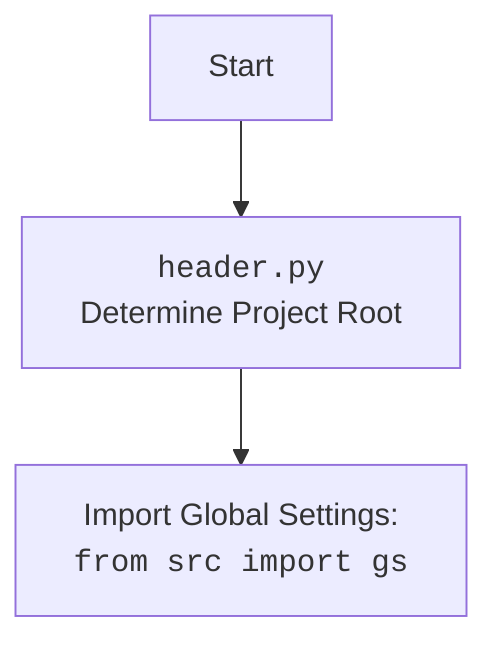

## АНАЛИЗ КОДА: `src/webdriver/executor.py`

### 1. <алгоритм>

**Общая схема работы:**

1.  **Инициализация `ExecuteLocator`**:
    *   Создается экземпляр класса `ExecuteLocator`, который инициализирует `ActionChains` и `by_mapping`.
2.  **`execute_locator`**:
    *   Принимает `locator` (словарь или `SimpleNamespace`), `timeout`, `timeout_for_event`, `message`, `typing_speed`, `continue_on_error`.
    *   Преобразует `locator` в `SimpleNamespace` при необходимости.
    *   Вызывает асинхронную функцию `_parse_locator`.
3.  **`_parse_locator`**:
    *   Получает `locator` и `message`.
    *   Преобразует `locator` в `SimpleNamespace`, если это необходимо.
    *   Проверяет, есть ли `event`, `attribute`, `mandatory` в `locator`. Если нет, возвращает `None`.
    *   Определяет тип локатора (например, `By.XPATH`, `By.ID`).
    *   Вызывает `evaluate_locator`, чтобы обработать значения атрибутов, если они есть.
    *   В зависимости от наличия `event` или `attribute` вызывает соответствующие методы: `execute_event`, `get_attribute_by_locator` или `get_webelement_by_locator`.
4.  **`evaluate_locator`**:
    *   Принимает `attribute` (строка, список строк или словарь).
    *   Если `attribute` является списком, итерируется по нему и вызывает `_evaluate` для каждого элемента.
    *   В противном случае вызывает `_evaluate` для единичного атрибута.
5.  **`_evaluate`**:
    *   Проверяет, является ли атрибут константой (например, `%ENTER%`).
    *   Возвращает константу или исходный атрибут.
6. **`get_attribute_by_locator`**:
   *  Принимает `locator`, `timeout`, `timeout_for_event`, `message`, `typing_speed`, `continue_on_error`.
   *   Получает `web_element` через `get_webelement_by_locator`.
   *   Если `web_element` не найден, возвращает `None`.
   *   Если `locator.attribute` это строка, похожая на словарь (`{key:value}`), то парсит ее.
   *  Получает атрибуты в зависимости от того, является ли `web_element` списком или единичным элементом.
7.  **`get_webelement_by_locator`**:
    *   Принимает `locator`, `timeout`, `timeout_for_event`.
    *   Преобразует `locator` в `SimpleNamespace`, если это необходимо.
    *   Использует `WebDriverWait` для ожидания элемента(ов) на странице.
    *   Возвращает `WebElement` или `List[WebElement]`, применяя фильтрацию `_parse_elements_list` по правилу `if_list`.
8.  **`_parse_elements_list`**:
   *   Фильтрует список веб-элементов на основе параметра `if_list`.
   *   Возвращает отфильтрованный список или одиночный элемент.
9.  **`get_webelement_as_screenshot`**:
    *   Принимает `locator`, `timeout`, `timeout_for_event`, `message`, `typing_speed`, `continue_on_error`, `webelement`.
    *   Получает `webelement`, если он не передан явно.
    *   Делает скриншот и возвращает `screenshot_stream`.
10. **`execute_event`**:
    *   Принимает `locator`, `timeout`, `timeout_for_event`, `message`, `typing_speed`, `continue_on_error`.
    *   Получает `web_element` через `get_webelement_by_locator`.
    *   Разбивает `locator.event` на список событий.
    *   Выполняет действия в цикле: `click`, `pause`, `upload_media`, `screenshot`, `clear`, `send_keys`, `type`.
11. **`send_message`**:
    *   Принимает `locator`, `timeout`, `timeout_for_event`, `message`, `typing_speed`, `continue_on_error`.
    *   Получает `web_element` через `get_webelement_by_locator`.
    *   Вызывает `type_message`.
12. **`type_message`**:
    *   Разбивает сообщение на слова и буквы, обрабатывает их посимвольно.
    *   Использует `ActionChains` для ввода букв с учетом скорости набора и замены символов.

**Примеры:**

*   **`execute_locator(locator={"by": "ID", "selector": "myButton", "event": "click()"})`**: Находит элемент с `ID="myButton"` и кликает по нему.
*   **`execute_locator(locator={"by": "XPATH", "selector": "//input[@id='myInput']", "attribute": "value"})`**: Находит элемент с `XPATH="//input[@id='myInput']"` и возвращает его значение.
*   **`execute_locator(locator={"by": "CSS_SELECTOR", "selector": ".items", "if_list": "first"})`**: Находит все элементы с `CSS_SELECTOR=".items"` и возвращает первый элемент.
*    **`execute_locator(locator={"by":"ID","selector":"message_box", "event": "type(Привет мир!)", "typing_speed":0.1})`** -  находит элемент с `ID="message_box"` и печатает текст "Привет мир!" с задержкой 0.1 сек на символ.
*    **`execute_locator(locator={"by":"ID","selector":"upload", "event": "upload_media()", "message": "test.jpg"})`** - находит элемент с `ID="upload"` и имитирует загрузку файла `test.jpg`.
*   **`execute_locator(locator={"by":"ID","selector":"input_field","event":"send_keys(SHIFT+ENTER)"})`** - находит элемент с `ID="input_field"` и эмулирует нажатие клавиш SHIFT+ENTER.
*    **`execute_locator(locator={"by":"ID","selector":"element_id", "event": "screenshot()"})`** - находит элемент с `ID="element_id"` и делает его скриншот.
*    **`send_message(locator={"id": "messageBox"}, message="Hello World", typing_speed=0.1)`** - находит элемент с `ID="messageBox"` и печатает текст "Hello World" с задержкой 0.1 сек на символ, имитируя ввод текста.

### 2. <mermaid>

```mermaid
flowchart TD
    A[Start: execute_locator] --> B{Is locator a SimpleNamespace or dict?}
    B -- Yes --> C[Use locator as is]
    B -- No --> D[Convert dict to SimpleNamespace]
    D --> C
    C --> E[Call _parse_locator]
    E --> F{Has event, attribute or mandatory?}
    F -- No --> G[Return None]
    F -- Yes --> H[Map `by` and evaluate attribute]
    H --> I{Has event?}
    I -- Yes --> J[Call execute_event]
    I -- No --> K{Has attribute?}
    K -- Yes --> L[Call get_attribute_by_locator]
    K -- No --> M[Call get_webelement_by_locator]
    J --> N[Return event result]
    L --> N
    M --> N
    N --> O[Return result of execute_locator]
    O --> P[End]

    subgraph "evaluate_locator"
        S[Start: evaluate_locator] --> T{Is attribute a list?}
        T -- Yes --> U[Iterate over attributes, call _evaluate]
        U --> V[Return gathered results from asyncio.gather]
        T -- No --> W[Call _evaluate for single attribute]
        W --> V
        V --> X[End]
        subgraph "_evaluate"
           Y[Start:_evaluate] --> Z{Is attribute a constant?}
           Z -- Yes --> AA[Return constant]
           Z -- No --> AB[Return original attribute]
           AA --> AC[End]
           AB --> AC
        end
        end
    subgraph "get_attribute_by_locator"
        AD[Start: get_attribute_by_locator] --> AE{Is locator SimpleNamespace or dict?}
        AE -- Yes --> AF[Convert locator to SimpleNamespace]
        AE -- No --> AF
        AF --> AG[Call get_webelement_by_locator]
        AG --> AH{Is web_element found?}
        AH -- No --> AI[Return None]
        AH -- Yes --> AJ{Is locator.attribute dictionary-like str?}
        AJ -- Yes --> AK[Parse locator.attribute to dict]
        AK --> AL{Is web_element a list?}
        AL -- Yes --> AM[Retrieve attributes for each element in the list]
        AL -- No --> AN[Retrieve attributes for a single web_element]
        AJ -- No --> AO{Is web_element a list?}
        AO -- Yes --> AP[Retrieve attributes for each element in list]
        AO -- No --> AQ[Retrieve attribute for a single web_element]
        AM --> AR[Return list of attributes]
        AN --> AR
        AP --> AR
        AQ --> AR
        AR --> AS[End]
        end
    subgraph "get_webelement_by_locator"
        AT[Start: get_webelement_by_locator] --> AU{Is locator a dict?}
        AU -- Yes --> AV[Convert to SimpleNamespace]
        AU -- No --> AV
        AV --> AW[Wait for web element(s)]
         AW --> AX[Call _parse_elements_list]
        AX --> AY[Return web element(s)]
    end
    subgraph "_parse_elements_list"
        AZ[Start:_parse_elements_list] --> BA{Is web_elements a list?}
        BA -- No --> BB[Return web_elements]
        BA -- Yes --> BC{Apply filtering based on locator.if_list}
        BC --> BD[Return filtered web elements]
        BD --> BE[End]

    end
    subgraph "get_webelement_as_screenshot"
        BF[Start: get_webelement_as_screenshot] --> BG{Is webelement passed?}
        BG -- No --> BH[Call get_webelement_by_locator]
        BG -- Yes --> BH
        BH --> BI{Is webelement found?}
        BI -- Yes --> BJ[Take screenshot]
        BJ --> BK[Return screenshot]
        BI -- No --> BK
    end
    subgraph "execute_event"
        BL[Start: execute_event] --> BM[Get web element]
         BM --> BN[Split events by ';']
         BN --> BO[Loop through events]
            BO --> BP{event = "click()"?}
            BP -- Yes --> BQ[Execute click event]
            BP -- No --> BR{event.startswith("pause(")?}
            BR -- Yes --> BS[Pause]
            BR -- No --> BT{event="upload_media()"?}
            BT -- Yes --> BU[Upload media]
            BT -- No --> BV{event="screenshot()"?}
            BV -- Yes --> BW[Take screenshot]
            BV -- No --> BX{event="clear()"?}
            BX -- Yes --> BY[Clear element]
            BX -- No --> BZ{event.startswith("send_keys(")?}
            BZ -- Yes --> CA[Send Keys]
            BZ -- No --> CB{event.startswith("type(")?}
            CB -- Yes --> CC[Type message]
            CC --> CD[next event]
            CA --> CD
            BY --> CD
            BW --> CD
            BU --> CD
            BS --> CD
            BQ --> CD
        CD --> CE[Return result]

    end
     subgraph "send_message"
        CF[Start:send_message] --> CG[Get web element]
        CG --> CH[Call type_message]
        CH --> CI[Return True]
     end
     subgraph "type_message"
        CJ[Start:type_message] --> CK[Split message into words]
        CK --> CL[Loop through each word]
        CL --> CM[Loop through letters in the word]
        CM --> CN{Is letter in replace_dict?}
        CN -- Yes --> CO[Perform replace action]
        CN -- No --> CP[Send letter and pause]
        CO --> CQ[Next letter]
        CP --> CQ
        CQ --> CR[Next word]
        CR --> CS[End]

    end
```

**Импортированные зависимости:**

*   `asyncio`: Для асинхронного программирования.
*   `re`: Для работы с регулярными выражениями (например, `pause(\d+)`).
*   `sys`: Для доступа к системным переменным и функциям.
*   `time`: Для работы со временем, в основном для задержек.
*   `dataclasses`: Для создания классов данных.
*   `enum`: Для создания перечислений.
*   `pathlib`: Для работы с путями в файловой системе.
*   `types`: Для работы с типами данных, здесь используется `SimpleNamespace`.
*   `typing`: Для определения типов.
*   `selenium.common.exceptions`: Для обработки исключений, возникающих при взаимодействии с Selenium.
*   `selenium.webdriver.common.action_chains`: Для создания цепочек действий (например, `ActionChains`).
*   `selenium.webdriver.common.by`: Для определения стратегий поиска элементов (например, `By.XPATH`, `By.ID`).
*   `selenium.webdriver.common.keys`: Для эмуляции нажатий клавиш.
*   `selenium.webdriver.remote.webelement`: Для представления веб-элементов.
*   `selenium.webdriver.support.expected_conditions`: Для задания условий ожидания.
*   `selenium.webdriver.support.ui`: Для ожидания элементов (например, `WebDriverWait`).
*   `header`: Внутренний модуль проекта, обычно используемый для определения корневой директории проекта.
*   `src`: Родительский пакет проекта.
*   `src.logger.logger`: Для логирования.
*   `src.logger.exceptions`: Для кастомных исключений.
*   `src.utils.jjson`: Для работы с JSON.
*   `src.utils.printer`: Для форматированного вывода.
*   `src.utils.image`: Для сохранения изображений.
*   `src.gs`: Для доступа к глобальным настройкам проекта

**Зависимости `header.py`**:

### 3. <объяснение>

**Импорты:**

*   `asyncio`: Используется для поддержки асинхронного выполнения операций, что позволяет не блокировать основной поток при ожидании ответов от веб-драйвера или при выполнении задержек.
*   `re`: Применяется для разбора строк с регулярными выражениями, например, для извлечения числового значения из строки `pause(1000)`.
*   `sys`: Предоставляет доступ к системным переменным и функциям.
*   `time`: Обеспечивает функции для работы со временем, используется для задержек в выполнении операций.
*   `dataclasses`: Упрощает создание классов данных, предоставляя автоматическую генерацию методов, таких как `__init__`, `__repr__` и т.д.
*   `enum`: Позволяет создавать перечисления, что делает код более читаемым и поддерживаемым.
*   `pathlib`: Упрощает работу с путями к файлам и директориям.
*   `types.SimpleNamespace`: Создает простые объекты, позволяющие обращаться к атрибутам через точку (например, `obj.attribute`), используется для динамического создания объектов с атрибутами из словаря.
*   `typing`: Предоставляет инструменты для определения типов, включая `Optional`, `Union`, `List`, `Dict`, что улучшает читаемость и надежность кода.
*   `selenium.*`: Набор библиотек для автоматизации веб-браузеров.
*   `header`: Внутренний модуль проекта для определения корневой директории проекта, часто используется для загрузки настроек и определения местоположения ресурсов.
*   `src.gs`: Глобальные настройки проекта, которые доступны в любом месте приложения.
*   `src.logger.*`: Библиотеки для логирования и обработки исключений, которые используются для отладки и мониторинга работы приложения.
*   `src.utils.*`: Утилиты для работы с JSON, форматированным выводом и изображениями.

**Классы:**

*   **`ExecuteLocator`**:
    *   **Роль**: Основной класс для выполнения действий над веб-элементами. Он инкапсулирует логику взаимодействия с Selenium.
    *   **Атрибуты**:
        *   `driver`: Объект веб-драйвера Selenium.
        *   `actions`: Объект `ActionChains` для выполнения сложных действий (например, наведение мыши, перетаскивание).
        *   `by_mapping`: Словарь, связывающий строки с константами `By` (например, `XPATH` -> `By.XPATH`).
        *   `mode`: Режим работы (например, `debug`).
    *   **Методы**:
        *   `__post_init__`: Инициализирует `ActionChains` после создания экземпляра класса.
        *   `execute_locator`: Основной метод для выполнения действий над веб-элементом.
        *    `evaluate_locator`:  Оценивает и обрабатывает атрибуты локатора.
        *    `get_attribute_by_locator`: Получает атрибуты веб-элемента(ов).
        *   `get_webelement_by_locator`: Получает веб-элемент(ы) по локатору.
        *    `_parse_elements_list`: фильтрует полученный список элементов.
        *   `get_webelement_as_screenshot`: Делает скриншот элемента.
        *   `execute_event`: Выполняет событие (например, клик, ввод текста).
        *    `send_message`: Отправляет сообщение в веб-элемент.
        *    `type_message`: Набирает текст в веб-элементе.

**Функции:**

*   **`execute_locator`**:
    *   **Аргументы**:
        *   `locator`: Словарь или `SimpleNamespace`, содержащий информацию о локаторе.
        *   `timeout`: Время ожидания элемента.
        *   `timeout_for_event`: Событие ожидания элемента.
        *   `message`: Сообщение для ввода.
        *   `typing_speed`: Скорость печати.
        *   `continue_on_error`: Флаг для продолжения выполнения при ошибке.
    *   **Возвращаемое значение**: Результат выполнения операции (строка, список, элемент, `True`, `False` или `None`).
    *   **Назначение**: Координирует выполнение действий над веб-элементами, делегируя задачи другим методам класса.
*    **`evaluate_locator`**:
    *   **Аргументы**:
          * `attribute` - атрибут локатора.
    *   **Возвращаемое значение**: Обработанный атрибут.
    *   **Назначение**: Оценивает и обрабатывает атрибуты локатора, заменяя константы (например, `%ENTER%`) на их значения.
*    **`_evaluate`**:
    *    **Аргументы**:
        * `attr` - обрабатываемый атрибут.
    *    **Возвращаемое значение**: Возвращает либо константу `Keys` либо исходный атрибут.
    *    **Назначение**: Проверяет, является ли атрибут константой (например, `%ENTER%`) и, если да, возвращает значение константы, в противном случае возвращает исходный атрибут.
*    **`get_attribute_by_locator`**:
     *   **Аргументы**:
        *    `locator` - Словарь или `SimpleNamespace`, содержащий информацию о локаторе.
        *   `timeout` - время ожидания элемента.
        *    `timeout_for_event` - событие ожидания элемента.
     *   **Возвращаемое значение**: Атрибут или список атрибутов.
     *   **Назначение**: Получает атрибуты элемента(ов) на основе локатора.
*   **`get_webelement_by_locator`**:
    *   **Аргументы**:
        *   `locator`: Словарь или `SimpleNamespace`, содержащий информацию о локаторе.
        *   `timeout`: Время ожидания элемента.
        *   `timeout_for_event`: Событие ожидания элемента.
    *   **Возвращаемое значение**: `WebElement` или `List[WebElement]` или `None`.
    *   **Назначение**: Получает веб-элемент(ы) по локатору, используя `WebDriverWait`.
*  **`_parse_elements_list`**:
    *   **Аргументы**:
        * `web_elements` - список элементов.
        * `locator` - информация о локаторе, откуда берется правило фильтрации.
    *   **Возвращаемое значение**: Отфильтрованный список элементов.
    *   **Назначение**: Фильтрует список веб-элементов в соответствии с правилом, указанным в `locator.if_list`.
*   **`get_webelement_as_screenshot`**:
    *   **Аргументы**:
        *   `locator`: Словарь или `SimpleNamespace`, содержащий информацию о локаторе.
        *    `timeout` - время ожидания элемента.
        *   `timeout_for_event`: Событие ожидания элемента.
        *   `webelement`: Предварительно найденный элемент.
    *   **Возвращаемое значение**: Бинарный поток изображения (`BinaryIO`) или `None`.
    *   **Назначение**: Делает скриншот веб-элемента.
*   **`execute_event`**:
    *   **Аргументы**:
        *   `locator`: Словарь или `SimpleNamespace`, содержащий информацию о локаторе.
        *   `timeout`: Время ожидания элемента.
        *   `timeout_for_event`: Событие ожидания элемента.
        *   `message`: Сообщение для ввода.
        *   `typing_speed`: Скорость печати.
    *   **Возвращаемое значение**: `True` или `False` в зависимости от успешности выполнения события.
    *   **Назначение**: Выполняет действия над элементом (например, клик, ввод текста).
*   **`send_message`**:
    *   **Аргументы**:
        *   `locator`: Словарь или `SimpleNamespace`, содержащий информацию о локаторе.
        *  `timeout` - время ожидания элемента.
        *   `timeout_for_event`: Событие ожидания элемента.
        *   `message`: Сообщение для ввода.
        *   `typing_speed`: Скорость печати.
    *   **Возвращаемое значение**: `True` или `False` в зависимости от успешности выполнения действия.
    *    **Назначение**: Отправляет сообщение в веб-элемент, имитируя ввод текста.
*  **`type_message`**:
    *   **Аргументы**:
         *   `el` - веб-элемент, куда будет производиться ввод.
        *   `message` - сообщение для ввода.
        * `replace_dict` -  словарь замен, например `;` заменяется на `SHIFT+ENTER`.
        *  `typing_speed` - скорость набора.
    *   **Возвращаемое значение**: `True`
    *   **Назначение**:  Набирает сообщение в веб-элементе с учетом скорости набора и замен.
**Переменные:**

*   `locator`: Словарь или `SimpleNamespace`, представляющий локатор элемента.
*   `timeout`: Время ожидания элемента (в секундах).
*   `timeout_for_event`: Условие ожидания элемента.
*   `message`: Строка сообщения для ввода.
*   `typing_speed`: Скорость набора текста (в секундах).
*   `continue_on_error`: Флаг, указывающий, следует ли продолжать выполнение при ошибке.
*    `web_element`: Объект веб-элемента `WebElement`, полученный с помощью Selenium.
*   `events`: Список событий, которые нужно выполнить.

**Потенциальные ошибки и области для улучшения:**

1.  **Обработка ошибок**:
    *   В коде присутствуют блоки `try...except`, но их можно дополнить, предоставив более конкретные сообщения об ошибках.
    *   Не все возможные исключения обрабатываются, что может привести к неожиданному поведению.
2.  **Рефакторинг**:
    *   Можно вынести некоторые общие блоки кода в отдельные функции, чтобы избежать дублирования.
    *   Код можно упростить, используя более современные подходы.
3.  **Подробное логирование**:
    *   Добавить больше логирования в разных точках выполнения кода, чтобы можно было более подробно отслеживать его работу.
4.  **`type_message`**:
   *   В функции `type_message` есть комментарий "TODO: делать проверку в словаре подмен", этот момент необходимо доработать.
    *   В функции `type_message`  пока игнорируется ошибка при передаче буквы, этот момент необходимо доработать.
    *   Реализовать  дополнительные обработки ошибок при вводе текста, чтобы обеспечить более надежную работу.

**Взаимосвязи с другими частями проекта:**

*   **`header.py`**:  Определение корневой директории проекта и путей к файлам.
*   **`src.gs`**: Доступ к глобальным настройкам проекта.
*   **`src.logger`**: Логирование выполнения действий и ошибок.
*   **`src.utils`**: Функции для работы с JSON, форматированным выводом, изображениями.

**Заключение:**

Модуль `executor.py` предоставляет мощный и гибкий инструмент для взаимодействия с веб-элементами, позволяя выполнять сложные сценарии автоматизации. Он использует асинхронность для эффективного выполнения операций и включает в себя механизмы обработки ошибок. Тем не менее, код имеет потенциал для улучшения в плане обработки ошибок, рефакторинга и расширения функциональности.