## `executor.py` - Объяснение кода

### 1. <алгоритм>

Модуль `executor.py` предназначен для автоматизации взаимодействия с веб-элементами через Selenium. Основной класс `ExecuteLocator` принимает на вход WebDriver и позволяет выполнять различные действия с веб-элементами на основе предоставленных локаторов.

**Основные этапы работы:**

1.  **Инициализация `ExecuteLocator`**:
    *   Создается экземпляр `ExecuteLocator` с передачей объекта WebDriver.
    *   Инициализируется `ActionChains` для сложных действий (если есть драйвер).
    *   Устанавливается соответствие между типами локаторов и методами `By` (например, `"ID"` -> `By.ID`).

2.  **`execute_locator(locator)`**:
    *   Принимает локатор (словарь или `SimpleNamespace`).
    *   Преобразует `dict` в `SimpleNamespace`.
    *   Вызывает асинхронную функцию `_parse_locator`.

3.  **`_parse_locator(locator)`**:
    *   Проверяет, есть ли у локатора событие, атрибут или обязательное поле. Если нет, возвращает `None`.
    *   Пытается сопоставить тип локатора с методом `By` и вызвать соответствующий метод (`find_element` или `find_elements`).
    *   Перехватывает исключения и логирует их (если включен режим отладки).
    *   Проверяет наличие события:
        *   Если есть, выполняет событие с помощью `execute_event()`.
        *   Возвращает результат события.
    *   Проверяет наличие атрибута:
        *   Если есть, извлекает атрибут(ы) с помощью `get_attribute_by_locator()`.
        *   Возвращает результат атрибута.
    *   Если нет ни события, ни атрибута, получает веб-элемент(ы) с помощью `get_webelement_by_locator()`.
    *   Возвращает результат веб-элемента.

4.  **`evaluate_locator(locator)`**:
    *   Проверяет, является ли атрибут локатора списком.
        *   Если да, итерируется по каждому атрибуту и вызывает `_evaluate()` для каждого. Собирает результаты с помощью `asyncio.gather()`.
        *   Если нет, вызывает `_evaluate()` для одного атрибута.
    *   Возвращает результаты.

5.  **`get_attribute_by_locator(locator)`**:
    *   Преобразует локатор в `SimpleNamespace` если это `dict`.
    *   Вызывает `get_webelement_by_locator()`, чтобы получить веб-элемент(ы).
    *   Если веб-элемент не найден, возвращает `None` (с логированием отладочного сообщения).
    *   Проверяет, является ли `locator.attribute` строкой, похожей на словарь (например, `'{"style": "color"}'`).
        *   Если да, то парсит строку в словарь.
        *   Если веб-элемент - список, получает атрибуты для каждого элемента.
        *   Если веб-элемент - единичный, получает атрибут для одного элемента.
    *   Если `locator.attribute` не является строкой, похожей на словарь.
         *   Если веб-элемент - список, получает атрибуты для каждого элемента.
         *    Если веб-элемент - единичный, получает атрибут для одного элемента.
    *   Возвращает результат атрибута или список атрибутов.

6.  **`get_webelement_by_locator(locator)`**:
    *   Преобразует локатор в `SimpleNamespace` если это `dict`.
    *   Пытается найти веб-элемент(ы) с помощью методов `find_element` или `find_elements` из Selenium на основе `locator.by` и `locator.selector`.
    *   Возвращает найденный элемент(ы) или `None` если ничего не найдено.

7.  **`get_webelement_as_screenshot(locator)`**:
    *   Вызывает `get_webelement_by_locator()`, чтобы получить веб-элемент.
    *   Делает скриншот веб-элемента и сохраняет его в формате base64.
    *   Возвращает base64-строку скриншота или `None` в случае ошибки.

8.  **`execute_event(locator)`**:
    *   Вызывает `get_webelement_by_locator()`, чтобы получить веб-элемент.
    *   Выполняет JavaScript-событие или действие с помощью `ActionChains` (например, click(), send_keys()).
    *   Возвращает результат выполнения события.

9.  **`send_message(locator)`**:
    *   Вызывает `get_webelement_by_locator()`, чтобы получить веб-элемент.
    *   Отправляет сообщение (текст) в веб-элемент.
    *   Возвращает результат отправки сообщения.

**Пример потока данных:**
*   **Вход:** Локатор (словарь или `SimpleNamespace`).
*   **`execute_locator`**: Преобразует локатор, вызывает `_parse_locator`.
*   **`_parse_locator`**: Использует локатор для поиска элемента, выполняет событие (если есть) или получает атрибут (если есть). Возвращает результат.
*   **`get_webelement_by_locator`**:  Использует `driver` для поиска элемента и возвращает `WebElement` или `list` из `WebElement`
*   **`get_attribute_by_locator`**: Использует `get_webelement_by_locator` и атрибут из `locator` для получения значения атрибута.
*   **`execute_event`**: Использует `get_webelement_by_locator` и `locator.event` для выполнения javascript события.
*   **`send_message`**: Использует `get_webelement_by_locator` для отправки сообщения.
*   **Выход:** Результат (веб-элемент, значение атрибута, результат события, `None` или `list` из них).

```mermaid
flowchart TD
    Start_execute_locator[Начало execute_locator] --> CheckLocatorType_execute_locator[Проверка типа локатора: SimpleNamespace или dict]
    CheckLocatorType_execute_locator --> IsSimpleNamespace_execute_locator{Является ли локатор SimpleNamespace?}
    IsSimpleNamespace_execute_locator -- Да --> UseLocatorAsIs_execute_locator[Использовать локатор как есть]
    IsSimpleNamespace_execute_locator -- Нет --> ConvertDictToSimpleNamespace_execute_locator[Преобразовать dict в SimpleNamespace]
    ConvertDictToSimpleNamespace_execute_locator --> UseLocatorAsIs_execute_locator
    UseLocatorAsIs_execute_locator --> DefineParseLocator_execute_locator[Определение асинхронной функции _parse_locator]
    DefineParseLocator_execute_locator --> CheckEventAttributeMandatory_execute_locator[Проверка наличия события, атрибута или обязательного поля]
    CheckEventAttributeMandatory_execute_locator -- Нет --> ReturnNone_execute_locator[Вернуть None]
    CheckEventAttributeMandatory_execute_locator -- Да --> TryMapByEvaluateAttribute_execute_locator[Попытка сопоставления by и оценки атрибута]
    TryMapByEvaluateAttribute_execute_locator --> CatchExceptionsAndLog_execute_locator[Перехват исключений и логирование]
    CatchExceptionsAndLog_execute_locator --> HasEvent_execute_locator{Есть ли у локатора событие?}
    HasEvent_execute_locator -- Да --> ExecuteEvent_execute_locator[Выполнить событие]
    HasEvent_execute_locator -- Нет --> HasAttribute_execute_locator{Есть ли у локатора атрибут?}
    HasAttribute_execute_locator -- Да --> GetAttributeByLocator_execute_locator[Получить атрибут по локатору]
    HasAttribute_execute_locator -- Нет --> GetWebElementByLocator_execute_locator[Получить веб-элемент по локатору]
    ExecuteEvent_execute_locator --> ReturnEventResult_execute_locator[Вернуть результат события]
    GetAttributeByLocator_execute_locator --> ReturnAttributeResult_execute_locator[Вернуть результат атрибута]
    GetWebElementByLocator_execute_locator --> ReturnWebElementResult_execute_locator[Вернуть результат веб-элемента]
    ReturnEventResult_execute_locator --> ReturnFinalResult_execute_locator[Вернуть окончательный результат _parse_locator]
    ReturnAttributeResult_execute_locator --> ReturnFinalResult_execute_locator
    ReturnWebElementResult_execute_locator --> ReturnFinalResult_execute_locator
    ReturnFinalResult_execute_locator --> ReturnExecuteLocatorResult_execute_locator[Вернуть результат execute_locator]
    ReturnExecuteLocatorResult_execute_locator --> End_execute_locator[Конец execute_locator]

    Start_evaluate_locator[Начало evaluate_locator] --> CheckIfAttributeIsList_evaluate_locator[Проверка, является ли атрибут списком]
    CheckIfAttributeIsList_evaluate_locator -- Да --> IterateOverAttributes_evaluate_locator[Итерация по атрибутам в списке]
    IterateOverAttributes_evaluate_locator --> CallEvaluateForEachAttribute_evaluate_locator[Вызов _evaluate для каждого атрибута]
    CallEvaluateForEachAttribute_evaluate_locator --> ReturnGatheredResults_evaluate_locator[Вернуть собранные результаты из asyncio.gather]
    CheckIfAttributeIsList_evaluate_locator -- Нет --> CallEvaluateForSingleAttribute_evaluate_locator[Вызов _evaluate для одного атрибута]
    CallEvaluateForSingleAttribute_evaluate_locator --> ReturnEvaluateResult_evaluate_locator[Вернуть результат _evaluate]
    ReturnEvaluateResult_evaluate_locator --> End_evaluate_locator[Конец evaluate_locator]
    ReturnGatheredResults_evaluate_locator --> End_evaluate_locator

    Start_get_attribute_by_locator[Начало get_attribute_by_locator] --> CheckIfLocatorIsSimpleNamespaceOrDict_get_attribute_by_locator[Проверка типа локатора: SimpleNamespace или dict]
    CheckIfLocatorIsSimpleNamespaceOrDict_get_attribute_by_locator --> ConvertLocatorToSimpleNamespaceIfNeeded_get_attribute_by_locator[Преобразовать локатор в SimpleNamespace если необходимо]
    ConvertLocatorToSimpleNamespaceIfNeeded_get_attribute_by_locator --> CallGetWebElementByLocator_get_attribute_by_locator[Вызов get_webelement_by_locator]
    CallGetWebElementByLocator_get_attribute_by_locator --> CheckIfWebElementIsFound_get_attribute_by_locator[Проверка, найден ли web_element]
    CheckIfWebElementIsFound_get_attribute_by_locator -- Нет --> LogDebugMessageAndReturn_get_attribute_by_locator[Залогировать отладочное сообщение и вернуть]
    CheckIfWebElementIsFound_get_attribute_by_locator -- Да --> CheckIfAttributeIsDictionaryLikeString_get_attribute_by_locator[Проверка, является ли locator.attribute строкой, похожей на словарь]
    CheckIfAttributeIsDictionaryLikeString_get_attribute_by_locator -- Да --> ParseAttributeStringToDict_get_attribute_by_locator[Разбор строки locator.attribute в словарь]
    ParseAttributeStringToDict_get_attribute_by_locator --> CheckIfWebElementIsList_get_attribute_by_locator[Проверка, является ли web_element списком]
    CheckIfWebElementIsList_get_attribute_by_locator -- Да --> RetrieveAttributesForEachElementInList_get_attribute_by_locator[Получение атрибутов для каждого элемента в списке]
    RetrieveAttributesForEachElementInList_get_attribute_by_locator --> ReturnListOfAttributes_get_attribute_by_locator[Вернуть список атрибутов]
    CheckIfWebElementIsList_get_attribute_by_locator -- Нет --> RetrieveAttributesForSingleWebElement_get_attribute_by_locator[Получение атрибутов для одного web_element]
    RetrieveAttributesForSingleWebElement_get_attribute_by_locator --> ReturnListOfAttributes_get_attribute_by_locator
    CheckIfAttributeIsDictionaryLikeString_get_attribute_by_locator -- Нет --> CheckIfWebElementIsListAgain_get_attribute_by_locator[Проверка, является ли web_element списком]
    CheckIfWebElementIsListAgain_get_attribute_by_locator -- Да --> RetrieveAttributesForEachElementInListAgain_get_attribute_by_locator[Получение атрибутов для каждого элемента в списке]
    RetrieveAttributesForEachElementInListAgain_get_attribute_by_locator --> ReturnListOfAttributesOrSingleAttribute_get_attribute_by_locator[Вернуть список атрибутов или один атрибут]
    CheckIfWebElementIsListAgain_get_attribute_by_locator -- Нет --> RetrieveAttributeForSingleWebElementAgain_get_attribute_by_locator[Получение атрибута для одного web_element]
    RetrieveAttributeForSingleWebElementAgain_get_attribute_by_locator --> ReturnListOfAttributesOrSingleAttribute_get_attribute_by_locator
    ReturnListOfAttributesOrSingleAttribute_get_attribute_by_locator --> End_get_attribute_by_locator[Конец get_attribute_by_locator]
    LogDebugMessageAndReturn_get_attribute_by_locator --> End_get_attribute_by_locator
```

### 2. <mermaid>


**Объяснение диаграммы:**

*   **`execute_locator`**:
    *   Проверяет тип входного `locator` (`SimpleNamespace` или `dict`).
    *   Преобразует `dict` в `SimpleNamespace`, если необходимо.
    *   Определяет асинхронную функцию `_parse_locator`, которая выполняет основную логику поиска и взаимодействия с веб-элементами.
    *   Проверяет наличие события, атрибута или обязательного поля в локаторе.
    *   Пытается сопоставить тип локатора (`by`) с `By` (из Selenium) и оценить атрибут.
    *   Перехватывает исключения и логирует их в режиме отладки.
    *   Вызывает либо `execute_event`, либо `get_attribute_by_locator`, либо `get_webelement_by_locator` в зависимости от наличия атрибута или события.
    *   Возвращает результат действия.
*   **`evaluate_locator`**:
    *   Проверяет, является ли атрибут списком.
    *   Итерируется по каждому атрибуту в списке или обрабатывает один атрибут, вызывая `_evaluate`.
    *   Возвращает собранные или единичный результат.
*   **`get_attribute_by_locator`**:
    *   Проверяет тип входного `locator` (`SimpleNamespace` или `dict`).
    *   Преобразует `dict` в `SimpleNamespace`, если необходимо.
    *   Вызывает `get_webelement_by_locator` для получения элемента.
    *   Проверяет, найден ли элемент. Если нет, логирует и возвращает `None`.
    *   Проверяет, является ли атрибут строкой, похожей на словарь.
    *   В зависимости от типа атрибута и элемента (список или единичный), возвращает либо список атрибутов, либо один атрибут.

**Зависимости импорта:**

Диаграмма показывает зависимости внутри `executor.py` и его методы. В коде есть несколько импортов:
- `selenium.webdriver.remote.webdriver`: Используется для взаимодействия с веб-драйвером.
- `selenium.webdriver.common.by`:  Используется для определения способов поиска элементов (например, By.ID, By.CLASS_NAME).
- `selenium.webdriver.common.action_chains`: Используется для создания и выполнения сложных действий, таких как наведение курсора и перетаскивание.
- `asyncio`: Используется для асинхронных операций.
- `re`: Используется для регулярных выражений.
- `dataclasses.dataclass, dataclasses.field`:  Используется для создания классов данных и их полей.
- `enum.Enum`: Используется для создания перечислений.
- `pathlib.Path`:  Используется для работы с путями к файлам.
- `types.SimpleNamespace`: Используется для создания простых пространств имен.
- `typing`: Используется для аннотаций типов.

### 3. <объяснение>

**Импорты:**

*   **`selenium.webdriver`**: Основной модуль Selenium для управления браузером.
    *   `remote.webdriver`: Используется для создания экземпляра веб-драйвера.
    *   `common.by`: Определяет методы поиска элементов (например, `By.ID`, `By.XPATH`).
    *   `common.action_chains`: Позволяет выполнять сложные действия пользователя, например, клики, отправку текста, перетаскивание.
*   **`asyncio`**:  Используется для асинхронного выполнения кода, что позволяет выполнять несколько задач одновременно без блокировки.
*   **`re`**: Модуль для работы с регулярными выражениями, используемый для парсинга строк с атрибутами похожих на `dict`.
*   **`dataclasses`**: Модуль для создания классов данных.
    *   `dataclass`: Декоратор для автоматического создания методов класса, таких как `__init__`, `__repr__`.
    *   `field`: Позволяет задавать значения по умолчанию для полей данных.
*   **`enum`**: Модуль для создания перечислений (энумов), которые позволяют задавать именованные константы.
    *   `Enum`: Базовый класс для создания перечислений.
*   **`pathlib`**: Модуль для работы с файловыми путями в кроссплатформенном формате.
    *   `Path`: Класс для представления путей.
*   **`types`**: Модуль для создания простых пространств имен.
    *   `SimpleNamespace`: Используется для создания объектов, которые могут хранить атрибуты.
*   **`typing`**: Модуль для аннотаций типов, используется для статической проверки типов.

**Классы:**

*   **`ExecuteLocator`**:
    *   **Роль**: Ядро модуля, отвечает за взаимодействие с веб-элементами.
    *   **Атрибуты**:
        *   `driver`: Экземпляр Selenium WebDriver для взаимодействия с браузером.
        *   `actions`: Экземпляр `ActionChains` для выполнения сложных действий (например, наведения курсора, двойного клика).
        *   `by_mapping`: Словарь, сопоставляющий текстовые представления типов локаторов (например, `"ID"`, `"XPATH"`) с методами `By` из Selenium.
        *   `mode`: Режим выполнения (например, `debug`, `dev`). Используется для включения/отключения отладочной информации.
    *   **Методы**:
        *   `__post_init__`: Инициализирует `ActionChains` при создании экземпляра класса, если передан драйвер.
        *   `execute_locator(locator)`: Основной метод для обработки локатора и выполнения действия. Возвращает результат.
        *   `evaluate_locator(locator)`: Вызывает `_evaluate` для оценки атрибута. Возвращает собранный или единичный результат.
        *   `get_attribute_by_locator(locator)`: Извлекает атрибут(ы) из элемента на основе локатора. Возвращает значение атрибута или список значений.
        *   `get_webelement_by_locator(locator)`: Находит веб-элемент(ы) на странице на основе предоставленного локатора. Возвращает элемент или список элементов.
        *   `get_webelement_as_screenshot(locator)`: Делает скриншот найденного веб-элемента и возвращает его в формате base64.
        *   `execute_event(locator)`: Выполняет JavaScript-событие или действие на веб-элементе. Возвращает результат события.
        *   `send_message(locator)`: Отправляет сообщение в веб-элемент.
    *   **Взаимодействие**: Этот класс взаимодействует с Selenium WebDriver для управления браузером, а также использует asyncio для асинхронного выполнения задач.

**Функции (методы класса):**

*   `execute_locator(locator)`:
    *   **Аргументы**: `locator` (словарь или `SimpleNamespace`) - конфигурация для поиска и взаимодействия с элементом.
    *   **Возвращаемое значение**: Результат выполнения действия (веб-элемент, значение атрибута, результат события или None).
    *   **Назначение**: Основная функция для выполнения действий с веб-элементами на основе локатора.
    *   **Пример**:
        ```python
        locator = {"by": "ID", "selector": "my_element", "event": "click()"}
        result = await executor.execute_locator(locator)
        ```
*   `evaluate_locator(locator)`:
     *   **Аргументы**: `locator` (словарь или `SimpleNamespace`) - конфигурация для поиска и взаимодействия с элементом.
     *   **Возвращаемое значение**: Результат вызова `_evaluate` (список или значение).
     *   **Назначение**: Оценивает атрибут локатора с помощью `_evaluate`  и собирает результат с помощью `asyncio.gather`.
     *   **Пример**:
        ```python
        locator = {"by": "ID", "selector": "my_element", "attribute": ["text", "class"]}
        result = await executor.evaluate_locator(locator)
        ```
*   `get_attribute_by_locator(locator)`:
    *   **Аргументы**: `locator` (словарь или `SimpleNamespace`) - конфигурация для поиска и извлечения атрибута.
    *   **Возвращаемое значение**: Значение атрибута или список значений (если найдено несколько элементов), или `None`.
    *   **Назначение**: Извлекает атрибут(ы) из веб-элемента(ов) на основе локатора.
    *   **Пример**:
        ```python
        locator = {"by": "ID", "selector": "my_element", "attribute": "value"}
        result = await executor.get_attribute_by_locator(locator)
        ```
*    `get_webelement_by_locator(locator)`:
    *   **Аргументы**: `locator` (словарь или `SimpleNamespace`) - конфигурация для поиска элемента.
    *   **Возвращаемое значение**: Веб-элемент или список элементов, или `None`.
    *   **Назначение**: Находит веб-элементы на странице по заданным критериям.
    *    **Пример**:
        ```python
        locator = {"by": "ID", "selector": "my_element"}
        element = await executor.get_webelement_by_locator(locator)
        ```
*   `get_webelement_as_screenshot(locator)`:
    *   **Аргументы**: `locator` (словарь или `SimpleNamespace`) - конфигурация для поиска элемента.
    *   **Возвращаемое значение**: Base64-строка с изображением скриншота или `None` в случае ошибки.
    *   **Назначение**: Получает скриншот веб-элемента.
    *   **Пример**:
        ```python
        locator = {"by": "ID", "selector": "my_element"}
        screenshot = await executor.get_webelement_as_screenshot(locator)
        ```
*   `execute_event(locator)`:
    *   **Аргументы**: `locator` (словарь или `SimpleNamespace`) - конфигурация для поиска элемента и события.
    *   **Возвращаемое значение**: Результат выполнения события.
    *   **Назначение**: Выполняет JavaScript-событие на веб-элементе (например, `click()`).
    *    **Пример**:
        ```python
        locator = {"by": "ID", "selector": "my_element", "event": "click()"}
        result = await executor.execute_event(locator)
        ```
*   `send_message(locator)`:
    *   **Аргументы**: `locator` (словарь или `SimpleNamespace`) - конфигурация для поиска элемента.
    *   **Возвращаемое значение**: Результат отправки сообщения.
    *   **Назначение**: Отправляет текст в веб-элемент.
        *   **Пример**:
        ```python
        locator = {"by": "ID", "selector": "my_element", "text": "some text"}
        result = await executor.send_message(locator)
        ```

**Переменные:**

*   `driver`: Экземпляр WebDriver, используемый для взаимодействия с браузером.
*   `actions`: Экземпляр `ActionChains`, используемый для выполнения сложных действий.
*   `by_mapping`: Словарь, сопоставляющий строковые типы локаторов с методами `By` (например, `{"ID": By.ID}`).
*   `mode`: Режим выполнения, используемый для управления выводом отладочной информации.

**Потенциальные ошибки и области для улучшения:**

*   **Обработка исключений**: В коде есть общая обработка исключений, но в некоторых случаях может потребоваться более детальная обработка конкретных исключений, чтобы предоставить более информативные сообщения об ошибках.
*   **Валидация локаторов**: Локаторы приходят извне, нужно добавить валидацию входных `locator`, чтобы избежать ошибок.
*   **Асинхронность**: Весь код работает асинхронно, однако если возникнет необходимость переписать его на синхронный код, потребуются доработки.
*   **Документация**: Покрытие тестами и документация методов с примерами использования будет полезным улучшением для других разработчиков.
*   **Расширяемость**: Класс можно расширить, чтобы поддерживать другие типы локаторов или действия, не ограничиваясь только кликами и отправкой текста.
*   **Динамические ожидания**: В коде нет явных ожиданий для динамически загружаемых элементов. Добавление явных ожиданий может улучшить стабильность тестов.

**Взаимосвязи с другими частями проекта:**

*   Этот модуль является частью пакета `src.webdriver` и предназначен для использования в автоматизации веб-тестов или задач веб-скрапинга.
*   Он зависит от Selenium WebDriver для управления браузером.
*   Результаты работы модуля могут использоваться для валидации данных на веб-страницах или для выполнения действий пользователя, имитирующих реальное взаимодействие.

Этот анализ обеспечивает полное понимание структуры и назначения кода `executor.py`.