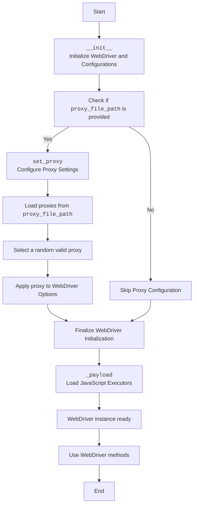

## АНАЛИЗ КОДА: `hypotez/src/webdriver/firefox/README.MD`

### 1. <алгоритм>

**Общее описание:**
Данный документ описывает модуль `Firefox` для управления браузером Firefox через Selenium WebDriver. Модуль предоставляет дополнительные возможности, такие как работа с пользовательскими профилями, настройка прокси, установка user agent, запуск в режиме киоска, и передача дополнительных опций.

**Пошаговый алгоритм:**

1.  **Инициализация (`__init__`)**:
    *   Принимаются параметры: `profile_name`, `geckodriver_version`, `firefox_version`, `user_agent`, `proxy_file_path`, `options`, а также `*args` и `**kwargs` для расширения возможностей.
    *   **Пример**: `browser = Firefox(profile_name="test_profile", geckodriver_version="v0.30", firefox_version="90.0", proxy_file_path="proxies.txt", options=["--kiosk"])`
    *   Сохраняются переданные параметры в атрибуты экземпляра класса.
    *   Инициализируется базовый WebDriver.
    *   Вызывается метод `set_proxy`, если указан `proxy_file_path`, для настройки прокси.
    *   Вызывается метод `_payload`, который загружает необходимые функции для работы с JavaScript и локаторами.

2.  **Настройка прокси (`set_proxy`)**:
    *   Метод `set_proxy` принимает объект `Options` как аргумент.
    *   Из файла, указанного в `proxy_file_path`, выбирается случайный валидный прокси.
        *   **Пример**: Если в `proxies.txt` есть строки `192.168.1.1:8080` и `10.0.0.2:3128`, метод выберет одну из них.
    *   Устанавливает прокси в `Options` объекта, используя `selenium.webdriver.Proxy`.
    *   Применяет обновленные опции к текущему экземпляру WebDriver.

3.  **Загрузка payload (`_payload`)**:
    *   Метод `_payload` не принимает аргументов.
    *   Загружает JavaScript-функции для работы с локаторами и другими JavaScript-операциями.
    *   **Пример**: `self._payload()` подготавливает WebDriver для вызова JavaScript функций, если необходимо.

4.  **Использование**:
    *   После создания экземпляра класса `Firefox`, можно использовать стандартные методы WebDriver (`get`, `quit`, и т. д.).
    *   **Пример**: `browser.get("https://www.example.com")` открывает указанную веб-страницу.
    *   **Пример**: `browser.quit()` закрывает браузер.

**Поток данных:**

*   `__init__` получает данные (настройки браузера и пути) от пользователя.
*   `__init__` передает `Options` в `set_proxy`.
*   `set_proxy` получает `proxy_file_path` из `__init__` и загружает прокси из файла.
*   `set_proxy` устанавливает прокси в `Options` и применяет их.
*   `_payload` загружает JavaScript-код для использования в браузере.
*   Данные передаются между методами внутри класса `Firefox`.

### 2. <mermaid>

**Объяснение диаграммы:**

*   **Start**: Начало процесса.
*   **Initialize**: Метод `__init__` класса `Firefox` инициализирует WebDriver с переданными конфигурациями.
*   **CheckProxy**: Проверяется, был ли предоставлен путь к файлу с прокси `proxy_file_path`.
*   **SetProxy**: Метод `set_proxy` вызывается для настройки прокси.
*   **LoadProxies**: Загружает прокси-серверы из указанного файла.
*   **SelectProxy**: Выбирает случайный рабочий прокси из загруженных.
*   **ApplyProxy**: Применяет выбранный прокси к настройкам браузера (WebDriver Options).
*   **SkipProxy**: Если `proxy_file_path` не предоставлен, прокси не настраивается.
*   **FinalizeInit**: Завершает инициализацию WebDriver, применяя все необходимые настройки.
*    **LoadPayload**: Загружает функции для работы с JavaScript и локаторами.
*   **Ready**: WebDriver готов к использованию.
*   **UseWebDriver**: Используются стандартные методы WebDriver.
*   **End**: Конец процесса.

### 3. <объяснение>

**Импорты:**

В явном виде импортов в описании нет, но из контекста подразумеваются следующие:

*   `selenium.webdriver`: Стандартный пакет для управления браузерами, который используется для создания экземпляра `Firefox` и управления им.
*   `selenium.webdriver.firefox.options`: Для установки опций Firefox.
*   `selenium.webdriver.Proxy`: Для настройки прокси.
*   `typing.Optional, List`: Для аннотации типов переменных и функций.
*   `fake_useragent`: Для генерации случайных user-agent строк (предположительно используется внутри `set_proxy` или других частей кода).
*   `src.utils.proxy`: Предполагаемый модуль для обработки прокси (загрузка, валидация) и выбора случайного прокси.
*   `src.utils.logger`: Модуль для логирования событий (ошибки, предупреждения).

**Классы:**

*   **`Firefox`**:
    *   **Роль**: Расширяет стандартный `selenium.webdriver.Firefox` для обеспечения дополнительных возможностей (прокси, профиль, юзерагент, опции).
    *   **Атрибуты**:
        *   `profile_name`: Имя пользовательского профиля Firefox.
        *   `geckodriver_version`: Версия geckodriver.
        *   `firefox_version`: Версия Firefox.
        *   `user_agent`: Строка пользовательского агента.
        *   `proxy_file_path`: Путь к файлу с прокси.
        *   `options`: Список дополнительных опций Firefox.
    *   **Методы**:
        *   `__init__`: Конструктор, инициализирующий WebDriver и его настройки.
        *   `set_proxy`: Настраивает прокси-сервер для WebDriver.
        *   `_payload`: Загружает дополнительные функции для работы с JavaScript.
    *   **Взаимодействие**: Наследуется от `selenium.webdriver.Firefox`, использует `selenium.webdriver.firefox.options` для настройки опций и `selenium.webdriver.Proxy` для настройки прокси, и взаимодействует с модулями `src.utils.proxy` и `src.utils.logger` для обработки прокси и логирования.

**Функции:**

*   `__init__(self, profile_name, geckodriver_version, firefox_version, user_agent, proxy_file_path, options, *args, **kwargs)`:
    *   **Аргументы**: Параметры конфигурации браузера, включая имя профиля, версии драйверов и Firefox, юзерагент, путь к файлу прокси, и список дополнительных опций. `*args` и `**kwargs` позволяют передавать дополнительные аргументы, которые могут использоваться в базовом классе `webdriver.Firefox`.
    *   **Возвращаемое значение**: `None`.
    *   **Назначение**: Инициализирует WebDriver с заданными настройками, устанавливает прокси и загружает payload.
    *   **Пример**: `Firefox(profile_name="myprofile", proxy_file_path="proxies.txt", options=["--headless"])`.

*   `set_proxy(self, options: Options) -> None`:
    *   **Аргументы**: `options` - объект типа `Options` (из `selenium.webdriver.firefox.options`), в котором будут настроены прокси.
    *   **Возвращаемое значение**: `None`.
    *   **Назначение**: Выбирает случайный рабочий прокси из файла и устанавливает его для WebDriver.
    *    **Пример**: `self.set_proxy(options)` вызывает установку прокси.

*    `_payload(self) -> None`:
     *   **Аргументы**: Нет.
     *   **Возвращаемое значение**: `None`.
     *   **Назначение**: Загружает в WebDriver необходимые функции для работы с JavaScript и локаторами.
     *   **Пример**:  `self._payload()` вызывает загрузку JS-кода.

**Переменные:**

*   `profile_name`, `geckodriver_version`, `firefox_version`, `user_agent`, `proxy_file_path`, `options`: Атрибуты экземпляра класса `Firefox`, содержащие настройки браузера. Типы переменных определены в сигнатуре метода `__init__` (например, `Optional[str]` или `Optional[List[str]]`).
*   `logger`: Используется для логирования.
*   `options` (внутри `set_proxy`): Экземпляр класса `selenium.webdriver.firefox.options.Options`, используемый для настройки параметров браузера.
*   `proxy` (внутри `set_proxy`): Экземпляр класса `selenium.webdriver.Proxy`, представляющий выбранный прокси.

**Потенциальные ошибки и области для улучшения:**

1.  **Отсутствие обработки ошибок:** Не описана обработка исключений при загрузке прокси из файла, при выборе прокси и при инициализации WebDriver.
2.  **Конфигурация User-Agent:** Способ установки пользовательского агента не описан, предполагается его использование в `__init__`.
3.  **Зависимость от `src.utils`:** Модули `proxy` и `logger` из `src.utils` не детализированы.
4.  **Проверка версий:** Нет проверок соответствия версий geckodriver и Firefox.
5.  **Логирование:** Ограниченное описание логирования. Желательно добавить больше подробностей о том, как используется `logger`.
6. **Случайный прокси**: При выборе случайного прокси, нет проверки что выбранный прокси действительно рабочий, и не произойдёт ошибки соединения.

**Цепочка взаимосвязей:**

1.  `src.webdriver.firefox` использует:
    *   `selenium.webdriver` для управления браузером.
    *   `selenium.webdriver.firefox.options` для настройки опций.
    *   `selenium.webdriver.Proxy` для работы с прокси.
    *   `src.utils.proxy` для обработки прокси.
    *   `src.utils.logger` для логирования.

2.  Этот модуль является частью более широкой системы, представленной в `src`, где может быть использован для автоматизированного тестирования и автоматизации веб-задач.

**В целом, данный документ описывает модуль `Firefox` с расширенными возможностями настройки браузера для автоматизации веб-задач и тестирования. Документ информативен, но нуждается в большем количестве деталей о зависимостях и обработке ошибок.**