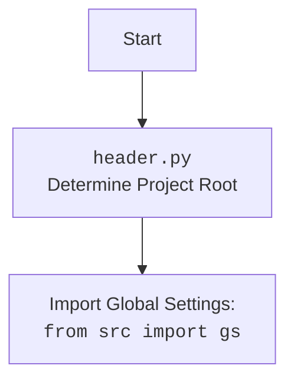

## Анализ кода `webdriver/firefox/_docs/firefox.md`

### 1. <алгоритм>

1. **Инициализация (`__init__`)**:
    - Принимает на вход `user_agent` (опционально, словарь).
    - Если `user_agent` не предоставлен, генерирует случайный `user_agent` с помощью `fake_useragent.UserAgent().random`.
    - Загружает настройки из `firefox.json` в виде `SimpleNamespace`.
    - Извлекает путь к geckodriver из настроек.
    - Вызывает `_set_profile` для настройки профиля Firefox.
    - Вызывает `_set_options` для настройки опций запуска Firefox.
    - Создает сервис `selenium.webdriver.firefox.service.Service` с путем к geckodriver.
    - Если профиль существует, устанавливает его в опции.
    - Пытается запустить Firefox с настроенными опциями и сервисом.
    - Если возникает `WebDriverException` (например, geckodriver не найден или несовместим), регистрирует критическую ошибку и завершает работу.
    - Если возникает другое исключение, также регистрирует критическую ошибку и завершает работу.

    *Пример:*
    ```python
    # Пример вызова __init__
    firefox_driver = Firefox() # user_agent сгенерируется рандомно
    firefox_driver_with_user_agent = Firefox(user_agent={"user-agent": "My custom user agent"})

    # Пример загрузки настроек из firefox.json
    # (предположим, что firefox.json содержит: {"geckodriver": ["bin", "geckodriver.exe"], "profile": {"profile_path": {"default": "path"}, "default_profile_from":"default","default_profile_directory": ["myprofile"]}, "options": ["--headless", "--kiosk"], "headers": {"custom-header": "custom-value"}})
    settings = SimpleNamespace(
        geckodriver = ["bin", "geckodriver.exe"], 
        profile = SimpleNamespace(profile_path = {"default": "path"}, default_profile_from="default",default_profile_directory = ["myprofile"]),
        options = ["--headless", "--kiosk"],
        headers = {"custom-header": "custom-value"}
    )

    geckodriver_path = "C:\\path\\to\\project\\bin\\geckodriver.exe"
    profile_dir = "C:\\path\\to\\project\\src\\webdriver\\firefox\\profiles\\myprofile"

    # Вызов _set_profile
    # Возвращает FirefoxProfile с указанным каталогом
    
    #Вызов _set_options
    # Возвращает Options с headless = True и аргументами '--kiosk' и заголовком {'custom-header': 'custom-value'}
    ```

2. **Настройка опций (`_set_options`)**:
    - Принимает на вход `settings` (SimpleNamespace) с настройками.
    - Создает экземпляр `selenium.webdriver.firefox.options.Options`.
    - Если в `settings` есть опции (`settings.options`):
      - Проходит по каждой опции.
        - Если опция содержит `'headless'`, устанавливает `options.headless = True`.
        - Иначе добавляет опцию как аргумент с помощью `options.add_argument(opt)`.
    - Если в `settings` есть заголовки (`settings.headers`):
        - Добавляет каждый заголовок как аргумент в формате `--key=value`.
    - Возвращает объект `Options` с заданными настройками.

    *Пример:*
    ```python
    settings = SimpleNamespace(options=['--headless', '--kiosk'], headers={'custom-header': 'custom-value'})
    options = _set_options(settings) 
    # options.headless == True
    # options.arguments == ['--kiosk', '--custom-header=custom-value']
    ```

3. **Настройка профиля (`_set_profile`)**:
    - Принимает на вход `profile` (SimpleNamespace) с настройками профиля.
    - Извлекает путь к каталогу профиля из `profile.profile_path` в зависимости от `profile.default_profile_from`.
    - Проверяет, содержит ли путь '%APPDATA%'.
      - Если да, то заменяет '%APPDATA%' на значение переменной окружения APPDATA и достраивает путь к профилю.
      - Если нет, то строит путь к профилю на основе `gs.path.src`.
    - Создает `selenium.webdriver.firefox.firefox_profile.FirefoxProfile` с заданным каталогом.
    - Возвращает созданный объект `FirefoxProfile`.
    
    *Пример:*
    ```python
    # Пример 1: профиль из %APPDATA%
    profile_settings = SimpleNamespace(
        profile_path={'default': r'%APPDATA%\Mozilla\Firefox'},
        default_profile_from='default',
        default_profile_directory=['test_profile']
    )
    
    # Предположим, что os.environ.get('APPDATA') = 'C:\\Users\\TestUser\\AppData\\Roaming'
    profile_directory = "C:\\Users\\TestUser\\AppData\\Roaming\\Mozilla\\Firefox\\test_profile"
    
    # Вызов _set_profile(profile_settings) создаст profile, использующий вышеуказанный путь
   
    
    # Пример 2: профиль из gs.path.src
    profile_settings_2 = SimpleNamespace(
        profile_path={'default': 'path'},
        default_profile_from='default',
        default_profile_directory=['test_profile']
    )
    # Предположим, что gs.path.src = "C:\\path\\to\\project\\src"
    profile_directory = "C:\\path\\to\\project\\src\\webdriver\\firefox\\profiles\\test_profile"

    # Вызов _set_profile(profile_settings_2) создаст profile, использующий вышеуказанный путь
    ```

### 2. <mermaid>

```mermaid
flowchart TD
    Start[Start] --> Init[__init__<br>Initialize Firefox Driver];
    Init --> UserAgent[Get User Agent<br>(Random or Specified)];
    UserAgent --> LoadSettings[Load Settings from<br><code>firefox.json</code>];
    LoadSettings --> GetGeckoPath[Get Geckodriver Path<br>from Settings];
    GetGeckoPath --> SetProfile[Set Firefox Profile<br><code>_set_profile()</code>];
    SetProfile --> SetOptions[Set Launch Options<br><code>_set_options()</code>];
    SetOptions --> CreateService[Create Geckodriver Service];
    CreateService --> ApplyProfile[Apply Profile<br>to Options];
    ApplyProfile --> StartDriver[Start Firefox<br>WebDriver];
    StartDriver --> ExceptionCheck[Check for<br><code>WebDriverException</code>];
    ExceptionCheck -- Yes --> LogError[Log Critical Error];
     ExceptionCheck -- No --> OtherExceptionCheck[Check for<br>Other Exceptions];
    OtherExceptionCheck -- Yes --> LogOtherError[Log Critical Error<br>General Error];
     OtherExceptionCheck -- No --> End[End];
     LogError --> End
      LogOtherError --> End
        
    subgraph "<code>_set_options()</code>"
        SOStart[Start] --> SOInitOptions[Init <code>Options()</code> Object];
        SOInitOptions --> SOIterateOptions[Iterate through <code>settings.options</code>];
        SOIterateOptions -- Headless Option Found --> SOSetHeadless[Set <code>options.headless=True</code>];
        SOIterateOptions -- Other Option Found --> SOAddArgument[<code>options.add_argument()</code>];
        SOSetHeadless --> SOIterateOptions
        SOAddArgument --> SOIterateOptions
        SOIterateOptions -- No More Options --> SOIterateHeaders[Iterate through <code>settings.headers</code>];
        SOIterateHeaders -- Header Found --> SOAddHeader[<code>options.add_argument()</code> with header];
         SOAddHeader --> SOIterateHeaders
        SOIterateHeaders -- No More Headers --> SOReturnOptions[Return <code>Options</code> Object];
    end
     SOReturnOptions -- returns -->SetOptions
     
    subgraph "<code>_set_profile()</code>"
        SPStart[Start] --> SPGetProfilePath[Get Profile Path<br>from settings];
          SPGetProfilePath --> SPCheckAppData[Check if Profile Path<br>contains <code>%APPDATA%</code>];
        SPCheckAppData -- Yes --> SPReplaceAppData[Replace <code>%APPDATA%</code><br>with System Path];
        SPReplaceAppData --> SPCreateProfile[Create <code>FirefoxProfile()</code><br>using the profile path];
        SPCheckAppData -- No --> SPCreateProfile2[Create <code>FirefoxProfile()</code><br>using gs.path.src];
        SPCreateProfile --> SPReturnProfile[Return <code>FirefoxProfile</code> Object];
        SPCreateProfile2 --> SPReturnProfile
    end
     SPReturnProfile -- returns -->SetProfile
```

### 3. <объяснение>

#### Импорты:

-   **`os`**:  Используется для работы с операционной системой, например, для получения переменных окружения (например, `os.environ.get('APPDATA')`).
-   **`pathlib.Path`**:  Представляет пути к файлам и каталогам в объектно-ориентированном виде, что делает работу с путями более удобной и кросс-платформенной.
-   **`types.SimpleNamespace`**: Создает простые объекты, к атрибутам которых можно обращаться по имени, подобно словарю. Используется для хранения настроек из JSON.
-   **`typing.Optional`**: Используется для указания, что аргумент может быть либо определенного типа (например, `dict`), либо `None`.
-   **`typing.Any`**: Обозначает, что переменная или параметр могут иметь любой тип.
-   **`selenium.webdriver.Firefox as WebDriver`**: Импортирует класс `Firefox` из `selenium.webdriver`, переименовывая его в `WebDriver` для краткости.
-   **`selenium.webdriver.firefox.options.Options`**: Класс для настройки опций запуска Firefox.
-   **`selenium.webdriver.firefox.service.Service`**: Класс для запуска службы geckodriver.
-   **`selenium.webdriver.firefox.firefox_profile.FirefoxProfile`**: Класс для настройки профиля Firefox.
-   **`selenium.common.exceptions.WebDriverException`**: Класс исключений, возникающих при проблемах с webdriver (например, если geckodriver не найден).
-    **`fake_useragent.UserAgent`**: Класс для генерации случайных User-Agent.
-   **`src.gs`**:  Глобальные настройки проекта (предположительно определенные в файле `src/gs.py`), которые содержат, например, корневой путь проекта. Используется для получения пути к папке `bin`.
-   **`src.utils.jjson.j_loads_ns`**: Функция для загрузки JSON-файла и преобразования его в объект `SimpleNamespace`.
-   **`src.logger.logger.logger`**: Объект логгера из модуля `src.logger.logger`, используется для записи сообщений о работе программы, включая ошибки.

#### Класс `Firefox`:
-   **`driver_name`**: Атрибут класса, представляющий имя драйвера (`'firefox'`).
-   **`__init__`**: 
    -   Конструктор класса, вызывается при создании экземпляра класса `Firefox`.
    -   Принимает `user_agent` (словарь), используется если нужно установить кастомный `user_agent`.
    -   Загружает настройки из `firefox.json` (включая путь к geckodriver, настройки профиля и опции запуска).
    -   Инициализирует `FirefoxProfile` с помощью метода `_set_profile` и `Options` с помощью метода `_set_options`.
    -   Создает `Service` для geckodriver.
    -   Применяет профиль к опциям, если он существует.
    -   Запускает браузер.
    -   Обрабатывает `WebDriverException` и общие исключения, логируя их.
-   **`_set_options`**:
    -   Настраивает опции запуска браузера, включая headless режим, кастомные аргументы и заголовки.
-   **`_set_profile`**:
    -   Настраивает профиль Firefox, использует настройки из JSON.
    -   Поддерживает профили, расположенные в папке APPDATA, так и в папке проекта.

#### Функции:
-   **`__init__(self, user_agent: Optional[dict] = None, *args, **kwargs) -> None`**
    - Инициализирует объект `Firefox` и создает WebDriver, вызывая другие методы для подготовки и запуска браузера.
    - **Параметры:**
      - `user_agent` (`Optional[dict]`): Словарь с user agent, по умолчанию None.
      - `*args`, `**kwargs` : дополнительные аргументы и именованные аргументы.
-   **`_set_options(self, settings: SimpleNamespace) -> Options`**:
    -   Создает и настраивает объект `Options` для запуска Firefox.
    -   **Параметры:**
        - `settings` (`SimpleNamespace`): Настройки для опций Firefox.
    -   **Возвращает:** Объект `Options` с заданными параметрами.
-   **`_set_profile(self, profile: SimpleNamespace) -> FirefoxProfile`**:
    -   Создает и настраивает объект `FirefoxProfile` для Firefox.
     -   **Параметры:**
        - `profile` (`SimpleNamespace`): Настройки для профиля Firefox.
    -   **Возвращает:** Объект `FirefoxProfile` с заданными параметрами.

#### Переменные:
-   **`self.user_agent`**:  Словарь, содержащий настройки user agent.
-   **`settings`**: Объект `SimpleNamespace`, хранящий настройки, загруженные из `firefox.json`.
-   **`geckodriver_path_parts`**: Список, содержащий части пути к geckodriver.
-   **`geckodriver_path`**:  Строка, представляющая полный путь к geckodriver.
-    **`profile`**: Объект `FirefoxProfile`, представляющий профиль браузера.
-   **`options`**: Объект `Options`, содержащий настройки запуска Firefox.
-   **`service`**: Объект `Service`, используемый для запуска geckodriver.

#### Потенциальные ошибки и области для улучшения:
-   **Отсутствие обработки ошибок при загрузке настроек из `firefox.json`**: В случае, если `firefox.json` отсутствует или содержит невалидный JSON, будет выброшено исключение.
-   **Обработка переменных окружения APPDATA**: Код предполагает, что переменная окружения APPDATA существует. В случае, если ее не будет, код выбросит ошибку.
-  **Зависимость от файловой структуры**: Пути к файлам и папкам заданы жестко и могут быть изменены, что приведет к неработоспособности драйвера.

#### Взаимосвязь с другими частями проекта:
-   Использует `src.gs` для получения глобальных настроек проекта.
-   Использует `src.utils.jjson` для загрузки JSON настроек.
-   Использует `src.logger.logger` для логирования ошибок и событий.
-   Подготавливает окружение для тестирования web страниц с помощью selenium.

В целом, код реализует класс `Firefox`, который упрощает запуск браузера с нужными настройками, профилем и user agent. Он также предоставляет гибкую настройку через JSON.