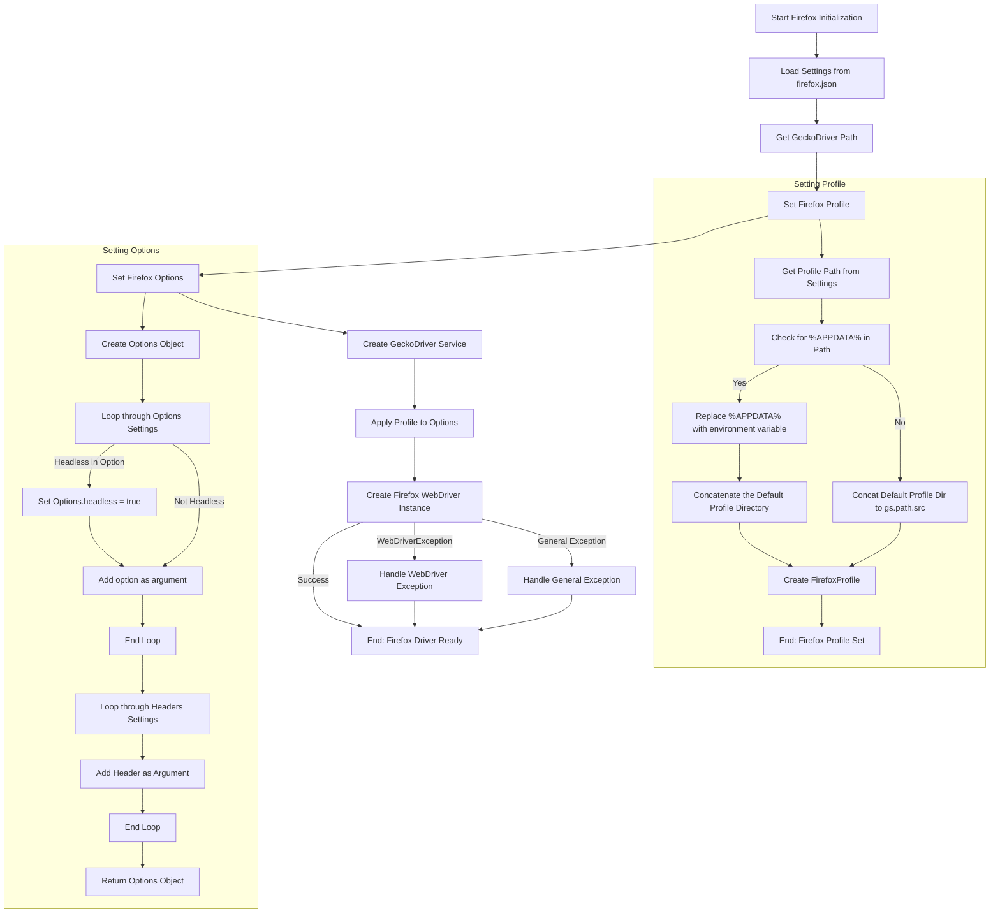
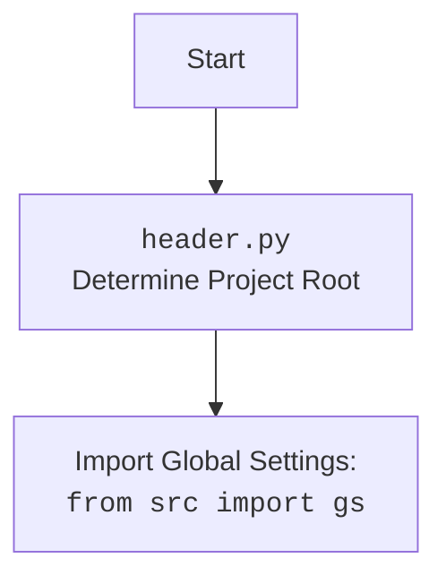

## Анализ кода `webdriver/firefox/_docs/firefox.md`

### 1. <алгоритм>

**Блок-схема:**

1.  **Инициализация Firefox:**
    *   Создается экземпляр класса `Firefox`.
    *   Принимает необязательный параметр `user_agent` (словарь), иначе генерируется случайный.
    *   Загружает настройки из `firefox.json`.
    *   Определяется путь к `geckodriver` на основе загруженных настроек.
        *   *Пример:* `settings.geckodriver` = `["bin", "geckodriver.exe"]`, `gs.path.bin` = `"/path/to/bin"`, результат: `"/path/to/bin/bin/geckodriver.exe"`
    *   Настраивается `FirefoxProfile` (на основе настроек профиля).
    *   Настраиваются `Options` (на основе общих настроек).
    *   Инициализируется `Service` для `geckodriver`.
    *   Профиль привязывается к опциям.
    *   Создается экземпляр драйвера `WebDriver` с `options` и `service`.
    *   Обрабатываются возможные исключения `WebDriverException` и `Exception`.

2.  **Настройка параметров (Options):**
    *   Функция `_set_options` принимает `settings` (SimpleNamespace).
    *   Создается экземпляр класса `Options`.
    *   Проходит по списку опций в `settings.options`.
        *   Если опция содержит `headless`, то устанавливает `options.headless = True`.
        *   Иначе добавляет опцию в `options.add_argument(opt)`.
        *   *Пример:* `settings.options` = `["--kiosk", "--window-size=1920,1080"]`,  применяется `--kiosk`, `--window-size=1920,1080`.
    *   Добавляет заголовки из `settings.headers` в виде аргументов командной строки.
        *   *Пример:* `settings.headers` = `{"Accept-Language": "en-US"}` применяется `--Accept-Language=en-US`.
    *   Возвращает объект `Options`.

3. **Настройка профиля (FirefoxProfile):**
    * Функция `_set_profile` принимает `profile` (SimpleNamespace).
    * Определяет путь к профилю из `profile.profile_path`.
        *   Если путь содержит '%APPDATA%', заменяет переменную окружения и добавляет путь из `profile.default_profile_directory`.
            *   *Пример:* `profile.profile_path` = `["%APPDATA%\\Mozilla\\Firefox"]`, `os.environ.get('APPDATA')` = `"/user/appdata"`, `profile.default_profile_directory` = `["default_profile_1"]` результат: `"/user/appdata/Mozilla/Firefox/default_profile_1"`
        * Иначе, создается путь на основе `gs.path.src`, `"webdriver"`, `"firefox"`, `"profiles"` и `profile.default_profile_directory`.
           * *Пример:* `gs.path.src` = `/path/to/src`, `profile.default_profile_directory` = `["default_profile_1"]`, результат: `"/path/to/src/webdriver/firefox/profiles/default_profile_1"`.
    * Создает экземпляр `FirefoxProfile` c путем к директории.
    *   Возвращает объект `FirefoxProfile`.

### 2. <mermaid>

### 3. <объяснение>

**Импорты:**

*   `os`: Предоставляет функции для взаимодействия с операционной системой, включая работу с переменными окружения (`os.environ.get`).
*   `pathlib.Path`: Используется для работы с путями в файловой системе, облегчает конструирование путей.
*   `types.SimpleNamespace`:  Создаёт простые объекты, которые могут иметь атрибуты, и используется для доступа к настроенным параметрам из `json`.
*   `typing.Optional, typing.Any`: Используется для статической типизации, `Optional` - указывает, что переменная может быть `None`, `Any` - допускает любой тип данных.
*    `selenium.webdriver.Firefox as WebDriver`: Импортирует основной класс для управления Firefox.
*   `selenium.webdriver.firefox.options.Options`: Класс для установки параметров запуска Firefox.
*   `selenium.webdriver.firefox.service.Service`: Класс для управления сервисом `geckodriver`.
*   `selenium.webdriver.firefox.firefox_profile.FirefoxProfile`: Класс для управления профилем Firefox.
*   `selenium.common.exceptions.WebDriverException`:  Исключение, связанное с проблемами WebDriver.
*   `fake_useragent.UserAgent`: Класс для генерации случайных user-agent строк, для имитации браузера.
*    `src.gs`:  Импортирует глобальные настройки проекта, включая пути к каталогам.
*   `src.utils.jjson.j_loads_ns`:  Функция для загрузки данных из `json` файла в `SimpleNamespace` объект.
*   `src.logger.logger.logger`:  Модуль для логирования событий.

**Классы:**

*   `Firefox(WebDriver)`:
    *   Наследует от `selenium.webdriver.Firefox`.
    *   `driver_name`: Атрибут класса, обозначает имя драйвера - `firefox`.
    *   `__init__(self, user_agent: Optional[dict] = None, *args, **kwargs)`: Инициализирует драйвер, загружает настройки, устанавливает профиль, опции, сервис, и запускает браузер.
        *   `user_agent`: Словарь с настройками user agent.
        *   `settings`: Настройки загруженные из `firefox.json`.
        *   `geckodriver_path`: Полный путь к исполняемому файлу `geckodriver`.
        *   `profile`: Объект `FirefoxProfile`.
        *   `options`: Объект `Options`.
        *   `service`:  Объект `Service` для управления `geckodriver`.
    *   `_set_options(self, settings: SimpleNamespace) -> Options`: Устанавливает параметры запуска браузера.
        *   `settings`: Настройки из `firefox.json`.
        *   Возвращает `Options` с параметрами.
    *   `_set_profile(self, profile: SimpleNamespace) -> FirefoxProfile`: Устанавливает профиль браузера.
        *   `profile`: Настройки профиля из `firefox.json`.
        *   Возвращает `FirefoxProfile` с настройками.

**Функции:**

*   `__init__`: Конструктор класса. Принимает словарь `user_agent`, `*args` и `**kwargs`.
*   `_set_options`: Настраивает опции для браузера. Принимает `settings` типа `SimpleNamespace` и возвращает объект `Options`.
*   `_set_profile`: Настраивает профиль для браузера. Принимает `profile` типа `SimpleNamespace` и возвращает объект `FirefoxProfile`.

**Переменные:**

*   `user_agent`: Словарь, содержащий информацию о `user-agent`.
*   `settings`: Объект `SimpleNamespace`, полученный из `firefox.json`.
*   `geckodriver_path_parts`: Список, содержащий путь к `geckodriver` в виде частей.
*   `geckodriver_path`: Строка, полный путь к `geckodriver`.
*   `profile`: Объект `FirefoxProfile`.
*   `options`: Объект `Options`.
*  `service`: Объект `Service`, для управления `geckodriver`
* `profile_directory`: Строка, путь к каталогу профиля.
*  `opt`: Переменная для итерации в цикле по `settings.options`.
* `key`, `value`: переменные для итерации по заголовкам `settings.headers`.

**Потенциальные ошибки и области для улучшения:**

*   **Обработка ошибок:** Добавлена обработка `WebDriverException` и `Exception`, однако можно сделать их более гранулярными, например обрабатывать `FileNotFoundError` при отсутствии `geckodriver`.
*   **Конфигурация:**  Использование `SimpleNamespace` для настроек делает код более гибким, но при расширении настроек может потребоваться более структурированный подход, например с использованием `dataclass`.
*   **Логирование:**  Можно добавить логирование на каждом этапе для более детального отслеживания работы драйвера.
*   **Установка `user-agent`:** `user_agent` переопределяется если явно передан `user_agent` при инициализации, в противном случае присваивается случайный `user-agent`, это поведение можно вынести в опции.

**Взаимосвязи с другими частями проекта:**

*   Использует `src.gs` для получения путей к ресурсам и настройкам проекта.
*   Использует `src.utils.jjson.j_loads_ns` для загрузки настроек из `json` файла.
*   Использует `src.logger.logger.logger` для логирования событий.

**Заключение:**

Код предоставляет функциональность для управления браузером Firefox с использованием WebDriver. Он настраивает профиль и опции запуска на основе конфигурационных данных, что обеспечивает гибкость в использовании браузера для автоматизации и тестирования. Код хорошо структурирован, но может быть расширен и улучшен в плане обработки ошибок, конфигурации и логирования.