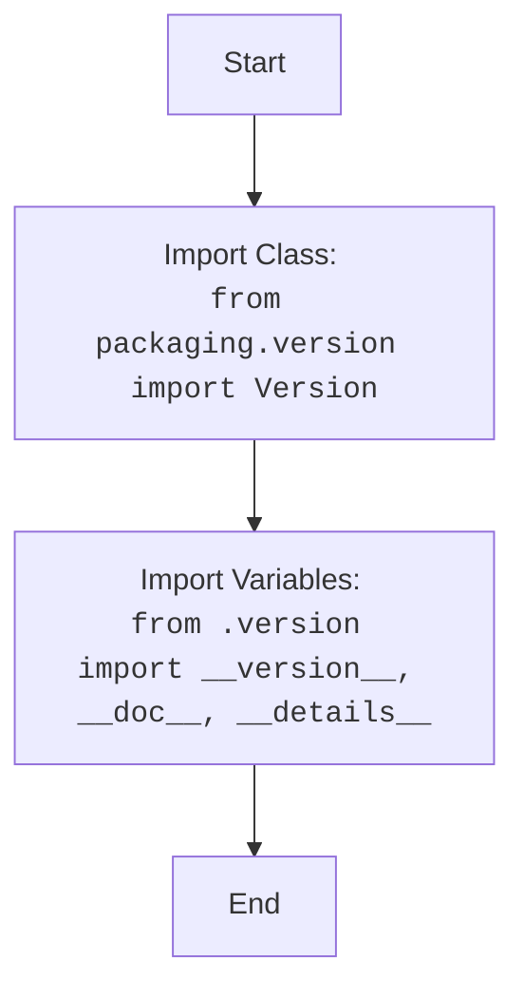

## Анализ кода `hypotez/src/webdriver/firefox/_examples/__init__.py`

### 1. <алгоритм>

1.  **Импорт `Version` из `packaging.version`**:
    *   **Пример**: `from packaging.version import Version`
    *   Эта строка импортирует класс `Version` из библиотеки `packaging`. Этот класс предназначен для удобного сравнения и работы с версиями программного обеспечения.
2.  **Импорт из текущего пакета `src.webdriver.firefox._examples`**:
    *   **Пример**: `from .version import __version__, __doc__, __details__`
    *   Эта строка импортирует переменные `__version__`, `__doc__` и `__details__` из модуля `version.py`, находящегося в той же директории.
3.  **Определение переменных**:
    *   `__version__`: Переменная, содержащая строку с номером версии текущего пакета.
    *   `__doc__`: Строка документации (docstring) для текущего пакета.
    *   `__details__`: Строка, содержащая дополнительную информацию о пакете.

### 2. <mermaid>

### 3. <объяснение>

**Импорты:**

*   `from packaging.version import Version`: Импортирует класс `Version` из библиотеки `packaging`. Этот класс позволяет удобно сравнивать и обрабатывать версии программного обеспечения. Он может быть полезен, например, для сравнения версий Firefox или драйверов.
    *   **Связь с `src`**: Хотя `packaging` не является частью `src`, он используется для манипуляций версиями, что может быть необходимо в контексте webdriver, например, для проверки совместимости драйвера с версией браузера.
*   `from .version import __version__, __doc__, __details__`: Импортирует переменные из модуля `version.py` (который находится в той же директории `_examples`).
    *   `__version__`: Содержит текущую версию пакета.
    *   `__doc__`: Содержит строку документации (docstring) пакета.
    *   `__details__`: Содержит дополнительные детали о пакете.
    *  **Связь с `src`**: Это импорт из внутреннего модуля пакета `src.webdriver.firefox._examples`, что позволяет хранить метаданные пакета в одном месте (в `version.py`) и повторно использовать их во всем пакете.

**Классы**:

*   В данном коде нет классов.

**Функции**:

*   В данном коде нет функций.

**Переменные**:

*   `__version__`: Строка, содержащая версию пакета. Например: `'0.1.0'`.
*   `__doc__`: Строка, содержащая docstring для модуля. Эта строка может быть использована для автоматической генерации документации.
*   `__details__`: Строка, содержащая дополнительные детали о модуле. Эта строка может содержать, например, информацию о лицензии, авторских правах или зависимостях.

**Потенциальные ошибки и области для улучшения:**

*   **Не хватает примеров использования**: Код сейчас только импортирует переменные, но нет примеров их использования. Было бы полезно добавить примеры, показывающие, как используются импортированные переменные и класс `Version`.
*   **Не хватает документации**: Хотя `__doc__` есть, можно было бы добавить более подробную документацию, описывающую назначение этого модуля и примеры использования.
*   **Отсутствие логики**: Файл `__init__.py` обычно служит для инициализации пакета. Сейчас он в основном содержит метаданные. Возможно, потребуется добавить инициализацию, если в будущем это станет необходимо.

**Взаимосвязи с другими частями проекта**:

*   `packaging.version`: Библиотека используется в основном для обработки версий. Это означает, что в других частях проекта (например, в коде, который управляет драйверами браузера), может потребоваться проверять версии браузеров и драйверов.
*  `src.webdriver.firefox._examples.version`: Данный модуль и его метаданные используются в пакете `_examples`.
    Модуль может использоваться для контроля за тем, какая версия используется в примерах `_examples` .

В целом, файл `__init__.py` является точкой входа для пакета `_examples`, который предназначен для хранения метаданных и облегчения их импорта в другие модули этого же пакета.