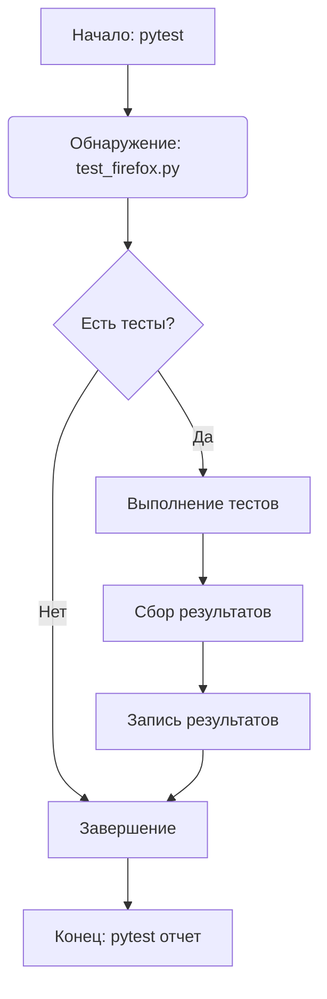

## АНАЛИЗ КОДА: `hypotez/src/webdriver/firefox/_pytest/test_firefox.py`

### 1. <алгоритм>

Этот файл, `test_firefox.py`,  является частью набора тестов для модуля, связанного с управлением браузером Firefox в рамках проекта. На данном этапе, основываясь на предоставленном коде, сложно построить полноценную блок-схему, так как сам код состоит из шапки и пустых строк. Однако, можно предположить общий алгоритм работы тестов в `_pytest`, где этот файл, вероятно, является точкой входа для набора тестов Firefox.

**Общий алгоритм (предположительный):**

1.  **Инициализация:** Запуск `pytest`.
2.  **Обнаружение тестов:** `pytest` находит тестовые файлы, в том числе `test_firefox.py`, в каталоге `_pytest`.
3.  **Выполнение тестов:** `pytest` исполняет тестовые функции или классы (которые на данный момент отсутствуют).
4.  **Отчетность:** `pytest` генерирует отчёт о результатах выполнения тестов.

**Пример (при наличии тестовых функций):**

Предположим, что в файле `test_firefox.py` есть функция `test_open_browser()`.

```
graph LR
    A[Начало: pytest] --> B(Обнаружение: test_firefox.py);
    B --> C{Есть тест?};
    C -- Да --> D[Выполнение: test_open_browser()]
    D --> E{Тест пройден?};
    E -- Да --> F[Запись: PASS]
    E -- Нет --> G[Запись: FAIL]
    C -- Нет --> H[Завершение]
    F --> H
    G --> H
    H --> I[Конец: pytest отчет]
```

**Поток данных (гипотетический):**

`pytest` -> `test_firefox.py` -> вызов функций (предположительно в `src/webdriver/firefox`), сбор результатов ->  `pytest` (отчет).

### 2. <mermaid>



**Объяснение `mermaid` диаграммы:**
-   `A` (Начало: pytest): Начальная точка, где запускается фреймворк тестирования `pytest`.
-   `B` (Обнаружение: test_firefox.py): `pytest` находит файл `test_firefox.py`.
-   `C` (Есть тесты?): Проверка, есть ли в файле `test_firefox.py` функции или классы, которые должны быть выполнены как тесты.
-   `D` (Выполнение тестов): Если тесты есть, они выполняются. Это место, где был бы вызван код, связанный с запуском и взаимодействием с Firefox.
-  `E` (Сбор результатов): После выполнения тестов, собираются их результаты (успех или провал).
-  `F` (Запись результатов): Результаты тестов записываются в отчёт.
-  `G` (Завершение): Если тестов нет, или после записи результатов тестов происходит завершение.
-  `H` (Конец: pytest отчет): `pytest` формирует итоговый отчёт.

В данном примере, отсутствует импорт `header`.

### 3. <объяснение>

**Импорты:**

В представленном коде отсутствуют какие-либо импорты. Обычно, в файлах тестов в `_pytest`, как `test_firefox.py`, ожидаются импорты:
*   **`pytest`**:  Библиотека для создания и запуска тестов. Обычно используется для декораторов `@pytest.mark`, `@pytest.fixture`,  `assert` и других функций.
*   **`src`**: Импорты из других модулей внутри проекта, например `from src.webdriver.firefox import FirefoxDriver`.
*   **`unittest`**: Альтернатива `pytest`,  если проект использует этот фреймворк.

**Классы:**

В представленном коде отсутствуют определения классов. В тестовых файлах обычно можно ожидать объявления классов с тестами, например:

```python
class TestFirefoxBrowser:
    def test_open_browser(self):
        # some test logic
        pass
```

**Функции:**

В представленном коде отсутствуют функции. В тестовых файлах обычно располагаются тестовые функции с префиксом `test_`, например:

```python
def test_open_browser():
    # some test logic
    assert True
```

**Переменные:**

В представленном коде отсутствуют переменные. Обычно в тестовых файлах переменные используются для хранения данных для тестов.

**Потенциальные ошибки и области для улучшения:**

*   **Отсутствие кода:** Основная проблема в том, что предоставленный файл практически пустой. Отсутствует тестовый код и импорты.
*   **Неочевидность назначения**: Без конкретного кода сложно понять, какие тесты планируется выполнять.

**Цепочка взаимосвязей (предположительно):**

1.  `test_firefox.py`: Запускается `pytest`.
2.  Импорт из `src.webdriver.firefox`:  `test_firefox.py`  импортирует классы или функции для управления браузером Firefox.
3.  Модули `src.webdriver.firefox` содержат код для запуска браузера Firefox, управления им (навигация, ввод текста, клики, и т.д.)
4.  `pytest`:  Собирает результаты и генерирует отчет.

**Примеры (гипотетические):**

```python
# test_firefox.py
import pytest
from src.webdriver.firefox import FirefoxDriver

def test_open_browser():
    driver = FirefoxDriver()
    driver.open("https://www.google.com")
    assert driver.get_title() == "Google"
    driver.close()

@pytest.mark.xfail
def test_open_browser_fail():
  assert False
```

В этом примере:
-   Импортируется `pytest` и `FirefoxDriver` из `src.webdriver.firefox`.
-   `test_open_browser` тестирует открытие страницы Google и проверку заголовка.
-   `test_open_browser_fail` намеренно завершится неудачей и помечен как ожидаемый провал.

Этот анализ показывает, что для полноценной оценки функциональности и взаимосвязей необходим реальный код тестов в `test_firefox.py` и связанных с ним модулей `src`.