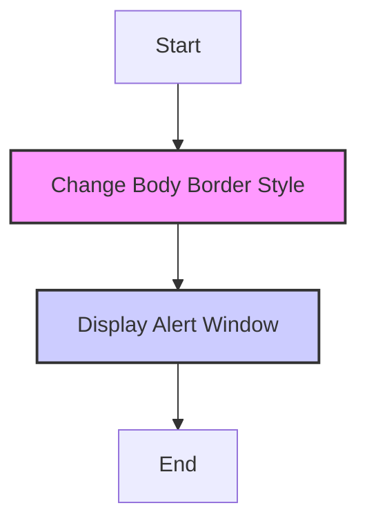

## Анализ кода `hypotez/src/webdriver/firefox/extentions/test_extention - Copy/borderify.js`

### <алгоритм>

1.  **Изменение стиля границы:**
    *   Код начинается с обращения к `document.body`, который представляет собой `<body>` элемент HTML-страницы.
    *   Затем, к стилю этого элемента, через `style`, устанавливается свойство `border`.
    *   Значение `5px solid red` задает границу шириной в 5 пикселей, сплошную, и красного цвета.
    *   **Пример:** Если текущий `document.body` не имеет установленной границы, то выполнение данного кода установит красную границу в 5px.

2.  **Отображение всплывающего окна (alert):**
    *   Вызывается встроенная JavaScript функция `alert()`.
    *   Эта функция отображает всплывающее окно с сообщением. Поскольку в `alert()` не передаётся никакой параметр, будет показано стандартное сообщение (например, "Это сообщение от alert").
    *   **Пример:** При выполнении `alert()` будет показано модальное окно, которое требует закрытия пользователем.

### <mermaid>

**Объяснение:**

*   **Start:** Начало выполнения JavaScript кода.
*   **ChangeBorder:** Установка CSS свойства `border` для элемента `document.body`, что визуально добавляет границу на странице.
*   **Alert:** Вызов функции `alert()`, которая отображает диалоговое окно, требующее действия пользователя для продолжения работы.
*   **End:** Завершение работы скрипта.

### <объяснение>

**Общая функциональность:**

Этот JavaScript код предназначен для изменения внешнего вида веб-страницы путем добавления красной границы вокруг всего тела документа и показа модального окна. Это простой скрипт, который может быть использован в качестве примера для расширений браузера или для демонстрации основных принципов работы с DOM (Document Object Model) и JavaScript.

**Импорты:**

Код не имеет импортов. Он использует встроенные в браузер объекты и функции:
*   `document`: Объект, представляющий HTML-документ.
*   `document.body`: Свойство, возвращающее объект `<body>` HTML-документа.
*   `style`: Свойство объекта, позволяющее изменять CSS стили.
*   `border`: CSS свойство, устанавливающее границу элемента.
*   `alert()`: Функция, отображающая модальное окно.

**Классы:**

В данном коде нет классов. Код написан с использованием процедурного подхода, где действия выполняются последовательно.

**Функции:**

*   `alert()`:
    *   **Аргументы:** Не принимает аргументов в данном случае, но может принимать строку с сообщением.
    *   **Возвращаемое значение:** Не возвращает значения.
    *   **Назначение:** Отображает модальное окно с сообщением.
    *   **Примеры:**
        *   `alert()` - покажет стандартное сообщение
        *   `alert("Привет, мир!")` - покажет сообщение "Привет, мир!"

**Переменные:**
*   В коде не используются явно объявленные переменные. `document.body` это объект, доступный через DOM.

**Потенциальные ошибки и области для улучшения:**

1.  **Негибкость:** Код жёстко задаёт параметры границы. Было бы полезно сделать параметры границы настраиваемыми (через переменные).
2.  **Устаревший подход:** Использование `alert()` не является лучшей практикой для отображения сообщений пользователю, так как блокирует взаимодействие пользователя со страницей. Лучше использовать `console.log()` или более сложные модальные окна.
3.  **Отсутствие обработки ошибок:** Код не проверяет на наличие ошибок, например, не проверяет существует ли `document.body`.
4.  **Жестко заданные стили:** Установка стилей непосредственно через JavaScript может затруднить поддержку. Было бы лучше использовать CSS классы для стилизации.

**Цепочка взаимосвязей с другими частями проекта (если применимо):**

В данном конкретном контексте, файл `borderify.js` является частью расширения для браузера Firefox.
Он работает как "контент-скрипт", то есть скрипт, который внедряется в веб-страницу при ее загрузке, и может изменять ее содержимое и внешний вид.

*   **Расширение:** Файл `borderify.js` является одним из компонентов расширения для браузера Firefox. Он взаимодействует с DOM (Document Object Model) веб-страницы, к которой применен.
*   **Браузер:** Браузер является средой исполнения для JavaScript кода. JavaScript код выполняется в контексте загруженной страницы.
*   **Другие файлы расширения:** Файл `borderify.js` может быть частью более крупного расширения, в котором могут присутствовать другие JavaScript файлы, файлы манифеста (manifest.json) и другие ресурсы, определяющие логику работы расширения.
*   **Веб-страница:** Основной объект взаимодействия скрипта. JavaScript код, выполняемый на странице, может изменять структуру DOM, стили и реагировать на события.

Этот скрипт в данном случае просто изменяет стиль границы и показывает всплывающее окно, но в рамках расширения он может взаимодействовать с другими частями расширения и выполнять более сложные операции.