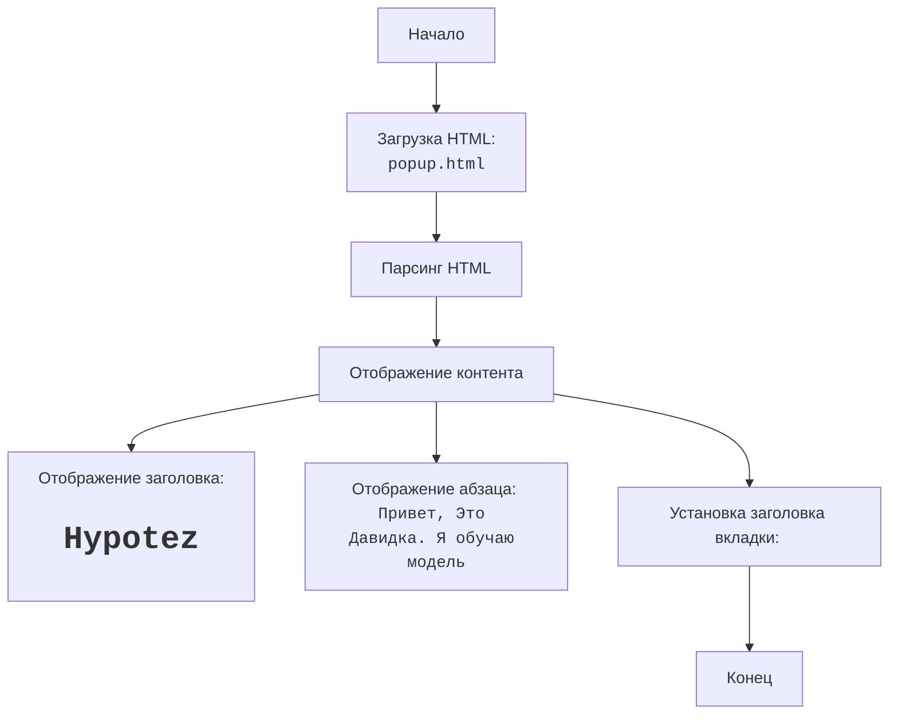

## АНАЛИЗ КОДА: `hypotez/src/webdriver/firefox/extentions/test_extention - Copy/html/popup.html`

### 1. **<алгоритм>**

1.  **Загрузка HTML:**
    *   Браузер загружает файл `popup.html`.
2.  **Парсинг HTML:**
    *   Браузер анализирует структуру HTML, распознавая теги, атрибуты и текст.
3.  **Отображение контента:**
    *   Браузер отображает содержимое HTML на экране.
        *   Отображается заголовок "Hypotez" (тег `<h1>`).
        *   Отображается абзац "Привет, Это Давидка. Я обучаю модель" (тег `
`).
        *   Устанавливается заголовок вкладки браузера как "Hypotez" (тег `<title>`).

### 2. **<mermaid>**

### 3. **<объяснение>**

#### **Импорты:**
В этом коде нет явных импортов Python. Он представляет собой HTML-файл, который не использует модули Python напрямую.

#### **Классы:**
В HTML нет классов в смысле объектно-ориентированного программирования. Однако, теги HTML, такие как `<html>`, `<head>`, `<body>`, `<h1>`, `
`, можно рассматривать как элементы, формирующие структуру и контент веб-страницы.

#### **Функции:**
HTML не содержит функций в том же смысле, как в Python. Функциональность в HTML реализуется через теги и атрибуты. Например, тег `<title>` устанавливает заголовок вкладки, а теги `<h1>` и `
` отображают текст.

#### **Переменные:**
-   `MODE`: Переменная `MODE = 'debug'` определена в самом начале файла, но она не используется в HTML, поэтому ее роль не очевидна. Она может использоваться в других частях приложения для управления режимами работы.

#### **Подробное объяснение:**

**Структура HTML:**
-   `<!DOCTYPE html>`: Объявление типа документа HTML5.
-   `<html lang="en">`: Корневой элемент документа HTML, устанавливающий язык как английский.
-   `<head>`: Содержит метаданные документа, такие как кодировка (`<meta charset="UTF-8">`), настройка viewport (`<meta name="viewport" ...>`) и заголовок страницы (`<title>Hypotez</title>`).
-   `<body>`: Содержит видимый контент страницы, включая:
    -   `<h1>Hypotez</h1>`: Заголовок первого уровня.
    -   `
Привет, Это Давидка. Я обучаю модель
`: Обычный абзац текста.

**Функциональность:**
Этот HTML-файл является очень простым и отображает статический контент. Он предназначен для отображения внутри расширения браузера Firefox, но само по себе не имеет динамической функциональности.
Роль этого HTML файла заключается в том, чтобы отобразить интерфейс расширения браузера Hypotez.

**Связь с другими частями проекта:**
HTML-файл `popup.html` является частью расширения Firefox, которое, вероятно, включает другие файлы JavaScript, CSS и Python, которые взаимодействуют для создания полноценного функционала расширения. Этот конкретный HTML-файл отвечает за представление пользовательского интерфейса всплывающего окна расширения.
Он будет использоваться в связке с Python кодом, для обработки данных и с js кодом для отрисовки интерфейса и создания динамики.

**Потенциальные ошибки или области для улучшения:**

*   **Отсутствие интерактивности:** HTML-файл является статическим и не имеет никакой интерактивности. Для создания пользовательского интерфейса с функциями, которые изменяются при взаимодействии с пользователем, потребуются JavaScript и другие технологии.
*   **Неинформативное сообщение:** сообщение `Привет, Это Давидка. Я обучаю модель` не несёт в себе информации для пользователя, является примером и должно быть заменено на более информативный текст.
*   **Неиспользуемая переменная MODE:** Переменная MODE определена, но не используется внутри данного файла. Это может быть упущением, или может подразумеваться ее использование в других частях проекта.
*   **Простая разметка:** Разметка HTML очень простая и не предполагает стилизации.  Для хорошего UX потребуется CSS.