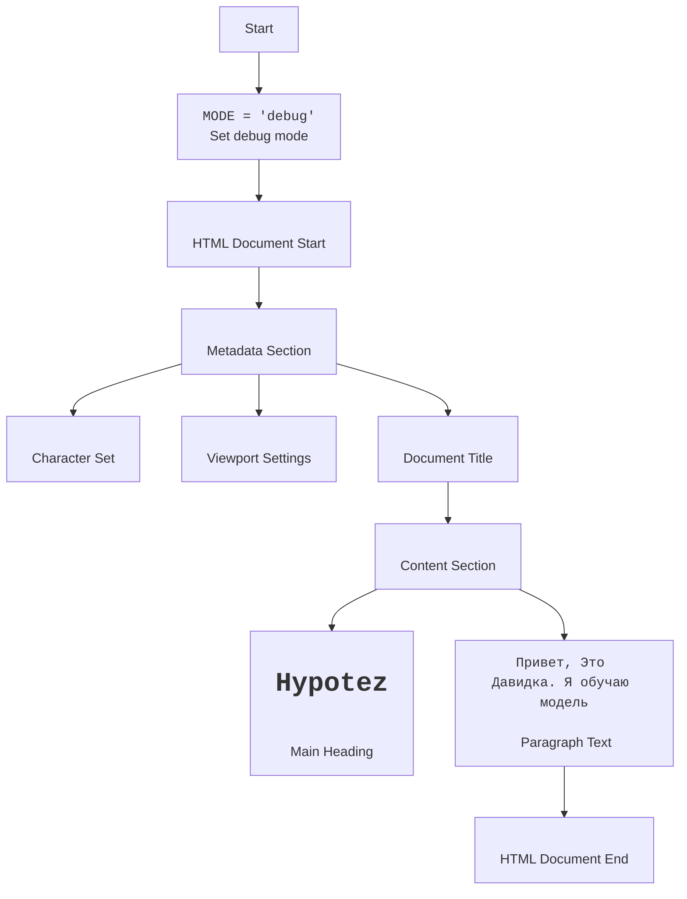

## АНАЛИЗ КОДА: `hypotez/src/webdriver/firefox/extentions/test_extention/html/popup.html`

### 1. <алгоритм>

1.  **Объявление режима:**
    *   Начало: Переменная `MODE` устанавливается в значение `'debug'`. Это может использоваться для управления поведением отладки.
    *   Пример: `MODE = 'debug'`
2.  **HTML Структура:**
    *   Начало: Объявление `<!DOCTYPE html>` определяет тип документа как HTML5.
    *   Заголовок: Секция `<head>` содержит метаданные, такие как кодировка (`<meta charset="UTF-8">`), настройки viewport и заголовок окна.
    *   Тело: Секция `<body>` содержит основной контент страницы, в данном случае заголовок `<h1>` и параграф `
`.
        *   Заголовок: Заголовок первого уровня `<h1>Hypotez</h1>` отображает название.
            *   Пример: `<h1>Hypotez</h1>`
        *   Параграф: Текст в параграфе `
Привет, Это Давидка. Я обучаю модель
` отображает приветственное сообщение.
            *   Пример: `
Привет, Это Давидка. Я обучаю модель
`
3.  **Конец:**
    *   Завершение: Закрывающие теги `</body>` и `</html>` завершают HTML-документ.

### 2. <mermaid>

**Объяснение `mermaid`:**

*   Диаграмма представляет собой блок-схему, описывающую структуру HTML-файла.
*   `Start` - начало процесса.
*   `ModeDeclaration` - блок, где устанавливается переменная `MODE` в значение `'debug'`.
*   `HTMLStart` - начало HTML-документа.
*   `HeadSection` - заголовочная часть HTML, содержит метаданные.
*   `MetaCharset` - объявление кодировки символов.
*   `MetaViewport` - настройка viewport для адаптивности.
*   `Title` - заголовок HTML-документа.
*   `BodySection` - тело HTML-документа, содержащее основной контент.
*   `Header` - заголовок первого уровня.
*   `Paragraph` - текстовый параграф.
*   `HTMLEnd` - конец HTML-документа.

### 3. <объяснение>

**Импорты:**

*   В данном коде нет явных импортов. В начале файла присутствует комментарий `# -*- coding: utf-8 -*-`, который указывает на кодировку символов, а не на импорт модуля. Строка `""" module: src.webdriver.firefox.extentions.test_extention.html """` определяет модуль, но не является импортом.

**Классы:**
*   В данном файле нет классов.

**Функции:**

*   В данном файле нет функций.

**Переменные:**

*   `MODE`: Глобальная переменная, которая устанавливается в значение `'debug'`. Тип - `str`. Может использоваться в других частях проекта для включения или отключения отладочного поведения.

**Объяснение:**

Данный файл `popup.html` представляет собой простой HTML-документ, который, вероятно, используется как всплывающее окно для расширения браузера. Он включает заголовок и параграф с текстом.

**Потенциальные ошибки и области для улучшения:**

*   **Минимализм:**  Файл содержит только базовую разметку HTML и минимальное содержание. Если в будущем планируется более сложный интерфейс, потребуется добавить дополнительные элементы HTML, CSS и JavaScript.
*   **Отсутствие динамики:** HTML-файл статичен. Для создания интерактивного интерфейса необходимо добавить JavaScript.
*   **Зависимость от переменной `MODE`:**  Переменная `MODE`  определена в начале файла, но ее использование в данном контексте не показано. Стоит уточнить где и как она будет использоваться.

**Взаимосвязи с другими частями проекта:**

*   Файл находится в каталоге `src/webdriver/firefox/extentions/test_extention/html`, что указывает на его роль как части расширения Firefox, используемого для тестирования.
*   Переменная `MODE` может влиять на поведение других частей проекта при отладке.

**Цепочка взаимосвязей:**

1.  `popup.html`: Отображает HTML-контент всплывающего окна.
2.  `test_extention`:  Расширение Firefox, частью которого является данный HTML-файл.
3.  `webdriver`: Модуль, управляющий браузером Firefox, для которого предназначено расширение.
4.  `src`:  Корневой каталог исходного кода проекта, в котором находится данный файл.